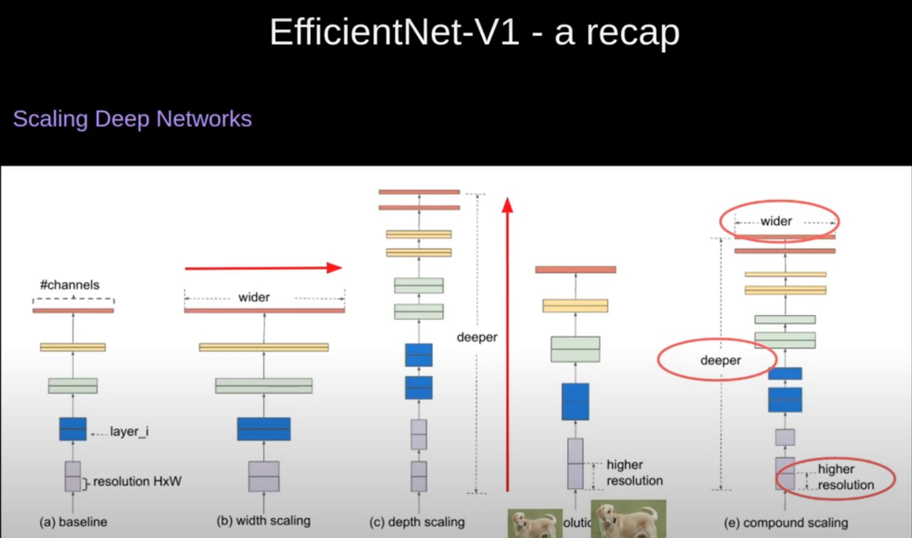
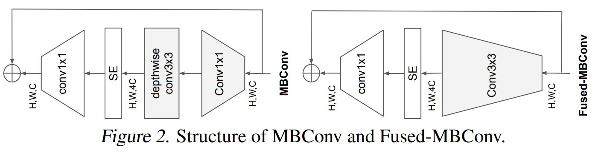
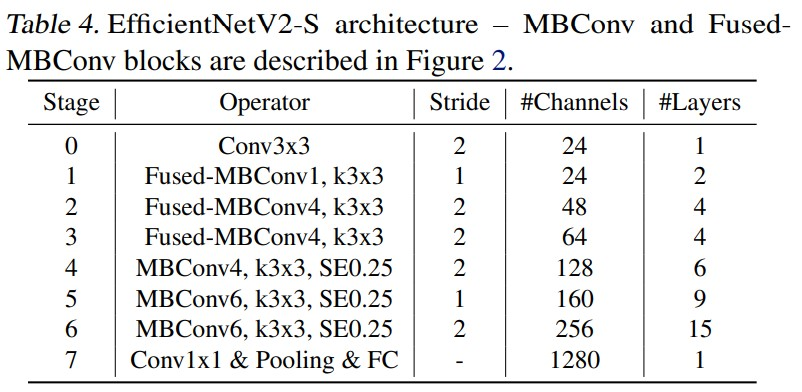

# EfficientNetV2: Smaller Models and Faster Training
Mingxing Tan, Quoc V. Le. _23 Jun 2021 (v3)_

> This paper introduces EfficientNetV2, a new family of convolutional networks that have faster training speed and better parameter efficiency than previous models. To develop this family of models, we use a combination of training-aware neural architecture search and scaling, to jointly optimize training speed and parameter efficiency. The models were searched from the search space enriched with new ops such as Fused-MBConv. Our experiments show that EfficientNetV2 models train much faster than state-of-the-art models while being up to 6.8x smaller.
>Our training can be further sped up by progressively increasing the image size during training, but it often causes a drop in accuracy. To compensate for this accuracy drop, we propose to adaptively adjust regularization (e.g., dropout and data augmentation) as well, such that we can achieve both fast training and good accuracy.

* Official paper: [name](https://arxiv.org/abs/2104.00298)
* Official code: [Github](https://github.com/google/automl/tree/master/efficientnetv2)

# Overview

>To develop these models, we use a combination of training-aware neural architecture search and scaling, 
- **Goals** : to jointly optimize _training speed_(latancy) and _parameter efficiency_(FLOPs, prams). 
- The models were searched from the search space enriched with new ops such as Fused-MBConv.

> we propose an improved method of progressive learning, which adaptively adjusts regularization (e.g. data augmentation) along with image size.
Because:
-  training with very large image sizes is slow
-  depthwise convolutions are slow in early layers
-  equally scaling up every stage is sub-optimal

#  EfficientNetV2 Architecture Design

1. Review of EfficientNet (v1)
   
- It leverages NAS to search for the baseline EfficientNet-B0 that has better trade-off on accuracy and FLOPs

  

2. Understanding Training Efficiency
   
**Training with very large image sizes is slow:**
- Since the total memory on GPU/TPU is fixed, we have to train these models with smaller batch size, which drastically slows down the training.
- using smaller image size for training also leads to slightly better accuracy.

**Depthwise convolutions are slow in early layers but effective in later stages:**
-  Depthwise convolutions have fewer parameters and FLOPs than regular convolutions, but they often cannot fully utilize modern accelerators (for inverse bottleneck). => **Fused-MBConv** is proposed 

- It replaces the depthwise conv3x3 and expansion conv1x1 in MBConv with a single regular conv3x3, as shown in Figure 2.
-  applied in early stage 1-3, FusedMBConv can improve training speed with a small overhead on parameters and FLOPs, but if we replace all blocks with Fused-MBConv (stage 1-7), then it significantly increases parameters and FLOPs while also slowing down the training.

|  | Params (M) | FLOPs (B) | Top-1 Acc. | TPU imgs/sec/core | V100 imgs/sec/gpu |
| :--- | ---: | ---: | ---: | :---: | :---: |
| No fused | $19.3$ | $4.5$ | $82.8 \%$ | 262 | 155 |
| Fused stage1-3 | $20.0$ | $7.5$ | $83.1 \%$ | 362 | 216 |
| Fused stage1-5 | $43.4$ | $21.3$ | $83.1 \%$ | 327 | 223 |
| Fused stage1-7 | $132.0$ | $34.4$ | $81.7 \%$ | 254 | 206 |

3. Training-Aware NAS and Scaling

**NAS Search**:  Since the search space is smaller, we can apply reinforcement learning  or simply random search on much larger networks that have comparable size as EfficientNetB4. 

Our search reward combines the model accuracy _A_, the normalized training step time _S_, and the parameter size _P_, using a simple weighted product $A \cdot S^{w} \cdot P^{v}$
where $w$ $=-0.07,v=-0.05$ are empirically determined to balance the trade-offs.

**EfficientNetV2 Architecture:**
-   The first difference is EfficientNetV2 extensively uses both MBConv and the newly added fused-MBConv in the early layers
-   EfficientNetV2 prefers smaller expansion ratio for MBConv since smaller expansion ratios tend to have less memory access overhead. 
-   EfficientNetV2 prefers smaller 3x3 kernel sizes, but it adds more layers to compensate the reduced receptive field resulted from the smaller kernel size
-   EfficientNetV2 completely removes the last stride-1 stage in the original EfficientNet
  

# Progressive Learning

1. Motivation

2. Progressive Learning with adaptive Regularization

# Main Results
