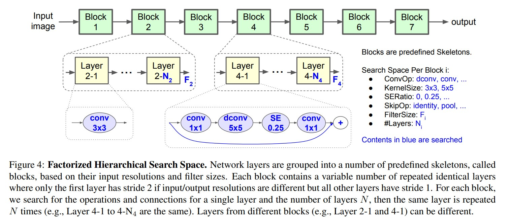
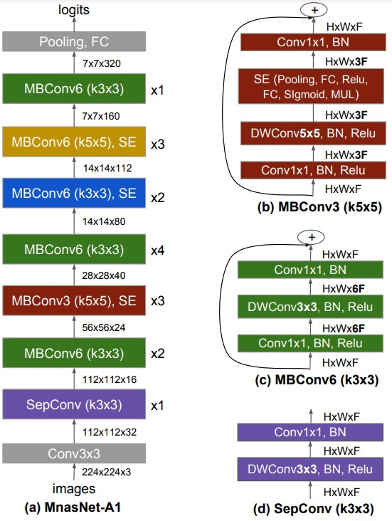
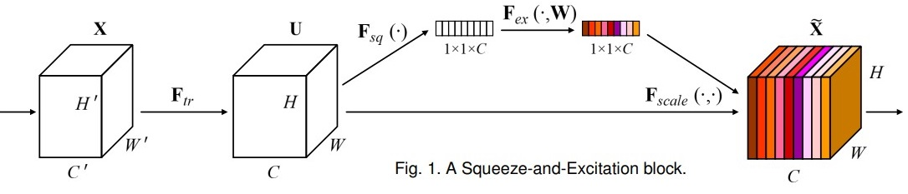
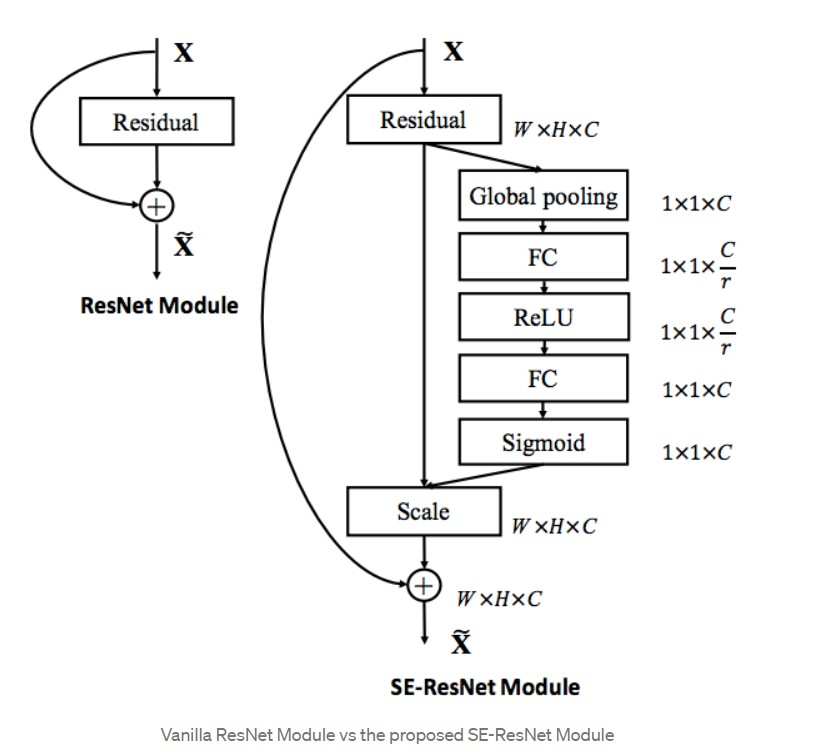

# MnasNet: Platform-Aware Neural Architecture Search for Mobile
Mingxing Tan, Bo Chen, Ruoming Pang, Vijay Vasudevan, Mark Sandler, Andrew Howard, Quoc V. Le. _29 May 2019 (this version, v3)_

* Official paper: [ArXiv](https://arxiv.org/abs/1807.11626)
* Official code: [Github](https://github.com/tensorflow/tpu/tree/master/models/official)

# Overview

> We introduce a multi-objective neural architecture search approach that optimizes both accuracy and realworld latency on mobile devices inspired by [Mobinetv2](mobilenetv2.md) and NastNet.

Given a model m, let _ACC(m)_ denote its accuracy on the target task, _LAT(m)_ denotes the inference latency on the target mobile platform, and _T_ is the target latency
Optimization goal:

$$\underset{m}{\operatorname{maximize}} A C C(m) \times\left[\frac{L A T(m)}{T}\right]^{w} \qquad(Eq.1)$$

where $w$ is the weight factor defined as :

$$w= \begin{cases}\alpha, & \text { if } L A T(m) \leq T \\ \beta, & \text { otherwise }\end{cases}$$


#  Factorized Hierarchical Search Space and Search Algorithm

**Factorized Hierarchical Search Space**

-  we need to search for the best operations based on the input and output shapes to obtain better accuratelatency trade-offs, for example stages of CNNs usually process larger amounts of data and thus have much higher impact on inference latency than later stages:
   -   a [widely-used depthwise separable convolution](mobilenet.md) (K, K, M, N),  transforms an input of size (H, W, M) to an output of size (H, W, N) e (H, W) is the input resolution and M, N are the input/output filter sizes
   -   number muladds:
    
    $$H * W * M *(K * K+N)$$

   -   Figure 4 shows the baseline structure of our search space.



   -   Each block has a list of identical layers, whose operations and connections are determined by a per-block sub search space. Specifically, a sub search space for a block i consists of the following choices:
       *   Convolutional ops ConvOp,  depthwise conv (dconv), and mobile inverted bottleneck conv
       *   Convolutional kernel size KernelSize: 3x3, 5x5
       *   Squeeze-and-excitation ratio SERatio: 0, 0.25
       *   Skip ops SkipOp: pooling, identity residual, or no skip
       *   Output filter size $F_i$
       *   Number of layers per block $N_i$
  
- Factorized hierarchical search space has a distinct advantage of balancing the diversity of layers and the size of total search space. 
  - Suppose we partition the network into $B$ blocks, 
  - each block has a sub search space of size $S$ with average $N$ layers per block
  - total search space size would be $S^{B}$, versing the flat per-layer search space with size $S^{B * N}$. 
  - A typical case is $S=432, B=5, N=3$, where search space size is about $10^{13}$, versing the perlayer approach with search space size $10^{39}$.

**Auto Search Algorithm**
- use a reinforcement learning approach to find Pareto optimal solutions for our multi-objective search problem.
- These tokens are determined by a sequence of actions $a_{1: T}$ from the reinforcement learning agent based on its parameters $\theta$. 
- goal is to maximize the expected reward:
  
    $$J=E_{P\left(a_{1: T} ; \theta\right)}[R(m)]$$

    where:
    - $m$ is a sampled model determined by action $a_{1: T}$
    - $R(m)$ is the objective value defined by [equation 1](#overview) .

# MnasNet Architecture and Layer Diversity

- Figure below illustrates MnasNet-A1 model found by  [automated approach](#factorized-hierarchical-search-space). 
- it consists of a variety of layer architectures throughout the network. 
- MnasNet uses both 3x3 and 5x5 convolutions, which is different from previous [mobile models](mobilenetv2.md) that all only use 3x3 convolutions.



# **NOTE**

**Squeeze-and-excitation - SEBlock**
[PAPER](https://arxiv.org/pdf/1709.01507.pdf)



A Squeeze-and-Excitation block is a computational unit:
  - built upon a transformation $\mathbf{F}_{t r}$
  - mapping an input $\mathbf{X} \in \mathbb{R}^{H^{\prime} \times W^{\prime} \times C^{\prime}}$ 
  - feature maps $\mathbf{U} \in \mathbb{R}^{H \times W \times C}$. 

In the notation:
  - take $\mathbf{F}_{t r}$ to be a convolutional operator 
  - use $\mathbf{V}= \text{set} ( v_{1}, v_{2}, \ldots, v_C)$ to denote the learned set of filter kernels, 
  where $v_c$ refers to the parameters of the _c_-th filter. 
  
**the outputs** as $\mathbf{U} = [u_1, u_2, \ldots, u_C]$
where
  
$$\mathbf{u}_{c}=\mathbf{v}_{c} * \mathbf{X}=\sum_{s=1}^{C^{\prime}} \mathbf{v}_{c}^{s} * \mathbf{x}^{s}$$

  -   Here: 
      -   $*$ denotes convolution
      -   $v_{c}= [v_c^{1}, \ldots, v_{c}^{C^{\prime}} ]$
      -   $X = [x^1,  \ldots, x^{C^{\prime}}]$
      -   $u_{c} \in \mathbb{R}^{H \times W} \cdot v_{c}^{s}$ is a 2D spatial kernel representing a single channel of $v_c$ that acts on the corresponding channel of **X**. 



>All you need to understand for now is that the network weights each of its channels equally when creating the output feature maps. SENets are all about changing this by adding a content aware mechanism to weight each channel adaptively. In it’s most basic form this could mean adding a single parameter to each channel and giving it a linear scalar how relevant each one is.
>First, they get a global understanding of each channel by squeezing the feature maps to a single numeric value. This results in a vector of size n, where n is equal to the number of convolutional channels. Afterwards, it is fed through a two-layer neural network, which outputs a vector of the same size. These n values can now be used as weights on the original features maps, scaling each channel based on its importance.

Example code

```python
def se_block(in_block, ch, ratio=16):
    x = GlobalAveragePooling2D()(in_block)
    x = Dense(ch//ratio, activation='relu')(x)
    x = Dense(ch, activation='sigmoid')(x)
    return multiply()([in_block, x])
```
   
