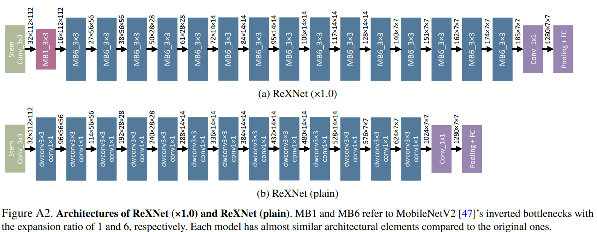
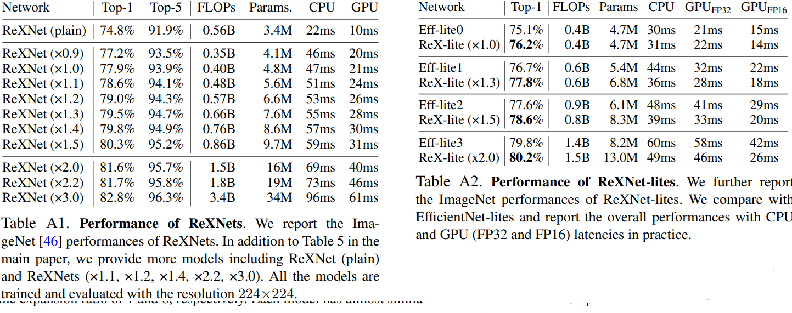

# Rethinking Channel Dimensions for Efficient Model Design
NAVER AI Lab. _08 June 2021_

* Official paper: [ArVix](https://arxiv.org/pdf/2007.00992v3.pdf)
* Official code: [Github](https://github.com/clovaai/rexnet)

# Overview
- ReXNet is upgraded from [Mobinet v2](mobilenetv2.md to a network
  - the identical setting of the stem (i.e., 3×3 convolution with BN and ReLU6) and the inverted bottleneck with the expansion ratio 6
  - replace ReLU6 only after the first 1×1 convolution in each inverted bottleneck
  - the second depthwise convolution has the channel dimension ratio of 1, so we do not replace ReLU6 here
  - Using other nonlinear functions such as ELU shows similar accuracy gains (see Table A2, but we use SiLU 

# Architecture

