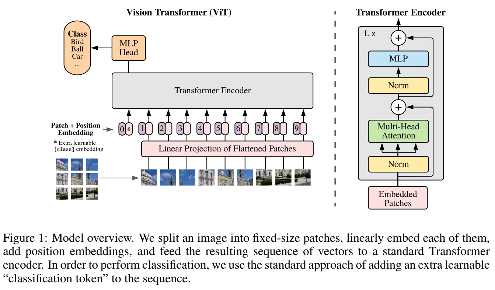
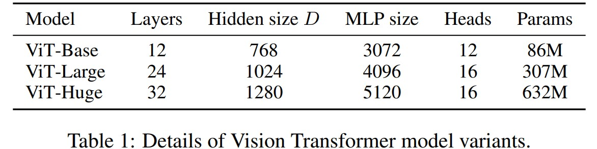
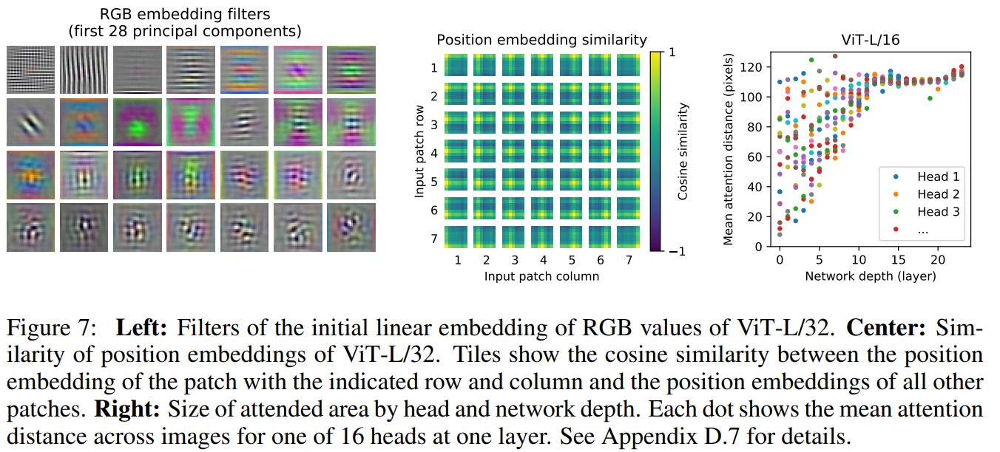

# An Image is Worth 16x16 Words: Transformers for Image Recognition at Scale
_3 Jun 2021 (this version, v2)_

>While the Transformer architecture has become the de-facto standard for natural language processing tasks, its applications to computer vision remain limited. In vision, attention is either applied in conjunction with convolutional networks, or used to replace certain components of convolutional networks while keeping their overall structure in place. We show that this reliance on CNNs is not necessary and a pure transformer applied directly to sequences of image patches can perform very well on image classification tasks. When pre-trained on large amounts of data and transferred to multiple mid-sized or small image recognition benchmarks (ImageNet, CIFAR-100, VTAB, etc.), Vision Transformer (ViT) attains excellent results compared to state-of-the-art convolutional networks while requiring substantially fewer computational resources to train.

* Official paper: [ArXiv](https://arxiv.org/pdf/2010.11929.pdf)
* Official code: [Github](https://github.com/google-research/vision_transformer)

# Introduce

> Inspired by the Transformer scaling successes in NLP, we experiment with applying a standard Transformer directly to images, with the fewest possible modifications. To do so, we split an image into patches and provide the sequence of linear embeddings of these patches as an input to a Transformer.

**Image patches are treated the same way as tokens (words) in an NLP application.**

# Architecture

1. VISION TRANSFORMER (VIT)
- The standard Transformer receives as input a 1D sequence of token embeddings
  - Thus, reshape the image $\mathbf{x} \in \mathbb{R}^{H \times W \times C}$ into a sequence of flattened $2 \mathrm{D}$ patches $\mathbf{x}_{p} \in \mathbb{R}^{N \times\left(P^{2} \cdot C\right)}$
  - where $(H, W)$ is the resolution of the original image
  - $C$ is the number of channels
  - $(P, P)$ is the resolution of each image patch
  - $N=H W / P^{2}$ is the resulting number of patches
- The Transformer uses constant latent vector size $D$ through all of its layers
  - So, flatten the patches and map to $D$ dimensions with a trainable linear projection (Eq. 1)
  - the output of this projection as the patch embeddings
- prepend a learnable embedding to the sequence of embedded patches $\left(\mathbf{z}_{0}^{0}=\mathbf{x}_{\text {class }}\right)$ serves as the image representation $y$ (Eq. 4)
- a classification head is attached to $\mathbf{z}_{L}^{0}$. 
  - The classification head is implemented by a MLP with one hidden layer at pre-training time 
  - by a single linear layer at fine-tuning time.
- Position embeddings are added to the patch embeddings to retain positional information
- The Transformer encoder  consists of alternating layers of multiheaded selfattention  and MLP blocks (Eq. 2, 3). 
- Layernorm (LN) is applied before every block, and residual connections after every block.

$$\begin{aligned}
\mathbf{z}_{0} &=\left[\mathbf{x}_{\text {class }} ; \mathbf{x}_{p}^{1} \mathbf{E} ; \mathbf{x}_{p}^{2} \mathbf{E} ; \cdots ; \mathbf{x}_{p}^{N} \mathbf{E}\right]+\mathbf{E}_{\text {pos }}, & & \mathbf{E} \in \mathbb{R}^{\left(P^{2} \cdot C\right) \times D}, \mathbf{E}_{p o s} \in \mathbb{R}^{(N+1) \times D} \\
\mathbf{z}_{\ell}^{\prime} &=\operatorname{MSA}\left(\operatorname{LN}\left(\mathbf{z}_{\ell-1}\right)\right)+\mathbf{z}_{\ell-1}, & & \ell=1 \ldots L \\
\mathbf{z}_{\ell} &=\operatorname{MLP}\left(\operatorname{LN}\left(\mathbf{z}_{\ell}^{\prime}\right)\right)+\mathbf{z}_{\ell}^{\prime}, & & \ell=1 \ldots L \\
\mathbf{y} &=\operatorname{LN}\left(\mathbf{z}_{L}^{0}\right) & &
\end{aligned}$$

2. FINE-TUNING AND HIGHER RESOLUTION
- Typically, we pre-train ViT on large datasets, and fine-tune to (smaller) downstream tasks
- we remove the pre-trained prediction head and attach a zero-initialized D × K feedforward layer, where K is the number of downstream classes
- The Vision Transformer can handle arbitrary sequence lengths (up to memory constraints),however, the pre-trained position embeddings may no longer be meaningful.
  

1. INSPECTING VISION TRANSFORMER
- The first layer of the Vision Transformer linearly projects the flattened patches into a lower-dimensional space (Eq. 1) . Figure 7 (left) shows the top principal components of the the learned embedding filters
- After the projection, a learned position embedding is added to the patch representations.  Figure 7 (center) shows that the model learns to encode distance within the image in the similarity of position embeddings
  

- Self-attention allows ViT to integrate information across the entire image even in the lowest layers. They compute the average distance in image space across which information is integrated, based on the attention weights (Figure 7, right)
