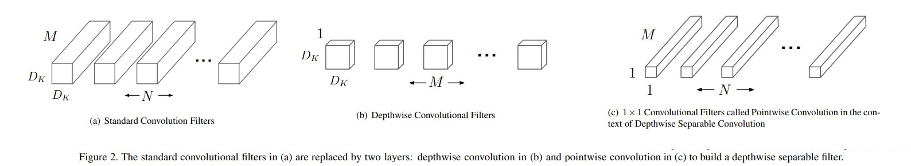

# MobileNets: Efficient Convolutional Neural Networks for Mobile Vision Applications
Andrew G. Howard, Menglong Zhuz, Bo Chen, Dmitry Kalenichenko, Weijun Wang, Tobias Weyand, Marco Andreetto, Hartwig Adam. _17 April 2017_

paper: [ArXiv](https://arxiv.org/pdf/1704.04861.pdf)
code: [github](https://github.com/tensorflow/tensorflow/blob/v2.4.1/tensorflow/python/keras/applications/mobilenet.py)

# Overview
> This paper describes an efficient network architecture and a set of two hyper-parameters in order to build very small, low latency models that can be easily matched to the design requirements for mobile and embedded vision applications

# MobileNet Architecture

## 1. Depthwise Separable Convolution

- The MobileNet model is based on depthwise separable convolutions which is a form of factorized convolutions which factorize a standard convolution into a depthwise convolution and a 1×1 convolution called a **pointwise convolution**.
  - the depthwise convolution applies a single filter to each input channel
  - pointwise convolution then applies a 1×1 convolution to combine the outputs the depthwise convolution
  - depthwise separable convolution splits this into two layers: _a separate layer for filtering_ and _a separate layer for combining_
  - This factorization has the effect of drastically reducing computation and model size. Figure 2 shows how a standard convolution 2(a) is factorized into a depthwise convolution 2(b) and a 1 × 1 pointwise convolution 2(c). with M is the number of input channels (input depth), N is the number of output channel (output depth), $D_k$ denotes  the spatial width and height of a square kernel.
  
  

- Mathematically, :
  - For the standard convolutional layer is parameterized by convolution kernel K of size $D_K x D_K x M x N$, output feature map for standard convolution assuming stride one and padding is computed as:
  
  $$\mathbf{G}_{k, l, n}=\sum_{i, j, m} \mathbf{K}_{i, j, m, n} \cdot \mathbf{F}_{k+i-1, l+j-1, m}$$

  Then, Standard convolutions have the computational cost of:

  $$D_{K} \cdot D_{K} \cdot M \cdot N \cdot D_{F} \cdot D_{F}$$

  - In mobilenets, using depthwise convolutions to apply a single filter per each input channel (input depth). Pointwise convolution, a simple 1×1 convolution, is then used to create a linear combination of the output of the depthwise layer
    - Depthwise convolution with one filter per input channel (input depth) can be written as:
  
    $$\hat{\mathbf{G}}_{k, l, m}=\sum_{i, j} \hat{\mathbf{K}}_{i, j, m} \cdot \mathbf{F}_{k+i-1, l+j-1, m}$$

    - Depthwise convolution has a computational cost of:

    $$D_{K} \cdot D_{K} \cdot M \cdot D_{F} \cdot D_{F}$$

    - Depthwise convolution is extremely efficient relative to standard convolution. However it only filters input channels, it does not combine them to create new features, so depthwise separable convolution which was originally introduced. Depthwise separable convolutions cost:
  
    $$D_{K} \cdot D_{K} \cdot M \cdot D_{F} \cdot D_{F}+M \cdot N \cdot D_{F} \cdot D_{F}$$
  
    - we get a reduction in computation of:

    $$\begin{aligned}
    & \frac{D_{K} \cdot D_{K} \cdot M \cdot D_{F} \cdot D_{F}+M \cdot N \cdot D_{F} \cdot D_{F}}{D_{K} \cdot D_{K} \cdot M \cdot N \cdot D_{F} \cdot D_{F}} \\
    =& \frac{1}{N}+\frac{1}{D_{K}^{2}}
    \end{aligned}$$

  - summary:

  

## 2. Network Structure and Training

> Counting depthwise and pointwise convolutions as separate layers, MobileNet has 28 layers.

* All layers are followed by a batchnorm and ReLU nonlinearity with the exception of the final fully connected layer which has no nonlinearity and feeds into a softmax layer for classification.

* Figure 3 contrasts a layer with regular convolutions, batchnorm and ReLU nonlinearity to the factorized layer with depthwise convolution, 1 × 1 pointwise convolution as well as batchnorm and ReLU after each convolutional layer. 
* Down sampling is handled with strided convolution in the depthwise convolutions as well as in the first layer.
*  A final average pooling reduces the spatial resolution to 1 before the fully connected layer. 

## 3. Width Multiplier and Resolution Multiplier

**3.1 Width Multiplier: Thinner Models and Resolution**

$\alpha$ called width multiplier with the role is to thin a network uniformly at each layer.

-  The number of input channels M becomes $\alpha \mathcal{M}$ and the number of output channels N becomes $\alpha \mathcal{N}$
-  $\alpha = 1$ is the baseline MobileNet and smaller than 1 are reduced MobileNets

**3.2 Resolution Multiplier: Reduced Representation**

$\mathcal{p}$ called  resolution multiplier to reduce the computational cost of a neural network 

- apply this to the input image and the internal representation of every layer is subsequently reduced by the same multiplier
