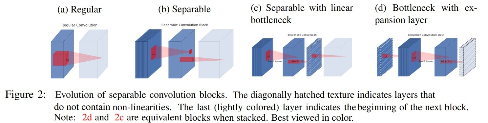
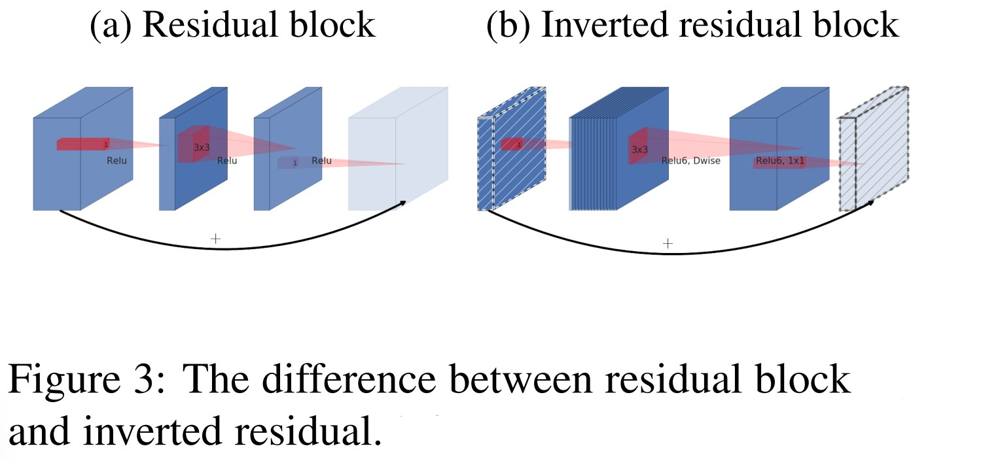
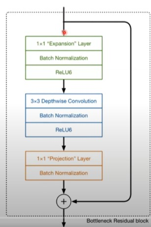
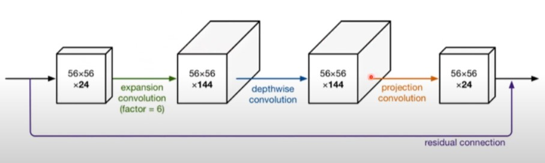
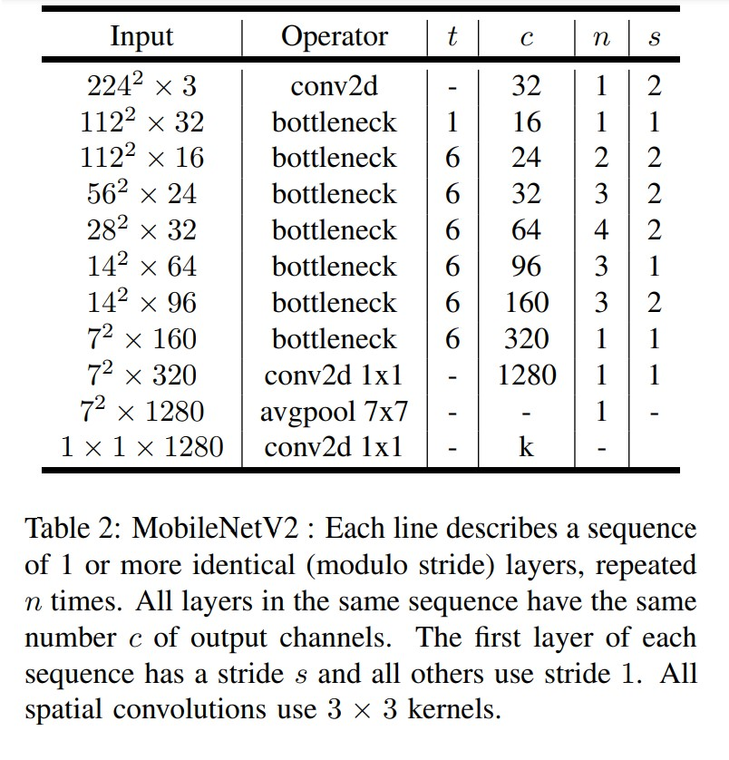
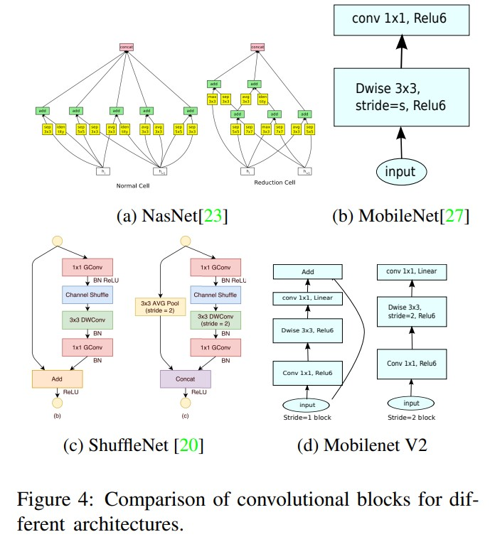

# MobileNets: Efficient Convolutional Neural Networks for Mobile Vision Applications
Mark Sandler, Andrew Howard, Menglong Zhu, Andrey Zhmoginov, Liang-Chieh Chen. _21 Mar 2019_

paper: [ArXiv](https://arxiv.org/pdf/1801.04381.pdf)
code: [github](https://github.com/tensorflow/tensorflow/blob/v2.4.1/tensorflow/python/keras/applications/mobilenet_v2.py)

# Overview
- network design is based on MobileNetV1 ([review here](mobilenet.md))
- Main contribution is a novel layer module: **the inverted residual** with **linear bottleneck**

# I. Preliminaries, discussion and intuition

## 1. Depthwise Separable Convolution
- The basic idea is to replace a full convolutional operator with a factorized version that splits convolution into two separate layers:
  -  The first layer is called a **depthwise convolution**, it performs lightweight filtering by applying a single convolutional filter per input channel. 
  -  The second layer is a 1 × 1 convolution, called a **pointwise convolution**, which is responsible for building new features through computing linear combinations of the input channels.
- Read more [details](mobilenet.md)

## 2. Linear Bottlenecks

Consider a deep neural network consist of _n_ layers Li each of which has an activation tensor of dimensions $h_i × w_i × d_i$.

- [the width multiplier](mobilenet.md#3-width-multiplier-and-resolution-multiplier) approach allows one to reduce the dimensionality of the activation space until the manifold of interest spans this entire space, however,  breaks down when we recall that deep convolutional neural networks actually have non-linear per coordinate transformations, such as ReLU (information loss)
- Two properties that are indicative of the requirement that the manifold of interest should lie in a low-dimensional subspace of the higher-dimensional activation space:
  - If the manifold of interest remains non-zero volume after ReLU transformation, it corresponds to a linear transformation.
  - ReLU is capable of preserving complete information about the input manifold, but only if the input manifold lies in a low-dimensional subspace of the input space

- Experimental evidence suggests that using linear layers is crucial as it prevents nonlinearities from destroying too much information

## 3. Inverted residuals

- The bottleneck blocks appear similar to residual block where each block contains an input followed by several bottlenecks then followed by expansion (Fig3a). Mechanism: Wide -> narrow (bottleneck) -> wide 
- the bottlenecks contain all the necessary information, while an expansion layer acts merely as an implementation detail that accompanies a non-linear transformation of the tensor. => inverted residuals (Fig3b) : narrow -> wide -> narrow

> we use shortcuts directly between the bottlenecks

- the inverted design is considerably more memory efficient, as well as works slightly better in their experiments. 

|   Input   |   Operator    |     Output    |
|-----------|---------------|---------------|
|_h x w x k_| 1x1conv2d, ReL6| _h x w x (tk)_|
|_h x w x tk_| 3x3dwise s=s, ReL6| _h/s x w/s x (tk)_|
|_h/s x w/s x tk_| linear 1x1 conv2d| _h/s x w/s x k'_|

Table 1: Bottleneck residual block transforming from k to k'channels, with stride s, and expansion factor t.

## 4. Information flow interpretation

The proposed convolutional block has a unique property that allows to separate the network expressiveness (encoded by expansion layers) from its capacity (encoded by bottleneck inputs)

# II.  Model Architecture

- the basic building block is a bottleneck depth-separable convolution with residuals

- The architecture of MobileNetV2 contains the initial fully convolution layer with 32 filters, followed by 19 residual bottleneck layers described in the Table 2. 
- ReLU6 as the non-linearity because of its robustness when used with low-precision computation.
- always use kernel size 3 × 3 as is standard for modern networks, and utilize dropout and batch normalization during training
- the exception of the first layer, we use constant expansion rate throughout the network (between 5 and 10)

# **Note**
  - Bottleneck Residual Block A bottleneck block operator $\mathcal{F}(x)$ shown in Figure 3b can be expressed as a composition of three operators:
    * $\mathcal{F}(x)=[A \circ \mathcal{N} \circ B] x$
    * _A_ is a linear transformation $A: \mathcal{R}^{s \times s \times k} \rightarrow \quad \mathcal{R}^{s \times s \times n}$ 
    * _N_ is a non-linear per-channel transformation: $\mathcal{N}: \mathcal{R}^{s \times s \times n} \rightarrow \mathcal{R}^{s^{\prime} \times s^{\prime} \times n}$
      * $\mathcal{N}= \text{ReLU6} \circ \text{dwise} \circ \text{ReLU6}$
      * the memory required to compute _F(X)_ can be as low as $\left|s^{2} k\right|+\left|s^{\prime 2} k^{\prime}\right|+$ $O\left(\max \left(s^{2}, s^{2}\right)\right)$.
    * _B_ is again a linear transformation to the output domain: $B: \mathcal{R}^{s^{\prime} \times s^{\prime} \times n} \rightarrow \quad \mathcal{R}^{s^{\prime} \times s^{\prime} \times k^{\prime}}$
  - The algorithm is based on the fact that the inner tensor $\mathcal{I}$ can be represented as concatenation of ___t___ tensors, of size ___n / t___ each and our function can then be represented as

    $$\mathcal{F}(x)=\sum_{i=1}^{t}\left(A_{i} \circ N \circ B_{i}\right)(x)$$

