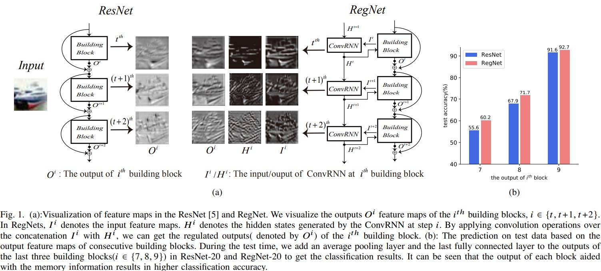
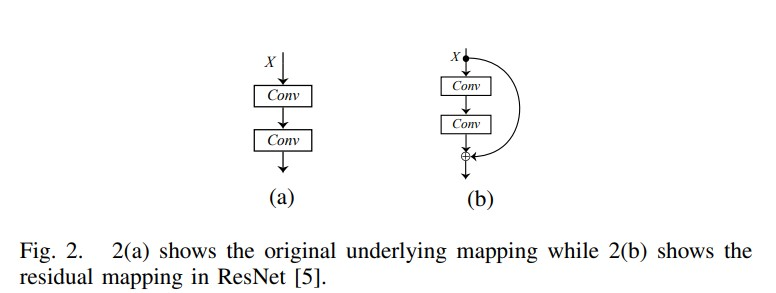
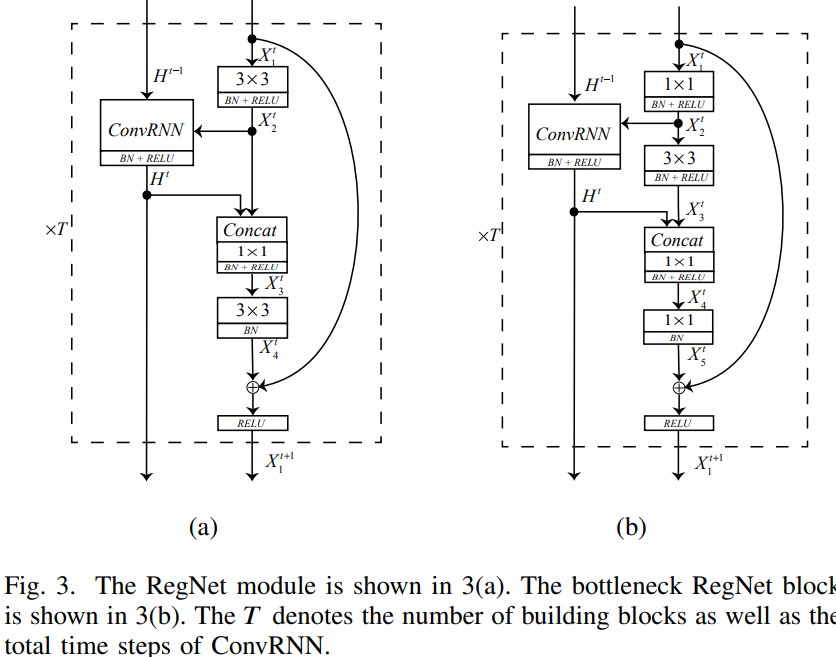

# RegNet: Self-Regulated Network for Image Classification
Jing Xu, Yu Pan, Xinglin Pan, Steven Hoim Zhang Yim, Zenglin Xu∗. _3 Jan 2021_

* Official paper: [ArXiv](https://arxiv.org/pdf/2101.00590.pdf)
* Official code: [Github](https://github.com/TrevorIkky/RegNet)

# Overview
- In The ResNet and its variants  the simple shortcut connection mechanism limits the ability of reexploring new potentially complementary features due to the additive function. the shortcut connection mechanism makes each block focus on learning its respective residual output where the inner block information communication is somehow ignored and some reusable information learned from previous blocks tends to be forgotten in later blocks.(fig.1)
    -  It can be see that due to the summation operation among blocks, the adjacent outputs 𝑂𝑡, 𝑂𝑡+1 and 𝑂𝑡+2 look very similar to each other, which indicates that less new information has been learned through consecutive blocks

# REGNET Architecture

1. ResNet

2. ConvRNN and its Variants

- RNN and its classical variants LSTM and GRU  tackle the spatio-temporal problem =>  adopt the basic ConvRNN and its variants ConvLSTM and ConvGRU
- the ConvRNN can be formulated as

    $$\mathbf{H}^{t}=\tanh \left({ }^{2 N} \mathbf{W}_{h}^{N} *\left[\mathbf{X}^{t}, \mathbf{H}^{t-1}\right]+\mathbf{b}_{h}\right)$$

    - where $X^{t}$ is the input 3D feature map
    - $H^{t-1}$ is the hidden state obtained from the earlier output of ConvRNN 
    - $H^{t}$ is the output 3D feature map at this state

- To make the ConvRNN more efficient,  given input $\mathbf{X}$ with $2 \mathrm{~N}$ channels, conduct convolution operation in 2 steps:
  - Divide the input $\mathbf{X}$ with $2 \mathrm{~N}$ channels into $\mathrm{N}$ groups, and use grouped convolutions  with $1 \times 1$ kernel to process each group separately for fusing input channels.
  - Divide the feature map obtained by previous step into $\mathrm{N}$ groups, and use grouped convolutions with $3 \times 3$ kernel to process each group separately for capturing the spatial information per input channel.

3. RNN-Regulated ResNet

*  **RNN-Regulated ResNet Module** (RegNet module)
    shown in Figure 3a

- $H^{t-1}$ denotes the earlier output from ConvLSTM, 
- $H^{t}$ is output of the ConvLSTM at $t$-th module 
- $. X_{i}^{t}$ denotes the $i$-th feature map at the $t$-th module.

The $t$-th RegNet(ConvLSTM) module can be expressed as

$$\begin{aligned}
&\mathbf{X}_{2}^{t}=\operatorname{Re} L U\left(B N\left(\mathbf{W}_{12}^{t} * \mathbf{X}_{1}^{t}+\mathbf{b}_{12}^{t}\right)\right. \\
&{\left[\mathbf{H}^{t}, C^{t}\right]=\operatorname{ReLU}\left(\operatorname{BN}\left(\operatorname{ConvLSTM}\left(\mathbf{X}_{2}^{t},\left[\mathbf{H}^{t-1}, C^{t-1}\right]\right)\right)\right)} \\
&\mathbf{X}_{3}^{t}=\operatorname{Re} L U\left(B N\left(\mathbf{W}_{23}^{t} * \operatorname{Concat}\left[\mathbf{X}_{2}^{t}, \mathbf{H}^{t}\right]\right)\right) \\
&\mathbf{X}_{4}^{t}=B N\left(\mathbf{W}_{34}^{t} * \mathbf{X}_{3}^{t}+\mathbf{b}_{34}^{t}\right) \\
&\mathbf{X}_{1}^{t+1}=\operatorname{ReLU}\left(\mathbf{X}_{1}^{t}+\mathbf{X}_{4}^{t}\right)
\end{aligned}$$

- According to the inputs, the ConvLSTM automatically decides whether the information in memory cell will be propagated to the output hidden feature map $\mathbf{H}^{t}$.

*  **Bottleneck RNN-Regulated ResNet Module** (bottleneck RegNet module)
Based on bottleneck ResNet building block is shown in Fig. 3(b)

the $t$-th bottleneck RegNet module can be expressed as

$$\begin{aligned}
&\mathbf{X}_{2}^{t}=\operatorname{Re} L U\left(B N\left(\mathbf{W}_{12}^{t} * \mathbf{X}_{1}^{t}+\mathbf{b}_{12}^{t}\right)\right. \\
&{\left[\mathbf{H}^{t}, C^{t}\right]=\operatorname{Re} L U\left(B N\left(\operatorname{ConvLSTM}\left(\mathbf{X}_{2}^{t},\left[\mathbf{H}^{t-1}, C^{t-1}\right]\right)\right)\right)} \\
&\mathbf{X}_{3}^{t}=\operatorname{Re} L U\left(B N\left(\mathbf{W}_{23}^{t} * \mathbf{X}_{2}^{t}+\mathbf{b}_{23}^{t}\right)\right. \\
&\mathbf{X}_{4}^{t}=\operatorname{Re} L U\left(B N\left(\mathbf{W}_{34}^{t} * \operatorname{Concat}\left[\mathbf{X}_{3}^{t}, \mathbf{H}^{t}\right]\right)\right) \\
&\mathbf{X}_{5}^{t}=B N\left(\mathbf{W}_{45}^{t} * \mathbf{X}_{4}^{t}+\mathbf{b}_{45}^{t}\right) \\
&\mathbf{X}_{1}^{t+1}=\operatorname{Re} L U\left(\mathbf{X}_{1}^{t}+\mathbf{X}_{5}^{t}\right)
\end{aligned}$$

where :
    - $\mathbf{W}_{12}^{t}$ and $\mathbf{W}_{45}^{t}$ are the two $1 \times 1$ kernels, and $\mathbf{W}_{23}^{t}$ is the $3 \times 3$ bottleneck kernel. 

   -   The $\mathbf{W}_{34}^{t}$ is a $1 \times 1$ kernel for fusing feature in our model.

