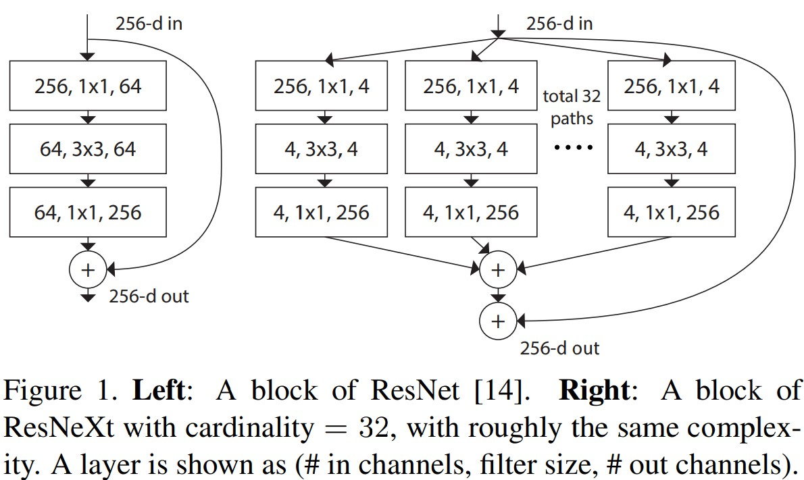

# Aggregated Residual Transformations for Deep Neural Networks
Saining Xie; Ross Girshick; Piotr Dollár; Zhuowen Tu; Kaiming He _09 November 2017_

> Our simple design results in a homogeneous, multi-branch architecture that has only a few hyper-parameters to set. This strategy exposes a new dimension, which we call “cardinality” (the size of the set of transformations), as an essential factor in addition to the dimensions of depth and width.

* Official paper: [IEEE](https://ieeexplore.ieee.org/document/8100117)
* Official code: [Github](https://github.com/hyunwoongko/resnext-parallel)

# Overview

> In this paper, we present a simple architecture which adopts VGG/ResNets’ strategy of repeating layers, while exploiting the split-transform-merge strategy in an easy, extensible way.
>  A module in our network performs a set of transformations, each on a low-dimensional embedding, whose outputs are aggregated by summation. We pursuit a
simple realization of this idea — the transformations to be aggregated are all of the same topology (e.g., Fig. 1 (right)). This design allows us to extend to any large number of transformations without specialized designs.



- **cardinality** (the size of the set of transformations) is a concrete, measurable dimension that is of central importance, in addition to the dimensions of width and depth. Their experiments demonstrates that _increasing cardinality is a more effective way of gaining accuracy than going deeper or wider_
-  ResNeXt adopts a highly modularized design  following VGG/ResNets, consists of a stack of residual block  are subject to two simple rules:
   -  if producing spatial maps of the same size, the blocks share the same hyper-parameters (width and filter sizes)
   -  each time when the spatial map is downsampled by a factor of 2, the width of the blocks is multiplied by a factor of 2
    
     - The second rule ensures that the computational complexity, in terms of FLOPs (floating-point operations, in # of multiply-adds), is roughly the same for all blocks
  
# 1. Group Convolution
   -   The simplest neurons in artificial neural networks perform inner product (weighted sum), which is the elementary transformation done by fully-connected and convolutional layers:
     

$$\sum_{i=1} w_i x_i \qquad \text{where} \qquad x_i = [x_1, x_2, ..., x_D] | \quad \text{D-channel input vector}$$

   -   the above operation can be recase as a combination of _spliting, trainsforming, aggregating_
       -   **Splitting** : _x_ is sliced as low-dementional embedding (single-dimentionsal subsapce $x_i$)
       -   **Transforming** : $w_i x_i$
       -   **Aggregating** : the transformations are aggregated by $\sum_{i=1}$

   -   **“Network-in-Neuron”**: expands along a new dimension instead of increase dimetion of death normaly as "network-in-network" ideals.
       - generality aggregated transformation :
  
   $$\mathcal{F}(\mathbf{x})=\sum_{i=1}^{C} \mathcal{T}_{i}(\mathbf{x}) \qquad (2)$$

   where $\mathcal{T}_{i}(\mathbf{x})$ can be an arbitrary function. 
       -  In Eqn.(2), _C_ is the size of the set of transformations to be aggregated and refer as **cardinality**. the dimension of cardinality controls the number of more complex transformations.
  
   -  In this paper:

       -  all $mathcal{T}_i$'s have the same topology. 
       -  set the individual transformation $mathcal{T}_i$ to be the bottleneck-shaped architecture as in Fig.1(right)
    -  The residual funtion in Fig. 1 right is:
  
   $$y = x + \sum_{i=1}^C \mathcal{T}_i(x) \quad \text{ y is output}$$

   
    -  fig.3(c) is reformulation:
       -  All low-dimensional embeddings (the first 1x1 layers) can be replaced by a sigle, wider layer (1x1, 128-d)
       -  splitting divides its input channels into groups (32g), convolutions are separately performed within each group.
  

   - code example:
 
 ```python
    def forward(self, x):
        return Lambda(lambda z: self.__forward(z))(x)

    def __forward(self, x):
        i, outs = tf.constant(0), tf.TensorArray(dtype=tf.float32, size=self.cardinality)
        x, i, outs = tf.while_loop(self.cond, self.body, [self.split(x), i, outs],
                                   parallel_iterations=self.cardinality)
        outs = [outs.gather([i]) for i in range(self.cardinality)]
        out = tf.concat(outs, axis=4)

        _, b, w, h, c = out.shape
        out = tf.reshape(out, (b, w, h, c))
        return out

    def body(self, x, i, outs):
        group = x.gather([i])
        _, _, w, h, c = group.shape
        group = tf.reshape(group, (self.batch_size, w, h, c))
        group = GroupConv2D_Backend(filters=self._out,
                                    kernel_size=self.kernel_size,
                                    padding='same',
                                    use_bias=False,
                                    strides=self.strides,
                                    kernel_initializer='he_normal',
                                    kernel_regularizer=self.weight_decay)(group)
        outs = outs.write(i, group)
        i = tf.add(i, 1)  # increase index to proceed loop
        return x, i, outs

    def cond(self, x, i, outs):
        return tf.less(i, self.cardinality)

    def split(self, x):
        _, w, h, c = x.shape
        out = c // self.cardinality
        arr = tf.TensorArray(size=self.cardinality, dtype=tf.float32)

        for i in range(self.cardinality):
            _from = i * out
            _to = (i + 1) * out
            val = x[:, :, :, _from:_to]
            arr = arr.write(value=val, index=i)

        return arr
```

# 2. Block Architecture (Basic block)


```python
    class BasicBlock:

        def __init__(self, _in, _out, strides, batch_size, cardinality, weight_decay=5e-4):
            self.channel_axis = 1 if K.image_data_format() == 'channels_first' else -1

            self.conv1 = GConv2D(
                _in=_in,
                _out=_out,
                kernel_size=(3, 3),
                cardinality=cardinality,
                batch_size=batch_size,
                weight_decay=l2(weight_decay),
                strides=(strides, strides))

            self.conv2 = GConv2D(
                _in=_out,
                _out=_out,
                kernel_size=(3, 3),
                cardinality=cardinality,
                batch_size=batch_size,
                weight_decay=l2(weight_decay),
                strides=(1, 1))

            self.bn1 = BatchNormalization(axis=self.channel_axis)
            self.bn2 = BatchNormalization(axis=self.channel_axis)
            self.relu = Activation('relu')

        def __call__(self, x):
            return self.forward(x)

        def forward(self, x):
            shortcut = x
            # store shortcut

            x = self.conv1(x)
            x = self.bn1(x)
            x = self.relu(x)
            x = self.conv2(x)
            x = self.bn2(x)

            if x.shape == shortcut.shape:
                # check shape for addition
                x = layers.add([x, shortcut])

            return self.relu(x)

```

# 3. Network Architecture
    
   
    
```python
    class ResNeXt:

        def __init__(self, input_shape, n_class, batch_size, cardinality, weight_decay=5e-4):
            """
            ResNeXt-18
            """
            self.channel_axis = 1 if K.image_data_format() == 'channels_first' else -1
            self.input_shape = input_shape
            self.weight_decay = weight_decay
            self.batch_size = batch_size

            self.conv1 = Conv2D(filters=64,
                                kernel_size=(3, 3),
                                padding='valid',
                                strides=(1, 1),
                                use_bias=False,
                                kernel_initializer='he_normal',
                                kernel_regularizer=l2(weight_decay))

            self.bn1 = BatchNormalization(axis=self.channel_axis)
            self.relu = Activation('relu')
            self.l1_1, self.l1_2 = self.make_layers(BasicBlock, BasicBlock, 64, 64, strides=1, cardinality=cardinality)
            self.l2_1, self.l2_2 = self.make_layers(BasicBlock, BasicBlock, 64, 128, strides=2, cardinality=cardinality)
            self.l3_1, self.l3_2 = self.make_layers(BasicBlock, BasicBlock, 128, 256, strides=2, cardinality=cardinality)
            self.l4_1, self.l4_2 = self.make_layers(BasicBlock, BasicBlock, 256, 512, strides=2, cardinality=cardinality)

            self.gap = GlobalAveragePooling2D()
            self.fc = Dense(n_class, activation='softmax', kernel_initializer='he_normal', use_bias=False)

        def __call__(self, x):
            return self.forward(x)

        def make_layers(self, b1, b2, _in, _out, strides, cardinality):
            return b1(_in, _out,
                    strides=strides, weight_decay=self.weight_decay, batch_size=self.batch_size, cardinality=cardinality), \
                b2(_in, _out,
                    strides=strides, weight_decay=self.weight_decay, batch_size=self.batch_size, cardinality=cardinality)

        def forward(self, x):
            # stem forwarding
            x = self.conv1(x)
            x = self.bn1(x)
            x = self.relu(x)

            # residual layers
            x = self.l1_2(self.l1_1(x))
            x = self.l2_2(self.l2_1(x))
            x = self.l3_2(self.l3_1(x))
            x = self.l4_2(self.l4_1(x))

            # classification layers
            x = self.gap(x)
            x = self.fc(x)
            return x

        def model(self):
            inputs = Input(shape=self.input_shape)
            outputs = self.forward(inputs)
            model = Model(input=inputs, output=outputs, name='ResNeXt')
            return model
```
