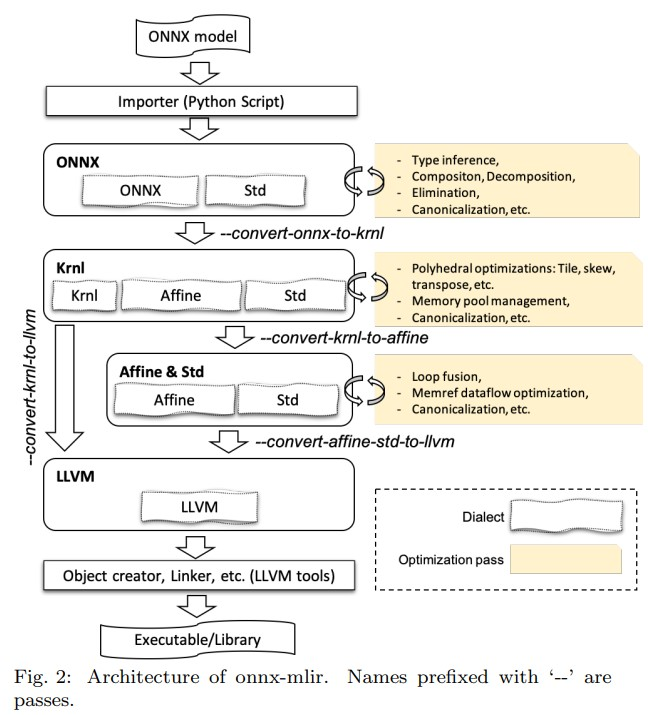

# Compiling ONNX Neural Network Models Using MLIR
Tian Jin, Gheorghe-Teodor Bercea, Tung D. Le, Tong Chen, Gong Su, Haruki Imai, Yasushi Negishi, Anh Leu, Kevin O'Brien, Kiyokuni Kawachiya, Alexandre E. Eichenberger. _1 Oct 2020 (this version, v2)]_

>to assist the portability of models, the open-source community has proposed the Open Neural Network Exchange (ONNX) standard. In this paper, we present a high-level, preliminary report on our onnx-mlir compiler, which generates code for the inference of deep neural network models described in the ONNX format.

* paper [arXiv](https://arxiv.org/abs/2008.08272)
* Source [Github](https://github.com/onnx/onnx-mlir)

# Introduce

- Many deep learning frameworks, such as Torch, Caffe, Theano, and TensorFlow, have been developed to facilitate the training and inferencing of deep neural network models
- training and inferencing are often done on different environments due to their different optimization characteristics
  
    For example, a model is trained using a large-scale distributed system since it might need weeks or months to finish, and can then be used on lightweight devices such as Internet of Things or mobile phones for inferencing.
    
- Rewriting a model for inferencing consists of replacing the operations in the model with the function calls in the library.

> we chose Open Neural Network Exchange (ONNX) [1] as a format to represent the input model of our compiler. Our compiler was written using Multi-level Intermediate Representation (MLIR) [5], a modern open source compiler infrastructure for multi-level intermediate representations and a subproject inside LLVM

# Background

1. ONNX

- is an open source format for artificial intelligence models, including both deep learning and traditional machine learning
- In ONNX, the top-level structure is a ‘Model’ to associate metadata with a graph.
-  Operators in ONNX are divided into a set of primitive operators and functions where a function is an operator whose calculation can be expressed via a subgraph of other operators
- An acyclic dataflow graph is constructed as a topological sort of the list of nodes in the graph
- Inputs and outputs can be marked as variadic or optional, There are three data types used to define inputs and outputs, i.e., ‘Tensor’, ‘Sequence’, and ‘Map’

2. MLIR

-  is a modern compiler infrastructure which is reusable and extensible. It reduces the cost of building domain-specfic compilers by facilitating the design and implementation of code generators, translators, and optimizers at different abstraction levels.
-  In MLIR, Tensor and MemRef types are syntactically represented as ***tensor*** [D1×D2× . . . ×DN×dtype] and ***memref*** [D1×D2× . . . ×DN×dtype]

# Example