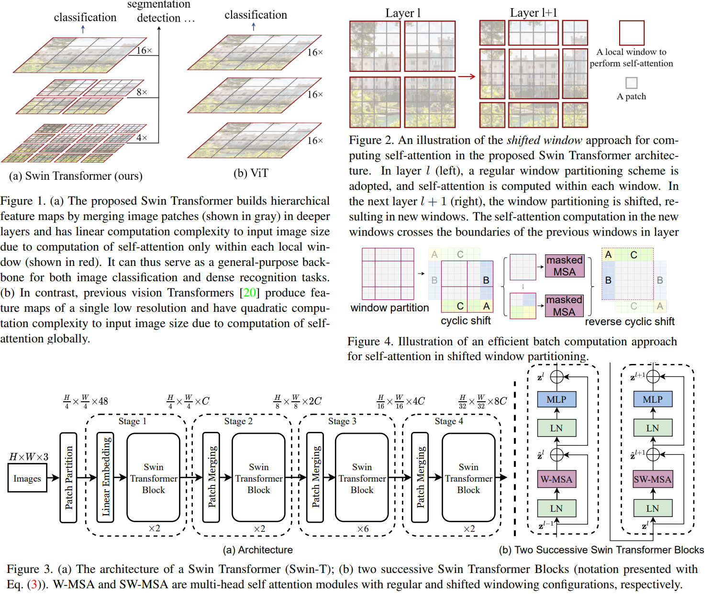

# Swin Transformer: Hierarchical Vision Transformer using Shifted Windows

> Challenges in adapting Transformer from language to vision arise from differences between the two domains, such as large variations in the scale of visual entities and the high resolution of pixels in images compared to words in text

>  we propose a hierarchical Transformer whose representation is computed with **Shifted windows**. The shifted windowing scheme brings greater efficiency by limiting self-attention computation to non-overlapping local windows while also allowing for cross-window connection

* Offical Paper: [ArXiv](https://arxiv.org/pdf/2103.14030.pdf)
* Offical Code : [Github](https://github.com/microsoft/Swin-Transformer)

# OVERVIEW
-  Designed for sequence modeling and transduction tasks, the Transformer is notable for its use of attention to model long-range dependencies in the data.
- Figure 1(a), Swin Transformer constructs a hierarchical representation by starting from small-sized patches (outlined in gray) and gradually merging neighboring patches in deeper Transformer layers.
- A key design element of Swin Transformer is its **shift** of the window partition between consecutive self-attention layers, as illustrated in Figure 2
  - The shifted windows bridge the windows of the preceding layer, providing connections among them that significantly enhance modeling power
  - This strategy is also efficient in regards to real-world latency: _all query patches within a window share the same key set_
- **Self-attention/Transformers to complement CNNs**
  - The selfattention layers can complement backbones or head networks  by providing the capability to encode distant dependencies or heterogeneous interactions. 
  - More recently, the encoder-decoder design in Transformer has been applied for the object detection and instance segmentation tasks
- **Transformer based vision backbones**
  -  The pioneering work of [ViT](../CNN/ViT.md) directly applies a Transformer architecture on nonoverlapping medium-sized image patches for image classification, but its architecture is unsuitable for use as a general-purpose backbone network on dense vision tasks or when the input image resolution is high, due to its low-resolution feature maps and the quadratic increase in complexity with image size
  -  

# ARCHITECHTURE

## Overall Architecture
- Figure 3, which illustrates the tiny version (SwinT):
  - It first splits an input RGB image into non-overlapping patches (**treated as a “token”**) by a patch splitting module, like ViT. A patch size of 4 × 4 and thus the feature dimension of each patch is _4 × 4 × 3 = 48_
  - A linear embedding layer is applied on this raw-valued feature to project it to an arbitrary dimension (denoted as C).
  - Several Transformer blocks with modified self-attention computation (Swin Transformer blocks) are applied on these patch tokens referred to as "Stage 1"
  - To produce a hierarchical representation, the number of tokens is reduced by patch merging layers as the network gets deeper:
    -  The first patch merging layer concatenates the features of each group of 2 x 2 neighboring patche, then applies a linear layer on the _4C-dimensional concatenated features_
    -  Swin Transformer blocks are applied afterwards for feature transformation with the resolution kept at $\frac{H}{8} \times \frac{H}{8}$ as "Stage 2"
    -  The procedure is repeated twice, as "Stage 3" and "Stage 4"
    -  These stages jointly produce a hierarchical representation  with the same feature map resolutions as those of typical convolutional networks
 -  **Swin Transformer block**
    -  replacing the standard multi-head self attention (MSA) module in a Transformer block by a module based on shifted windows (next section)

## Shifted Window based Self-Attention

### Self-attention in non-overlapped windows
> For efficient modeling, we propose to compute self-attention within local windows
-  Supposing each indow contains M × M patches, the computational complexity of a global MSA module and  a window based one on an image of h × w patches are generally unaffordable for a large hw (MSA), while the window based self-attention is scalable

### Shifted window partitioning in successive blocks
- The window-based self-attention module lacks connections across windows, which limits its modeling power
- To introduce cross-window connections while maintaining the efficient computation of non-overlapping windows, a shifted window partitioning approach is illustrated as Fig 2:
  - the first module uses a regular window partitioning strategy which starts from the top-left pixel, and the 8x8 feature map is evenly partitioned into 2x2 windows of size $4 \times 4(M=4)$
  - the next module adopts a windowing configuration that is shifted from that of the preceding layer, by displacing the windows by $\left(\left\lfloor\frac{M}{2}\right\rfloor,\left\lfloor\frac{M}{2}\right\rfloor\right)$ pixels from the regularly partitioned windows
- consecutive Swin Transformer blocks are computed as:

$$\begin{aligned}
&\hat{\mathbf{z}}^l=\mathrm{W}-\operatorname{MSA}\left(\mathrm{LN}\left(\mathbf{z}^{l-1}\right)\right)+\mathbf{z}^{l-1} \\
&\mathbf{z}^l=\operatorname{MLP}\left(\mathrm{LN}\left(\hat{\mathbf{z}}^l\right)\right)+\hat{\mathbf{z}}^l \\
&\hat{\mathbf{z}}^{l+1}=\operatorname{SW}-\operatorname{MSA}\left(\mathrm{LN}\left(\mathbf{z}^l\right)\right)+\mathbf{z}^l \\
&\mathbf{z}^{l+1}=\operatorname{MLP}\left(\mathrm{LN}\left(\hat{\mathbf{z}}^{l+1}\right)\right)+\hat{\mathbf{z}}^{l+1}
\end{aligned}$$

where $\hat{\mathbf{z}}^l$ and $\mathbf{z}^l$ denote the output features of the $(\mathrm{S}) \mathrm{W}$ MSA module and the MLP module for block _l_
W-MSA and SW-MSA denote window based multi-head self-attention using regular and shifted window partitioning configurations

- The shifted window partitioning approach introduces connections between neighboring non-overlapping windows in the previous layer
  
### Efficient batch computation for shifted configuration
>  we propose a more efficient batch computation approach by cyclic-shifting toward the top-left direction, as illustrated in Figure 4

- After this shift, a batched window may be composed of several sub-windows that are not adjacent in the feature map, so a masking mechanism is employed to limit self-attention computation to within each sub-window.
- With the cyclic-shift, the number of batched windows remains the same as that of regular window partitioning, and thus is also efficient

### Relative position bias

In computing self-attention, we follow by including a relative position bias $B \in \mathbb{R}^{M^2 \times M^2}$ to each head in computing similarity:

$$\operatorname{Attention}(Q, K, V)=\operatorname{SoftMax}\left(Q K^T / \sqrt{d}+B\right) V$$

where :

- $Q, K, V \in \mathbb{R}^{M^2 \times d}$ are the query, key and value matrices; 
- $d$ is the query/key dimension
- $M^2$ is the number of patches in a window.

## Architecture Variants
- Swin-T, Swin-S and Swin-L, which are versions of about 0.25×, 0.5× and 2× the model size and computational complexity
- Swin-T and Swin-S are similar to those of ResNet-50 (DeiT-S) and ResNet-101
- The window size is set to **M=7** by default. The query dimension of each head is **d=32**, and the expansion layer of each MLP is $\alpha=4$, for all
- The architecture hyper-parameters of these model variants are:
  - Swin-T: C=96, layer numbers $=\{2,2,6,2\}$
  - Swin-S: C=96, layer numbers $=\{2,2,18,2\}$
  - Swin-B: C=128, layer numbers $=\{2,2,18,2\}$
  - Swin-L: C=192, layer numbers $=\{2,2,18,2\}$
