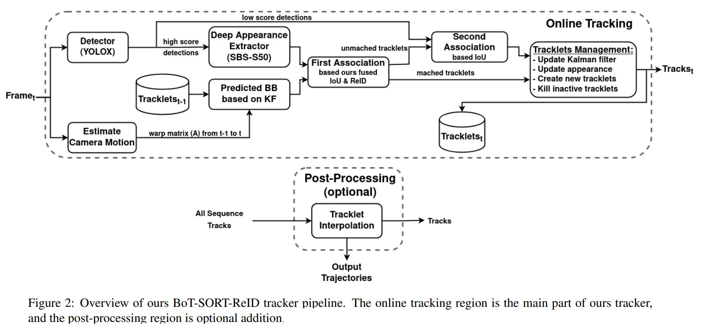

# BoT-SORT: Robust Associations Multi-Pedestrian Tracking
Nir Aharon, Roy Orfaig, Ben-Zion Bobrovsky. _7 Jul 2022_
>The goal of multi-object tracking (MOT) is detecting and tracking all the objects in a scene, while keeping a unique identifier for each object. In this paper, we present a new robust state-of-the-art tracker, which can combine the advantages of motion and appearance information, along with camera-motion compensation, and a more accurate Kalman filter state vector

* Official paper: [ArXiv](https://arxiv.org/abs/2206.14651)
* Official code: [Github](https://github.com/niraharon/bot-sort)

# Overview

- Multi-object tracking (MOT) aims to detect and estimate the spatial-temporal trajectories of multiple objects in a video stream
- Tracking-by-detection contains an object detection step, followed by a tracking step with two parts:
  - Motion model and state estimation for predicting the bounding boxes of the tracklets in the following frames. A Kalman filter (KF), is the popular choice for this task. 
  - Associating the new rame detections with the current set of tracks. Two leading approaches are used for tackling the association task:
    *   Localization of the object, mainly intersection-over-union (IoU) between the predicted tracklet bounding box and the detection bounding box.
    *   Appearance model of the object and solving a re-identification (Re-ID) task.
- predicting the correct location of the bounding box may fail due to camera motion, which leads to low overlap. Therefore, adopting conventional image registration to estimate the camera motion, and properly correcting the Kalman filter, which denotes Camera Motion Compensation (CMC)
- there is a trade-off between the tracker’s ability to detect (MOTA) and the tracker’s ability to maintain the correct identities over time (IDF1)

## Related work

- **Motion Models.** Most of the recent tracking-by-detection algorithms are based on motion models
  -  the famous Kalman filter with constant-velocity model assumption, tends to be the popular choice for modeling the object motion 
  -  camera motion, which may lead to non-linear motion of the objects and cause incorrect KF’s predictions.
  -  many researchers adopted camera motion compensation (CMC) by aligning frames via image registration using the Enhanced Correlation Coefficient (ECC) or matching features such as ORB
-  **Appearance models and re-identification.** 
   -  Discriminating and re-identifying (ReID) objects by deep-appearance cues has also become popular but still fall in many cases (crowned traffic,...)
   -  Some solutions is that separate appearance-based trackers crop the frame detection boxes and extract deep appearance features using an additional deep neural network, but demand high inference computational costs
   -  several joint trackers have been proposed to train detection and some other components jointly, e.g., motion, embedding, and association models. The main benefit of these trackers is their low computational cost and comparable performance.
   -   several recent studies  have abandoned appearance information and relied only on highperformance detectors and motion information which achieve high running speed and state-of-the-art performance (ByteTrack)

# **Proposed Method**

1. Hungary Algorithm
- [ref](https://www.youtube.com/watch?v=dQDZNHwuuOY)
- In object tracking, with _N_ detection I and _N_ track predicted J, assumption that there is a measure Distance-Distrance between I-J => need match with smallest covariance.

2. **Kalman Filter**
To model the object’s motion in the image plane, Using the discrete Kalman filter with a constant-velocity model

- In SORT, the state vector was chosen to be a seven-tuple, $\boldsymbol{x}=\left[x_{c}, y_{c}, s, a, \dot{x}_{c}, \dot{y}_{c}, \dot{s}\right]^{\top}$
  - $\left(x_{c}, y_{c}\right)$ are the **2D** coordinates of the object center in the image plane
  - **s** is the bounding box scale (area)
  - **a** is the bounding box aspect ratio.
- We use the state vector has changed to an eight-tuple, to define the **KF’s state vector** as Eq.1 and the **measurement vector** as in Eq.2::

$$
\begin{gathered}
\boldsymbol{x}_{k}=\left[x_{c}(k), y_{c}(k), w(k), h(k),\right. \\
\left.\dot{x}_{c}(k), \dot{y}_{c}(k), \dot{w}(k), \dot{h}(k)\right]^{\top}  \qquad \text{(Eq.1)}\\
\boldsymbol{z}_{k}=\left[z_{x_{c}(k)}, z_{y_{c}}(k), z_{w}(k), z_{h}(k)\right]^{\top} \qquad \text{(Eq.2)}
\end{gathered}
$$

- the process noise covariance **Qk** and measurement noise covariance **Rk** matrices were modified: 
$$
\begin{array}{r}
\boldsymbol{Q}_{k}=\operatorname{diag}\left(\left(\sigma_{p} \hat{w}_{k-1 \mid k-1}\right)^{2},\left(\sigma_{p} \hat{h}_{k-1 \mid k-1}\right)^{2},\right. \\
\left(\sigma_{p} \hat{w}_{k-1 \mid k-1}\right)^{2},\left(\sigma_{p} \hat{h}_{k-1 \mid k-1}\right)^{2}, \\
\left(\sigma_{v} \hat{w}_{k-1 \mid k-1}\right)^{2},\left(\sigma_{v} \hat{h}_{k-1 \mid k-1}\right)^{2}, \\
\left.\left(\sigma_{v} \hat{w}_{k-1 \mid k-1}\right)^{2},\left(\sigma_{v} \hat{h}_{k-1 \mid k-1}\right)^{2}\right)
\end{array}
$$

$$
\begin{array}{r}
\boldsymbol{R}_{k}=\operatorname{diag}\left(\left(\sigma_{m} \hat{w}_{k \mid k-1}\right)^{2},\left(\sigma_{m} \hat{h}_{k \mid k-1}\right)^{2},\right. \\
\left.\left(\sigma_{m} \hat{w}_{k \mid k-1}\right)^{2},\left(\sigma_{m} \hat{h}_{k \mid k-1}\right)^{2}\right)
\end{array}
$$

- In the ablation study section, they show experimentally that those changes leads to higher HOTA.

2. Camera Motion Compensation (CMC)

- 
