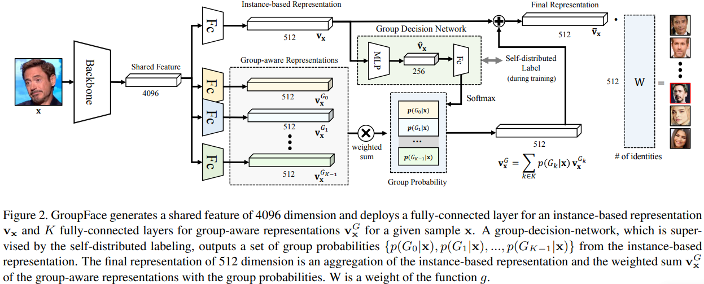
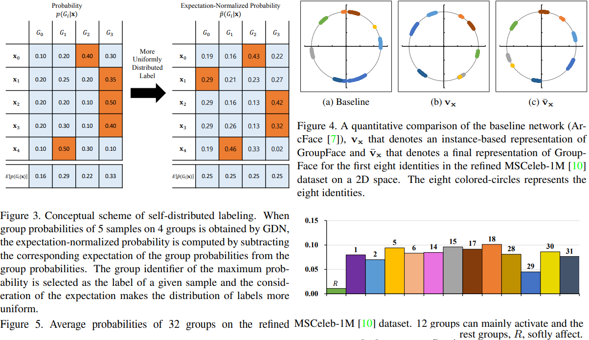

# GroupFace: Learning Latent Groups and Constructing Group-based Representations for Face Recognition
Yonghyun Kim, Wonpyo Park, Myung-Cheol Roh, Jongju Shin _25 May 2020 (this version, v2)_

> We propose a novel face-recognition-specialized architecture called GroupFace that utilizes multiple group-aware representations, simultaneously, to improve the quality of the embedding feature. The proposed method provides self-distributed labels that balance the number of samples belonging to each group without additional human annotations, and learns the group-aware representations that can narrow down the search space of the target identity

* Offical Paper : [ArXiv](https://arxiv.org/abs/2005.10497)
* Offical CODE  : [GITHUB](https://github.com/SeungyounShin/GroupFace)

# OVERVIEW
- **Grouping** is a key idea to efficiently-and-flexibly _embed a significant number of people and briefly describe an unknown person_
-  Each person has own characteristics in his or her face. At the same time, _they have common ones shared in a group of people_(man with deep, black eyes and red beard,...)

# METHODOLOGY
GroupFace learns the latent groups by using a selfdistributed grouping method, constructs multiple groupaware representations and ensembles them into the standard instance-based representation to enrich the feature representation for face recognition.

## GroupFace

**Instance-based Representation.**
They will call a feature vector in conventional face recognition scheme as an **Instance-based Representation** in this paper (Figure 2) and it is used to predict an identity as: 

$$p(y_i | x) = \text{softmax}_k (g (\mathbb{v}_x) ) \qquad \text{ (Eq.1)}$$

   - _y_ is label
   - v_x is an instance-based repesentation of sample x
   - _g(.)_ is a function projects an embedding feature of 512 dimention into M classes dimentional space

**Group-aware Representation.**
- Group-aware Representation as well as the instance-based representation to enrich the embedding features. Group-aware representation vector is extracted by deploying _fully-connected layers for each corresponding group_ (Figure 2)

- The final group-based embedding feature $\tilde{v}_x$ is obtained by aggregating the  instance-based representation _vx_ and the weighted summed group-aware representation:

$$p(y_i | x) = \text{softmax}_k (g (\tilde{v}_x) ) = \text{softmax}_k (g (v_x + v_x^G) ) \qquad \text{ ( Eq.2)}$$

  - $v_x^G$ is an ensemble of multiple group-aware representations with group probabilities

**Structure.**
- GroupFace calculates and uses instance-based representation and group-aware representations, concurrently with the K group-aware representations are obtained similarly by deploying a fullyconnected layer
- the **group probabilities** are calculated from the instance-based representation vector by deploying a **Group Decision Network (GDN)** that consists of three fully-connected layers and a softmax layer
-  multiple group-aware representations are sub-ensembled in a soft manner (S-GroupFace) or a hard manner (H-GroupFace):
  
   *  S-GroupFace aggregates multiple group-aware representations with corresponding probabilities of groups as weights, and is defined as:

    $$\mathbf{v}_{\mathbf{x}}^G=\sum_{k \in K} p\left(G_k \mid \mathbf{x}\right) \mathbf{v}_{\mathbf{x}}^{G_k}$$

   * H-GroupFace **selects one** of the group-aware representations for which the corresponding group probability **has the highest value**, and is defined as:

    $$\mathbf{v}_{\mathbf{x}}^G=\underset{p\left(G_k \mid \mathbf{x}\right)}{\arg \max } \mathbf{v}_{\mathbf{x}}^{G_k}$$

- The final representation $\overline{\mathbf{v}}_{\mathbf{x}}$ is enriched by aggregating both the instance-based representation and the sub-ensembled group-aware representation

**Group-aware Similarity.**
a group-aware similarity that is a new similarity considering both the standard embedding feature and the intermediate feature of GDN in the inference stage. 
  - The group-aware similarity is penalized by a distance between intermediate features of two given instances 
  - The group-aware similarity $S^*$ between the $i^{t h}$ image $I_i$ and the $j^{t h}$ image $I_j$ is defined as:

    $$S^*\left(\mathbf{x}_i, \mathbf{x}_j\right)=S\left(\overline{\mathbf{v}}_{\mathbf{x}_i}, \overline{\mathbf{v}}_{\mathbf{x}_j}\right)-\beta D\left(\hat{\mathbf{v}}_{\mathbf{x}_i}, \hat{\mathbf{v}}_{\mathbf{x}_j}\right)^\gamma$$

    - S is a cosine similarity metric
    - D is a distance metric
    - V-hat is the intermediate feature of GDN 

## Self-distributed Grouping
Define a group as a set of samples that share any common visual-or-non-visual features that are used for face recognition. Such a group is determined by a deployed GDN. GDN is gradually trained in a selfgrouping manner that provides a group label by_ considering the distribution of latent groups without any explicit ground-truth information_

**Naïve Labeling.** A naïve way to determine a group label is to take an index that has the maximum activation of softmax outputs

$$\begin{gathered}p\left(G_k \mid \mathbf{x}\right)=\operatorname{softmax}_k(f(\mathbf{x})), \\
G^*(\mathbf{x})=\underset{k}{\arg \max } p\left(G_k \mid \mathbf{x}\right),
\end{gathered}$$

- where $G_k$ is the _k-th_ group

**Self-distributed Labeling.** an efficient labeling method that utilizes a modified probability regulated by a prior probability to generate uniformly-distributed group labels in a deep manner

$$\tilde{p} (G_k \mid \mathbf{x} ) = \frac{1}{K} \{ p (G_k \mathbf{x} ) - E_{\mathbf{x} \sim \text { data }} [p (G_k \mid \mathbf{x} )]\}+\frac{1}{K} \qquad \text { (Eq.8) }$$

where the first $1 / K$ bounds the normalized probability between 0 and 1. Then, the expectation of the expectation normalized probability is computed as:

$$\begin{aligned}
&E_{\mathbf{x} \sim \text { data }} [\tilde{p} (G_k \mid \mathbf{x})] \\
&= \frac{1}{K} \{E_{\mathbf{x} \sim \text { data }} [p (G_k \mid \mathbf{x} )]-E_{\mathbf{x} \sim \text { data }} [p (G_k \mid \mathbf{x})] \}+\frac{1}{K} \\
&=\frac{1}{K}
\end{aligned}$$

The optimal self-distributed label is obtained as:

$$G^*(\mathbf{x})=\underset{k}{\arg \max } \tilde{p}\left(G_k \mid \mathbf{x}\right)$$

The trained GDN estimates a set of group probabilities that represent the degree to which the sample belongs to the latent groups.

## Learning
- A softmax-based loss $L_1$ ([ArcFace](../Lossfunctions/ArcFace.md) is mainly used in this work) is used to train a feature representation for identities and is defined as:

$$L_1=-\frac{1}{N} \sum_{i=1}^N \log \frac{e^{s\left(\cos \left(\theta_{\mathbf{y}_i}+m\right)\right)}}{e^{s\left(\cos \left(\theta_{\mathbf{y}_i}+m\right)\right)}+\sum_{j=1, j \neq \mathbf{y}_i}^n e^{s\left(\cos \left(\theta_j\right)\right)}}$$

- To construct the optimal group-space, a self-grouping loss, which reduces the difference between the prediction and the self-generated label, is defined as:

$$L_2=-\frac{1}{N} \sum_{i=1}^N \operatorname{CrossEntropy}\left(\operatorname{softmax}\left(f\left(\mathbf{x}_i\right)\right), G^*\left(\mathbf{x}_i\right)\right)$$

- **Training.** The whole network is trained by using the aggregation of two losses with $\lambda$ set to $0.1$:

$$L=L_1+\lambda L_2$$

<!--lass-->

# Visualization
- 2D Projection of Representation: fig4
- Activation Distribution of Groups : fig5