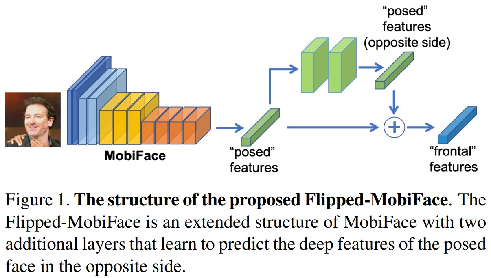

# MobiFace: A Lightweight Deep Learning Face Recognition on Mobile Devices
Chi Nhan Duong, Kha Gia Quach, Ibsa Jalata, Ngan Le, Khoa Luu. _17 Apr 2019 (v2)_

>Developing a lightweight deep neural network is one of the most practical solutions to deploy face recognition on mobile devices. Such the lightweight deep neural network requires efficient memory with small number of weights representation and low cost operators. In this paper, a novel deep neural network named MobiFace, a simple but effective approach, is proposed for productively deploying face recognition on mobile devices.

* Official paper: [arXiv](https://arxiv.org/abs/1811.11080)
* Official code: [Github]()

# Overview
- Network Design Strategy
- MobiFace Analysis
- Flipped-MobiFace

# 1. Network Design Strategy
**Bottleneck Residual block with the expansion layers.**
a block consists of three main transformation operators, i.e. two linear transformations and one non-linear:

$$\mathcal{B}(\mathbf{x})= (\mathcal{F}_{1} \circ \mathcal{F}_{2} \circ \mathcal{F}_{3})(\mathbf{x})$$

where 

$$\mathcal{F}_{1}: \mathbb{R}^{w \times h \times k} \mapsto \mathbb{R}^{w \times h \times t k}$$

$$\mathcal{F}_{3}: \mathbb{R}^{w \times h \times k} \mapsto$ $\mathbb{R}^{\frac{w}{s}} \times \frac{h}{s} \times k_{1}$$

are the linear function represented by $1 \times 1$ convolution operator, and $t$ denotes the expansion factor. 

$$\mathcal{F}_{2}: \mathbb{R}^{w \times h \times t k} \mapsto \mathbb{R}^{\frac{w}{s} \times \frac{h}{s} \times t k}$$

is the non-linear mapping per-channel transformation  which is a composition of three operators : ReLU, 3×3 depthwise convolution with stride s, and ReLU. 

**Fast Downsampling**
>Under the limited computational resource of mobile devices, a compact network should maximize the information transferred from the input image to output features while avoiding the high computational cost due to the large spatial dimensions of feature maps.
- the downsampling steps are consecutively applied in the very beginning stage of the feature embedding process to avoid large spatial dimension of the feature maps.
- in the later stage, more feature maps are added to support the information flow of the whole network

# 2.MobiFace Analysis
**Architecture**
> Model Architecture for facial feature embedding. /2
means the operator has stride of 2. “Block” and “RBlock” indicate the Bottleneck Block and Residual Bottleneck block, respectively.

|    INPUT   |  OPERATOR   |
|------------| ----------- |
|   112x11x3 | 3x3 Conv, /2, 64|
|    56x56x64| 3x3 DWconv, 64  |
|    56x56x64| Block 1 x {(1x1 Conv, 128) - (3x3 DWconv, 2, 128) - (1 × 1 Conv, Linear, 64)} |
|    28x28x64| RBlock 2 x {(1x1 Conv, 128) - (3x3 DWconv, 2, 128) - (1 × 1 Conv, Linear, 64)} |
|    28x28x64| Block 1 x {(1x1 Conv, 256) - (3x3 DWconv, 2, 256) - (1 × 1 Conv, Linear, 128)} |
|   14x14x128| RBlock 3 x {(1x1 Conv, 256) - (3x3 DWconv, 2, 256) - (1 × 1 Conv, Linear, 128)}|
|   14x14x128| Block 1 x {(1x1 Conv, 512) - (3x3 DWconv, 2, 512) - (1 × 1 Conv, Linear, 256)} |
|    7x7x256 | RBlock 6 x {(1x1 Conv, 512) - (3x3 DWconv, 2, 512) - (1 × 1 Conv, Linear, 256)}|
|    7x7x256 | 1x1 Conv, 512 |
|    7x7x512 | 512-d FC     |
- Given an input facial image with the size of 112 × 112 × 3, this light-weight network aims at maximizing the information embedded in final feature vector while maintaining the low computational cost.
- The structures of Residual Bottleneck blocks and Bottleneck blocks are very similar except a shortcut is added to connect the input and the output of the 1×1 convolution layer 
- the stride s is set to 2 in Bottleneck blocks while that parameter is set to 1 in every layers of Residual Bottleneck blocks.
- given an input image with the size of 112 × 112 × 3, the **spatial dimension** is _reduced by half_ within the first two layers. The expansion factor is kept to 2 whereas **the number of channels** is _double after each Bottleneck block_ in later feature embedding
stage.
- A batch normalization with a non-linear activation (PReLU) are applied after each convolutional layer except the “Linear”
  

# 3.Flipped-MobiFace
> during learning process of MobiFace, after embedding the faces of different subjects from images to feature domain, they become linear separable
>  This linearity property of deep feature domain inspires us to a hypothesis that the averaging of the deep features of left- and right-posed faces within the same angle can approximate the deep features of the frontal face

- let $\mathcal{I}, \overline{I}$ are the input posed face image and the mirror image. $f_I, f_{\overline{I}}$ are thier deep features extracted by MobiFace. The mirror are computed along _x_-axis through the new layers are trainable. 

- new feature $f = \frac{1}{2} (f_I + f_{\overline{I}} )$
- The loss function consists of two main terms:
  - $l_2$-norm between the ground-truth and the predicted features
  - the cross-entropy loss between the predicted ID and correct ID
