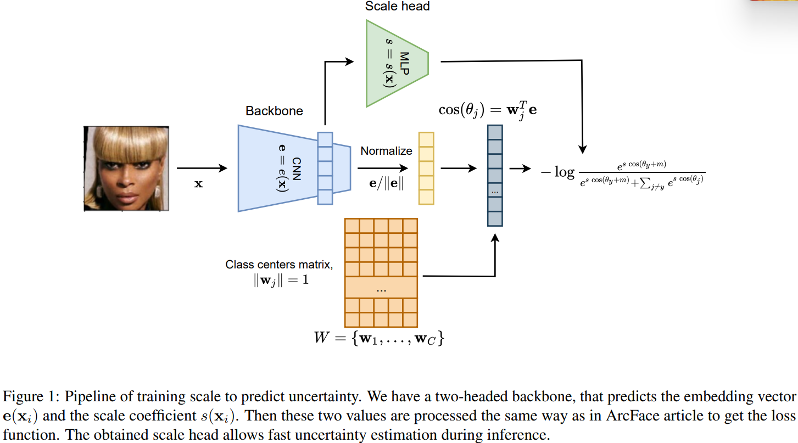
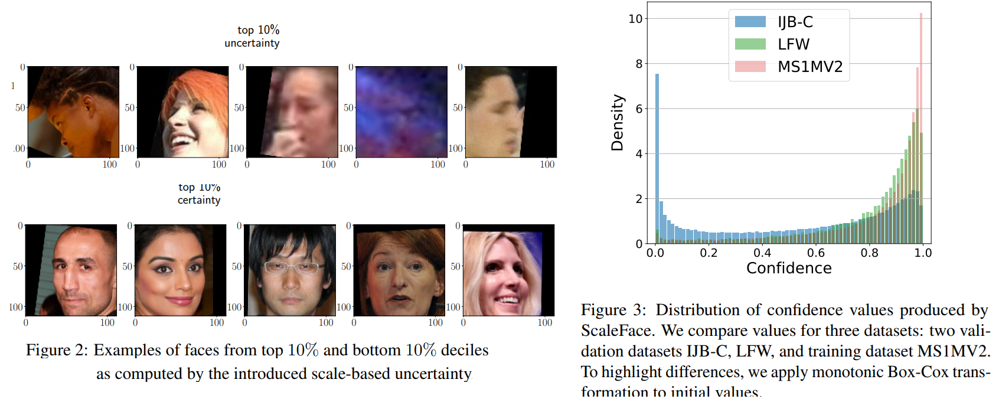

# ScaleFace: Uncertainty-aware Deep Metric Learning
Roman Kail, Kirill Fedyanin, Nikita Muravev, Alexey Zaytsev, Maxim Panov _5 Sep 2022 (this version)_

* Offical Paper: [ArXiv](https://arxiv.org/pdf/2209.01880v1.pdf)
* Offical Code : [Github](https://github.com/stat-ml/face-evaluation)


# PROPOSED METHOD

## ArcFace model
- [review](../Lossfunctions/ArcFace.md)
  
## Prediction of uncertainty using scale
- The entropy of the probability distribution of the classes is a strong indicator of prediction uncertainty
- To compute object-dependent scale values, they suggest to _train an extra head of the network_.
-  Now consider an input object **x** that we process with _a two-headed backbone_ to get the l2-normalized embedding vector e(x) and scale coefficient s(x)

$$L=-\frac{1}{N} \sum_{i=1}^N \log \frac{e^{s\left(\mathbf{x}_i\right) \cos \left(\theta_{i y_i}+m\right)}}{e^{s\left(\mathbf{x}_i\right) \cos \left(\theta_{i y_i}+m\right)}+\sum_{j \neq y_i} e^{s\left(\mathbf{x}_i\right) \cos \left(\theta_{i j}\right)}}$$

   - the prediction of high values of $s\left(\mathbf{x}_i\right)$ moves the probabilities distribution after softmax closer to the onehot distribution with value 1 for the logit with highest value
   - low values of $s\left(\mathbf{x}_i\right)$ move the probability distribution towards the uniform one



## From scaling coefficient to modified similarity measure
- The [PFE approach](../others/PFE.md) suggests not only to compute uncertainties for the input objects but also proposes the modified similarity measure that takes uncertainties into account. This similarity measure, **mutual likelihood score** (MLS), allows to improve the final quality of the model
- In training procedure, predicting logits equal $l_j(\mathbf{x})=$ $s(\mathbf{x}) \langle\mathbf{e}(\mathbf{x}), \mathbf{w}_j\rangle$. This function represents the usual cosine similarity between vectors $\mathbf{e}(\mathbf{x})$ and $\mathbf{w}_j$ but adjusted by a scale coefficient $s(\mathbf{x})$.
- Here we consider two possible scenarios:
  - to compare two objects $\mathbf{x}_1$ and $\mathbf{x}_2$ taking into account uncertainties for both of them. Here we assume that the similarity is used to solve binary classification problem, distinguishing pairs, belonging to one identity (positive class) or different identities (negative class). Then, we suggest to consider the similarity measure

  $$s\left(\mathbf{x}_1, \mathbf{x}_2\right)\left\langle\mathbf{e}\left(\mathbf{x}_1\right), \mathbf{e}\left(\mathbf{x}_2\right)\right\rangle \qquad \text{ (Eq.3)}$$

    - $s\left(\mathbf{x}_1, \mathbf{x}_2\right)$ is some function computed based on the scales
    - For example, one may consider $s\left(\mathbf{x}_1, \mathbf{x}_2\right)=\sqrt{s\left(\mathbf{x}_1\right) \cdot s\left(\mathbf{x}_2\right)}$.
  
  -  We compare query object $\mathbf{x}$ with some template class object representation $\mathbf{u}_i$ for which we are sure in the quality of representat. ion.
-  the essential idea of pushing uncertain objects to have low similarity, in practice the decision boundary between classes has substantial positive value. That is why the direct application of these formulas may lead to many positive examples receiving similarities lower than classseparation threshold
-  In order to overcome this issue, they propose to introduce the shift parameter $\mu>0$ and consider a modification of similarity measure (Eq.3) of the following form:

$$s\left(\mathbf{x}_1, \mathbf{x}_2\right)\left(\left\langle\mathbf{e}\left(\mathbf{x}_1\right), \mathbf{e}\left(\mathbf{x}_2\right)\right\rangle-\mu\right) \qqua \text{ (Eq.5)}$$ 

<!--3.0-->

#  Open-Set Experiments

## Uncertainty estimation approaches
* [Norm](../Lossfunctions/ArcFace.md): the norm of the ArcFace embedding before normalization;
* [PFE](../others/PFE.md): Probabilistic Face Embeddings;
* [MagFace](../Lossfunctions/MagFace.md): margin-based uncertainty estimate;
* ScaleFace: an approach introduced in previous sections.
  
## Qualitative Experiments
- On the first step, we want to show that the proposed ScaleFace method provides perceptually reasonable uncertainty estimates. We divide images in the test sample by deciles of scale-based uncertainty u(x) and uniformly randomly selected images from these deciles
- Figure 2 presents five examples of images from the top decile and five examples of images from the bottom decile:
  - Images with high uncertainty are blurry, dark, or only partly reveal the face.
  - images with low uncertainty allow easy identification of a depicted person

## Reject verification
We consider so-called **reject verification** evaluation procedure as a main tool to assess the quality of uncertainty estimates in the context of open-set recognition. We describe it in details below:
  - a test dataset $D_{\text {test }}=\left\{\left(\mathbf{x}_{i 1}, \mathbf{x}_{i 2}\right), y_i\right\}_{i=1}^N$ consisting of pairs of images and labels indicating whether these images belong to one identity or not
  - For each sample from the dataset the backbone assigns a similarity score $p_i=\left\langle\mathbf{e}\left(\mathbf{x}_{i 1}\right), \mathbf{e}\left(\mathbf{x}_{i 2}\right)\right\rangle$
  - they have predictions $p_i$ and target labels $y_i$ and can compare them via metrics for the binary classification problem.
  - they use the true acceptance rate for a fixed false acceptance rate _TAR@FAR_ that is a common metric for the face verification task.
  - We expect that pairs of images with high uncertainty have bigger chances to be verified incorrectly


# CODE

- **header**
  
```python
import torch
import torch.nn as nn
import torch.nn.functional as F
from torch.nn import Parameter
from torch.nn.utils import spectral_norm
from face_lib.models import FaceModule


class PFEHead(FaceModule):
    def __init__(self, in_feat=512, **kwargs):
        super(PFEHead, self).__init__(**kwargs)
        self.fc1 = nn.Linear(in_feat * 6 * 7, in_feat)
        self.bn1 = nn.BatchNorm1d(in_feat, affine=True)
        self.relu = nn.ReLU()
        self.fc2 = nn.Linear(in_feat, in_feat)
        self.bn2 = nn.BatchNorm1d(in_feat, affine=False)
        self.gamma = Parameter(torch.Tensor([1e-4]))
        self.beta = Parameter(torch.Tensor([-7.0]))

    def forward(self, **kwargs):
        x: torch.Tensor = kwargs["bottleneck_feature"]
        x = x / x.norm(dim=-1, keepdim=True)
        x = self.relu(self.bn1(self.fc1(x)))
        x = self.bn2(self.fc2(x))
        x = self.gamma * x + self.beta
        x = torch.log(1e-6 + torch.exp(x))
        return {"log_sigma": x}


class PFEHeadAdjustable(FaceModule):
    def __init__(self, in_feat=512, out_feat=512, **kwargs):
        super(PFEHeadAdjustable, self).__init__(**kwargs)
        self.fc1 = Parameter(torch.Tensor(out_feat, in_feat))
        self.bn1 = nn.BatchNorm1d(out_feat, affine=True)
        self.relu = nn.ReLU()
        self.fc2 = Parameter(torch.Tensor(out_feat, out_feat))
        self.bn2 = nn.BatchNorm1d(out_feat, affine=False)
        self.gamma = Parameter(torch.Tensor([1.0]))
        self.beta = Parameter(torch.Tensor([0.0]))

        nn.init.kaiming_normal_(self.fc1)
        nn.init.kaiming_normal_(self.fc2)

    def forward(self, **kwargs):
        x: torch.Tensor = kwargs["bottleneck_feature"]
        x = self.relu(self.bn1(F.linear(x, F.normalize(self.fc1))))
        x = self.bn2(F.linear(x, F.normalize(self.fc2)))  # 2*log(sigma)
        x = self.gamma * x + self.beta
        x = torch.log(1e-6 + torch.exp(x))  # log(sigma^2)
        return {"log_sigma": x}


class PFEHeadAdjustableSpectralSimple(FaceModule):
    def __init__(self, in_feat=512, out_feat=512, n_power_iterations=3, **kwargs):
        super(PFEHeadAdjustableSpectralSimple, self).__init__(**kwargs)

        # self.fc1 = Parameter(torch.Tensor(out_feat, in_feat))
        self.fc1 = nn.Linear(in_feat, out_feat, bias=False)
        self.bn1 = nn.BatchNorm1d(out_feat, affine=True)
        self.relu = nn.ReLU()
        # self.fc2 = Parameter(torch.Tensor(out_feat, out_feat))
        self.fc2 = nn.Linear(out_feat, out_feat, bias=False)
        self.bn2 = nn.BatchNorm1d(out_feat, affine=False)
        self.gamma = Parameter(torch.Tensor([1.0]))
        self.beta = Parameter(torch.Tensor([0.0]))

        nn.init.kaiming_normal_(self.fc1.weight)
        nn.init.kaiming_normal_(self.fc2.weight)

        self.fc1 = spectral_norm(self.fc1, n_power_iterations=n_power_iterations)
        self.fc2 = spectral_norm(self.fc2, n_power_iterations=n_power_iterations)

    def forward(self, **kwargs):
        x: torch.Tensor = kwargs["bottleneck_feature"]
        x = self.relu(self.bn1(self.fc1(x)))
        x = self.bn2(self.fc2(x))  # 2*log(sigma)
        x = self.gamma * x + self.beta
        x = torch.log(1e-6 + torch.exp(x))  # log(sigma^2)
        return {"log_sigma": x}


class ProbHead(FaceModule):
    def __init__(self, in_feat=512, **kwargs):
        super(ProbHead, self).__init__(kwargs)
        # TODO: remove hard coding here
        self.fc1 = nn.Linear(in_feat * 7 * 7, in_feat)
        self.bn1 = nn.BatchNorm1d(in_feat, affine=True)
        self.relu = nn.ReLU(in_feat)
        self.fc2 = nn.Linear(in_feat, 1)
        self.bn2 = nn.BatchNorm1d(1, affine=False)
        self.gamma = Parameter(torch.Tensor([1e-4]))
        self.beta = Parameter(torch.Tensor([-7.0]))

    def forward(self, **kwargs):
        x: torch.Tensor = kwargs["bottleneck_feature"]
        x = self.relu(self.bn1(self.fc1(x)))
        x = self.bn2(self.fc2(x))
        x = self.gamma * x + self.beta
        x = torch.log(1e-6 + torch.exp(x))
        return {"log_sigma": x}
```

- **losses**

```python
import torch
import torch.nn as nn
from torch.autograd import Variable
import torch.nn.functional as F

from face_lib.models import FaceModule


class CosFace(nn.Module):
    def __init__(self, s=64.0, m=0.40):
        super(CosFace, self).__init__()
        self.s = s
        self.m = m

    def forward(self, cosine, label):
        index = torch.where(label != -1)[0]
        m_hot = torch.zeros(index.size()[0], cosine.size()[1], device=cosine.device)
        m_hot.scatter_(1, label[index, None], self.m)
        cosine[index] -= m_hot
        ret = cosine * self.s
        return ret


class ArcFace(FaceModule):
    def __init__(self, s=64.0, m=0.5):
        super(ArcFace, self).__init__()
        self.s = s
        self.m = m

    def forward(self, **kwargs):
        cosine, gty = kwargs["cosine"], kwargs["label"]
        index = torch.where(gty != -1)[0]
        m_hot = torch.zeros(index.size()[0], cosine.size()[1], device=cosine.device)
        m_hot.scatter_(1, gty[index, None], self.m)
        cosine.acos_()
        cosine[index] += m_hot
        cosine.cos_().mul_(self.s)
        return cosine


class AngleLoss(FaceModule):
    """
    https://arxiv.org/pdf/1704.08063.pdf
    """

    def __init__(self, gamma=0, **kwargs):
        super(AngleLoss, self).__init__(**kwargs)
        self.gamma = gamma
        self.it = 0
        self.LambdaMin = 5.0
        self.LambdaMax = 1500.0
        self.lamb = 1500.0

    def forward(self, **kwargs):

        target = kwargs.get("gty")
        input = kwargs.get("angle_x")

        self.it += 1
        cos_theta, phi_theta = input
        target = target.view(-1, 1)

        index = cos_theta.data * 0.0
        index.scatter_(1, target.data.view(-1, 1), 1)
        index = index.byte()
        index = Variable(index)

        self.lamb = max(self.LambdaMin, self.LambdaMax / (1 + 0.1 * self.it))

        output = cos_theta * 1.0
        output[index] -= cos_theta[index] * (1.0 + 0) / (1 + self.lamb)
        output[index] += phi_theta[index] * (1.0 + 0) / (1 + self.lamb)

        logpt = F.log_softmax(output)
        logpt = logpt.gather(1, target)
        logpt = logpt.view(-1)
        pt = Variable(logpt.data.exp())

        loss = -1 * (1 - pt) ** self.gamma * logpt
        loss = loss.mean()
        return loss


class MLS(nn.Module):
    def __init__(self):
        super().__init__()

    def forward(self, mu_X, log_sigma, cos_func=False, **kwargs):
        mu_X = F.normalize(mu_X)
        sigma_sq_X = torch.exp(log_sigma)
        if cos_func:
            func = (
                lambda f1, f2: -torch.einsum("ij,dj->idj", f1, f2)
                / (f1.norm(dim=-1)[:, None] @ f2.norm(dim=-1)[None] + 1e-5)[..., None]
            )
        else:
            func = lambda f1, f2: (f1.unsqueeze(1) - f2.unsqueeze(0)) ** 2

        sig_sum = sigma_sq_X.unsqueeze(1) + sigma_sq_X.unsqueeze(0)

        diff = func(mu_X, mu_X) / (1e-10 + sig_sum) + torch.log(sig_sum)
        diff = diff.sum(dim=2, keepdim=False)
        return -diff


class MLSLoss(FaceModule):
    """
    TODO: docs
    """

    def __init__(self, mean=False, **kwargs):
        super(MLSLoss, self).__init__(**kwargs)
        self.mean = mean

    def forward(self, device, **kwargs):
        mu_X, gty, log_sigma = kwargs["feature"], kwargs["gty"], kwargs["log_sigma"]
        non_diag_mask = (1 - torch.eye(mu_X.size(0))).int().to(gty.device)
        loss_mat = -MLS()(mu_X, log_sigma)
        gty_mask = (torch.eq(gty[:, None], gty[None, :])).int()
        pos_mask = (non_diag_mask * gty_mask) > 0
        pos_loss = loss_mat[pos_mask].mean()
        return pos_loss


class ProbConstraintLoss(FaceModule):
    def __init__(self):
        super(ProbConstraintLoss, self).__init__()

    def forward(self, **kwargs):
        log_sigma = kwargs["log_sigma"]
        log_sigma_mean = log_sigma.mean(0)
        loss = torch.norm(log_sigma / log_sigma_mean - 1.0, p=1, dim=-1).mean()
        return loss


class ProbTripletLoss(FaceModule):
    def __init__(self):
        super(ProbTripletLoss, self).__init__()

    def forward(self, **kwargs):
        mu_X, log_sigma = kwargs["feature"], kwargs["log_sigma"]
        sigma_sq_X = torch.exp(log_sigma)
        sig_sum = sigma_sq_X.unsqueeze(1) + sigma_sq_X.unsqueeze(0)
        func = lambda f1, f2: (f1.unsqueeze(1) - f2.unsqueeze(0)) ** 2
        diff = func(mu_X, mu_X) / (1e-10 + sig_sum) + torch.log(sig_sum)
        return diff


class ProbLoss(FaceModule):
    """
    TODO: docs
    """

    def __init__(self, m=3, lambda_c=0.1, lambda_id=0.1, **kwargs):
        super(ProbLoss, self).__init__(kwargs)
        self.m = m
        self.lambda_c = lambda_c
        self.lambda_id = lambda_id

    def forward(self, device, **kwargs):
        mu_X, gty, log_sigma = kwargs["feature"], kwargs["gty"], kwargs["log_sigma"]
        non_diag_mask = (1 - torch.eye(mu_X.size(0))).int().to(gty.device)
        gty_mask = (torch.eq(gty[:, None], gty[None, :])).int()
        nty_mask = (1 - gty_mask).int()
        pos_mask = (non_diag_mask * gty_mask) > 0
        neg_mask = (non_diag_mask * nty_mask) > 0

        loss_mls = -MLS()(mu_X, log_sigma)
        loss_mls = loss_mls[pos_mask].mean()

        loss_c = self.lambda_c * ProbConstraintLoss()(**kwargs)

        loss_triplet = ProbTripletLoss()(**kwargs)

        triplet_loss = (
            torch.cat((loss_triplet[pos_mask], -loss_triplet[neg_mask]), dim=0) + self.m
        )

        triplet_loss = (
            self.lambda_id
            * torch.max(torch.zeros(1, device=triplet_loss.device), triplet_loss).mean()
        )

        return loss_mls + loss_c + triplet_loss


class ArcFaceScale(nn.Module):
    def __init__(self, m=0.5):
        super(ArcFaceScale, self).__init__()
        self.m = m

    def forward(self, cosine: torch.Tensor, label, scale: torch.Tensor):
        index = torch.where(label != -1)[0]
        m_hot = torch.zeros(index.size()[0], cosine.size()[1], device=cosine.device)
        m_hot.scatter_(1, label[index, None], self.m)
        cosine.acos_()
        cosine[index] += m_hot
        cosine.cos_().mul_(scale)
        return cosine

```