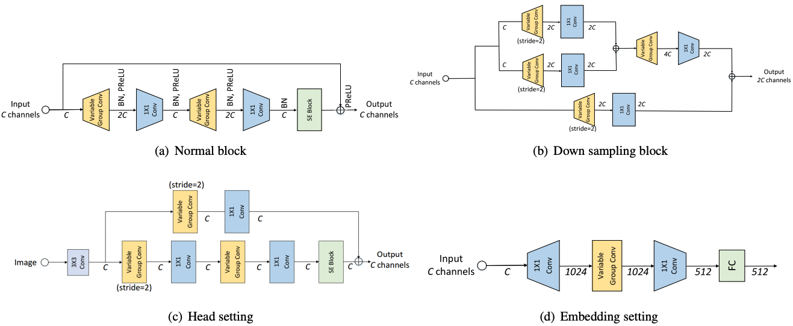
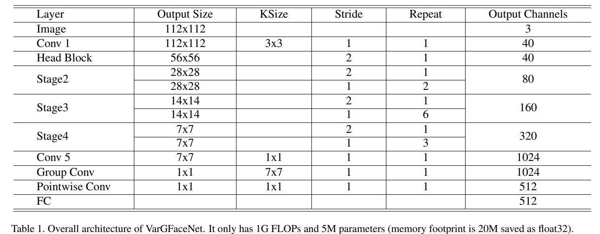
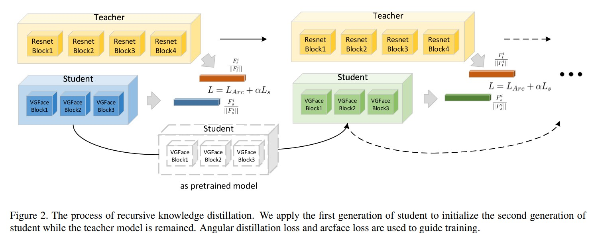

# VarGFaceNet: An Efficient Variable Group Convolutional Neural Network for Lightweight Face Recognition.
 _24 Nov 2019_

> To improve the discriminative and generalization ability of lightweight network for face recognition, we propose an efficient variable group convolutional network called VarGFaceNet. 
> Specifically, we use a head setting to reserve essential information at the start of the network and propose a particular embedding setting to reduce parameters of fully-connected layer for embedding. To enhance interpretation ability, we employ an equivalence of angular distillation loss to guide our lightweight network and we apply recursive knowledge distillation to relieve the discrepancy between the teacher model and the student model

* Official paper: [ArXiv](https://arxiv.org/abs/1910.04985v4)
* Official code: [Github](www.google.com)

# Overview
- [MobileNet](../../../Architectures/CNN/mobilenetv3.md) utilizes depthwise separable convolution to achieve a trade off between latency and accuracy. 
- [VarGNet](https://arxiv.org/pdf/1907.05653v2.pdf)  proposes a variable group convolution which can efficiently solve the unbalance of computational intensity inside a block
- we explore that variable group convolution has larger capacity than depthwise convolution with the same kernel size, 3which helps network to extract more essential information.

# Approach

1. Variable Group Convolution
 - Group Convolution was first introduced in AlexNet for computational cost reduction on GPUs
 -  depthwise separable convolution inspired by group convolution to save computational cost while keep discriminative ability of convolution, However, depthwise separable convolution spends 95% computation time in Conv 1 × 1, which causes a large MAdds gap between two consecutive laysers
 -  To keep the balance of computational intensity inside a block:
    -  sets the channel numbers in a group as a constant _S_
    -  The constant channel numbers in a group lead to the variable number of groups $n_{i}$ in a convolution named **variable group convolution**
    -  The computational cost of a variable group convolution is:
  
    $$k^{2} \times h_{i} \times w_{i} \times S \times c_{i+1}$$

       - The input of this layer is $h_{i} \times w_{i} \times c_{i}$
       - the output of that is $h_{i} \times w_{i} \times c_{i+1}$
    -  When variable group convolution is used to replace depthwise convolution in MobileNet, computational cost :
    
    $$1^{2} \times h_{i} \times w_{i} \times c_{i+1} \times c_{i+2}$$

    - In practice, $c_{i+2} \gg k^{2}, S>1$:
      -  it will be more computational balanced inside a block when employs variable group convolution on the bottom of pointwise convolution instead of depthwise convolution.
      -  $S>1$ means variable group convolution has higher MAdds and larger network capacity than depthwise convoluiton

2. Blocks of Variable Group Network

-  To limit the communication cost, VarGNet sets the number of output channels to be same as the number of input channels in the normal block.
   -  VarGNet expands the C channels at the start of the block to 2C channels using variable group convolution
   -  The normal block we used is shown in Fig. 1(a), and down sampling block is shown in Fig. 1(b). 
   -  Different from the blocks in VarGNet, is to add SE block in normal block and employ PReLU instead of ReLU to increase the discriminative ability of the block.

2. Lightweight Network for Face Recognition
   
**Head setting**

In order to reserve discriminative ability in lightweight networks:
   -    use 3 × 3 Conv with stride 1 at the start of network
   -    it remains the same as imput size shown in fig. 1(c)

**Embedding setting**

- the parameters of this fully-connected layer will be huge when output features from last convoluiton are relatively large
- In order to design a lightweight network (memory footprint is less than 20M, FLOPs is less than 1G):
  - employ variable group convolution after last conv to shrink the feature maps to 1 × 1 × 512 before fc layer (fig.1-d)
  - To avoid the derease of essential information, we expand channels after last conv to retain as much information as possible
  - then employ variable group convolution and pointwise convolution to decrease the parameters and computational cost while keep information.
  - first use a 1×1 Conv to expand the channels from 320 to 1024, Then we employ a 7 × 7 variable group convolution layer (8 channels in a group) to shrink the feature tensors from 7 × 7 × 1024 to 1 × 1 × 1024
  - Finally, pointwise convolution is used to connect the channels and output the feature tensors to 1 × 1 × 512

**Overall architecture**

- set S = 8 in a group empirically.

3. Angular Distillation Loss

- Knowledge distillation has been widely used in lightweight network training
- an angular distillation loss is purposed to extract useful information and avoid over-regularization:
  
  $$L_{a}\left(F_{t}^{i}, F_{s}^{i}\right)=\frac{1}{N} \sum_{i=1}^{N}\left\|1-\frac{F_{t}^{i}}{\left\|F_{t}^{i}\right\|} * \frac{F_{s}^{i}}{\left\|F_{s}^{i}\right\|}\right\|_{2}^{2} \quad \text{Eq. 4}$$

  where, 
    - $F_{t}^{i}$ is the $i$ th feature of teacher model
    -  $F_{s}^{i}$ is ith features of student model.
    -  $m$ is the number of samples in a batch
    -  Eq. 4 first computes cosine similarity between features of teacher and student, then minimizes the $l 2$ distance between this similarity and 1
-  Inspired by [ShrinkTeaNet](https://arxiv.org/abs/1905.10620), they proposed to use Eq. 5 to enhance the implementation efficiency:

    $$L_{s}\left(F_{t}^{i}, F_{s}^{i}\right)=\frac{1}{N} \sum_{i=1}^{N}\left\|\frac{F_{t}^{i}}{\left\|F_{t}^{i}\right\|}-\frac{F_{s}^{i}}{\left\|F_{s}^{i}\right\|}\right\|_{2}^{2} \quad \text{Eq. 5}$$

    - Compared with previous $l 2$ loss of exact features, Eq. 5 focus on angular information and the istribution of embeddings.
- In addition,  arcface employed as our classification loss, so **Objective function** used in training is:
  
  $$L=L_{A r c}+\alpha L_{s}$$

  - set $\alpha=7$ in paper implementation.

4. Recursive Knowledge Distillation

- Knowledge distillation with one generation is sometimes difficult to transfer enough knowledge when large discrepancy exists between teacher models and student models
-  the different architecture and block settings between teacher model and student model increase the complexity of training as well
-  **Thus,** use recursive knowledge distillation, which employs the first generation of student to initialize the second generation of student, as shown below:

