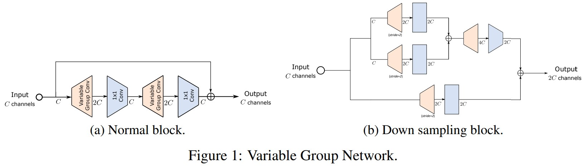
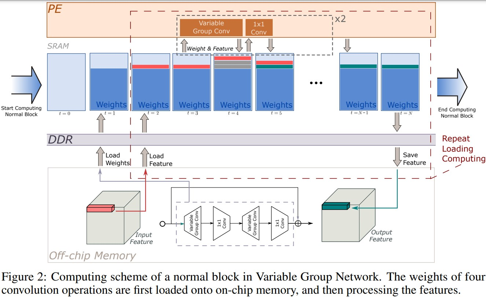
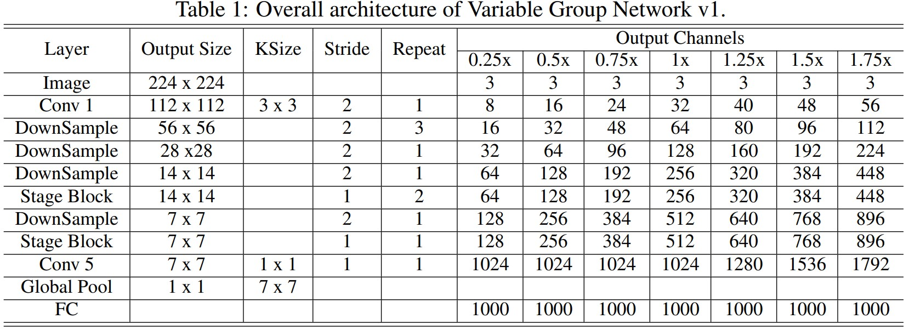
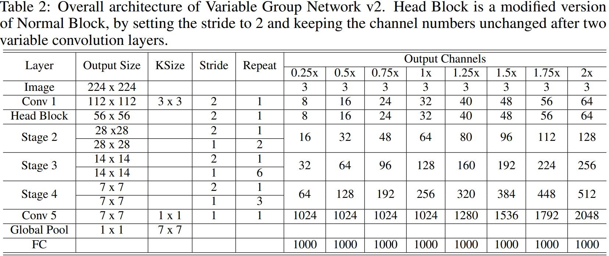
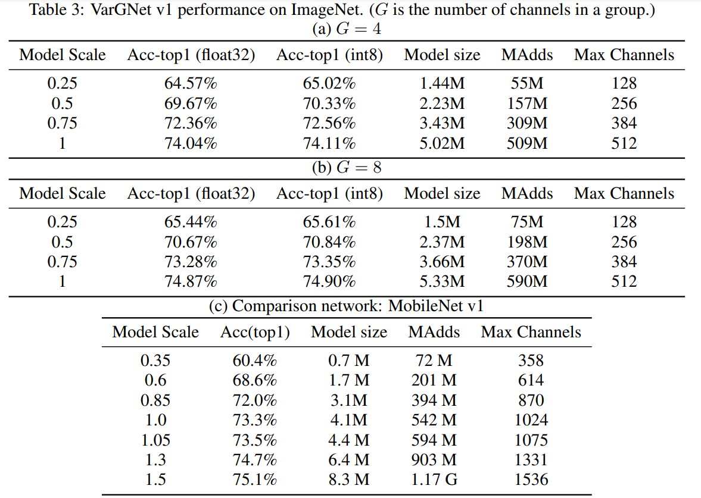
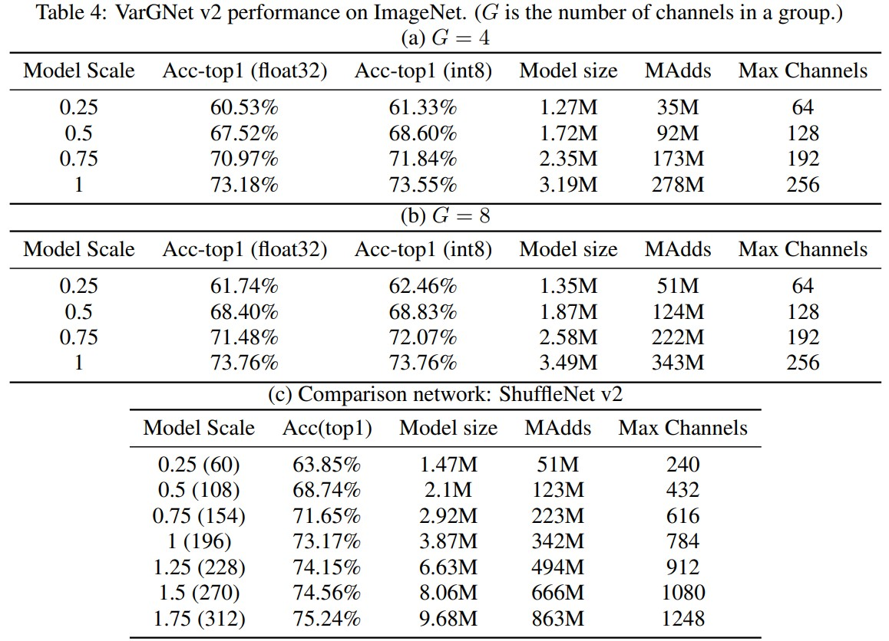

# VarGNet: Variable Group Convolutional Neural Network for Efficient Embedded Computing
Qian Zhang, Jianjun Li, Meng Yao, Liangchen Song, Helong Zhou, Zhichao Li, Wenming Meng, Xuezhi Zhang, Guoli Wang _12 Jul 2019_

> we propose a novel network design mechanism for efficient embedded computing. Inspired by the limited computing patterns, we propose to fix the number of channels in a group convolution, instead of the existing practice that fixing the total group numbers. Our solution based network, named Variable Group Convolutional Network (VarGNet), can be optimized easier on hardware side, due to the more unified computing schemes among the layers. Extensive experiments on various vision tasks, including classification, detection, pixel-wise parsing and face recognition, have demonstrated the practical value of our VarGNet.

* Official paper: [ArXiv](https://arxiv.org/abs/1907.05653)
* Official code: [Github](https://github.com/zma-c-137/VarGFaceNet)

# Overview

- The first is to design lightweight networks which has a small MAdds,  thus friendly to low power consumption platforms
-  The second is to optimize hardware-side configurations, such as FPGA based accelerators

> In this work, we intend to close the exiting gap by systematically analyze the necessary properties of a lightweight network that is friendly to the embedded hardware and the corresponding compilers

- Inspired by the observation that the computation graph of a network is easier to be optimized, if the computational intensity of the operations in a network is more balanced.

> We propose the variable group convolution, which is based on depthwise separable convolution 

# Designing Efficient Networks on Embedded Systems

* For designing efficient networks on embedded systems, the first intuition here is that the layers in a network should be similar as each other in some sense.

* Another important intuition is based on two properties of convolutions used in CNNs
  * The first property is the computation pattern. In convolution, several filters (kernels) slide over the whole feature map, indicating that the kernels are repeatedly used while values from the feature map are only used once. 
  *  The second property is the data size of convolutional kernels and feature maps

* **the two guidelines in detail**
  - ***Small intermediate feature maps between blocks***
    - a common practice is to first design a normal block and a down sampling block first, and then stack several blocks together to get a deep network. 
    - in recent compiler-side optimizations, layers in a block are usually grouped and computed together. Therefore, a smaller intermediate feature map between blocks will certainly help reduce the data transfer time.

  - ***Balanced computational intensity inside a block.***
    -  in practice, weights in several layers are loaded before performing convolution, thus we have to increase the on-chip buffer to satisfy the pointwise, or not grouping the computation of the two layers together

# Variable Group Network
- To balance the computation intensity, we set the channel numbers in a group in a network to be constant, resulting in variable groups in each convolution layers
  - if we look at the MAdds of a convolution,
  
  $$\frac{k^2 \times \text{Height} \times \text{Width} \times \text{Channels}^2}{Groups}$$

  - if the size of feature map is a constant, then by fixing $G = \frac{Channels}{Groups}$, the computational intensity inside a block is more balanced
  - Compared with depthwise convolution, the variable group convolution increases the MAdds as well as the expressiveness.Thus, now we are able to reduce the channel number of intermediate feature maps, while keeping the same generalizing ability as previous networks as Fig.1

  
  
    - For the normal block used in the early stages in the whole network, since the size of weights are relatively small at this time, the weights of the four layers can be all cached into the on-chip memory.   
    - When entering the late stages, where channel numbers increase and the size of weights increase as well, the normal block is also able to be optimized by only loading a variable group conv and a pointwise conv
  -  The whole computing process for a normal block is demonstrated in Fig. 2: 

  

  - based on the architecture of MobileNetV1, SuffleNetv2, we substitute their basic blocks to ours and the whole detailed network architecture is shown in Tab1, Tab2:
  
  

  

# Results - ImageNet Classification
Training hyperparameters are set as: batch size 1024, crop ratio 0.875, learning rate 0.4, cosine learning rate schedule, weight decay 4e-5 and training epochs 240

- VarGNet v1 performs better than MobileNetv1
  


- the performance of VarGNet v2 is worse than ShuffleNet v2, due to less channels used in our VarGNet v2. Then, when the model size is large, VarGnetv2 performs better.
  



# Code Pytorch:
Code for VarGNet and [VarGFaceNet](VarGFaceNet.md)
Source: cnblogs.com/wanghui-garcia/p/12582953.html


```python
#coding:utf-8
import torch.nn as nn
import torch

def l2_norm(input,axis=1):
    norm = torch.norm(input,2,axis,True)
    output = torch.div(input, norm)
    return output

class se_block(nn.Module):
    def __init__(self, channels, reduction):
        super(se_block, self).__init__()
        self.avg_pool = nn.AdaptiveAvgPool2d(1)
        self.fc1 = nn.Conv2d(channels, channels//reduction, kernel_size=1, stride=1, padding=0, bias=False)
        self.relu = nn.PReLU(channels//reduction)

        self.fc2 = nn.Conv2d(channels//reduction, channels, kernel_size=1, stride=1, padding=0, bias=False)
        self.sigmoid = nn.Sigmoid()

    def forward(self, x):
        module_input = x
        x = self.avg_pool(x)
        x = self.fc1(x)
        x = self.relu(x)
        x = self.fc2(x)
        x = self.sigmoid(x)
        return module_input * x

class separable_conv2d(nn.Module):
    def __init__(self, in_channels, out_channels, kernel_size, padding, expansion=1, stride=1,dw_bn_out=True, dw_relu_out=True, pw_bn_out=True, pw_relu_out=True, group_base=8):
        super(separable_conv2d, self).__init__()
        #depthwise
        assert in_channels % group_base == 0
        self.dw_conv = nn.Conv2d(in_channels, in_channels*expansion, kernel_size=kernel_size, stride=stride, padding=padding, bias=False, groups=in_channels//group_base)
        if dw_bn_out:
            self.dw_bn = nn.BatchNorm2d(in_channels*expansion)
        else:
            self.dw_bn = nn.Sequential()
        if dw_relu_out:
            self.dw_relu = nn.PReLU(in_channels*expansion)
        else:
            self.dw_relu = nn.Sequential()

        #pointwise
        self.pw_conv = nn.Conv2d(in_channels*expansion, out_channels, kernel_size=1, stride=1, padding=0, bias=False)
        if pw_bn_out:
            self.pw_bn = nn.BatchNorm2d(out_channels)
        else: 
            self.pw_bn = nn.Sequential()
        if pw_relu_out:
            self.pw_relu = nn.PReLU(out_channels)
        else:
            self.pw_relu = nn.Sequential()

    def forward(self, x):
        x = self.dw_conv(x)
        x = self.dw_bn(x)
        x = self.dw_relu(x)

        x = self.pw_conv(x)
        x = self.pw_bn(x)
        x = self.pw_relu(x)

        return x

#Norm Block
class vargnet_block(nn.Module):
    def __init__(self, channels_1, channels_2, channels_3, reduction, expansion=2, multiplier=1, kernel_size=3, stride=1, dilate=1, dim_match=True, use_se=True):
        super(vargnet_block, self).__init__()
        pad = ((kernel_size-1) *dilate + 1) // 2
        if not dim_match:
            self.short_cut = separable_conv2d(int(channels_1*multiplier), int(channels_3*multiplier), kernel_size=kernel_size, padding=pad, expansion=expansion, stride=stride, pw_relu_out=False)
        else:
            self.short_cut = nn.Sequential()
        self.part_1 = separable_conv2d(int(channels_1*multiplier), int(channels_2*multiplier), kernel_size=kernel_size, padding=pad, expansion=expansion, stride=stride)
        self.part_2 = separable_conv2d(int(channels_2*multiplier), int(channels_3*multiplier), kernel_size=kernel_size, padding=pad, expansion=expansion, stride=1, pw_relu_out=False)
        if use_se:
            self.se = se_block(int(channels_3*multiplier), reduction)
        else:
            self.se = nn.Sequential()
        self.relu = nn.PReLU(int(channels_3*multiplier))

    def forward(self, x):
        short_cut_data = self.short_cut(x)
        x = self.part_1(x)
        x = self.part_2(x)
        x = self.se(x)
        x = self.relu(short_cut_data+x)

        return x

#Down sampling block
class vargnet_branch_merge_block(nn.Module):
    def __init__(self, channels_1, channels_2, channels_3, expansion=2, multiplier=1, kernel_size=3, stride=2, dilate=1, dim_match=False):
        super(vargnet_branch_merge_block, self).__init__()
        pad = ((kernel_size-1) *dilate + 1) // 2
        if not dim_match:
            self.short_cut = separable_conv2d(int(channels_1*multiplier), int(channels_3*multiplier), kernel_size=kernel_size, padding=pad, expansion=expansion, stride=stride, pw_relu_out=False)
        else:
            self.short_cut = nn.Sequential()
        self.part_1_branch_1 = separable_conv2d(int(channels_1*multiplier), int(channels_2*multiplier), kernel_size=kernel_size, padding=pad, expansion=expansion, stride=stride, pw_relu_out=False)
        self.part_1_branch_2 = separable_conv2d(int(channels_1*multiplier), int(channels_2*multiplier), kernel_size=kernel_size, padding=pad, expansion=expansion, stride=stride, pw_relu_out=False)
        self.relu_1 = nn.PReLU(int(channels_2*multiplier))

        self.part_2 = separable_conv2d(int(channels_2*multiplier), int(channels_3*multiplier), kernel_size=kernel_size, padding=pad, expansion=expansion, stride=1, pw_relu_out=False)
        self.relu_2 = nn.PReLU(int(channels_3*multiplier))

    def forward(self, x):
        short_cut_data = self.short_cut(x)
        x_branch_1 = self.part_1_branch_1(x)
        x_branch_2 = self.part_1_branch_2(x)
        x = self.relu_1(x_branch_1+x_branch_2)
        x = self.part_2(x)
        x = self.relu_2(short_cut_data+x)
        return x


#Down sampling block(1个) + Norm Block(n个)
class add_vargnet_conv_block(nn.Module):
    def __init__(self, in_channels, out_channels, norm_block_number, reduction, expansion=2, multiplier=1, kernel_size=3, stride=2, dilate=1):
        super(add_vargnet_conv_block, self).__init__()
        self.down_sample_block = vargnet_branch_merge_block(in_channels, out_channels, out_channels, expansion=expansion, multiplier=multiplier, kernel_size=kernel_size, stride=stride, dilate=dilate, dim_match=False)
        
        norm_blocks = []
        for i in range(norm_block_number-1):
            norm_blocks.append(vargnet_block(out_channels, out_channels, out_channels, reduction, expansion=expansion, multiplier=multiplier, kernel_size=kernel_size, stride=1, dilate=dilate, dim_match=True, use_se=True))
        self.norm_blocks_layer = nn.Sequential(*norm_blocks)

    def forward(self, x):
        x = self.down_sample_block(x)
        x = self.norm_blocks_layer(x)
        return x

#Head_seeting
class add_head_block(nn.Module):
    def __init__(self, channels, multiplier, reduction, kernel_size=3, stride=1, padding=1):
        super(add_head_block, self).__init__()
        self.conv1 = nn.Conv2d(3, int(channels*multiplier), kernel_size=kernel_size, stride=stride, padding=padding, bias=False)
        self.bn1 = nn.BatchNorm2d(int(channels*multiplier))
        self.relu1 = nn.PReLU(int(channels*multiplier))

        self.head = vargnet_block(channels, channels, channels, reduction, expansion=1, multiplier=multiplier, kernel_size=kernel_size, stride=2, dim_match=False, use_se=True)

    def forward(self, x):
        x = self.conv1(x)
        x = self.bn1(x)
        x = self.relu1(x)
        x = self.head(x)

        return x

#embedding setting
class add_emb_block(nn.Module):
    def __init__(self,in_channels, last_channels, emb_size, group_base=8):
        super(add_emb_block, self).__init__()
        self.conv1 = nn.Conv2d(in_channels, last_channels, kernel_size=1, stride=1, padding=0, bias=False)
        self.bn1 = nn.BatchNorm2d(last_channels)
        self.relu1 = nn.PReLU(last_channels)

        #depthwise
        self.dw_conv = nn.Conv2d(last_channels, last_channels, kernel_size=7, stride=1, padding=0, bias=False, groups=last_channels//group_base)
        self.dw_bn = nn.BatchNorm2d(last_channels)

        # pointwise
        self.pw_conv = nn.Conv2d(last_channels, last_channels//2, kernel_size=1, stride=1, padding=0, bias=False)
        self.pw_bn = nn.BatchNorm2d(last_channels//2)
        self.pw_relu = nn.PReLU(last_channels//2)

        self.fc = nn.Linear(last_channels//2, emb_size, bias=False)
        self.bn = nn.BatchNorm1d(emb_size)

    def forward(self, x):
        x = self.conv1(x)
        x = self.bn1(x)
        x = self.relu1(x)

        x = self.dw_conv(x)
        x = self.dw_bn(x)

        x = self.pw_conv(x)
        x = self.pw_bn(x)
        x = self.pw_relu(x)
        x = x.view(x.size(0), -1)

        x = self.fc(x)
        x = self.bn(x)

        return x


class VarGFaceNet(nn.Module):
    def __init__(self, last_channels, emb_size, filter_list, norm_block_number, multiplier, reduction, num_stage, expansion):
        super(VarGFaceNet, self).__init__()
        self.head = add_head_block(filter_list[0], multiplier, reduction, kernel_size=3, stride=1, padding=1)
        
        body = []
        for i in range(num_stage):
            body.append(add_vargnet_conv_block(filter_list[i], filter_list[i+1], norm_block_number[i], reduction, expansion=expansion, multiplier=multiplier, kernel_size=3, stride=2, dilate=1))
        self.body_layer = nn.Sequential(*body)

        self.embedding = add_emb_block(int(filter_list[num_stage]*multiplier), last_channels, emb_size, group_base=8)

        self._initialize_weights()

    def forward(self, x):
        x = self.head(x)
        x = self.body_layer(x)
        x = self.embedding(x)
        return l2_norm(x)

    def _initialize_weights(self):
        for m in self.modules():
            if isinstance(m, nn.Conv2d):
                nn.init.kaiming_normal_(m.weight, mode='fan_out', nonlinearity='relu')
            elif isinstance(m, nn.BatchNorm2d):
                m.weight.data.fill_(1)
                m.bias.data.zero_()

def varGFaceNet(emb_size=512, multiplier=1.25, reduction=4, num_stage=3, expansion=2):
    """
        last_channels: 最后一层的通道数,默认1024
        emb_size: 嵌入特征的大小,默认512
        filter_list:每一层的通道数
        norm_block_number:每个num_stage中norm block的个数
        multiplier:乘于filter_list中的通道数，起到拓宽网络的作用,可0.5、1、1.5等
        reduction:SE模块中通道的缩小倍数, 默认4
        num_stage:中间的Down sampling block(1个) + Norm Block(n个)的个数,默认3
        expansion:下一层的通道数 = 上一层的通道数*expansion,默认2倍
    """
    filter_list=[32, 64, 128, 256]
    norm_block_number=[3, 7, 4]
    last_channels=1024 if multiplier <= 1 else 1024 * multiplier 
    return VarGFaceNet(last_channels=last_channels, emb_size=emb_size, filter_list=filter_list, norm_block_number=norm_block_number, multiplier=multiplier, reduction=reduction, num_stage=num_stage, expansion=expansion)


if __name__ == '__main__':
    model = varGFaceNet()
    for name, child in model.named_children():
        print(name)
        print(child)
    input = torch.autograd.Variable(torch.randn(4,3,112,112))
    output = model(input)
    print(output.shape)
```
