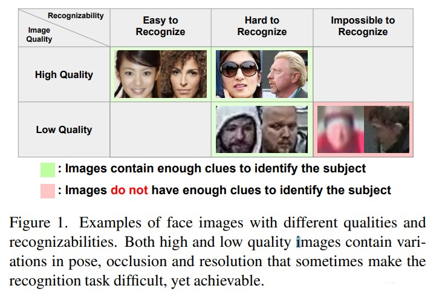
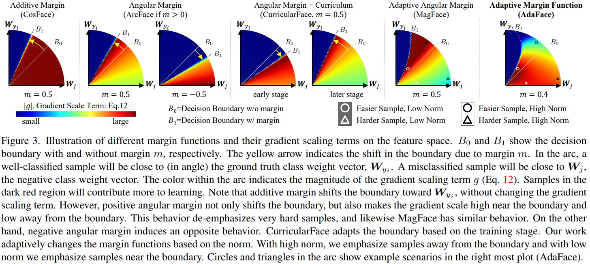
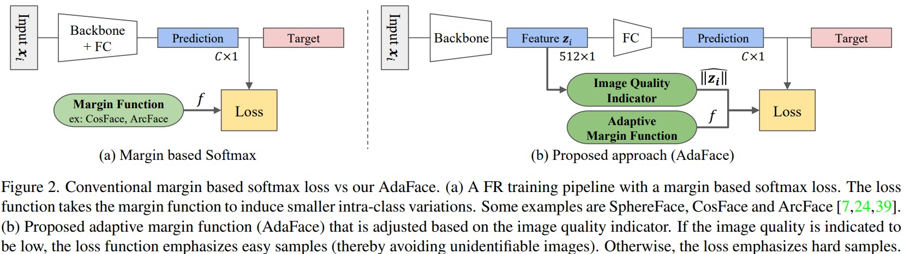
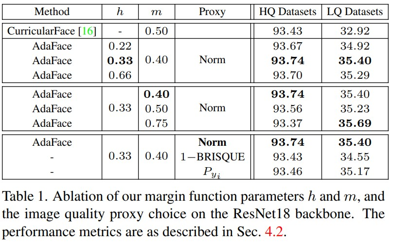

# AdaFace: Quality Adaptive Margin for Face Recognition
Minchul Kim, Anil K. Jain, Xiaoming Liu . _3 Apr 2022_

> We argue that the strategy to emphasize misclassified samples should be adjusted according to their image quality. Specifically, the relative importance of easy or hard samples should be based on the sample's image quality. We propose a new loss function that emphasizes samples of different difficulties based on their image quality. Our method achieves this in the form of an adaptive margin function by approximating the image quality with feature norms.

* Official paper: [arxiv](https://arxiv.org/pdf/2204.00964v1.pdf)
* Official code: [Github](https://github.com/mk-minchul/AdaFace)

# Overview

1. Related works
2. Architecture
3. Ablation and Analysis

# 1. Related works

**Margin Based Loss Function.**
- Margin (a scalar hyperparameter) is added to the softmaxloss because without the margin, learned features are not sufficiently discriminative

- Example [CosFace](CosFace.md), [ArcFace](ArcFace.md)

**Adaptive Loss Function**
Many studies have introduced an element of adaptiveness in the training objective for either hard sample mining, scheduling difficulty during training, or finding optimal hyperparameters:
- CurricularFace brings the idea of curriculum learning into the loss function
  
$$f (\theta_{j}, m )_{\text {Curricular }}= \begin{cases}s \cos  (\theta_{j}+m ) & j=y_{i} \\ N (t, \cos \theta_{j} ) & j \neq y_{i}\end{cases}$$

where

$$N (t, \cos \theta_{j} )= \begin{cases}\cos  (\theta_{j} ) & s \cos  (\theta_{y_{i}}+m ) \geq \cos \theta_{j} \\ \cos  (\theta_{j} ) (t+\cos \theta_{j} ) & s \cos  (\theta_{y_{i}}+m )<\cos \theta_{j}\end{cases}$$

- [Magface](MagFace.md) explores the idea of applying different margins based on recognizability. It applies large angular margins to high norm features on the premise that high norm features are easily recognizable.

**Face Recognition with Low Quality Images.**

- High Quality :  LFW, CFP-FP, CPLFW, AgeDB, CALFW
- Low Quality  : IJB-B, IJB-C, IJB-S, low quality face images is that they tend to be unrecognizable. where most of the images are of low quality, and some do not contain sufficient identity information, even for human examiners. 
- The key to good performance involves both:
    - 1) learning discriminative features for low quality images and
    - 2) learning to discard images that contain few identity cues.
- The latter is sometimes referred to as quality aware fusion.

# 2. Architecture
- The cross entropy softmax loss of a sample $x_i$:
  
$$\mathcal{L}_{C E} (\boldsymbol{x}_{i} )=-\log \frac{\exp  (\boldsymbol{W}_{y_{i}} \boldsymbol{z}_{i}+b_{y_{i}} )}{\sum_{j=1}^{C} \exp  (\boldsymbol{W}_{j} \boldsymbol{z}_{j}+b_{j} )}$$

where 
  -  $z_{i} \in R^{d}$ is the  _i_-th input x's feature embedding, 
  -  $\boldsymbol{W}_{j}$ refers to the $j$ th column of the last FC layer weight matrix, 
  -  $\boldsymbol{W} \in \mathbb{R}^{d \times C}$, and $b_{j}$ refers to the corresponding bias term. 
  -  $C$ refers to the number of classes.

## 2.1 Margin Form and the Gradient
- Previous works on margin based softmax focused on how the margin shifts the decision boundaries and what their geometric interpretations
-  that during backpropagation, the gradient change due to the margin has the effect of scaling the importance of a sample relative to the others. Angular margin can introduce an additional term in the gradient equation that scales the signal according to the sample’s difficulty

$$\begin{gathered}
\frac{\partial \mathcal{L}_{\mathrm{CE}}}{\partial \boldsymbol{W}_{j}}= (P_{j}^{(i)}-\mathbb{1} (y_{i}=j ) ) \frac{\partial f (\cos \theta_{j} )}{\partial \cos \theta_{j}} \frac{\partial \cos \theta_{j}}{\partial \boldsymbol{W}_{j}} \\
\frac{\partial \mathcal{L}_{\mathrm{CE}}}{\partial \boldsymbol{x}_{i}}=\sum_{k=1}^{C} (P_{k}^{(i)}-\mathbb{1} (y_{i}=k ) ) \frac{\partial f (\cos \theta_{k} )}{\partial \cos \theta_{k}} \frac{\partial \cos \theta_{k}}{\partial \boldsymbol{x}_{i} \text{(11)}}
\end{gathered}$$

- the first two scalar terms in Eq. (11) as a gradient scaling term (GST) affected by parameter _m_, denote: 

$$g:= (P_{j}^{(i)}-\mathbb{1} (y_{i}=j ) ) \frac{\partial f (\cos \theta_{j} )}{\partial \cos \theta_{j}}$$

- the effect of GST visualize Fig. 3 shows the GST as the color in the feature space:
  - the GST peaks at the decision boundary but slowly decreases as it moves away towards $W_j$ and harder samples receive less emphasis
  - ArcFace and MagFace fail to put high emphasis on hard samples (green area near $W_j$)
  - CurricularFace where the decision boundary and the GST g change depending on the training stage
  -  AdaFace combines all margin functions (positive and negative angular margins and additive margins) to emphasize hard samples when necessary

## 2.2 Norm and Image quality
- Image quality is a comprehensive term that covers characteristics such as brightness, contrast and sharpness
> In this work, we refrain from introducing an additional module that calculates the image quality. Instead, we use the feature norm as a proxy for the image quality
- we show a correlation plot between the feature norm and the image quality. This high correlation between the feature norm and the IQ score supports our use of feature norm as the proxy of image quality
- a correlation between the probability output $P_{y_i}$ and the IQ score is visible from an early stage of training. This is a useful property for using the feature norm as the proxy of image quality because we can rely on the proxy from the early stage of training
- there is a non-linear relationship between $P_{y_i}$
and the image quality
- the feature norm can be a good way to find low quality images.

## 2.3 AdaFace: Adaptive Margin based on Norm
**Image Quality Indicator.**
- As the feature norm, $\|z_{i}\|$ is a model dependent quantity, 
- we normalize it using batch statistics $\mu_{z} ; \sigma_{z}$:

$$\widehat{\|z_{i} \|}= \lfloor .\frac{ \|\boldsymbol{z}_{i} \|-\mu_{z}}{\sigma_{z} / h} |_{-1} ^{1}, .$$

where $\mu_{z}$ and $\sigma_{z}$ are the mean and standard deviation of all 
$\|\boldsymbol{z}_{i}\|$ within a batch, then to clipping the value between -1 and 1 and stopping the gradient from flowing.

- If the batch size is small, the batch statistics $\mu_{z};\sigma_{z}$ can be unstable. 
Thus we use the exponential moving average (EMA) of $\mu_{z}; \sigma_{z}$ across multiple steps to stabilize the batch statistics. Specifically in the _k_-th step batch statistics.:
  
$$\mu_{z}=\alpha \mu_{z}^{(k)}+(1-\alpha) \mu_{z}^{(k-1)}$$

where
    -  $\alpha$ is a momentum set to 0.99. 
    -  $\sigma_{z}$ set to 0.99, 

**Adaptive Margin Function.**
> a margin function such that 1) if image quality is high, we emphasize hard samples, and 2) if image quality is low, we de-emphasize hard samples. 

$$f (\theta_{j}, m )_{AdaFace}= \begin{cases}s \cos  (\theta_{j}+g_{\text {angle }} )-g_{\text {add }} & j=y_{i} \\ s \cos \theta_{j} & j \neq y_{i}\end{cases}$$

with: 
  
$$g_{\text {angle }}=-m \cdot \widehat{ \|\boldsymbol{z}_{i} \|}, \quad g_{add} = m \cdot \widehat{ \|\boldsymbol{z}_{i} \|}+m$$

- Note that:
    -   when $\widehat{ \|z_{i} \|}=-1$, the proposed function becomes ArcFace. 
    -   When $\widehat{ \|\boldsymbol{z}_{i} \|}=0$, it becomes CosFace. 
  
- When $\widehat{ \|\boldsymbol{z}_{i} \|}=1$, it becomes a negative angular margin with a shift. Fig. 3 shows the effect of the adaptive function on the gradient. The high norm features will receive a higher gradient scale, far away from the decision boundary, whereas the low norm features will receive higher gradient scale near the decision boundary. For low norm features, the harder samples away from the boundary are de-emphasized.

# 3. Ablation and Analysis

**Effect of Image Quality Indicator Concentration - _h_**
- h = 0.33 is a good value.
- To validate this claim, we show in Tab. 1 the performance when varying h.

- For h = 0.22 or h = 0.66, the performance is still higher
than CurricularFace. 
- As long as h is set such that $\widehat{\|\boldsymbol{z}_{i}}\|$ has some variation, h is not very sensitive

**Effect of Hyperparameter - _m_**
- The margin _m_ corresponds to both the maximum range of the angular margin and the magnitude of the additive margin
-  Large m results in large angular margin variation based on the image quality, resulting in more adaptivity

**Effect of Proxy Choice.**
- In Tab. 1, to show the effectiveness of using the feature norm as a proxy for image quality
- we switch the feature norm with other quantities such as
(1-BRISQUE) or $P_{y_i}$:
    - BRISQUE score it is not as effective in capturing the image quality when training with augmentation
    - $P_{y_i}$  show that the adaptiveness in feature norm is different from adaptiveness in difficulty

**Effect of Augmentation**
-  low norm features are more likely to be unidentifiable images
-  The percentage of samples with augmentations is higher for the low norm features than for the high norm features
