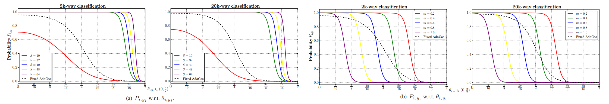

# AdaCos: Adaptively Scaling Cosine Logits for Effectively Learning Deep Face Representations
Xiao Zhang, Rui Zhao, Yu Qiao, Xiaogang Wang, Hongsheng Li _7 May 2019 (this version, v2)_

>The cosine-based softmax losses and their variants achieve great success in deep learning based face recognition. However, hyperparameter settings in these losses have significant influences on the optimization path as well as the final recognition performance. Manually tuning those hyperparameters heavily relies on user experience and requires many training tricks. In this paper, we investigate in depth the effects of two important hyperparameters of cosine-based softmax losses, the scale parameter and angular margin parameter, by analyzing how they modulate the predicted classification probability. Based on these analysis, we propose a novel cosine-based softmax loss, AdaCos, which is hyperparameter-free and leverages an adaptive scale parameter to automatically strengthen the training supervisions during the training process. We apply the proposed AdaCos loss to large-scale face verification and identification datasets, including LFW, MegaFace, and IJB-C 1:1 Verification. Our results show that training deep neural networks with the AdaCos loss is stable and able to achieve high face recognition accuracy. Our method outperforms state-of-the-art softmax losses on all the three datasets.

* Official paper: [ArXiv](https://arxiv.org/abs/1905.00292)
* Implementation code: [Github](https://github.com/4uiiurz1/pytorch-adacos)

# ANALYSYS

1. Effects of the scale parameter **S**
- The scale parameter **s** can significantly affect The predicted classification probability $P_{ij}$. We have:

    $$P_{i, y_i}=\frac{e^{f_{i, y_i}}}{e^{f_{i, y_i}}+B_i}=\frac{e^{s \cdot \cos \theta_{i, y_i}}}{e^{s \cdot \cos \theta_{i, y_i}}+B_i} \qquad \text{ Eq.5}$$

  - where $B_i=\sum_{k \neq y_i} e^{f_{i, k}}=\sum_{k \neq y_i} e^{s \cdot \cos \theta_{i, k}}$ are the logits summation of all non-corresponding classes for feature $\vec{x}_i$. 
- they observe that:
    -  the values of _B are almost unchanged during the training process_ $B_i \approx \sum_{k \neq y_i} e^{s \cdot \cos (\pi / 2)}=C-1$
    -  It is obvious that when _s_ is too small (e . g ., s=10 for class/identity number C=2,000 and C=20,000), the maximal value of $P_{i, y_i}$ could not reach 1.
    -   when s is too large (e.g., s = 64), the probability curve P  is also problematic, It would output a very high probability even when θi,y is close to π/2, which means that the loss function with large _s_ may fail to penalize mis-classified samples and cannot effectively update the networks to correct mistakes.

2. Effects of the margin parameter **m**
- increasing the margin parameter shifts probability _P(i,yi)_ curves to the left (fig2.b)
- the same $\theta_{i,y}$, larger margin parameters lead to lower probabilities _P(i,y)_ then  thus larger loss even with small angles (_OBJECTIVE_)
- Although larger margin m provides stronger supervisions, it should not be too large either, This lead to large loss for almost all samples even with very small sample-to-class angles, which makes the training difficult to converge

# PROPOSED METHOD

With softmax function, the predicted probability can be defined by

$$P_{i, j}=\frac{e^{\tilde{s} \cdot \cos \theta_{i, j}}}{\sum_{k=1}^C e^{\tilde{s} \cdot \cos \theta_{i, k}}}$$

  - where $\tilde{s}$ is the automatically tuned scale parameter to be discussed below.
**Our objective** is choose a suitable scale $\tilde{s}$ which makes predicted probability $P_{i, y_i}$ change significantly with respect to $\theta_{i, y_i}$

  - Mathematically, we find the point where the absolute gradient value $\left\|\frac{\partial P_{i, y_i}(\theta)}{\partial \theta}\right\|$ reaches its maximum =>
  
    $$\frac{\partial^2 P_{i, y_i}\left(\theta_0\right)}{\partial \theta_0{ }^2}=0$$

    - where $\theta_0 \in\left[0, \frac{\pi}{2}\right]$
  - Considering that $P\left(\theta_0\right)$ is close to 0.5, the relation between the scale parameter **S** and the point $\left(\theta_0, P\left(\theta_0\right)\right)$ can be approximated as:

    $$s_0=\frac{\log B_i}{\cos \theta_0}$$
    
    - $B_i=$ $\sum_{k \neq y_i} e^{s \cdot \cos \theta_{i, k}} \approx C-1$
    - the angles $\theta_{i, k}$ distribute around $\pi / 2$ 

1. Automatically choosing a fixed scale parameter

$$\begin{aligned}\tilde{s}_f=\frac{\log B_i}{\cos \frac{\pi}{4}} &=\frac{\log \sum_{k \neq y_i} e^{s \cdot \cos \theta_{i, k}}}{\cos \frac{\pi}{4}} \\
& \approx \sqrt{2} \cdot \log (C-1)\end{aligned}$$

2.  Dynamically adaptive scale parameter
**Introduce**
- a modulating indicator variable $\theta_{\text {med }}^{(t)}$, which is the median of all corresponding classes' angles, 
- $\theta_{i, y_i}^{(t)}$, from the mini-batch of size $N$ at the $t$-th iteration. 
- $\theta_{\text {med }}^{(t)}$ roughly represents the current network's degree of optimization on the mini-batch

**Observation**
- When the median angle is large, it denotes that the network parameters are far from optimum and less strict supervisions should be applied to make the training converge more stably;
- when the median angle $\theta_{\text {med }}^{(t)}$ is small, it denotes that the network is close to optimum and stricter supervisions should be applied to make the intra-class angles $\theta_{i, y_i}$ become even smaller.

* we set the central angle $\tilde{\theta}_0^{(t)}=\theta_{\text {med }}^{(t)}$. 
* We also introduce $B_{\text {avg }}^{(t)}$ as the average of $B_i^{(t)}$ as
  
$$B_{\mathrm{avg}}^{(t)}=\frac{1}{N} \sum_{i \in \mathcal{N}^{(t)}} B_i^{(t)}=\frac{1}{N} \sum_{i \in \mathcal{N}^{(t)}} \sum_{k \neq y_i} e^{\tilde{\tilde{s}}_d^{(t-1)} \cdot \cos \theta_{i, k}}$$

where $\mathcal{N}^{(t)}$ denotes the face identity indices in the minibatch at the **t**-th iteration

* dynamic scale $\tilde{s}_d^{(t)}$ directly :
  
$$\tilde{s}_d^{(t)}=\frac{\log B_{\mathrm{avg}}^{(t)}}{\cos \theta_{\mathrm{med}}^{(t)}}$$

* At the begin of the training process, the median angle $\theta_{\text {med }}^{(t)}$ of each mini-batch might be too large to impose enough supervisions for training, then:

$$\tilde{s}_d^{(t)}= \begin{cases}\sqrt{2} \cdot \log (C-1) & t=0 \\ \frac{\log B_{\text {avg }}^{(t)}}{\cos \left(\min \left(\frac{\pi}{4}, \theta_{\text {med }}^{(t)}\right)\right)} & t \geq 1\end{cases}$$

where $\tilde{s}_d^{(0)}$ is initialized as our fixed scale parameter $\tilde{s}_f$ when _t=0_.