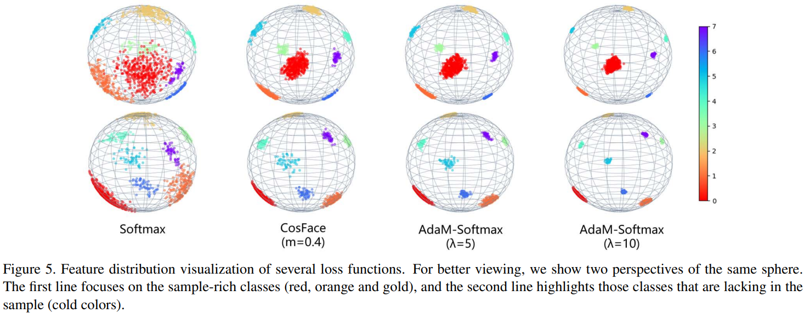

# AdaptiveFace: Adaptive Margin and Sampling for Face Recognition
Hao Liu, Xiangyu Zhu, Zhen Lei, Stan Z. Li. _15-20 June 2019_

> we propose the Adaptive Margin Softmax to adjust the margins for different classes adaptively. In addition to the unbalance challenge, face data always consists of large-scale classes and samples. Smartly selecting valuable classes and samples to participate in the training makes the training more effective and efficient. To this end, we also make the sampling process adaptive in two folds: Firstly, we propose the Hard Prototype Mining to adaptively select a small number of hard classes to participate in classification. Secondly, for data sampling, we introduce the Adaptive Data Sampling to find valuable samples for training adaptively. We combine these three parts together as AdaptiveFace

* Official paper: [IEEE](https://ieeexplore.ieee.org/abstract/document/8953996)
* Official code: [Github](https://github.com/haoliu1994/AdaptiveFace)

# OVERVIEW
- public face datasets are highly unbalanced, which indicates that they always have tremendously different numbers of samples.  Therefore, a uniform margin(COSFACE, ARCFACE,...) is not perfect to constrain classes with different sample distributions
- They prefer a larger margin to strongly squeeze the intraclass variations of those underrepresented classes to improve generalization : **Adaptive Margin Softmax Loss (AdaM-Softmax)** to adaptively find the appropriate margins for different kind of classes
- beside, How to select valuable classes and samples for training is another important topic => they also make the sampling process adaptive

# PROPOSED METHOD

## Adaptive Margin Softmax Loss
Given an input feature vector $x_j$ with its corresponding _j-th y_, they modify [CosFace](CosFace.md)  to obtain:

$$L_{a d}=-\frac{1}{M} \sum_{j=1}^M \log \frac{e^{s\left(\cos \left(\theta_{\left.y^{(j)}\right)_j}\right)-m_{y(j)}\right)}}{e^{s\left(\cos \left(\theta_{y_j(j)}\right)-m_y^{(j)}\right)}+\sum_{i=1, i \neq y^{(j)}}^N e^{s \cos \left(\theta_{i j}\right)}} \text{ (Eq.4)}$$

- $m_y (j)$ is the margin corresponding to class y and  _it can learn a larger through the parameter update_ during network training
- we constrain margins in the database view: $L_m=-\frac{1}{N} \sum_{i=1}^N m_i$ which is the average of margins of all the classes

Combining the two parts is our Adaptive Margin Softmax Loss (AdaM-Softmax):

$$L_{\text {AdaM }}=L_{a d}+\lambda * L_m$$

- The proposed adaptive margin can be applied in any margin based Softmax loss such as ArcFace, just by changing the cosine margin to the angular margin.

##  Hard Prototype Mining
The hard example mining aims to mine the most valuable pairs or triplets ==> , we propose the Hard Prototype Mining (HPM) to select the classes that are most similar to the samples in the mini-batch in each iteration

-  we consider the weight $\mathbb{w}_i$ of each class as its prototype. then build an ANN graph for prototypes of all classes and find the _k classes_ that are most similar to each class and put them into their respective queues. They call these queues dominant queues indicated

-  When each iteration starts, we select the prototypes in the dominant queues corresponding to the samples in the mini-batch to construct the weight matrix W of this iteration
-  After forward propagation, we update the dominant queues by the scores calculated by inner products in the classification layer. 
   -  Firstly, for a feature $\mathbf{x}_j$, if its highest activated class $c_p$ is its corresponding class $y^{(j)}$, there is no need to update. 
   -  Secondly, if $c_p \neq y^{(j)}$, we find all the classes with scores greater than $\cos \left(\theta_{y^{(j)}{ }_j}\right.$ ) by sorting to update the queue. 
   -  Finally, we set a hyper-parameter **h** to control the size of dominant queue of each class. 
      -  For each class in the queue, if its similarity to the queue owner is greater than **h**
      -  it will remain in the queue, otherwise it will be popped up. 
      -  With **h**, we can control the similarity of the selected prototypes, and gradually increase the difficulty of the training by adjusting **h**. 
      -  The whole HPM increases little computation cost.
 

## Adaptive Data Sampling
- When the network has roughly converged, most of the samples in the dataset have been well classified and are difficult to contribute to the network training ==> they build a feedback channel from the classification layer to the data layer to adaptively find valuable samples to form mini-batches, and call it **Adaptive Data Sampling** (ADS)
  - assign sampling probability to each sample
  - when the sample is correctly classified in this iteration, we pass the signal to the data layer and reduce its sampling probability
  - Otherwise,  increase its sampling probability, so that the samples which are correctly classified frequently will be gradually ignored as the training progresses
  - We also set a minimum sampling probability $s_min$, in case those simple samples are never sampled
- In order to alleviate the impact of noisy data, we add feedback for noisy samples. For each sample in mini-batch, if the score between its feature and its corresponding prototype is lower than a threshold, we will pass the message to the data layer to drastically reduce the sampling probability of this sample.

# Visualization
- to intuitively visualize the effect of AdaMSoftmax, we designed a toy experiment to demonstrate the feature distributions trained by different loss functions. We select face images from 8 identities in MS-Celeb-1M to train several 10-layer ResNet models which output 3-dimentional features. 
  - Among them, class 0 (red) contains the most (more than 400) samples, class 1, 2 (orange, gold) contain rich (about 200) samples, class 3∼7 (five cold colors) contain poor (about 50) samples (this ratio roughly simulates the sample number distribution of MS-Celeb-1M).
  - We normalized the obtained 3-dimensional features and plot them on the sphere

# CODE

