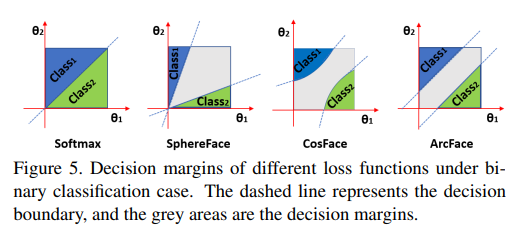
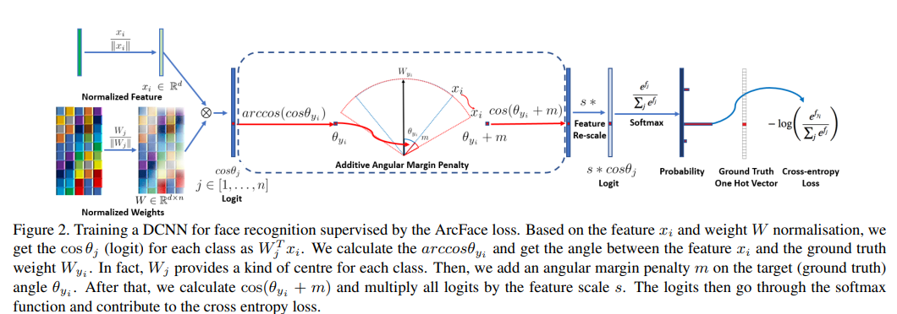

# ArcFace: Additive Angular Margin Loss for Deep Face Recognition
Jiankang Deng, Jia Guo, Niannan Xue, Stefanos Zafeiriou. _9 Feb 2019_

Recently, a popular line of research is to incorporate margins in well-established loss functions in order to maximise face class separability. In this paper, we propose an Additive Angular Margin Loss (ArcFace) to obtain highly discriminative features for face recognition. The proposed ArcFace has a clear geometric interpretation due to the exact correspondence to the geodesic distance on the hypersphere. 

* Official paper: [arXiv](https://arxiv.org/abs/1801.07698)
* Official code: [Github](https://github.com/deepinsight/insightface)

## Overview

1. Related work
2. Arcface
3. Combining margin penalty ideal
4. Hyperparameter tuning

## I. Related work
Arcface purposed new additive margin penalty softmax, so that you could read [CosFace](CosFace.md) before. 

## II. Arcface
- Arcface can be formulated as:
  $$ L_{arcface} = \frac{1}{N} \sum_{i=1}^n - log\frac{e^{s \cos(\theta_{y_i, i} + m)}}{e^{s \cos(\theta_{y_i, i} + m)} + \sum_{j=y_i}e^{s \cos(\theta_{y_i, i})}} $$
subject to 
$$W = \frac{W^\*}{||W^\*||}$$
$$x = \frac{x^\*}{||x^\*||}$$
$$\cos(\theta_{j, i}) = W_j^T x_i $$

- Similinaly Cosface, Arcface defines a decision margin in cosine space. For example, to decide x belong to 2 class 1-th or 2-th:
  $$C_1  :  \cos(\theta_1 + m) \ge \cos(\theta_2)$$
  $$C_2  :  \cos(\theta_2 + m) \ge \cos(\theta_1)$$

- Arcface's Architecture

## III. Combining margin penalty ideal
- this is litle fun mention in paper, if by combining all of the margin penalties, we implement SphereFace, ArcFace and CosFace in an united framework with m1, m2 and m3 as the hyper-parameters like:
  $$ L_{SAC} = \frac{1}{N} \sum_{i=1}^n - log\frac{e^{s (\cos(m_1\theta_{y_i, i} + m_2) + m_3)}}{e^{s (\cos(m_1\theta_{y_i, i} + m_2) + m_3)} + \sum_{j=y_i}e^{s \cos(\theta_{y_i, i})}} $$

## IV. Hyperparameter tuning
- with $s$, we do same thing in CosFace:
  $$s \ge \frac{C-1}{C} log \frac{(C-1)P_W}{1-P_W}$$
  where C is number of classes and $P_W$ denote the expected minimum posterior probability of class center
- with $m$, mathicaly m is a radian in range and it should be between 0.4 and 0.5 
- In paper, they trained on Casia-webface or MSMT2 dataset with m=0.5 s=64
- **NOTE**s:
when i used arcface for training from scratch, i have seen that:
  - arcface get best performance when seting embedding vector size > 516. Details in [Airface](https://arxiv.org/abs/1907.12256)
  - arcface have been strongly affected by batchsize-learning rate, m, s, lr scheduler
