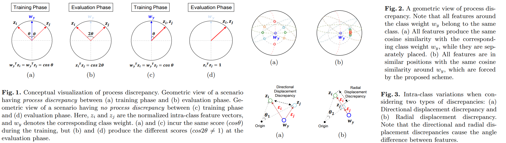
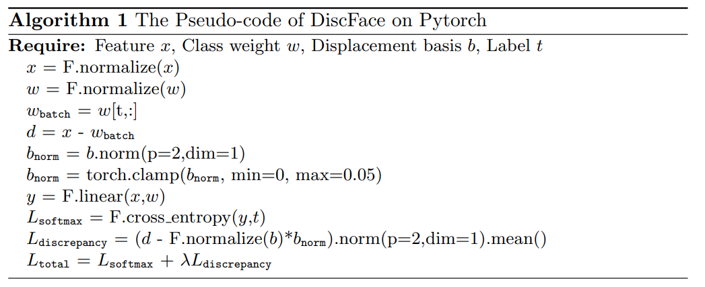

# DiscFace: Minimum Discrepancy Learning for Deep Face Recognition
Insoo Kim, Seungju Han, Seong-Jin Park, Ji-won Baek, Jinwoo Shin, Jae-Joon Han & Changkyu Choi  _26 Feb 2021_

>In this paper, we discover an important issue of softmax-based approaches: the sample features around the corresponding class weight are similarly penalized in the training phase even though their directions are different from each other. This directional discrepancy, i.e., process discrepancy leads to performance degradation at the evaluation phase.

* Offical Paper : [DOI](https://doi.org/10.1007/978-3-030-69541-5_22)
* Offical CODE  : [Github]()

# OVERVIEW
- their observation is that CosFace, ArcFace,... evaluation performance can suffer from discrepancy between training and evaluation processes under the open-set protocol: the matching scores between sample features and a softmax class weight are used during the training, while the matching scores are calculated between different sample features (without the class weight) at the evaluation phase. This difference leads to a directional discrepancy between sample features, as shown in Fig.1

# PROPOSED METHODS - Minimum Discrepancy Learning

1. Discrepancy in Face Recognition Schemes

* Consider:
   -  a dataset $\mathcal{D}=\{(x, y)\}$, which contains a sample (e.g., image) _x_
   -  its corresponding label (or class) $y \in \mathcal{C}=\{1,2, \ldots, C\}$. 
   -  We are interested in finding a learnable model parameterized by $\{\theta, w\}$ 
   -  that outputs a learned feature $\varphi_\theta(x)$ 
   -  a classification score $w_k^T \varphi_\theta(x)$ for each class _k_. 
* Softmax loss with respect to $\{\theta, w\}$:

$$L_{\text {softmax }}(\theta, w ; \mathcal{D})=-\frac{1}{|\mathcal{D}|} \sum_{(x, y) \in \mathcal{D}} \log \frac{e^{w_y^T \varphi_\theta(x)}}{\sum_{k \in \mathcal{C}} e^{w_k^T \varphi_\theta(x)}}$$

Then, the cosine similarity between normalized feature vectors, i.e., 

$$z_i=\frac{\varphi_\theta\left(x_i\right)}{\left\|\varphi_\theta\left(x_i\right)\right\|_2}, z_j=\frac{\varphi_\theta\left(x_j\right)}{\left\|\varphi_\theta\left(x_j\right)\right\|_2}$$

is measured to identify whether they are in the same class or not.

* As described in Fig.2 (a), the features around the corresponding class weight $w_y$ lie on a hypersphere manifold. 
  - In the training phase, these features are able to produce the same scores by $w_y^T \varphi_\theta(x)$ of the softmax function (1) even though their directions are different from each other. 
  - On the other hand, this directional discrepancy is attributed to different displacement vectors $\left(\varphi_\theta(x)-w_y\right)$ and leads to an undesirable effect at the evaluation stage. 
  - Namely, _the directional relationship between features are important _in the evaluation phase, but it is not directly considered during the training
  - THis is **process discrepancy** that might not appear in deep metric-based learning because the underlying functions in both the training and evaluation process are identical

2. Learning Discrepancy-Free Representations

**Discrepancy loss** : The main idea for minimizing process discrepancy is to enforce the directions of intra-class features to be aligned in a single direction from the perspective of their class weights as illustrated in Fig.2 (b).

- process discrepancy occurs :
  - $W^T z_i \approx W^T z_j$ 
  - for the training phase does not guarantee $z_i^T z_j \approx 1$

- The proposed idea of directional alignment can minimize the angle between $z_i \text{ and } z_j$

  -   we first define the displacement vector $\varepsilon$ as follows:

    $$\varepsilon(x, y)=\frac{\varphi_\theta(x)}{\left\|\varphi_\theta(x)\right\|_2}-\frac{w_y}{\left\|w_y\right\|_2}$$

    it is **the difference vector** between a feature ϕθ(x) and its class weight wy as shown in Fig.3

  - they introduce an **additional learnable representative vector** that fits all displacement vectors, which is named here, **deep displacement basis**, in order to minimize the discrepancy between displacement vectors of their features.

    $$L_{\text {discrepancy }}(\theta, w, \xi ; \mathcal{D})=\frac{1}{|\mathcal{D}|} \sum_{(x, y) \in \mathcal{D}}\|\varepsilon(x, y)-\xi\|_2$$

    - The above loss minimizes the directional intra-class discrepancy, such that the training/evaluation process discrepancy can be mitigated
    - An additional advantage of optimizing (3) is that the class information in the displacement vectors is implicitly forced to be eliminated by fitting all of them to a single displacement basis

- In summary, they suggest to minimize the following loss:
  
$$L_{\text {total }}(\theta, w, \xi ; \mathcal{D})=L_{\text {sof tmax }}(\theta, w ; \mathcal{D})+\lambda L_{\text {discrepancy }}(\theta, w, \xi ; \mathcal{D})$$

**Directional vs. radial displacement discrepancy.**

- process discrepancy can be decomposed into two types as described in Fig.3:       
  - _directional displacement discrepancy_: is the angle difference between displacement vectors
  - _radial displacement discrepancy_:  is the norm difference between displacement vectors 
  

# CODE
