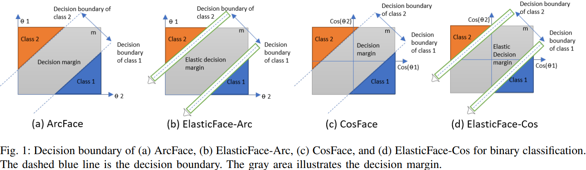
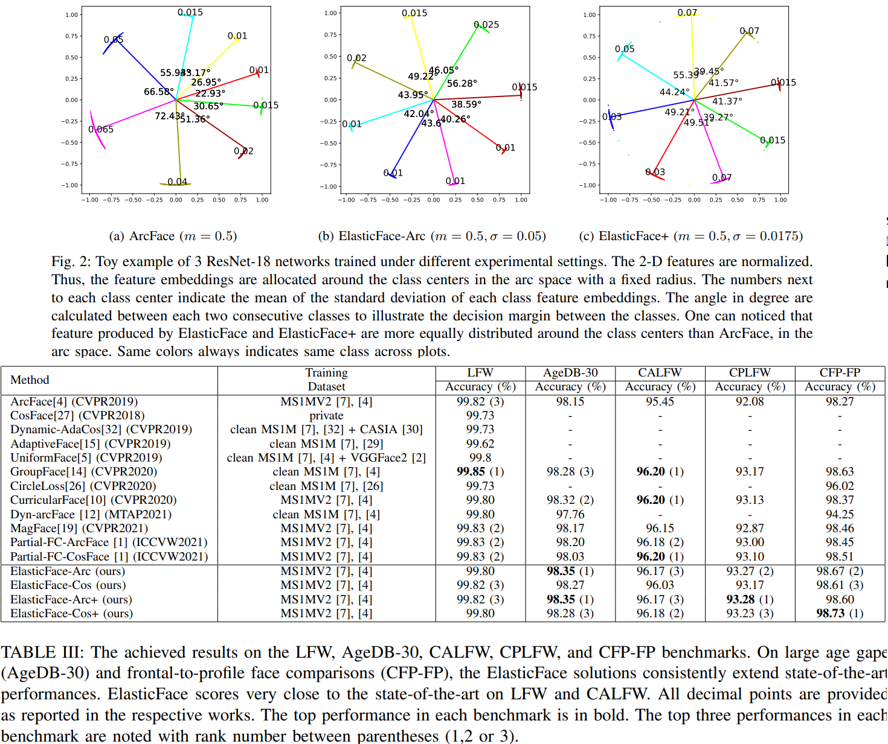

# ElasticFace: Elastic Margin Loss for Deep Face Recognition
Hao Liu, Xiangyu Zhu, Zhen Lei, Stan Z. Li. _21 March 2022_

> , we relax the fixed penalty margin constrain by proposing elastic penalty margin loss (ElasticFace) that allows flexibility in the push for class separability. 
> The main idea is to utilize random margin values drawn from a normal  distribution in each training iteration. This aims at giving the decision boundary chances to extract and retract to allow space for flexible class separability learning.

* Official paper: [ArXiv](https://arxiv.org/pdf/2109.09416.pdf)
* Official code: [Github](https://github.com/fdbtrs/ElasticFace)

# OVERVIEW
- The main challenge for the majority of the previously listed works is the fine selection of the ideal margin penalty value
- ElasticFace loss aim at improving the accuracy of face recognition by targeting enhanced intra-class compactness and inter-class discrepancy in a flexible manner through relaxing this constraint by **randomly drawing the margin value from a Gaussian distribution**

- **Angular Margin Penalty-based Loss:**

$$L_{A M L}=\frac{1}{N} \sum_{i \in N}-\log \frac{e^{s\left(\cos \left(m_1 \theta_{y_i}+m_2\right)-m_3\right)}}{e^{s\left(\cos \left(m_1 \theta_{y_i}+m_2\right)-m_3\right)}+\sum_{j=1, j \neq y_i}^c e^{s\left(\cos \left(\theta_j\right)\right)}} \qquad \text{Eq.5}$$

  - $m_1, m_2 \text{ and } m_3$ are the margin penalty parameters proposed by SphereFace, [ArcFace](ArcFace.md)  and [CosFace](CosFace.md), respectively
  - A reasonable choice could be selecting a large margin value that is close to the margin upper bound to enable higher separability between the classes
  -  However, this assumption could not be held when there are largely different intra-class variations leading to less than optimal discriminative feature learning, especially when there are **large variations** between the samples/classes in the training dataset




# PROPOSED METHOD

1. Elastic Angular Margin Penalty-based Loss (ElasticFace):

- ElasticFace loss is extended over the angular margin penalty-based loss by deploying random margin penalty values drawn from a Gaussian distribution

$$f(x) = \frac{1}{\sigma \sqrt{2 * PI}} \mathcal{e}^{-0.5 (\frac{x - \mu}{\sigma})^2} $$

  - ElasticFace-Arc $\left(L_{E A r c}\right)$ can be defined as follows:

    $$L_{E A r c}=\frac{1}{N} \sum_{i \in N}-\log \frac{e^{s\left(\cos \left(\theta_{y_i}+E(m, \sigma)\right)\right)}}{e^{s\left(\cos \left(\theta_{y_i}+E(m, \sigma)\right)\right)}+\sum_{j=1, j \neq y_i}^c e^{s\left(\cos \left(\theta_j\right)\right)}} \text { Eq.6 }$$

  - ElasticFace-Cos $\left(L_{E C o s}\right)$ can be defined as follows:
  
    $$L_{E C o s}=\frac{1}{N} \sum_{i \in N}-\log \frac{e^{s\left(\cos \left(\theta_{y_i}\right)-E(m, \sigma)\right)}}{e^{s\left(\cos \left(\theta_{y_i}\right)-E(m, \sigma)\right)}+\sum_{j=1, j \neq y_i}^c e^{s\left(\cos \left(\theta_j\right)\right)}} \text{ Eq.7}$$

  - $E(m, \sigma)$ is a normal function that return a random value from a Gaussian distribution in Eq.5
  - The sample push towards its center during training using ElasticFace-Arc and ElasticFace-Cos varies between training samples, based on the margin penalty drawn from $E(m, \sigma)$. During the training phase, a _new random margin is generated for each sample_ in each training iteration

2.  ElasticFace+ 

- they observes the intra-class variation during each training iteration and use this observation to assign a margin value to each sample based on its proximity to its class center. This causes the samples that are relatively far from their class center to be pushed with a larger penalty margin to their class center


- Thus, they **sort (descending)** the output of the Gaussian distribution function (Equation 5) based on $\cos \left(\theta_{y_i}\right)$ value. 
- Then, the sample with small $\cos \left(\theta_{y_i}\right)$ will be pushed with large value from $E(m, \sigma)$ function, and vice versa.


3.  Parameter Selection

- The probability density function has its peak around **m**
  - they select the best margin value (as a single value) by training three instances of ResNet-50 on CASIA  with ArcFace loss using margins equal 0.45, 0.5, 0.55 Then, based on the sum of the performance ranking **Borda count** on LFW, AgeDB-30, CALFW, CPLFW, and CFP-FP , they select the margin that achieved the highest Borda count sum and set it as m
  - best is 0.5 (ElasticFace-Arc), 0.35(ElasticFace-Cos)
- To select the $\sigma$
  - setting up the sigma to one of these values 0.0125, 0.015, 0.025 and 0.05. Then, we rank these models based on the sum of the performance ranking Borda count across all datasets
  - the best is  0.05 (ElasticFace-Arc and ElasticFace-Cos), 0.0175(ElasticFace-Arc+) and ElasticFace-Cos+ is 0.025


# Result



# CODE

```python
def l2_norm(input, axis = 1):
    norm = torch.norm(input, 2, axis, True)
    output = torch.div(input, norm)

    return output

class MLLoss(nn.Module):
    def __init__(self, s=64.0):
        super(MLLoss, self).__init__()
        self.s = s
    def forward(self, embbedings, label):
        embbedings = l2_norm(embbedings, axis=1)
        kernel_norm = l2_norm(self.kernel, axis=0)
        cos_theta = torch.mm(embbedings, kernel_norm)
        cos_theta = cos_theta.clamp(-1, 1)  # for numerical stability
        cos_theta.mul_(self.s)
        return cos_theta

class ElasticArcFace(nn.Module):
    def __init__(self, in_features, out_features, s=64.0, m=0.50,std=0.0125,plus=False):
        super(ElasticArcFace, self).__init__()
        self.in_features = in_features
        self.out_features = out_features
        self.s = s
        self.m = m
        self.kernel = nn.Parameter(torch.FloatTensor(in_features, out_features))
        nn.init.normal_(self.kernel, std=0.01)
        self.std=std
        self.plus=plus
    def forward(self, embbedings, label):
        embbedings = l2_norm(embbedings, axis=1)
        kernel_norm = l2_norm(self.kernel, axis=0)
        cos_theta = torch.mm(embbedings, kernel_norm)
        cos_theta = cos_theta.clamp(-1, 1)  # for numerical stability
        index = torch.where(label != -1)[0]
        m_hot = torch.zeros(index.size()[0], cos_theta.size()[1], device=cos_theta.device)
        margin = torch.normal(mean=self.m, std=self.std, size=label[index, None].size(), device=cos_theta.device) # Fast converge .clamp(self.m-self.std, self.m+self.std)
        if self.plus:
            with torch.no_grad():
                distmat = cos_theta[index, label.view(-1)].detach().clone()
                _, idicate_cosie = torch.sort(distmat, dim=0, descending=True)
                margin, _ = torch.sort(margin, dim=0)
            m_hot.scatter_(1, label[index, None], margin[idicate_cosie])
        else:
            m_hot.scatter_(1, label[index, None], margin)
        cos_theta.acos_()
        cos_theta[index] += m_hot
        cos_theta.cos_().mul_(self.s)
        return cos_theta


class ElasticCosFace(nn.Module):
    def __init__(self, in_features, out_features, s=64.0, m=0.35,std=0.0125, plus=False):
        super(ElasticCosFace, self).__init__()
        self.in_features = in_features
        self.out_features = out_features
        self.s = s
        self.m = m
        self.kernel = nn.Parameter(torch.FloatTensor(in_features, out_features))
        nn.init.normal_(self.kernel, std=0.01)
        self.std=std
        self.plus=plus

    def forward(self, embbedings, label):
        embbedings = l2_norm(embbedings, axis=1)
        kernel_norm = l2_norm(self.kernel, axis=0)
        cos_theta = torch.mm(embbedings, kernel_norm)
        cos_theta = cos_theta.clamp(-1, 1)  # for numerical stability
        index = torch.where(label != -1)[0]
        m_hot = torch.zeros(index.size()[0], cos_theta.size()[1], device=cos_theta.device)
        margin = torch.normal(mean=self.m, std=self.std, size=label[index, None].size(), device=cos_theta.device)  # Fast converge .clamp(self.m-self.std, self.m+self.std)
        if self.plus:
            with torch.no_grad():
                distmat = cos_theta[index, label.view(-1)].detach().clone()
                _, idicate_cosie = torch.sort(distmat, dim=0, descending=True)
                margin, _ = torch.sort(margin, dim=0)
            m_hot.scatter_(1, label[index, None], margin[idicate_cosie])
        else:
            m_hot.scatter_(1, label[index, None], margin)
        cos_theta[index] -= m_hot
        ret = cos_theta * self.s
        return ret
```