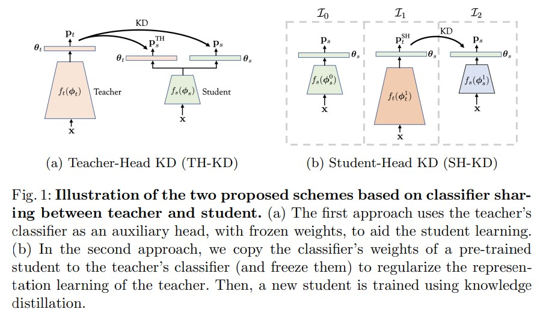
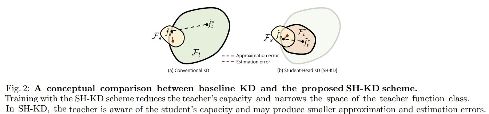
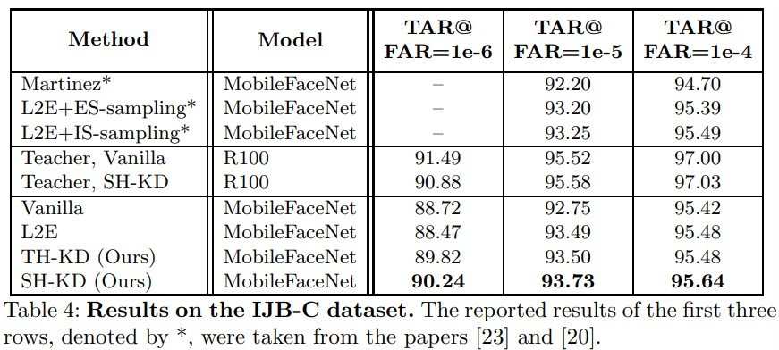

# It's All in the Head: Representation Knowledge Distillation through Classifier Sharing
Emanuel Ben-Baruch, Matan Karklinsky, Yossi Biton, Avi Ben-Cohen, Hussam Lawen, Nadav Zamir. _5 Apr 2022(v2)

>Common approaches for representation distillation mainly focus on the direct minimization of distance metrics between the models' embedding vectors. Such direct methods may be limited in transferring high-order dependencies embedded in the representation vectors, or in handling the capacity gap between the teacher and student models. Moreover, in standard knowledge distillation, the teacher is trained without awareness of the student's characteristics and capacity. 
>In this paper, we explore two mechanisms for enhancing representation distillation using classifier sharing between the teacher and student. We first investigate a simple scheme where the teacher's classifier is connected to the student backbone, acting as an additional classification head. Then, we propose a student-aware mechanism that asks to tailor the teacher model to a student with limited capacity by training the teacher with a temporary student's head. We analyze and compare these two mechanisms and show their effectiveness on various datasets and tasks, including image classification, fine-grained classification, and face verification.

* Official paper: [arXiv](https://arxiv.org/abs/2201.06945)
* Official code: [Github](https://github.com/alibaba-miil/headsharingkd)

# Introduce

- Knowledge distillation (KD) is a commonly used technique for improving the accuracy of a compact model using the guidance of a larger teacher model
- Representation distillation is often favored for transferring richer information and semantic knowledge from the teacher to the student
- most existing approaches for representation distillation are based on minimizing a loss function as a distance between the teacher and student representation vectors that encourages the student to mimic the attention maps of the teacher
- **But**
  -  aim at minimizing a distance metric between the embedding vectors, may be limited in transferring the representational knowledge from the teacher to the student
  - the discriminative power may reside in singular dimensions or be hidden in complex correlations between the embedding dimensions. 
  -  the teacher’s complexity can be significantly
higher than the student’s complexity, the student may not have the capacity to mimic the representation space of the teacher

- **Thus,** : they explore two methods that deploy classifier weights sharing between the teacher and the student

# Representational Knowledge Distillation through Classifier Sharing

1. Problem formulation
- Given a teacher model and a smaller student model $f_{t} \quad - \quad $f_{s}$
- For a given input sample $\mathbf{x}$:
  -   $\mathbf{z}_{t}=f_{t}\left(\mathbf{x} ; \phi_{t}\right)$  the representation (embedding) vectors of the teacher 
  -   $\mathbf{z}_{s}=f_{s}\left(\mathbf{x} ; \phi_{s}\right)$ is student models embedding
  -   $\phi_{t} \text{ and } \phi_{s}$ are the teacher and student models' parameters
  -   The teacher's classifier is defined by $g_{t}(\mathbf{z})=W_{t} \mathbf{z}+\mathbf{b}_{t}$
  -   the student's classifier is defined by $g_{s}(\mathbf{z})=W_{s} \mathbf{z}+\mathbf{b}_{s}$
  -   final prediction is given by applying the softmax activation
      -  Teacher: $h(\cdot): \mathbf{p}_{t}=h\left(g_{t}\left(\mathbf{z}_{t}\right)\right)$
      -   Student: $\mathbf{p}_{s}=h\left(g_{s}\left(\mathbf{z}_{s}\right)\right)$ 
-   a general form of the loss function :

    $$\mathcal{L}=\mathcal{L}_{\mathrm{CE}}\left(\mathbf{p}_{s}, \mathbf{y}\right)+\alpha \mathcal{H}\left(\mathbf{p}_{s}, \mathbf{p}_{t}\right)+\beta \mathcal{D}\left(\mathbf{z}_{s}, \mathbf{z}_{t}\right)$$

    where:
    - LCE(·) is the cross-entropy loss, 
    - and H(·) is the knowledge distillation distance function between the probabilistic outputs of the teacher and student models, e.g. the KL-divergence [refer](../../3.Person%20ReID/P2LR.md). 
    - The term D(·) refers to a distance metric applied on the representation vectors of the teacher and student models, as _the L2 loss, cosine distance or a contrastive loss_  

2. Teacher-Head Sharing (TH-KD) 

-  **Aim** to utilize the discrimination information represented by the _classification decision boundaries of the teacher_ to **guide** the student model in the optimization process

- Use the teacher's classifier as an auxiliary head for training the student model, Let $\mathbf{p}_{s}^{\mathrm{TH}}=h\left(g_{t}\left(\mathbf{z}_{s}\right)\right)$ be the prediction vector output from the teacher's classifier for a given student's embedding input
  - the KD losses computed for the two classifiers as follows:

    $$\mathcal{H}^{\prime}=\left(1-\alpha^{\mathrm{TH}}\right) \mathcal{H}\left(\mathbf{p}_{s}, \mathbf{p}_{t}\right)+\alpha^{\mathrm{TH}} \mathcal{H}\left(\mathbf{p}_{s}^{\mathrm{TH}}, \mathbf{p}_{t}\right)\quad \text{(1)}$$

  - the classification loss is:

    $$\mathcal{L}_{\mathrm{CE}}^{\prime}=\left(1-\alpha^{\mathrm{TH}}\right) \mathcal{L}_{\mathrm{CE}}\left(\mathbf{p}_{s}, \mathbf{y}\right)+\alpha^{\mathrm{TH}} \mathcal{L}_{\mathrm{CE}}\left(\mathbf{p}_{s}^{\mathrm{TH}}, \mathbf{y}\right) \quad \text{(2)}$$

  - final prediction can be obtained by combining the head outputs:
    
    $$\mathbf{p}_{s}^{\prime}=\left(1-\alpha^{\mathrm{TH}}\right) \mathbf{p}_{s}+\alpha^{\mathrm{TH}} \mathbf{p}_{s}^{\mathrm{TH}}$$

  - the student's head is simply the teacher's head whose weights are fixed during the training.
  - Incorporating the teacher-head loss encourages the student to mimic the representation space of the teacher while resolving its high dimensional dependencies.

3.  Student-Head Sharing (SH-KD)

**Aim** at tackling the limited capacity of the student in the distillation process
> In a conventional knowledge distillation, the teacher model is trained independently and in isolation from the student training process. Typically, the capacity of the teacher model is higher than the capacity of the student model, and thus the features learned by the teacher may not be applicable for
the student training

==> to train a teacher while considering the limited
capacity of the student, by i**nitializing the teacher’s classifier** with the weights of a temporary student’s head and fixing them during the training

- The method can be depicted as a three-step training procedure:
  - A student model is trained, with KD or without, providing a backbone and a classifier head with parameters $\left\{\boldsymbol{\phi}_{s}^{0}, \boldsymbol{\theta}_{s}\right\}$
  - A teacher model is trained by initializing and fixing its classifier with $\boldsymbol{\theta}_{s}$ to obtain the teacher model parameters, $\left\{\boldsymbol{\phi}_{t}, \boldsymbol{\theta}_{s}\right\}$.
  - A student model is trained using the loss in equation (1), with the teacher model obtained in step 1, to produce the final student parameters: $\left\{\boldsymbol{\phi}_{s}^{1}, \boldsymbol{\theta}_{s}\right\}$

- the accuracy of _the teacher may be decreased,_ ***however*** in knowledge distillation, we do not aim at optimizing the teacher, but rather to improve the accuracy of the student.Thus, leads to **a higher similarity** between the student and teacher representations 

**Theoretical Formulation for SH-KD.** [in paper](https://arxiv.org/abs/2201.06945), here is key notes
  -   Pure KD
  -  the expected error of the student model according to the VC theory 
  -   the classification error of teacher
  -   the convergence rate

# Results

