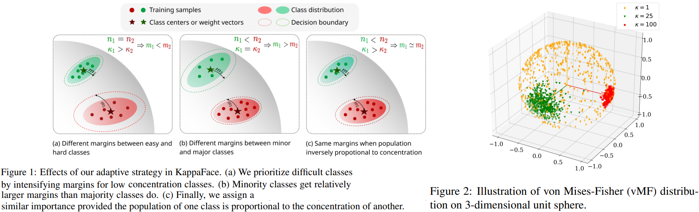
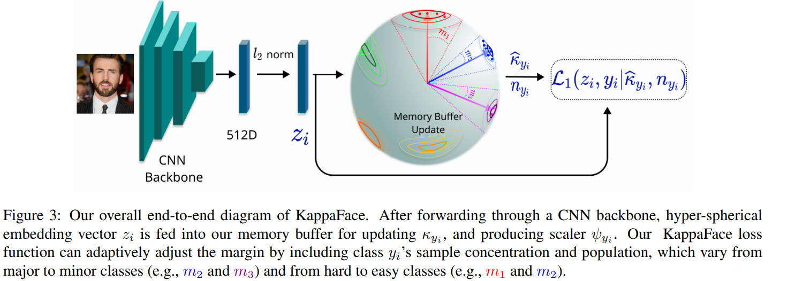
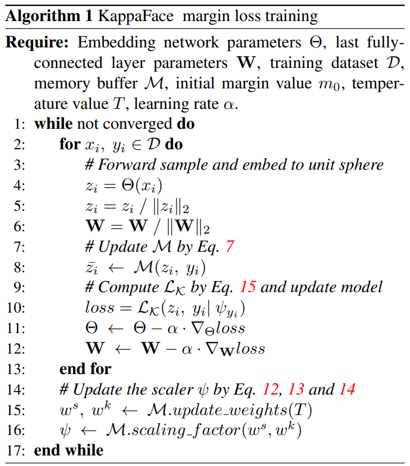

# KappaFace: Adaptive Additive Angular Margin Loss for Deep Face Recognition
Chingis Oinar, Binh M. Le, Simon S. Woo _19 Jan 2022_

> Feature learning is a widely used method employed for large-scale face recognition. Recently, large-margin softmax loss methods have demonstrated significant enhancements on deep face recognition. These methods propose fixed positive margins in order to enforce intra-class compactness and inter-class diversity. However, the majority of the proposed methods do not consider the class imbalance issue, which is a major challenge in practice for developing deep face recognition models. We hypothesize that it significantly affects the generalization ability of the deep face models.

* Offical Paper : [ArXiv](https://arxiv.org/abs/2201.07394)
* Offical CODE  : [Github]()

# OVERVIEW

- Recent works, including *CurricularFace*, demonstrated previous large margin methods  being inefficient for datasets having issues such as class imbalance or sample difficultness within a class. In fact, the class imbalance turns out to be a major challenge faced by deep face recognition models. 
Thus, the fixed margin methods were shown to produce biased decision boundaries, as
demonstrated in *FairLoss*, owing to which minority classes poorly describe the true feature space
- they adopt the *von MisesFisher distribution* (vMF) and present a method based on concentration and population parameters of a training dataset to achieve an adaptable class-based margin loss
- aim to **balance additive margins between the classes** to improve generalization ability for imbalanced datasets as Fig1

# PROPOSED METHODS
1. Normal margin penalty-based softmax

$$\mathcal{L}_{\mathcal{M}}=-\log \frac{e^{s\left(P\left(\cos \theta_{y_i}\right)\right)}}{e^{s\left(P\left(\cos \theta_{y_i}\right)\right)}+\sum_{j=1, j \neq y_i}^C e^{s\left(\cos \theta_j\right)}} \qquad \text{ (Eq.3)}$$

- where $P\left(\cos \theta_{y_i}\right)$ is a function to control the positive margin

2. The **von Mises-Fisher** distribution

The von Mises-Fisher distribution (vMF) is a probability distribution on the *d*-dimensional unit sphere $\mathbb{S}^{d-1}$, which has the density function presented as follows:

$$p(x \mid \epsilon, \kappa)=\frac{\kappa^{d / 2-1}}{(2 \pi)^{d / 2} I_{d / 2-1}(\kappa)} \exp \left(\kappa \epsilon^T x\right) \text{ (Eq.4)}$$

where:
-  $\epsilon \in \mathbb{S}^{d-1}$ is the mean direction
-  $\kappa \in \mathbb{R}^{+}$is the concentration parameter
-  $I_v$ denotes the modified Bessel function of the first kind at order _v_
-  The distribution of samples is uniform on the sphere when $\kappa=0$ and more concentrated around the mean direction $\epsilon$ when $\kappa$ becomes greater

Hyporthesize:
- easy learning classes are scattered around their centers and produce high
- hard learning classes contain noisy or samples having a high variance in terms of facial angles, ages and resolutions resulting in varying concentration values.

To approximate the value of concentration parameter from a set of $n$ observation samples, following the maximum likelihood estimation method, and is given by:

$$\hat{\kappa}=\frac{\bar{r}\left(d-\bar{r}^2\right)}{1-\bar{r}^2}$$

where

$$\bar{r}=\frac{\left\|\sum_i^n x_i\right\|_2}{n} . \quad \text{ (Eq.6)}$$

- The vMF is used for modeling the sample distributions of the classes in the hyperspherical space. Meanwhile, we can utilize a concentration value $\hat{\kappa}$ to modulate the angular margin for samples belonging to a certain class.

3. **KAPPAFACE**

* In order to efficiently estimate *the mean direction vectors*  and *concentrations*, they use **a memory buffer** that is
randomly initialized with the size of $|\mathcal{D}| \times d$, where |D| denotes the training set’s cardinality. So the average of the feature vector $z_i$ for the _i-th_ sample of the _t-th_ epoch:

$$\bar{z}_i^{t+1}=\alpha \times \bar{z}_i^t+(1-\alpha) \times z_i$$

* Thus, Eq. 6 can be restated for the $c$-th class as follows:
  
$$\widehat{r}_c=\frac{\left\|\sum_{i \mid y_i=c} \bar{z}_i\right\|_2}{n_c}$$

  - where the sum of vectors $\bar{z}_i$ is calculated while training within the memory buffer. 
  - This allows us to efficiently compute the concentration values $\widehat{\kappa}_c$ for each class.

*  they present **sample concentration and population weights** that are recalculated once an epoch to update the final margin values:

- Initially, the concentration values $\kappa$ are normalized by subtracting mean and dividing by standard deviation as follows

$$\begin{aligned}\mu_\kappa &=\frac{\sum_{c=1}^C \widehat{\kappa}_c}{C}, \\
\sigma_\kappa &=\sqrt{\frac{\sum_{c=1}^C\left(\widehat{\kappa}_c-\mu_\kappa\right)^2}{C}}, \\
\tilde{\kappa}_c &=\frac{\left(\widehat{\kappa}_c-\mu_\kappa\right)}{\sigma_\kappa} \end{aligned}$$

- then, the normalized values are used to calculate concentration weights

$$w_c^k=f_k\left(\tilde{\kappa}_c\right)=1-\sigma\left(\tilde{\kappa}_c \times T\right)$$

  - where $\sigma$ is a well-known sigmoid function
  - whereas $T \in$ $(0,1)$ is a hyper-parameter that denotes a temperature value.

* **Discussion**

The smaller the temperature value, the closer the weights are scattered around 0.5. Also, note that the greater the concentration value than the mean, the smaller the concentration weight $w_c^k$ and vice versa. 
Here, the memory buffer plays a crucial role in computing all the concentration values. 

Thus, we can encourage the concentration values to be closer to the mean and less diverse. 

Moreover, the class hardness is determined by a relative concentration $\tilde{\kappa_c}$ over the entire training dataset instead of its true value.

In contrast, considering that the number of samples per class is fixed throughout the training process, there is no need to update the sample weights once they are computed. Thus, the sample weights are obtained as follows:

$$w_c^s=f_s\left(n_c\right)=\frac{\cos \left(\pi \times \frac{n_c}{K}\right)+1}{2}$$

where $n_c$ is the number of samples for the _c_-th class and **K** is set to the maximum among them. 

* **Finally**, the calibration parameter for the margin value of instances belonging to the c-th class is determined as follows:

$$\psi_c=\gamma w_c^s+(1-\gamma) w_c^k$$

-  where $\gamma \in(0,1)$ is a hyper-parameter that balances the scaling contribution of sample concentration and the population.

Thus, with $m_0$ is a fixed initial margin value, the final classification loss looks as follows:

$$\mathcal{L}_{\mathcal{K}}=-\log \frac{e^{s\left(\cos \left(\theta_{y_i}+\psi_{y_i} \cdot m_0\right)\right)}}{e^{s\left(\cos \left(\theta_{y_i}+\psi_{y_i} \cdot m_0\right)\right)}+\sum_{j=1, j \neq y_i}^C e^{s\left(\cos \left(\theta_j\right)\right)}}$$

# CODE

