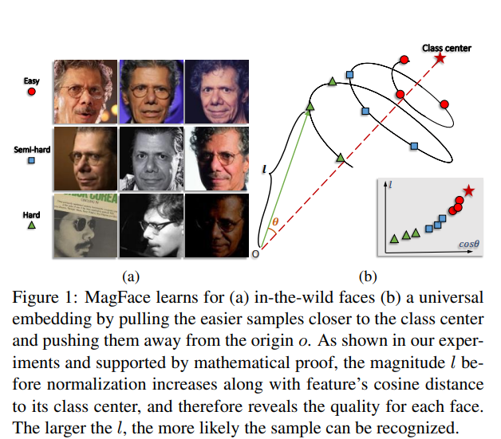
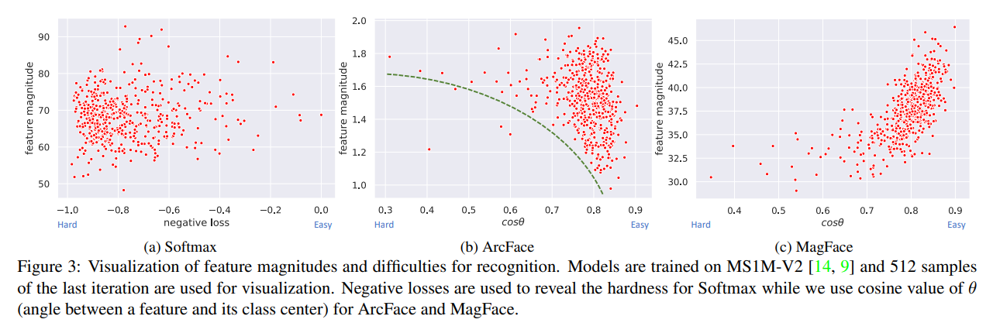

# MagFace: A Universal Representation for Face Recognition and Quality Assessment
Qiang Meng, Shichao Zhao, Zhida Huang, Feng Zhou. _20-25 June 2021_

The performance of face recognition system degrades when the variability of the acquired faces increases. Prior work alleviates this issue by either monitoring the face quality in pre-processing or predicting the data uncertainty along with the face feature. This paper proposes MagFace, a category of losses that learn a universal feature embedding whose magnitude can measure the quality of the given face.

* Official paper: [IEEE](https://ieeexplore.ieee.org/document/9578764)
* Official code: [Github](https://github.com/IrvingMeng/MagFace)

## Overview
The core objective of MagFace is to not only enlarge inter-class distance, but also maintain a cone-like withinclass structure like Fig. 1b, where ambiguous samples are pushed away from the class centers and pulled to the origin.

1. Related works
2. MagFace
3. Requirements for MagFace (Hyperparameter)

## I. Related works

- ArcFace Revisited.
U can revisit [here](ArcFace.md).
  -   Its superior performances on enforcing intraclass compactness and inter-class discrepancy, the angular margin penalty m used by ArcFace is quality-agnostic and the resulting structure of the within-class distribution could be arbitrary in unconstrained scenarios
  -   The three types of samples can stay at arbitrary location in the feasible region (shading
area in Fig. 2a) without any penalization by the angular margin. This leads to unstable within-class distribution, e.g., the high-quality face (type 1) stay along the boundary B while the low-quality ones (type 2 and 3) ( the larger the radius, the more uncertain the feature representation and the more difficulty the face can be recognized)
  -   Moreover, hard and noisy samples are overweighted as they are hard to stay in the feasible area and the models may overfit to them

- Face Quality Assessment
  - Face image quality is an important factor to enable high-performance face recognition systems that describe qualities from image-based aspects (e.g., distortion, illumination and occlusion) or subject-based measures (e.g., accessories).

## II. Magface
- instead of a fixed margin penalty, MagFace purposed the adaptive margin penalty based on facial image's magnitude:
  $$ L_{arcface} = \frac{1}{N} \sum_{i=1}^n - log\frac{e^{s \cos(\theta_{y_i, i} + m(a_i))}}{e^{s \cos(\theta_{y_i, i} + m(a_i))} + \sum_{j=y_i}e^{s \cos(\theta_{y_i, i})}} + \lambda_g g(a_i) $$
subject to 
$$W = \frac{W^\*}{||W^\*||}$$
$$x = \frac{x^\*}{||x^\*||}$$
$$\theta_{j, i} = \arccos(W_j^T x_i) $$
and where:
  -   $a_i  =  ||f_i||$ without normalization $f_i$ and is attributed in range [$l_a, u_a$].
  -   $g(a_i)$ is the regularizer and is a strictly decreasing convex function
  -   $m(a_i)$ is  the magnitude-aware angular margin and is a strictly increasing convex function

- Analysis:
  - To have a better understanding, Fig. 2b visualizes the margins $m(a_i)$ corresponding to different magnitude values.
  -  In contrast to ArcFace (Fig. 2a), the feasible region defined by $m(a_i)$ has a shrinking boundary with respect to feature magnitude towards the class center $w$. Consequently, this boundary pulls the low-quality samples (circle 2 and 3 in Fig. 2c) to the origin where they have lower risk to be penalized. 
  -  However, the structure formed solely by $m(a_i)$ is unstable for high-quality samples like circle 1 in Fig. 2c as they have large freedom moving inside the feasible region.
  - We therefore introduce the regularizer $g(a_i)$ that rewards sample with large magnitude  each sample would be pushed towards the boundary of the feasible region and the high-quality ones (circle 1) would be dragged closer to the class center $w$ as shown in Fig. 2d.

- Advantages:
  -  Can keep using the cosine-based metric that has been widely adopted by most existing inference systems
  -  By simultaneously enforcing  its direction and magnitude, the learned face representation is more robust to the variability of faces in the wild.

## III. Requirements for MagFace (Hyperparameter)
- In MagFace, $m(a_i),  g(a_i),  \lambda_g$ are required to have the following properties:
    1.  $m(a_i)$ is an increasing convex function in $[l_a, u_a]$ and $m^{\'}(a_i) \in (0, K]$, where K is a upper bound
    2.  $g(a_i)$  is a strictly convex function with $g^{\'}(u_a)=0$
    3.  $\lambda_g  \ge  \frac{sK}{-g^{\'}(l_a)}$
- In paper, they set:
    - $m(a_i) = \frac{u_m-l_m}{u_a-l_a} (a_i - l_a) + l_m$
    - $g_(a_i) = \frac{1}{a_i} + \frac{1}{u_a^2} a_i$
    - on MSMT2 dataset, with ($\lambda_g, l_a, u_a$) fixed to (35, 10, 110),
($l_m, u_m$) need selecting carefully, and they chosen (0.4, 0.8). If using other DS, we need tuning these hyperparameters.
