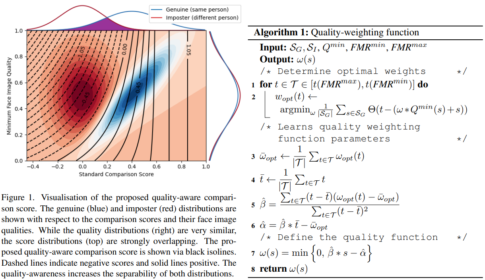

# QMagFace: Simple and Accurate Quality-Aware Face Recognition
Philipp Terhörst, Malte Ihlefeld, Marco Huber, Naser Damer, Florian Kirchbuchner, Kiran Raja, Arjan Kuijper _23 Mar 2022 (this version, v3)_

> Face recognition systems have to deal with large variabilities (such as different poses, illuminations, and expressions) that might lead to incorrect matching decisions. These variabilities can be measured in terms of face image quality which is defined over the utility of a sample for recognition. Previous works on face recognition either do not employ this valuable information or make use of non-inherently fit quality estimates. In this work, we propose a simple and effective face recognition solution (QMagFace) that combines a quality-aware comparison score with a recognition model based on a magnitude-aware angular margin loss.

* Official paper: [ArXiv](https://arxiv.org/abs/2111.13475)
* Official code: [Github](https://github.com/pterhoer/QMagFace)

# OVERVIEW
-  In these environments, these systems have to deal with large variabilities, such as challenging illuminations, poses, and expressions, that might result in incorrect matching decisions
-  The face image quality of a sample is defined as its utility for recognition  and measures the impact of these variabilities on the face recognition performance
-  QMagFace, a solution that combines a **quality-aware comparison function** with a face recognition model trained with a [MagFace loss](MagFace.md)
- In Figure 1, the effect of the proposed quality-aware scoring function is visualized: 
  -  Using the standard comparison score, the genuine (same person) and imposter (different person) distributions are strongly overlapping (see top plot). 
  -  Even if their respective quality distributions are very similar (right plot), _combining both information with the proposed quality-aware scoring function increases the separability leading to more reliable comparison scores for matching_
  - Especially for lower comparisons and quality scores, the proposed approach adapts the scores more strongly to increase the accuracy. For higher qualities and comparison scores, the proposed solution does not alter the score since high comparison scores imply face pairs of high quality

- _QMagFace is especially effective when dealing with challenging circumstances such as crosspose or cross-age._

# RELATE WORK

**Face Image Quality Assessment**
-  the first generation of face image quality assessment (FIQA) approaches are built on human perceptive image quality factors
-   The second generation of FIQA approaches  consists of supervised learning algorithms based on human or artificially constructed quality labels. 
-  The third generation of FIQA approaches [42] completely avoids the use of quality labels by utilizing the face recognition networks themselves:
   -  In 2020, Terhorst et al. proposed stochastic embedding robustness for FIQA (SER-FIQ). This concept measures the robustness of a face representation against dropout variations and uses this measure to determine the quality of a face
   -   In 2021, Meng et al. [31] proposed a class of loss functions that include magnitude-aware angular margins encoding the quality into the face representation.  Training with this loss results in a face recognition model that produces embeddings whose magnitudes can measure the FIQ of their faces.


<!--hhhhhhhhhhhhhhh-->


# METHODOLOGY
QMagFace, combines a **quality-aware comparison function** with a face recognition model trained with **MagFace loss**

1. Quality-Aware Comparison Scoring
-  a **comparison score** reflects the identity similarity of two face images. This reflection of similarity is more accurate when the compared samples are of high quality
-  they propose a simple, but effective, comparison function that includes these modelspecific quality values to enhance the accuracy and robustness of the face recognition system Given a face recognition model $\mathcal{M}$ trained with MagFace:
   -  two face images $I_1 \text{ and } I_2$
   -  their embeddings are given by $e_1=\mathcal{M}\left(I_1\right) \text{ and } $e_2=\mathcal{M}\left(I_2\right)$
   -  corresponding face image qualities $q_1=\left\|e_1\right\|_2$ through the vector length
   -  The standard comparison score $s=\cos \left(e_1, e_2\right)$ is defined over cosine similarity of these templates, then they proposed quality-aware comparison score $\hat{s}$ is defined as

    $$\hat{s} (s, q_1, q_2 )=\omega(s) * \min  \{q_1, q_2 \}+s \qquad \text{ with } \omega(s)=\min \{0, \beta * s-\alpha\}$$

      - This comparison function consists of only two trainable parameters $(\alpha;\beta$ ) and thus, can be robustly trained.
      - assume a linear relationship between the face image qualities and their comparison scores
      - further assume that the score-adjustment is dependent on the lowest quality of the comparison and that only comparisons with at least one low-quality sample needs to be adjusted
   - Cmt:
     - A high similarity score s can only be achieved through the comparison of two high-quality samples , no quality-based score adjustments (ω = 0) is needed
     - A lower comparison score might result from the degradation of a pair with at least one low-quality sample.  In this case, the similarity is altered by the sample quality and our proposed function adjusts the score based on the quality

2.  Training the Quality-Weighting Function

**For training**
- the comparison scores of the training set $\mathcal{S}=\mathcal{S}_G+\mathcal{S}_I$ are separated into genuine and imposter comparisons with the corresponding minimal qualities $\mathcal{Q}^{\min }$ of the sample pairs
- divided into three steps and aims at learning the quality weighting function $\omega(s)$ as shown in Algorithm 1 .
  - In the first step:
    - define the optimal quality weight $w_{\text {opt }}(t)$ for a given threshold **t**

    $$w_{\text {opt }}(t)=\underset{\omega}{\operatorname{argmin}} \frac{1}{\left|\mathcal{S}_G\right|} \sum_{s \in \mathcal{S}_G} \Theta(t-\bar{s}(\omega, s))$$

    - $\Theta(\cdot)$ describes the _Heaviside function_ and a quality-aware scoring function given by w and s that is scaled to the range of [0, 1], similar to the range of comparison scores [0,1], with a sigmoid function: 

    $$\bar{s}(\omega, s)=\sigma\left(\omega * Q^{\min }(s)+s\right) $$

  - In the second step:
    - a relevant threshold range $\mathcal{T}$ needs to be defined that represents the target FMR range
    - we choose the range from $F M R^{\max }=10^{-2} \text{ and }F M R^{\text {min }}=10^{-5}$ to cover a wide variety of potential applications
    - The relevant threshold range $\mathcal{T}=\left[t\left(F M R^{\max }\right), t\left(F M R^{\min }\right)\right]$ is determined by finding the threshold _t_ that corresponds to the required FMR on the quality-aware scores on the training data.

    $$t(F M R)=\underset{t}{\operatorname{argmin}}\left|F M R-\frac{1}{\left|\mathcal{S}_I\right|} \sum_{s \in \mathcal{S}_I} \Theta\left(\bar{s}\left(\omega_{\text {opt }}(t), s\right)-t\right)\right| \text {. }$$

  - The third step:
    - aims to learn the quality weighting function $\omega(s)$
    - Since the quality is included linearly in the MagFace loss, a linear relationship between the importance of the quality $q(s)$ and its comparison score _s_ is assumed.
    - the quality weights is modeled through : $\omega(s)=\beta * s-\alpha$
    - The parameters $\alpha;\beta$ can be learned by solving the following optimization:

    $$\min _{\alpha, \beta} \sum_{t \in \mathcal{T}}\left(\omega_{o p t}(t)+\alpha-\beta * t\right)^2$$

    resulting in the optimal parameters

    $$\begin{aligned} \hat{\beta} &=\frac{\sum_{t \in \mathcal{T}}(t-\bar{t})\left(\omega_{o p t}(t)-\bar{\omega}_{o p t}\right)}{\sum_{t \in \mathcal{T}}(t-\bar{t})^2} \\
    \hat{\alpha} &=\hat{\beta} * \bar{t}-\bar{\omega}_{o p t} \quad \text { with } \\
    \bar{\omega}_{o p t} &=\frac{1}{|\mathcal{T}|} \sum_{t \in \mathcal{T}} \omega_{\text {opt }}(t) \quad \text { and } \quad \bar{t}=\frac{1}{|\mathcal{T}|} \sum_{t \in \mathcal{T}} t .\end{aligned}$$


# CODE

```python
class QMagFace(Similarity):
    def __init__(self, alpha=0, beta=0):
        self.beta = beta
        self.alpha = alpha

    def similarity(self, f, pair_indices):
        s, q = self._compute_s_q(f, pair_indices)
        omega = self.beta * s - self.alpha
        omega[omega >= 0] = 0
        return omega * q + s

    def train(self, f, pair_indices, y, weights_num=20, fmr_num=50, fmr_min=1e-5, fmr_max=1e-2, max_ratio=0.5):
        # find the optimal omegas and threshold for the range of fmrs
        ts, omegas = self.get_thresholds_omegas(f, pair_indices, y, weights_num, fmr_num, fmr_min, fmr_max, max_ratio)

        # Finally, use SK-Learn to fit a line and get m and b
        m, b = self.fit_line(ts, omegas)
        self.beta = m
        self.alpha = -b

    def name(self):
        return "QMagFace"

    @staticmethod
    def get_thresholds_omegas(f, pair_indices, y, weights_num=20, fmr_num=50, fmr_min=1e-5, fmr_max=1e-2, max_ratio=0.5):
        # fmr_num logarithmically spaced values from the given range of FMRs
        fmrs = np.logspace(np.log10(fmr_min), np.log10(fmr_max), num=fmr_num)
        s, q = QMagFace._compute_s_q(f, pair_indices)
        max_q = np.max(q)
        max_omega = max_ratio / max_q
        # The list of quality weights we consider as possible solutions
        omegas = np.linspace(-max_omega, max_omega, num=weights_num)
        ts = np.zeros((fmr_num,))
        omega_opts = np.zeros((fmr_num,))
        # Create temporary variables to store:
        # The thresholds which achieve the FMR for the respective omega
        tmp_thrs = np.zeros((weights_num, fmr_num))
        # The FNMR using omega for the given FMR
        tmp_fnmrs = np.zeros((weights_num, fmr_num))
        # For every omega compute performance at all FMR values and store it and the threshold
        for i, omega in enumerate(omegas):
            # Calculate an ROC curve with SK-Learn
            scores = expit(omega * q + s)
            fpr, tpr, thr = roc_curve(y, scores)
            # Compute and FNMR and trhreshold for every FMR
            for j, fmr in enumerate(fmrs):
                fnmr_idx = np.argmin(1 - tpr[fpr < fmr])
                fnmr = (1 - tpr[fpr < fmr])[fnmr_idx]
                threshold = thr[fnmr_idx]
                tmp_thrs[i, j] = threshold
                tmp_fnmrs[i, j] = fnmr

        # For every FMR find the best omega and the threshold that achieves this
        for j in range(fmr_num):
            fnmrs = tmp_fnmrs[:, j]
            fnmr_idx = np.argmin(fnmrs)
            ts[j] = tmp_thrs[fnmr_idx, j]
            omega_opts[j] = omegas[fnmr_idx]
        return ts, omega_opts

    @staticmethod
    def fit_line(x, y):
        x_ = x.reshape(-1, 1)
        lreg = LinearRegression()
        lreg.fit(x_, y)
        m = lreg.coef_[0]
        b = lreg.intercept_
        return m, b

    @staticmethod
    def _compute_s_q(f, pair_indices):
        f, q = sklearn.preprocessing.normalize(f, return_norm=True)
        s = Cosine.similarity(f, pair_indices, is_normed=True)
        q = np.min(q[pair_indices], 1)
        return s, 

```

