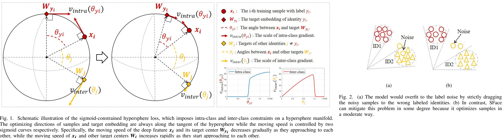
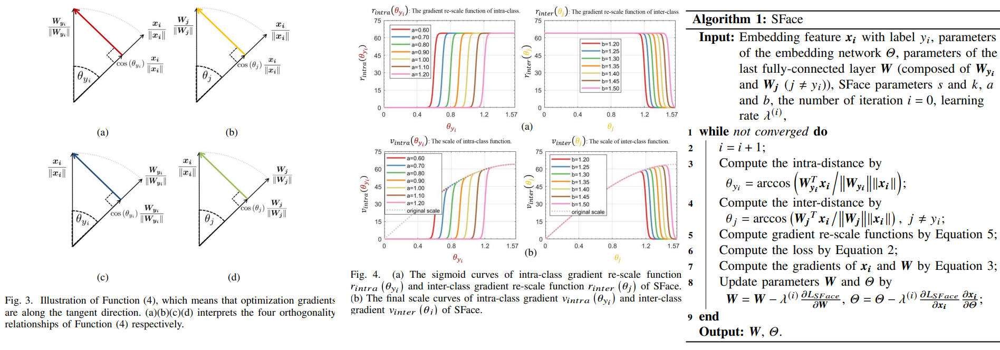

# SFace: Sigmoid-constrained Hypersphere Loss for Robust Face Recognition
Yaoyao Zhong, Weihong Deng, Jiani Hu, Dongyue Zhao, Xian Li, Dongchao Wen _08 Jan 2021_

>Deep face recognition has achieved great success due to large-scale training databases and rapidly developing loss functions. The existing algorithms devote to realizing an ideal idea: minimizing the intra-class distance and maximizing the inter-class distance. However, they may neglect that there are also low quality training images which should not be optimized in this strict way. Considering the imperfection of training databases, we propose that intra-class and inter-class objectives can be optimized in a moderate way to mitigate overfitting problem, and further propose a novel loss function, named sigmoid-constrained hypersphere loss (SFace).

* Offical Paper : [IEEE](https://ieeexplore.ieee.org/document/9318547)
* Offical CODE  : [Github](https://github.com/zhongyy/SFace)

# OVERVIEW
- Due to the imperfection of training databases, strictly minimizing the intra-class distance and maximizing the inter-class distance would lead to overfitting.
-  Therefore, our aim is to design a new loss function, which can increase the possibility of finding the best compromise between underfitting and overfitting to a specific training database, in order to obtaining better generalization ability.
-  we abandon the softmax-based loss while start from the primary and fundamental idea: optimize intra-class and inter-class distances to some extent, to improve the generalization ability of models. The intraclass and inter-class constraints are controlled by two sigmoid curves



# PROPOSED METHODS
1.  Sigmoid-constrained Hypersphere Loss (**SFace**)

- With the restricted directions of gradients, the moving directions of samples and target centers are always along the tangent of the hypersphere like Fig 1.
- Sface can be formulated:

$$L_{\text {SFace }}=L_{\text {intra }}\left(\theta_{y_i}\right)+L_{\text {inter }}\left(\theta_j\right)$$

  - $\theta_{y_i}$ is the angular distance between 
  
    $$\boldsymbol{x}_{\boldsymbol{i}} /\left\|\boldsymbol{x}_{\boldsymbol{i}}\right\| \text{ and }\boldsymbol{W}_{\boldsymbol{y}_{\boldsymbol{i}}} /\left\|\boldsymbol{W}_{\boldsymbol{y}_{\boldsymbol{i}}}\right\|$$

  -  $\theta_j\left(j \neq y_i\right)$ is the angular distance between

    $$x_i /\left\|x_i\right\| \text{ and }\boldsymbol{W}_{\boldsymbol{j}} /\left\|\boldsymbol{W}_{\boldsymbol{j}}\right\|$$

- Specifically:

$$\begin{aligned}
&L_{\text {intra }}\left(\theta_{y_i}\right)=-\left[r_{\text {intra }}\left(\theta_{y_i}\right)\right]_b \cos \left(\theta_{y_i}\right) \\
&L_{\text {inter }}\left(\theta_j\right)=\sum_{j=1, j \neq y_i}^C\left[r_{\text {inter }}\left(\theta_j\right)\right]_b \cos \left(\theta_j\right)
\end{aligned}$$

  - precisely control of the optimization degree, we design functions $r_{\text {intra }}\left(\theta_{y_i}\right) \text{ and } r_{\text {inter }}\left(\theta_j\right)$ to re-scale intra-class and inter-class objectives respectively to further restrict the optimizing speed. 
  - $[\cdot]_b$ is the block gradient operator, which prevents the contribution of its inputs to be taken into account for computing gradients.

- In the forward propagation process:

$$\begin{aligned}
&L_{\text {SFace }}= \\
&-\left[r_{\text {intra }}\left(\theta_{y_i}\right)\right]_b \cos \left(\theta_{y_i}\right)+\sum_{j=1, j \neq y_i}^C\left[r_{\text {inter }}\left(\theta_j\right)\right]_b \cos \left(\theta_j\right) .
\end{aligned}$$




2.  Gradient Re-scale

- The optimization gradients are always along the tangent direction (Fig3)
- In addition, ||x||, ||W|| as whole almost remain unchanged in the training process, for the reason that there are no components of gradients in the radial direction.
- So These two terms **r{intra} and r{inter}** actually re-scale the gradient, i.e. control the moving speed of samples and target centers i
- the final gradient scales are proportional to \
  - $v_{\text {intra }}\left(\theta_{y_i}\right)=r_{\text {intra }}\left(\theta_{y_i}\right) \sin \theta_{y_i}$ 
  -  $v_{\text {inter }}\left(\theta_j\right)=r_{\text {inter }}\left(\theta_j\right) \sin \theta_j$.
- Eventually, we choose sigmoid functions as the gradient rescale functions. The specific forms are:

$$\begin{aligned}
&r_{\text {intra }}\left(\theta_{y_i}\right)=\frac{s}{1+e^{-k *\left(\theta_{y_i}-a\right)}}, \\
&r_{\text {inter }}\left(\theta_j\right)=\frac{s}{1+e^{k *\left(\theta_j-b\right)}} .
\end{aligned}$$

  - $s$ is the upper asymptote of two sigmoid curves as the initial scale of gradient
  -  $k$ is the control the slope of sigmoid curves.
  -  Hyperparameters $a$ and $b$ decide the horizontal intercept of two sigmoid curves and actually control the flexible interval to suppress the moving speed.
  -  Therefore $a$ and $b$ are vital parameters should be selected according to characteristics of a specific training database, which we will discuss later
-  Algorithms in Fig4


# CODE

```python

class SFaceLoss(nn.Module):

    def __init__(self, in_features, out_features, device_id, s = 64.0, k = 80.0, a = 0.80, b = 1.23):
        super(SFaceLoss, self).__init__()
        self.in_features = in_features
        self.out_features = out_features
        self.device_id = device_id
        self.s = s
        self.k = k
        self.a = a
        self.b = b
        self.weight = Parameter(torch.FloatTensor(out_features, in_features))
        #nn.init.xavier_uniform_(self.weight)
        xavier_normal_(self.weight, gain=2, mode='out')

    def forward(self, input, label):
        # --------------------------- cos(theta) & phi(theta) ---------------------------
        if self.device_id == None:
            cosine = F.linear(F.normalize(input), F.normalize(self.weight))
        else:
            x = input
            sub_weights = torch.chunk(self.weight, len(self.device_id), dim=0)
            temp_x = x.cuda(self.device_id[0])
            weight = sub_weights[0].cuda(self.device_id[0])
            cosine = F.linear(F.normalize(temp_x), F.normalize(weight))

            for i in range(1, len(self.device_id)):
                #print("self.device_id", self.device_id)
                temp_x = x.cuda(self.device_id[i])
                weight = sub_weights[i].cuda(self.device_id[i])
                #print("cosine", i, cosine.size(), cosine)
                cosine = torch.cat((cosine, F.linear(F.normalize(temp_x), F.normalize(weight)).cuda(self.device_id[0])), dim=1)
        # --------------------------- s*cos(theta) ---------------------------
        output = cosine * self.s
        # --------------------------- sface loss ---------------------------
        #print("input", cosine.size(), cosine)
        #print("target", label.size(), label)

        one_hot = torch.zeros(cosine.size())
        if self.device_id != None:
            one_hot = one_hot.cuda(self.device_id[0])
        one_hot.scatter_(1, label.view(-1, 1), 1)

        zero_hot = torch.ones(cosine.size())
        if self.device_id != None:
            zero_hot = zero_hot.cuda(self.device_id[0])
        zero_hot.scatter_(1, label.view(-1, 1), 0)

        #print("one_hot", one_hot)
        #print("zero_hot", zero_hot)

        WyiX = torch.sum(one_hot * output, 1)
        with torch.no_grad():
            # theta_yi = torch.acos(WyiX)
            theta_yi = torch.acos(WyiX / self.s)
            weight_yi = 1.0 / (1.0 + torch.exp(-self.k * (theta_yi - self.a)))
        intra_loss = - weight_yi * WyiX

        Wj = zero_hot * output
        with torch.no_grad():
            # theta_j = torch.acos(Wj)
            theta_j = torch.acos(Wj / self.s)
            weight_j = 1.0 / (1.0 + torch.exp(self.k * (theta_j - self.b)))
        inter_loss = torch.sum(weight_j * Wj, 1)

        # print("intra loss", intra_loss.size())
        # print("inter loss", inter_loss.size())
        loss = intra_loss.mean() + inter_loss.mean()
        Wyi_s = WyiX / self.s
        Wj_s = Wj / self.s
        return output, loss, intra_loss.mean(), inter_loss.mean(), Wyi_s.mean(), Wj_s.mean()
```

