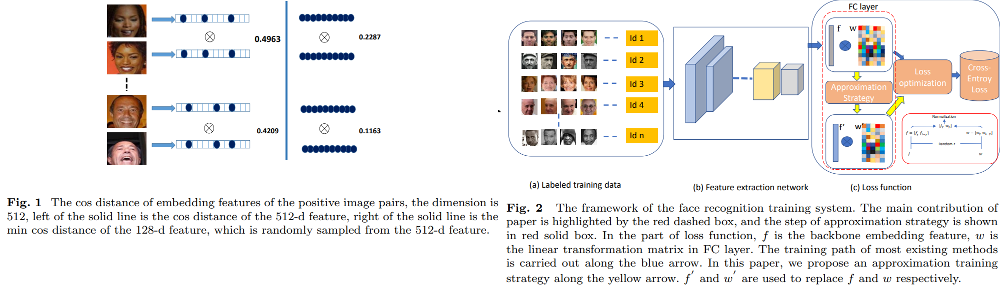
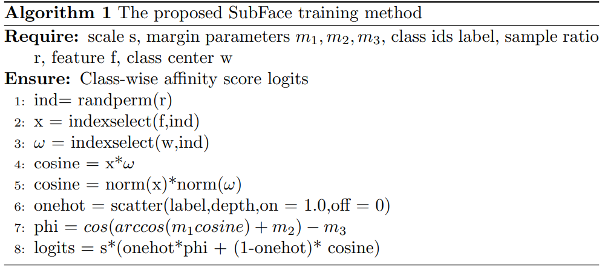

# SubFace: Learning with Softmax Approximation for Face Recognition
Hongwei Xu, Suncheng Xiang and Dahong Qian _24 Aug 2022_

> The softmax-based loss functions and its variants (e.g., cosface, sphereface, and arcface)  perform optimizations on the multiplication between the embedding features and the linear transformation matrix. However in most cases, the dimension of embedding features is given based on traditional design experience, and there is less-studied on improving performance using the feature itself when giving a fixed size.

* Offical Paper : [ArXiv](https://arxiv.org/pdf/2208.11483.pdf)
* Offical CODE  : [affter publication]()

# PROPOSED METHOD -  approximation strategy
- By analyzing the training process of approaches (CosFace, MagFace,...), they notice that the existing training strategies regard face features as a whole, which fails to pursue the optimization of softmax-based loss on the whole face dataset
- face features can be regarded as a high-dimensional vectors, which can help to make the features of sample identities more aggregated. Unfortunately, in some cases we observe that local features are less aggregated than global features, as shown in Fig.1

> we propose a feature approximation strategy which can realize accelerating or parallel processing by sampling positive and negative samples, the framework of this paper is shown in Fig. 2
> 
## Feature approximation

* Firstly, we present the details of our approximation method using the softmax loss, which can be formulated as follows:

$$L=-\frac{1}{N} \sum_{i=1}^N \log \frac{e^{w_{y i}^T f_i+b_{y i}}}{\sum_{j=1}^n e^{w_j^T f_i+b_j}} \qquad \text{ (Eq.2)}$$

  - As $w_j$ has the same dimension as $f_i$, which can be taken as a face representation, and meanwhile faces are locally distinguishable, we use the inner product of subspaces to replace that in Eq. $2 .$

* On the basis of softmax loss, we introduce a dimension selection factor $r \in[0,1]$, the subfeature can be expressed as $R_t * f_i$, where $R_t \in\{0,1\}^d$ is a random matrix with $R_{(t, j)} \sim \operatorname{Bernoulli}(r), *$ denotes element-wise product. 
And $R_t * w_{y i}$ constitutes a subset of $w_{y i}$. Consequently, we get the approximate loss:

$$\widehat{L}=-\frac{1}{N} \sum_{i=1}^N \log \widehat{p_i} \qquad \text{( Eq. 3)}$$

  - where $\widehat{p_i}=\frac{e^{\left(R_t * w_{y i}\right)^T\left(f_i\right)}}{\sum_{j=1}^n e^{\left(R_t w_j\right)^T\left(f_i\right)}}$.

*  Through analyzing our approximation loss in Eq. 3, obviously, $\left(R_t * w_{y i}\right)^T f_i=w_{y i}^T\left(R_t * f_i\right)$, so it can be easily expended as:

$$\widehat{L}=L+T_{\text {Bernoulli }}(r) \qquad \text{ (Eq.4)}$$

- Compared with the original softmax loss function, our approximation strategy can dynamically replace the inner product of feature and weight by that
of the subspace features.
- When training with this approximation mechanism:
  - the optimization goal for positive samples is to maximize the multiplication between the subfeature. 
  - Considering the randomness of this feature sampling, it focuses on making the aggregation of local features distribute evenly in the whole feature, while the original training method has no such effect. 
  - For negative samples, there is no difference between global features and subspace features for enhancing inter-class distance.

## Subfeature Normalization
* In practice, the bias term b in Eq. 2 is often set to 0, when the individual weight $\mathrm{w}$ and the feature $f_i$ are normalized. The softmax loss function can be formulated as:

$$l_{\text {softmax }}=-\frac{1}{N} \sum_{i=1}^N \log \frac{e^{s \cos \theta_{y i}}}{s \cos \theta_{y i}+\sum_{j=1, j \neq y i}^n e^{s \cos \theta_j}} \qquad \text{Eq.5}$$

  - $\theta_{y i}$ is the angle between the embedding feature  and the center. 

* Given the angle classification boundary $\theta$, the convergence constraint of training process should meet:

$$\begin{cases}\operatorname{arcos}\left(w_j^T f_i\right)<\theta & \text { if } i=j \\ \operatorname{arcos}\left(w_j^T f_i\right)>\theta & \text { if } i \neq j\end{cases} \qquad \text{ Eq.6}$$

* For the same purpose, we also hope that the optimization goal of this feature approximation training method will focus on the angle difference. 
- Considering with this, we normalize the subfeature $R_t * f_i$ and $R_t * w_j$, and re-scaled $R_t * f_i$ to s, the angle representation in Eq. 5 is replaced with the angle of between subfeature and subweight. The angle constraint between $R_t * f i$ and $R_t * w_j$ should also meet:

$$\begin{cases}\operatorname{arcos}\left(\omega_j^T x_i\right)<\theta & \text { if } i=j \\ \operatorname{arcos}\left(\omega_j^T x_i\right)>\theta & \text { if } i \neq j\end{cases} \qquad \text{ Eq.7}$$

where $x_i=\frac{R_t * f i}{\left\|R_t * f i\right\|}, \omega_j=\frac{R_t * w_j}{\left\|R_t * w_j\right\|}$.

* SubFace method is illustrated in the Alg. 1

