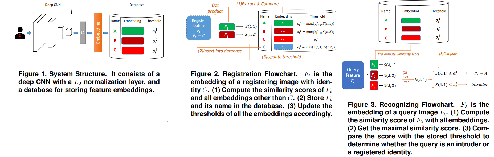

# Data-specific Adaptive Threshold for Face Recognition and Authentication
Hsin-Rung Chou, Jia-Hong Lee, Yi-Ming Chan, and Chu-Song Chen  _26 Oct 2018_

> Although we can obtain discriminative facial features through the state-of-the-art deep model training, how to decide the best threshold for practical use remains a challenge. We develop a technique of adaptive threshold mechanism to improve the recognition accuracy.

* Official paper: [IEEE](https://ieeexplore.ieee.org/document/8695322)
* Official code: [Github](https://github.com/ivclab/Online-Face-Recognition-and-Authentication)


# METHODOLOGY


We have two operations in our system illustrated in Figure 1: 
- **registration** : a feature vector (or embedding) is extracted form an input face image by using a deep network. The face could belong either to some person already registered on the system, or a new person not registered before. We assign _a threshold to the registered face during each registration_, and the thresholds of the other registered faces will be modified accordingly
- **recognition** :given a query image, we extract its feature embedding and compute the similarity scores between it and all of the other stored embeddings. Then we use the similarity scores to determine the identity of the query image. 

1.  Registration with Adaptive Threshold

* Given :
 - a sequence of face images $\mathbf{I}= \{I_1 \cdots I_t \cdots I_T \}$

 - the identity labels $\mathbf{P}= \{P_1 \cdots P_t \cdots P_T \}$ 

 - the embeddings $\mathbf{F}= \{F_1 \cdots F_t \cdots F_T \}$ extracted

* Register the embeddings into the database one-by-one as illustrated in Figure 2:
  - At each registration _t_, we insert the feature embedding $F_t$ and its identity $P_t$ into the database
  - then, update the threshold $\sigma_t^\tau$ accordingly
  - these threshold denotes the threshold of registered feature embedding $F_\tau \text{ when } F_t \text{ is registering into the database }(\tau=1, \cdots, t)$.
  - assign a different threshold for each facial embedding in the database:
    - first compute the similarity score between the embeddings $F_\tau \text{ and } F_v$ in the database 
    - Then  compute $\sigma_t^\tau$ as the maximum value among all facial embeddings not belonging to the same person at the current time

    $$\sigma_t^\tau=\max (S(\tau, v)), v=1 \cdots t, \text { where } P_\tau \neq P_v$$

* For the implementation of updating the thresholds, as the face images are registered one at a time, we can take advantage of the recursion of $\sigma_{t-1}^\tau \text{ and } \sigma_t^\tau$ for an efficient computation during registration.


2. Recognition and authentication

Given a query facial image $I_\lambda$ without its identity label, we first extract the embedding $F_\lambda$ by the deep CNN

- we compute the similarity scores with all the embeddings that are already stored in the database as shown in Figure 3
- extract the one which has the highest similarity score with $F_\lambda$ and denote its index as $u$ :
  
$$u=\underset{v}{\arg \max }(S(\lambda, v)), \text { for } v=1 \cdots t$$

- Once the most similar embedding $F_u$ is found:
  - the system compare the associated threshold $\sigma_t^u \text{ with the similarity score } S(\lambda, u)$
  - If $S(\lambda, u) \geq \sigma_t^u$, then the image $I_\lambda$ will be classified as identity $P_u$. else it dissociates from any registered identities, in this case, we call it an intruder and reject the authentication request

$$P_\lambda=\left\{\begin{array}{l} P_u, \text { if } S(\lambda, u) \geq \sigma_t^u \\ \text { intruder, if } S(\lambda, u)<\sigma_t^u \end{array}\right.$$


# CODE

```python
from __future__ import absolute_import
from __future__ import division
from __future__ import print_function

from tabulate import tabulate
import random
import numpy as np

from pdb import set_trace as bp

class Database():
    "Simulated data structure"
    def __init__(self, data_num, compare_num):
        self.embs = np.ndarray((data_num,128), dtype=float)
        self.labels = []
        self.indices = 0
        self.thresholds = []
        self.compare_num = compare_num
        self.class_dict = dict()

    def __len__(self):
        return self.indices

    def insert(self, label, emb):
        " Insert testing data "
        self.embs[self.indices] = emb
        self.labels.append(label)
        self.thresholds.append(0)
        self.add_to_dict(label[0])
        self.update_thresholds(emb, label)
        self.indices += 1

    def add_to_dict(self, label):
        if bool(self.class_dict.keys()) is False or label not in self.class_dict.keys():
            self.class_dict.setdefault(label, [])
        self.class_dict[label].append(self.indices)

    def update_thresholds(self, embTest, labelTest):
        max_thd = -1
        # Get class info
        all_classes = self.class_dict.keys()
        class_num = len(all_classes)

        compare_indices = None

        # Not enough images, compare all
        if class_num <= self.compare_num and self.indices <= self.compare_num:
            compare_indices = range(self.indices)
        # Not enough classes, but too many images, equally get images from each classes, last random
        elif class_num <= self.compare_num and self.indices > self.compare_num:
            # Number of images get from each classes
            mul = int(np.floor(float(self.compare_num/class_num)))
            compare_indices = []
            last = []
            cnt = 0
            # Equally select from each classes
            for c in all_classes:
                cur_class_indices = self.class_dict[c]
                if len(cur_class_indices) >= mul:
                    tmp = random.sample(cur_class_indices, mul)
                    compare_indices.extend(tmp)
                    last.extend([v for v in cur_class_indices if v not in tmp])
                    cnt += mul
                else:
                    compare_indices.extend(cur_class_indices)
                    cnt += len(cur_class_indices)
            # Random select for last 
            compare_indices.extend(random.sample(last, self.compare_num-cnt))
        # Too many classes, get one image from random classes
        elif class_num > self.compare_num:
            compare_classes = random.sample(list(all_classes), self.compare_num)
            compare_indices = [random.choice(self.class_dict[c]) for c in compare_classes]

        # Comparing
        for indx in compare_indices:
            # If different class
            if self.labels[indx] != labelTest:
                # Calculate similarity
                new_thd = get_similarity(embTest, self.embs[indx])
                # Update others
                if new_thd > self.thresholds[indx]:
                    self.thresholds[indx] = new_thd
                # Update self
                if new_thd > max_thd:
                    max_thd = new_thd
        if max_thd > -1:
            self.thresholds[self.indices] = max_thd

    def get_most_similar(self, embTest):
        testTiles = np.tile(embTest, (self.indices, 1))
        similarities = np.sum(testTiles*self.embs[0:self.indices], axis=1)
        max_similarity = np.max(similarities)
        max_id = np.argmax(similarities)
        return max_id, max_similarity

    def get_threshold_by_id(self, id):
        return self.thresholds[id]

    def get_label_by_id(self, id):
        return self.labels[id]

    def print_database(self):
        " Debug usage "
        data = zip(range(self.indices), self.labels, self.thresholds)
        table = tabulate(data, headers=['Index', 'Label', 'Threshold'])
        print(table)

    def contains(self, labelTest):
        if self.indices > 0:
            if labelTest in self.labels:
                return True
        return False

    def thresholds_mean(self):
        return np.mean(self.thresholds)

def get_similarity(embA, embB):
    ans = np.sum(embA*embB)
    return ans

```

```python
def simulator(args, emb_array, labels, max_compare_num, filepath):
    # Initialize
    fa = 0  # False accept
    wa = 0  # Wrong answer
    fr = 0  # False reject
    accept = 0
    reject = 0

    # Construct database
    database = Database(emb_array.shape[0], max_compare_num)

    # Simulating
    for indx, emb in enumerate(emb_array):
        test_array, test_label = util.get_batch(emb_array, labels, indx)

        if len(database) != 0:  # train_array is not empty
            max_id, max_similarity = database.get_most_similar(test_array)
            # Not intruder
            if database.get_threshold_by_id(max_id) < max_similarity:
                accept += 1
                if not database.contains(test_label):
                    fa += 1  # False accept
                elif test_label != database.get_label_by_id(max_id):
                    wa += 1  # Recognition error
            # Intruder
            else:
                reject += 1
                if database.contains(test_label):
                    fr += 1  # False reject

        # Add to database
        database.insert(test_label, test_array)

    #database.print_database()

    # Calculate error
    result_file = util.show_and_save_v3(fa, fr, wa, accept, reject, max_compare_num, filepath)
    return 


def main(args):
    filepaths = [os.path.join(args.csv_dir, v) for v in os.listdir(args.csv_dir) if 'features' in v]
    for csv_filepath in filepaths:
        util.green_print(csv_filepath)
        filepath = util.create_output_path(csv_filepath)

        # Read embeddings
        emb_array, labels = util.readEmb_csv(csv_filepath)

        # Main
        total_num = len(labels)
        if args.max_compare_num < 1:
            result_file = simulator(args, emb_array, labels, total_num, filepath)
        else:
            result_file = simulator(args, emb_array, labels, args.max_compare_num, filepath)

    # Plot
    #util.plot(result_file, start)
```