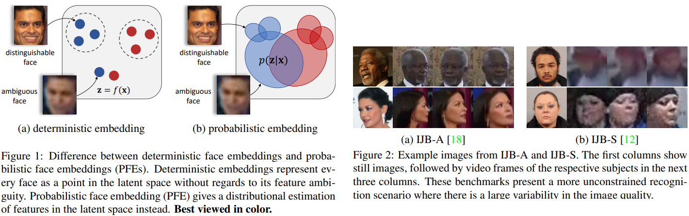
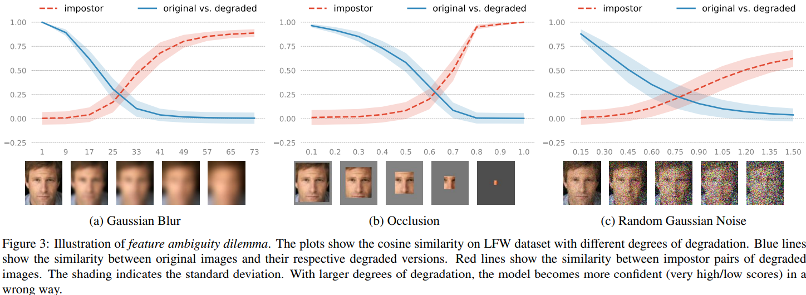
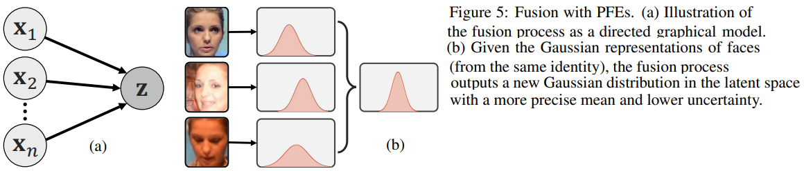
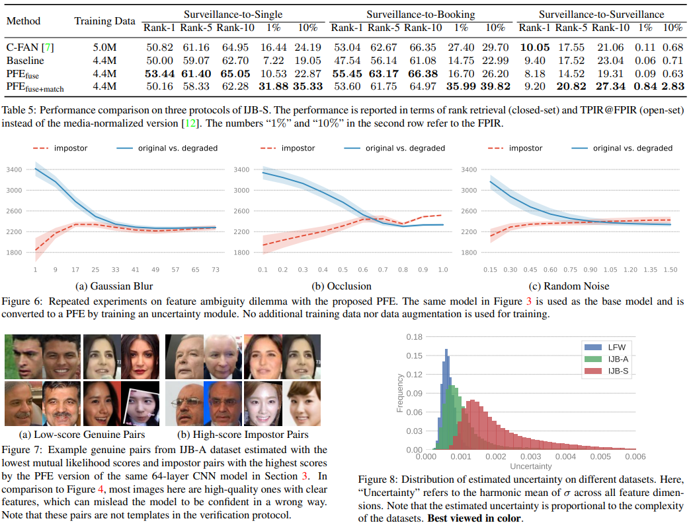

# Probabilistic Face Embeddings
Yichun Shi, Anil K. Jain _7 Aug 2019_

> In a fully unconstrained face setting, the facial features learned by the embedding model could be ambiguous or may not even be present in the input face, leading to noisy representations
> We propose Probabilistic Face Embeddings (PFEs), which represent each face image as a Gaussian distribution in the latent space

* Offical Paper : [ArXiv](https://arxiv.org/abs/1904.09658)
* Offical CODE  : [Github](https://github.com/seasonSH/Probabilistic-Face-Embeddings)

# OVERVIEW
- When humans are asked to describe a face image, they not only give the description of the facial attributes, but also the confidence associated with them. the uncertainty (or confidence) estimation is common and important in human decision making



- If the error in the estimation is somehow bounded, the distance between two points can effectively measure the semantic similarity between the corresponding face images. But given a low-quality input, a large shift in the embedded points is inevitable, leading to false recognition (Figure 1a). 
- Probabilistic Face Embeddings (PFEs), which give _a distributional estimation_ instead of _a point estimation_ in the latent space for each input face image (Figure 1b) is proposed
-  PFE can address the unconstrained face recognition problem in a two-fold way: 
   -  (1) During matching (face comparison), PFE penalizes uncertain features (dimensions) and pays more attention to more confident features. 
   -  (2) For low quality inputs,_the confidence estimated by PFE can be used to reject the input or actively ask for human assistance_ to avoid false recognition.

# RELATE WORD

1. **Uncertainty Learning** in DNNs

- There are two main types of uncertainty: 
  - **model uncertainty**: the uncertainty of model parameters given the training data and can be reduced by collecting additional training dataset 
  - **data uncertainty** : the uncertainty in output whose primary source is the inherent noise in input data and hence cannot be eliminated with more training data
  
2. Probabilistic Face Representation
Modeling faces as probabilistic distributions is not a new idea, there are some ideas:
- probabilistic distributions, subspace  or manifolds  in the feature space with the input for such methods is a set of face images and  use a between-distribution similarity or distance measure, e.g. KL-divergence, for comparison, which does not penalize the uncertainty 
- fuzzy models of a given face using the features of face parts

In the paper, they use an uncertainty-aware log likelihood score to compare the distributions

3. Quality-aware Pooling

- some methods leverage the saliency of deep CNN embeddings by aggregating the deep features of all faces into a single compact vector
- In these methods, a separate module learns to predict the quality of each face in the image set, which is then normalized for a weighted pooling of feature vectors

# Limitations of Deterministic Embeddings
Let $\mathcal{X}$ denote the image space and $\mathcal{Z}$ denote the latent feature space of _D_ dimensions.
  - An ideal latent space $\mathcal{Z}$ should only encode __identity-salient features__ and be disentangled from __identity-irrelevant features__.
  - each identity should have a unique intrinsic code $\mathbf{z} \in \mathcal{Z}$ that best represents this person
  - each face image $\mathbf{x} \in \mathcal{X}$ is an observation sampled from $p(\mathbf{x} \mid \mathbf{z})$
  - The process of training face embeddings can be viewed as a joint process of searching for such a latent space $\mathcal{Z}$ and learning the inverse mapping

For deterministic embeddings, the inverse mapping is a Dirac delta function $p(\mathbf{z} \mid \mathbf{x})=\delta(\mathbf{z}-f(\mathbf{x}))$, where _f_ is the embedding function
  -   for any space $\mathcal{Z}$, given the possibility of noises in $\mathrm{x}$
  -   it is unrealistic to recover the exact _z_ and the embedded point of a low-quality input would inevitably shift away from its intrinsic z 
  -   _“a pair of images being similar or even the same does not necessarily mean the probability of their belonging to the same person is high”_



These indicate two types of errors that can be expected in a fully unconstrained scenario even when the model is very confident (very high/low similarity scores):
*  false accept of impostor low-quality pairs
*  false reject of genuine cross-quality pairs

# METHODOLOGY
> we propose to encode the uncertainty into the face representation and take it into account during matching
> we estimate a distribution p(z|x) in the latent space to represent the potential appearance of a person’s face. In particular, we use a multivariate Gaussian distribution:

$$p\left(\mathbf{z} \mid \mathbf{x}_i\right)=\mathcal{N}\left(\mathbf{z} ; \boldsymbol{\mu}_i, \boldsymbol{\sigma}_i^2 \mathbf{I}\right)$$

- where $\boldsymbol{\mu}_i;\boldsymbol{\sigma}_i$ are both a _D_-dimensional vector predicted by the network from the _i-th_ input image Xi
- they only consider a diagonal covariance matrix to reduce the complexity of the face representation:
  - The center $\boldsymbol{\mu}$ should encode the most likely facial features of the input image.
  - The uncertainty $\boldsymbol{\sigma}$ should encode the model's confidence along each feature dimension.


## Matching with PFEs
Given the PFE representations of a pair of images $\left(\mathbf{x}_i, \mathbf{x}_j\right)$,  the "likelihood" of them belonging to the same person (sharing the same latent code):

$$p\left(\mathbf{z}_i=\mathbf{z}_j\right) \text{ where } \mathbf{z}_i \sim p\left(\mathbf{z} \mid \mathbf{x}_i\right) \text{ and } \mathbf{z}_j \sim p\left(\mathbf{z} \mid \mathbf{x}_j\right)$$

where 

$$p\left(\mathbf{z}_i=\mathbf{z}_j\right)=\int p\left(\mathbf{z}_i \mid \mathbf{x}_i\right) p\left(\mathbf{z}_j \mid \mathbf{x}_j\right) \delta\left(\mathbf{z}_i-\mathbf{z}_j\right) d \mathbf{z}_i d \mathbf{z}_j \qquad \text{ Eq.2}$$

In practice, they would like to use the log likelihood instead:

$$\begin{aligned}
s\left(\mathbf{x}_i, \mathbf{x}_j\right)=& \log p\left(\mathbf{z}_i=\mathbf{z}_j\right) \\
=&-\frac{1}{2} \sum_{l=1}^D\left(\frac{\left(\mu_i^{(l)}-\mu_j^{(l)}\right)^2}{\sigma_i^{2(l)}+\sigma_j^{2(l)}}+\log \left(\sigma_i^{2(l)}+\sigma_j^{2(l)}\right)\right) \\
&-\text { const },
\end{aligned}$$

where const $=\frac{D}{2} \log 2 \pi, \mu_i^{(l)}$ refers to the $l^{\text {th }}$ dimension of $\boldsymbol{\mu}_i$ and similarly for $\sigma_i^{(l)}$.
this symmetric measure can be viewed as the expectation of likelihood of one input's latent code conditioned on the other, that is:

$$\begin{aligned}
s\left(\mathbf{x}_i, \mathbf{x}_j\right) &=\log \int p\left(\mathbf{z} \mid \mathbf{x}_i\right) p\left(\mathbf{z} \mid \mathbf{x}_j\right) d \mathbf{z} \\
&=\log \mathbb{E}_{\mathbf{z} \sim p\left(\mathbf{z} \mid \mathbf{x}_i\right)}\left[p\left(\mathbf{z} \mid \mathbf{x}_j\right)\right] \\
&=\log \mathbb{E}_{\mathbf{z} \sim p\left(\mathbf{z} \mid \mathbf{x}_j\right)}\left[p\left(\mathbf{z} \mid \mathbf{x}_i\right)\right]
\end{aligned} \qquad \text{ (Eq.4)}$$

they call it __mutual likelihood score__ (MLS). 

**Property 1.** If $\sigma_i^{(l)}$ is a fixed number for all data $X_i$ and dimensions _l_, MLS is equivalent to a scaled and shifted negative squared Euclidean distance.


## Fusion with PFEs
With PFEs, a conjugate formula can be derived for representation fusion (Figure 5).
- Let $\{\mathbf{x}_1, \mathbf{x}_2, \ldots, \mathbf{x}_n \}$ be a series of observations (face images) from the same identity and $p (\mathbf{z} \mid \mathbf{x}_1, \mathbf{x}_2, \ldots, \mathbf{x}_n )$ be the posterior distribution after the _n-th_ observation.
- assuming all the observations are conditionally independent (given the latent code z)

$$p\left(\mathbf{z} \mid \mathbf{x}_1, \mathbf{x}_2, \ldots, \mathbf{x}_{n+1}\right)=\alpha \frac{p\left(\mathbf{z} \mid \mathbf{x}_{n+1}\right)}{p(\mathbf{z})} p\left(\mathbf{z} \mid \mathbf{x}_1, \mathbf{x}_2, \ldots, \mathbf{x}_n\right)$$

-  To simplify the notations, let us only consider a one-dimensional case below; the solution can be easily extended to the multivariate case.

If $p(\mathbf{z})$ is a noninformative prior, i.e. $p(\mathbf{z})$ variance approaches $\infty$, the posterior distribution in Equation (5) is a new Gaussian distribution with lower uncertainty
   - In practice, because the conditional independence assumption is usually not true, e.g. video frames include a large amount of redundancy, this is biased by the number of images in the set. Therefore, they take dimension-wise minimum to obtain the new uncertainty.

**Relationship to Quality-aware Pooling** 
If they consider a case:
   - where all the dimensions share the same uncertainty $\sigma_i$ for _i-th_ input 
   - let the quality value $q_i=\frac{1}{\sigma_i^2}$ be the output of the network. 
then, they have:

$$\hat{\boldsymbol{\mu}}_n=\frac{\sum_{i=1}^n q_i \boldsymbol{\mu}_i}{\sum_j^n q_j}$$

If they do not use the uncertainty after fusion, the algorithm will be the same as recent quality-aware aggregation methods for set-to-set face recognition.

## Learning
in this work they consider a stage-wise training strategy:

- given a pre-trained embedding model _f_, we fix its parameters, take $\boldsymbol{\mu}(\mathbf{x})=f(\mathbf{x})$
- optimize an additional uncertainty module to estimate $\sigma(\mathrm{x})$
- When the uncertainty module is trained on the same dataset of the embedding model. 

The uncertainty module is a network with two fullyconnected layers which **shares the same input as of the bottleneck layer**. The optimization criteria is to maximize themutual likelihood score of all genuine pairs $\left(\mathbf{x}_i, \mathbf{x}_j\right)$:

$$\mathcal{Loss}=\frac{1}{|\mathcal{P}|} \sum_{(i, j) \in \mathcal{P}}-s\left(\mathbf{x}_i, \mathbf{x}_j\right)$$

  - $\mathcal{P}$ is the set of all genuine pairs
  - In practice, the loss function is optimized within each mini-batch. this loss function can be understood as an alternative to maximizing $p(\mathbf{z} \mid \mathbf{x})$
  - if the latent distributions of all possible genuine pairs have a large overlap, the latent target **z** should have a large likelihood $p(\mathbf{z} \mid \mathbf{x})$ for any corresponding **x**.
  - $\boldsymbol{\mu}(\mathbf{x})$ is fixed, the optimization wouldn't lead to the collanse of all the $\mu(\mathbf{x})$ to a single point.


<!--hihi-->
# Results



# Training implementation
1. Before training, you need to prepare a base embedding network. To use the example [base model](https://drive.google.com/open?id=1MiC_qCj5GFidWLtON9ekClOCJu6dPHT4)
2. The configuration files for training are saved under `config/` folder, where you can define the training data, pre-trained model, network definition and other hyper-parameters
3. The uncertainty module that we are going to train is in models/uncertainty_module.py


# CODE

* uncertainty model

```python
from __future__ import absolute_import
from __future__ import division
from __future__ import print_function

import math
import tensorflow as tf
import tensorflow.contrib.slim as slim


batch_norm_params = {
    'decay': 0.995,
    'epsilon': 0.001,
    'center': True,
    'scale': True,
    'updates_collections': None,
    'variables_collections': [ tf.GraphKeys.TRAINABLE_VARIABLES ],
}

batch_norm_params_sigma = {
    'decay': 0.995,
    'epsilon': 0.001,
    'center': False,
    'scale': False,
    'updates_collections': None,
    'variables_collections': [ tf.GraphKeys.TRAINABLE_VARIABLES ],}

def scale_and_shift(x, gamma_init=1.0, beta_init=0.0):
    num_channels = x.shape[-1].value
    with tf.variable_scope('scale_and_shift'):
        gamma = tf.get_variable('alpha', (),
                        initializer=tf.constant_initializer(gamma_init),
                        regularizer=slim.l2_regularizer(0.0),
                        dtype=tf.float32)
        beta = tf.get_variable('gamma', (),
                        initializer=tf.constant_initializer(beta_init),
                        dtype=tf.float32)
        x = gamma * x +  beta

        return x   
    

def inference(inputs, embedding_size, phase_train, 
        weight_decay=5e-4, reuse=None, scope='UncertaintyModule'):
    with slim.arg_scope([slim.fully_connected],
                        weights_regularizer=slim.l2_regularizer(weight_decay),
                        activation_fn=tf.nn.relu):
        with tf.variable_scope(scope, [inputs], reuse=reuse):
            with slim.arg_scope([slim.batch_norm, slim.dropout],
                                is_training=phase_train):
                print('UncertaintyModule input shape:', [dim.value for dim in inputs.shape])

                net = slim.flatten(inputs)

                net = slim.fully_connected(net, embedding_size, scope='fc1',
                    normalizer_fn=slim.batch_norm, normalizer_params=batch_norm_params, 
                    activation_fn=tf.nn.relu)


                log_sigma_sq = slim.fully_connected(net, embedding_size, scope='fc_log_sigma_sq',
                    normalizer_fn=slim.batch_norm, normalizer_params=batch_norm_params_sigma,
                    activation_fn=None)
          
                # Share the gamma and beta for all dimensions
                log_sigma_sq = scale_and_shift(log_sigma_sq, 1e-4, -7.0)

                # Add epsilon for sigma_sq for numerical stableness                
                log_sigma_sq = tf.log(1e-6 + tf.exp(log_sigma_sq))

    return log_sigma_sq
```

* FW in Netword

```python

               # Initialialize the backbone network
                network = imp.load_source('embedding_network', config.embedding_network)
                mu, conv_final = network.inference(self.images, config.embedding_size)

                # Initialize the uncertainty module
                uncertainty_module = imp.load_source('uncertainty_module', config.uncertainty_module)
                log_sigma_sq = uncertainty_module.inference(conv_final, config.embedding_size, 
                                        phase_train = self.phase_train, weight_decay = config.weight_decay,
                                        scope='UncertaintyModule')

                self.mu = tf.identity(mu, name='mu')
                self.sigma_sq = tf.identity(tf.exp(log_sigma_sq), name='sigma_sq')

                # Build all losses
                loss_list = []
                self.watch_list = {}

               
                MLS_loss = mutual_likelihood_score_loss(self.labels, mu, log_sigma_sq)
                loss_list.append(MLS_loss)
                self.watch_list['loss'] = MLS_loss


                # Collect all losses
                reg_loss = tf.reduce_sum(tf.get_collection(tf.GraphKeys.REGULARIZATION_LOSSES), name='reg_loss')
                loss_list.append(reg_loss)
                self.watch_list['reg_loss'] = reg_loss
                total_loss = tf.add_n(loss_list, name='total_loss')

```