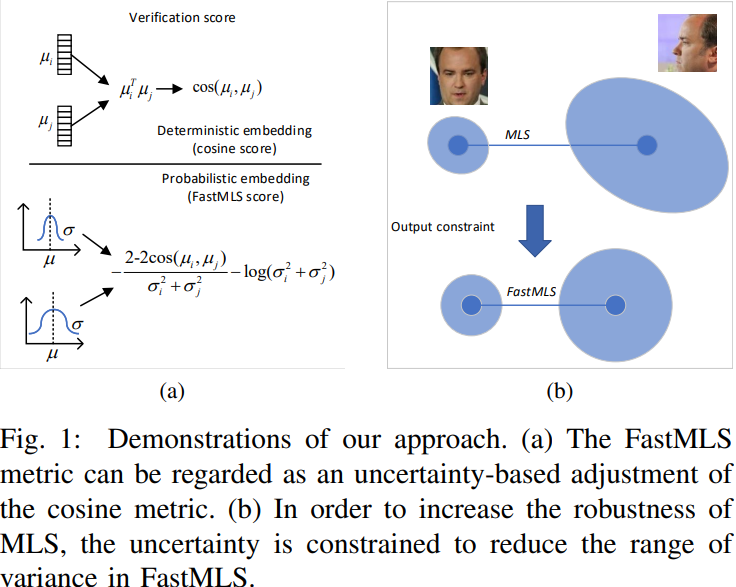
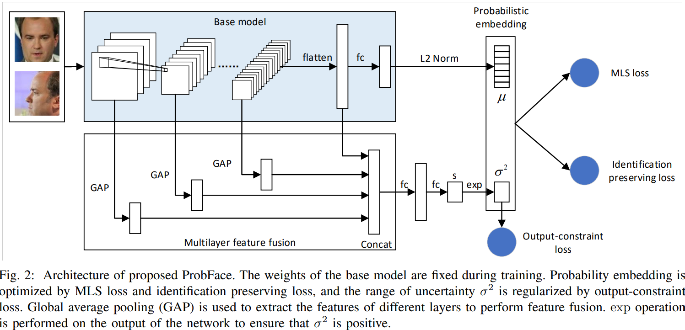
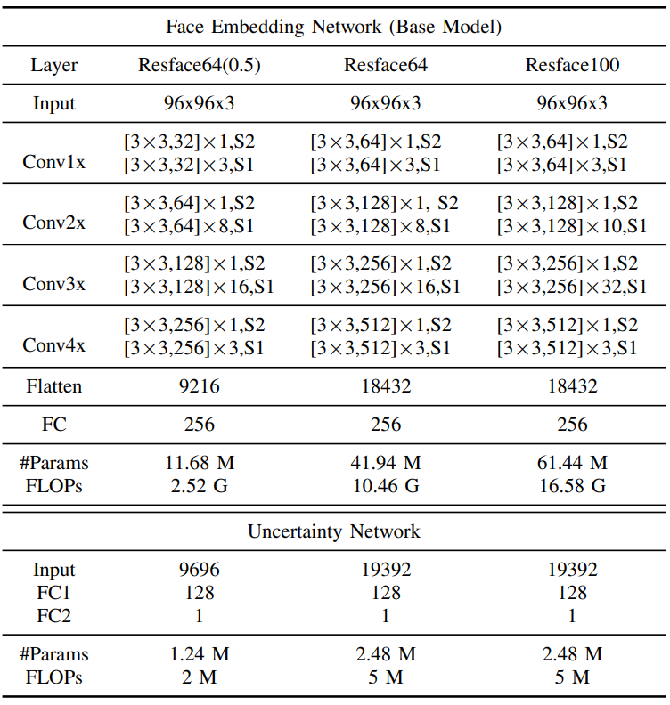
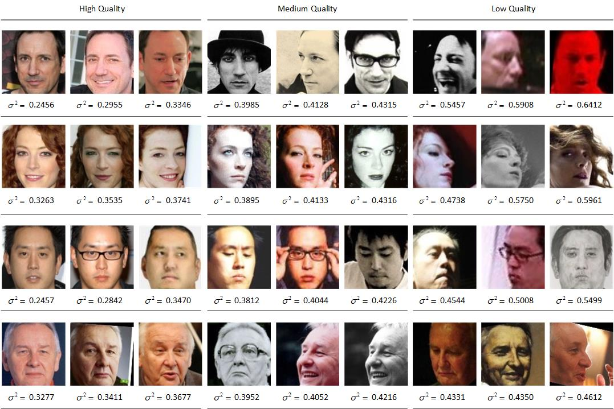

# Fast and Reliable Probabilistic Face Embeddings in the Wild
Kai Chen, Qi Lv, Taihe Yi _22 June 2021_

> Probabilistic Face Embeddings (PFE) can improve face recognition performance in unconstrained scenarios by integrating data uncertainty into the feature representation. However, existing PFE methods tend to be over-confident in estimating uncertainty and is too slow to apply to large-scale face matching. This paper proposes a regularized probabilistic face embedding method to improve the robustness and speed of PFE. Specifically, the mutual likelihood score (MLS) metric used in PFE is simplified to speedup the matching of face feature pairs. Then, an output-constraint loss is proposed to penalize the variance of the uncertainty output, which can regularize the output of the neural network. In addition, an identification preserving loss is proposed to improve the discriminative of the MLS metric, and a multi-layer feature fusion module is proposed to improve the neural network’s uncertainty estimation ability

* Offical Paper : [ArXiv](https://arxiv.org/abs/2102.04075)
* Offical CODE  : [Github](https://github.com/KaenChan/ProbFace)

# OVERVIEW

- Compared to preivous methods like [PPE](PFE.md), there are some problems like:
  - there is no constraints of the uncertainty output, which makes the output range of the uncertainty estimation too broad and easy to over-fit.
  - the mutual likelihood score (MLS) metric is used to calculate the similarity score between two probabilistic features, which increases the amount of calculation for  feature comparison

# RELATED WORK
**Probabilistic Face Embeddings and Mutual Likelihood Score**
- the probabilistic embeddings is used to improve performance and robustness in metric learning, pose estimation , prototype embeddings  and face recognition 
- face feature can be defined as a Gaussian distribution: 

$$p_D\left(\mathbf{z} \mid \mathbf{x}_i\right)=\mathcal{N}\left(\mathbf{z} ; \mu_i, \sigma_i^2 \mathbf{I}\right) \text{ (Eq.1)}$$

  - where 
    - $\mu \in R^D, \sigma \in R^D$ represent the mean and variance of the face feature are are the output of the neural network
    - $D$ is the length of face embedding
- with two face distributions i-j, mutual likelihood score can be used to measure the distance between $\mathbf{z}_i$ and $\mathbf{z}_j$, which is expressed as:

$$\begin{aligned}
S_D\left(\mathbf{x}_i, \mathbf{x}_j\right)=&-\frac{1}{2} \sum_{l=1}^D\left(\frac{\left\|\mu_i^{(l)}-\mu_j^{(l)}\right\|^2}{\sigma_i^{2(l)}+\sigma_j^{2(l)}}+\log \left(\sigma_i^{2(l)}+\sigma_j^{2(l)}\right)\right) \\
&-\text { const }
\end{aligned}$$

  - const $=\frac{\mathrm{D}}{2} \log 2 \pi$

- Only when the uncertainty of $\mathbf{z}_i \text{ and }\mathbf{z}_j$ are both small, can they get a higher score. 
- Therefore, $S_D$ is equivalent to fusing the face quality into the similarity score, which can reduce the similarity of low-quality face pairs, thus decreasing the ecognition errors caused by low-quality images.

**Disadvantages of orginal MLS**
-  each feature in PFE corresponds to a variance, leading to an increase in the size of face features storage
-   From the perspective of computational complexity, the calculation amount of SD and cosine is not much different, both are Θ(NMD), and $S_D$ has one more division and one more log operation than the cosine metric.

# PROPOSED METHODS
1. Fast Mutual Likelihood Score
- they change the output of uncertainty estimation from D dimension to 1 dimension:
  - According Eq.1,  the “likelihood” of z_i and z_j being the same person is as follows:

  $$\begin{aligned}p_1\left(\mathbf{z}_i=\mathbf{z}_j \mid \mathrm{y}_i=y_j\right)=p_1\left(\Delta \mathbf{z}_{i j}=0 \mid \mathrm{y}_i=y_j\right) \\
  =& \frac{1}{\left(2 \pi\left(\sigma_i^2+\sigma_j^2\right) / D\right)^{D / 2}} \exp \left(-\frac{D\left\|\mu_i-\mu_j\right\|^2}{2\left(\sigma_i^2+\sigma_j^2\right)}\right)
  \end{aligned}$$

    - where $y_i$ is the identification labels of _i-th_ z and _sigma_ in **R**
  - one-dimensional MLS can be obtained by the log likelihood:

  $$\begin{aligned}
  S_1\left(\mathbf{x}_i, \mathbf{x}_j\right) &=\log p_1\left(\Delta \mathbf{z}_{i j}\right) \\
  &=-\frac{D}{2}\left(\frac{\left\|\mu_i-\mu_j\right\|^2}{\sigma_i^2+\sigma_j^2}+\log \left(\sigma_i^2+\sigma_j^2\right)\right)-\text { const } \\
  &=-\frac{D}{2}\left(\frac{2-2 \cos \left(\mu_i, \mu_j\right)}{\sigma_i^2+\sigma_j^2}+\log \left(\sigma_i^2+\sigma_j^2\right)\right)-\text { const }
  \end{aligned}$$

- the fast mutual likelihood score (FastMLS) can be obtained:

$$S_f\left(\mathbf{x}_i, \mathbf{x}_j\right) \propto-\frac{2-2 \cos \left(\mu_i, \mu_j\right)}{\sigma_i^2+\sigma_j^2}-\log \left(\sigma_i^2+\sigma_j^2\right) \quad \text{ Eq.5}$$

  - In Equation (5), the cosine score is scaled and punished by the sum of the uncertainties $\sigma_i \text{ and }\sigma_j$ of two inputs, so as to achieve the purpose of uncertainty-based cosine score correction
  



- As shown in the Figure 2, to ensure that $\sigma^2$ is greater than 0 , they take:
  -  the output of the network as $s \triangleq \log \left(\sigma^2\right)$ 
  -  et uncertainty by $\sigma^2=\exp (s)$

- they can get the loss function:
  
$$L_S=\frac{1}{N_p} \sum_{i=1}^M \sum_{j=i+1}^M I_{y_i=y_j}\left(\frac{2-2 \cos \left(\mu_i, \mu_j\right)}{\sigma_i^2+\sigma_j^2}+\log \left(\sigma_i^2+\sigma_j^2\right)\right) \quad \text{ Eq.6}$$

  - where 
    - _M_ is the batch size, 
    - $I_{(\cdot)}$ is the indicator function 
    - $N_p$ is the number of pairs satisfying $y_i=y_j$ in the mini-batch.


2. Output-Constraint Loss

- this paper constrains the range of the estimated uncertainty for the uncertainty not be too far from its average. Specifically, we hope that the uncertainty/ the averaged around 1. then, they define OCLoss

$$L_C=\frac{1}{M} \sum_{i=1}^M\left|\frac{\sigma_i^2}{\sigma_{a v g}^2}-1\right|$$

- where the average of $\sigma^2$ in a mini-batch to approximate the average of all data:
  
$$\sigma_{a v g}^2=\frac{1}{M} \sum_{i=1}^M \sigma_i^2$$

- Constraining the output of neural networks is a commonly used regularization method, which has been used in many tasks


3. Identification preserving loss
- In Equation (6), only the influence of positive sample pairs on the uncertainty estimation is considered, and the influence of negative sample pairs is not considered
- Thus, they propose an _identification preserving loss function_ that uses both positive sample pairs and negative sample pairs to improve the discriminative of MLS based Triplet-loss:

$$L_{I d}=\frac{1}{|\mathcal{T}|} \sum_{(a, p, n) \in \mathcal{T}}\left[\frac{\left\|\mu_a-\mu_p\right\|^2}{\sigma_a^2+\sigma_p^2}-\frac{\left\|\mu_a-\mu_n\right\|^2}{\sigma_a^2+\sigma_n^2}+m\right]_{+}$$

4. **The total loss**:
  
$$L=L_S+\lambda_C L_C+\lambda_{I d} L_{I d}$$


5. Multi-layer Feature Fusion

- The uncertainty of a face image is influenced by many factors, including high-level semantic information (such as angle, occlusion) and low-level image details (such as blur,lighting)



- the low-level layers focus on local texture information and high-level layers can learn global semantic information. Therefore using the features of multiple layers of the network can improve the ability of uncertainty estimation
- use global average pooling (GAP) to transform feature maps of different level layers into vectors, and then concatenate them with the flattened vector of the last convolution



# CODE

* **Backbone -> mu**

```python
import tensorflow as tf
import tensorflow.contrib.slim as slim

'''
Resface20 and Resface36 proposed in sphereface and applied in Additive Margin Softmax paper
Notice:
batch norm is used in line 111. to cancel batch norm, simply commend out line 111 and use line 112
'''

def resface_block(lower_input,output_channels,scope=None):
    with tf.variable_scope(scope):
        net = slim.conv2d(lower_input, output_channels,weights_initializer=tf.truncated_normal_initializer(stddev=0.01))
        net = slim.conv2d(net, output_channels,weights_initializer=tf.truncated_normal_initializer(stddev=0.01))
        return lower_input + net

def resface_pre(lower_input,output_channels,scope=None):
    net = slim.conv2d(lower_input, output_channels, stride=2, scope=scope)
    return net

def resface64(images, keep_probability,
             phase_train=True, bottleneck_layer_size=128,
             weight_decay=0.0):
    '''
    conv name
    conv[conv_layer]_[block_index]_[block_layer_index]
    '''
    end_points = {}
    filter_list = [32, 64, 128, 256]
    with tf.variable_scope('Conv1'):
        net = resface_pre(images,filter_list[0],scope='Conv1_pre') # 1
        net = slim.repeat(net,3,resface_block,filter_list[0],scope='Conv_1') # 2*2 = 4
        end_points['Conv1'] = net
    with tf.variable_scope('Conv2'):
        net = resface_pre(net,filter_list[1],scope='Conv2_pre') # 1
        net = slim.repeat(net,8,resface_block,filter_list[1],scope='Conv_2') # 2*4 = 8
        end_points['Conv2'] = net
    with tf.variable_scope('Conv3'):
        net = resface_pre(net,filter_list[2],scope='Conv3_pre') # 1
        net = slim.repeat(net,16,resface_block,filter_list[2],scope='Conv_3') # 2*16=32
        end_points['Conv3'] = net
    with tf.variable_scope('Conv4'):
        net = resface_pre(net,filter_list[3],scope='Conv4_pre') # 1
        net = slim.repeat(net,3,resface_block,filter_list[3],scope='Conv_4') # 2*3 = 6
        end_points['Conv4'] = net

    with tf.variable_scope('Logits'):
        #net = slim.flatten(net)
        net = tf.reshape(net, [-1, net.get_shape()[1]*net.get_shape()[2]*net.get_shape()[3]])
        end_points['last_conv'] = net
        net = slim.dropout(net, keep_probability, is_training=phase_train,
                           scope='Dropout')
    conv_final = net
    mu = slim.fully_connected(net, bottleneck_layer_size, activation_fn=None,
                              scope='Bottleneck', reuse=False)
    # Output used for PFE
    mu = tf.nn.l2_normalize(mu, axis=1)

    def get_tensors(net_temp):
        net_temp = slim.avg_pool2d(net_temp, net_temp.get_shape()[1:3], padding='VALID',
                                   scope='AvgPool_1a_8x8')
        net_temp = slim.flatten(net_temp)
        return net_temp
    net1 = get_tensors(end_points['Conv1'])
    net2 = get_tensors(end_points['Conv2'])
    net3 = get_tensors(end_points['Conv3'])
    net4 = get_tensors(end_points['Conv4'])
    net = tf.concat([net, net1, net2, net3, net4], 1)
    net = slim.flatten(net)
    conv_final = net

    return mu, conv_final

# def inference(image_batch, keep_probability,
#               phase_train=True, bottleneck_layer_size=128,
#               weight_decay=0.0):
def inference(image_batch, embedding_size=256, keep_probability=1.0,
              phase_train=False, weight_decay=0.0):
    batch_norm_params = {
        'decay': 0.995,
        'epsilon': 0.001,
        'scale':True,
        'is_training': phase_train,
        'updates_collections': None,
        'variables_collections': [ tf.GraphKeys.TRAINABLE_VARIABLES ],
    }    
    with tf.variable_scope('Resface'):
        with slim.arg_scope([slim.conv2d, slim.fully_connected], 
                             weights_initializer=tf.contrib.layers.xavier_initializer(),
                             weights_regularizer=slim.l2_regularizer(weight_decay), 
                             activation_fn=tf.nn.relu,
                             normalizer_fn=slim.batch_norm,
                             #normalizer_fn=None,
                             normalizer_params=batch_norm_params):
            with slim.arg_scope([slim.conv2d], kernel_size=3):
                return resface64(images=image_batch,
                                keep_probability=keep_probability, 
                                phase_train=phase_train, 
                                bottleneck_layer_size=embedding_size)
```

* **MLS module**

```python
from __future__ import absolute_import
from __future__ import division
from __future__ import print_function

import math
import tensorflow as tf
import tensorflow.contrib.slim as slim


batch_norm_params = {
    'decay': 0.995,
    'epsilon': 0.001,
    'center': True,
    'scale': True,
    'updates_collections': None,
    'variables_collections': [ tf.GraphKeys.TRAINABLE_VARIABLES ],
}

batch_norm_params_sigma = {
    'decay': 0.995,
    'epsilon': 0.001,
    'center': False,
    'scale': False,
    'updates_collections': None,
    'variables_collections': [ tf.GraphKeys.TRAINABLE_VARIABLES ],}

def scale_and_shift(x, gamma_init=1.0, beta_init=0.0):
    num_channels = x.shape[-1].value
    with tf.variable_scope('scale_and_shift'):
        gamma = tf.get_variable('alpha', (),
                        initializer=tf.constant_initializer(gamma_init),
                        regularizer=slim.l2_regularizer(0.0),
                        dtype=tf.float32)
        beta = tf.get_variable('gamma', (),
                        initializer=tf.constant_initializer(beta_init),
                        dtype=tf.float32)
        x = gamma * x +  beta

        return x   
    

def inference(inputs, embedding_size, phase_train, 
        weight_decay=5e-4, reuse=None, scope='UncertaintyModule'):
    with slim.arg_scope([slim.fully_connected],
                        weights_regularizer=slim.l2_regularizer(weight_decay),
                        activation_fn=tf.nn.relu):
        with tf.variable_scope(scope, [inputs], reuse=reuse):
            with slim.arg_scope([slim.batch_norm, slim.dropout],
                                is_training=phase_train):
                print('UncertaintyModule input shape:', [dim.value for dim in inputs.shape])

                net = slim.flatten(inputs)

                fc1_size = 256
                net = slim.fully_connected(net, fc1_size, scope='fc1',
                    normalizer_fn=slim.batch_norm, normalizer_params=batch_norm_params, 
                    activation_fn=tf.nn.relu)

                log_sigma_sq = slim.fully_connected(net, embedding_size, scope='fc_log_sigma_sq',
                    normalizer_fn=slim.batch_norm, normalizer_params=batch_norm_params_sigma,
                    activation_fn=None)
          
                # Share the gamma and beta for all dimensions
                if embedding_size == 1:
                    log_sigma_sq = scale_and_shift(log_sigma_sq, 1e-1, -1.0)
                else:
                    log_sigma_sq = scale_and_shift(log_sigma_sq, 1e-1, -7.0)

                # Add epsilon for sigma_sq for numerical stableness                
                log_sigma_sq = tf.log(1e-6 + tf.exp(log_sigma_sq))
                # log_sigma_sq = tf.log(0.001 + tf.exp(log_sigma_sq))

    return log_sigma_sq
```