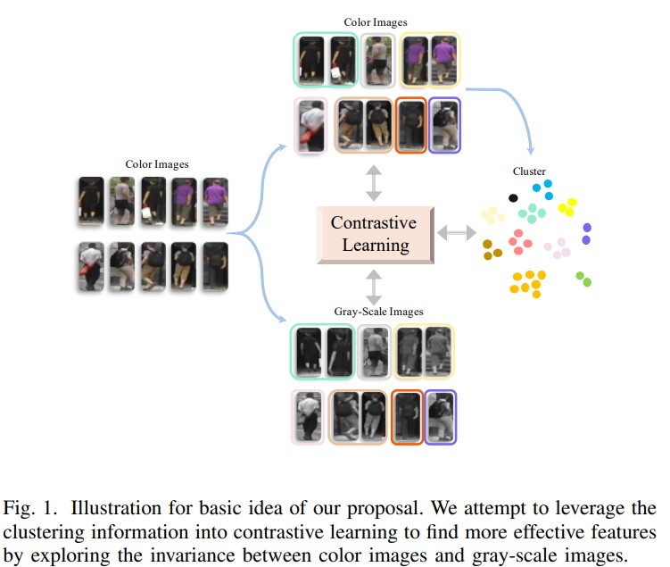
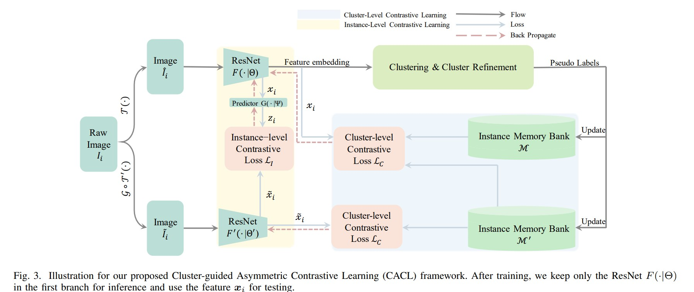
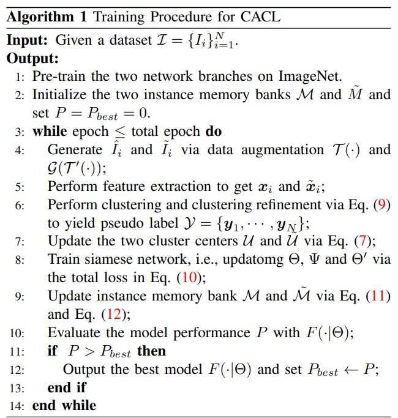

# Cluster-guided Asymmetric Contrastive Learning for Unsupervised Person Re-Identification
Mingkun Li, Chun-Guang Li, Jun Guo _9 May 2022 (this ver)_

>  Existing methods for unsupervised person Re-ID are usually built upon the pseudo labels from clustering. However, the quality of clustering depends heavily on the quality of the learned features, which are overwhelmingly dominated by the colors in images especially in the unsupervised setting. In this paper, we propose a Cluster-guided Asymmetric Contrastive Learning (CACL) approach for unsupervised person Re-ID, in which cluster structure is leveraged to guide the feature learning in a properly designed asymmetric contrastive learning framework. 

* Official paper: [IEEE](https://ieeexplore.ieee.org/document/9775582)
* Official code: [Github](https://github.com/MingkunLishigure/CACL)

# Overview

- Recently, existing methods for unsupervised person Re-ID are usually built on exploiting weak supervision information (e.g., pseudo labels) from clustering, however the performance of some methods heavily relies on the quality of the pseudo labels, which directly depends on the feature representation of the input images.
- More recently, contrastive learning is applied to perform feature learning in unsupervised setting whose idea in these methods is to learn some invariance in feature representation with self-supervised mechanism based on data augmentation
  - The existing methods for contrastive learning can be further categorized to: a) instance-level methods, b) cluster-level methods
  -  Instance-level methods regard each image as an individual class and consider two augmented views of the same image as positive pairs and treat others in the same batch (or memory bank) as negative pairs
  -  Cluster-level methods regard the samples in the same clusters as positive samples and other samples as negative samples
  -  

-   Although colors are important feature to match pedestrian images for person Re-ID ,it may also become an obstacle to learn more subtle and effective texture features that are important fine-level cues for person Re-ID
- using random color changing for data augmentation in contrastive training may damage the consistency in color distribution, not that helpful to gain generalization ability on unseen samples
-  (CACL), in which clustering information is properly incorporated into contrastive learning to learn robust and discriminant features while suppressing dominant color

# THEIR PROPOSAL: CLUSTER-GUIDED ASYMMETRIC CONTRASTIVE LEARNING (CACL)

Overall, $\mathrm{CACL}$ is a siamese network, which consists of two branches of backbone networks without sharing parameters:
   - $F(\cdot \mid \Theta)$
   - $F^{\prime}\left(\cdot \mid \Theta^{\prime}\right)$
   - a predictor layer $G(\cdot \mid \Psi)$ is added after the first branch
    - $\Psi$ denotes the parameters in the predictor layer.
   -  backbone networks are implemented _Resnet50_

- with each network, it own diffirent inputs (data augmentation,...):
  - $\hat{I}_i = \mathcal{T}(I_i)$
  - $\tilde{I}_i = \mathcal{G} (\mathcal{T}^{\prime}(I_i))$
  - where:
  
   - $\mathcal{T}(\cdot) \text{ and } \mathcal{T}^{\prime}(\cdot)$ denote two different transforms
   - $\mathcal{G}(\cdot)$ denotes the operation to transform color image into **gray-scale image**
   
  - $\mathcal{X}:= \{\boldsymbol{x}_1, \cdots, \boldsymbol{x}_N\}$ from the first network branch is used to generate the pseudo labels  and to leverage the cluster information into the contrastive learning.  the pseudo labels $\mathcal{Y}$ are used to guide the training of both network branches.
  -  use instance memory banks to store the outputs of two branches:
    -   $\mathcal{M}=\{v_i\}_{i=1}^{N}$
    -   $\tilde{M}=\{\tilde{v}_i\}_{i=1}^{N}$
    -   $v_{i}, \tilde{v}_{i} \in \mathbb{R}^{D}$
    -   Both instance memory banks  are initialized with $\mathcal{X}:=\{\boldsymbol{x}_1, \cdots, \boldsymbol{x}_N\} \text{ and } \tilde{\mathcal{X}}:= \{\tilde{\boldsymbol{x}}_1, \cdots, \tilde{\boldsymbol{x}}_N\}$

## Cluster-guided Contrastive Learning
- Firstly, pre-train the two network branches $F(\cdot \mid \Theta)$ and $F^{\prime}\left(\cdot \mid \Theta^{\prime}\right)$ on ImageNet and yield initial features for $m$ clusters in memory banks.
  - $\mathcal{C}:=\{\mathcal{C}^{(1)}, \mathcal{C}^{(2)}, \cdots, \mathcal{C}^{(m)}\} .$
  - The clustering result is used to form pseudo labels to train the cluster-guided contrastive learning module.
- To exploit the label invariance between the two augmented views and leverage the cluster structure, they employ two types of contrastive losses:
  - instance-level contrastive loss $\mathcal{L}_{I}$
   - To match the feature outputs $\boldsymbol{z}_{i} \text{ and }\ tilde{\boldsymbol{x}}_{i}$ of the two network branches at instance-level as [ref](https://arxiv.org/abs/2002.05709?context=stat.ML)
   - the negative cosine similarity of the prediction outputs $\boldsymbol{z}_{i}$ in the first branch
   - the feature output of the second branch $\tilde{\boldsymbol{x}}_{i}$ 

    $$\mathcal{L}_{I}:=-\frac{\boldsymbol{z}_{i}^{\top}}{\left\|\boldsymbol{z}_{i}\right\|_{2}} \frac{\tilde{\boldsymbol{x}}_{i}}{\left\|\tilde{\boldsymbol{x}}_{i}\right\|_{2}} \text{ (1)}$$

  - cluster-level contrastive loss $\mathcal{L}_{C}$
   - To leverage the cluster structure to further explore the hidden information from different views, it is further divided into inter-views cluster-level contrastive loss and intra-views cluster-level contrastive loss.
   - Inter-views Cluster-level contrastive loss, denoted as $\mathcal{L}_{C}^{(\text {inter })}$, which is defined as:

     $$\mathcal{L}_{C}^{(\text {inter })}:=-\frac{\boldsymbol{z}_{i}^{\top}}{\left\|\boldsymbol{z}_{i}\right\|_{2}} \frac{\tilde{\boldsymbol{u}}_{\omega\left(I_{i}\right)}}{\left\|\tilde{\boldsymbol{u}}_{\omega\left(I_{i}\right)}\right\|_{2}} \text{ (2)}$$

    - where $\omega\left(I_{i}\right)$ is:
     - to find the cluster index $\ell \text{ for }\boldsymbol{z}_{i}$
     - $\tilde{\boldsymbol{u}}_{\ell}$ is the center vector of the $\ell$-th cluster
     - the cluster center $\tilde{\boldsymbol{u}}_{\ell}$ is defined as

        $$\tilde{\boldsymbol{u}}_{\ell}=\frac{1}{\left|\mathcal{C}^{(\ell)}\right|} \sum_{I_{i} \in \mathcal{C}^{(\ell)}} \tilde{\boldsymbol{v}}_{i} \text{ (3)}$$

     - where:
      - $\tilde{\boldsymbol{v}}_{i}$ is the instance feature of image _I^i_ in the instance memory bank _M^_
      - $\mathcal{C}^{(\ell)}$ is the _l_-th cluster.
    - The inter-views cluster-level contrastive loss is used to reduce the discrepancy between the projection output _Z(i)_ of the first network branch and the cluster center $\tilde{\boldsymbol{u}}_{\ell}$ of the feature output of the second branch with the gray-scale view.
  
  - Intra-views Cluster-level contrastive loss:

     $$\begin{aligned}
      \mathcal{L}_{C}^{(i n t r a)}=&-\left(1-q_{i}\right)^{2} \ln \left(q_{i}\right) \\
      &-\left(1-\tilde{q}_{i}\right)^{2} \ln \left(\tilde{q}_{i}\right),
      \end{aligned}$$

   - $q_{i} \text{ and  }\tilde{q}_{i}$ are the softmax of the inner product of the network outputs and the corresponding instance memory bank

        $$\begin{aligned}
          q_{i} &=\frac{\exp \left(\boldsymbol{u}_{\omega\left(I_{i}\right)}^{\top} \boldsymbol{x}_{i} / \tau\right)}{\sum_{\ell=1}^{m^{\prime}} \exp \left(\boldsymbol{u}_{\ell}^{\top} \boldsymbol{x}_{i} / \tau\right)}, \\
          \tilde{q}_{i} &=\frac{\exp \left(\tilde{\boldsymbol{u}}_{\omega\left(I_{i}\right)}^{\top} \tilde{\boldsymbol{x}}_{i} / \tau\right)}{\sum_{\ell=1}^{m^{\prime}} \exp \left(\tilde{\boldsymbol{u}}_{\ell}^{\top} \tilde{\boldsymbol{x}}_{i} / \tau\right)},
         \end{aligned}$$

    - this loss is used to encourage the siamese network to learn features with respect to the corresponding cluster center for the two branches
  
     - Note that both $\boldsymbol{x}_{i} \text{ and } \tilde{\boldsymbol{x}}_{i}$ share the same pseudo labels $\omega\left(I_{i}\right)$ from clustering. 
     - cluster-level contrastive loss $\mathcal{L}_{C}$ as follows:
        
        $$\mathcal{L}_{C}:=\mathcal{L}_{C}^{(\text {inter })}+\mathcal{L}_{C}^{(\text {intra })}$$

  - The cluster-level contrastive loss $\mathcal{L}_{C}$ leverage the clustering information to minimize the difference between:
   -  the samples of the same cluster from different augmentation views via $\mathcal{L}_{C}^{(i n t e r)}$
   - within the same augmentation view via $\mathcal{L}_{C}^{(\text {intra })}$ 
   - help the siamese network to mine the hidden information brought by the basic augmented view in the first branch and the gray-scale augmented view in the second branch to prevent feature collapse to a trivial solution and impose the supervision information to learn features other than colors.

## Clustering and Cluster Refinement

- cluster-level contrast loss is greatly affected by the quality of the clustering result
>  To improve the quality of the clustering result, we propose a cluster refinement method which removes a proportion of noisy samples in larger clusters, helping the model to better learn the information at the cluster level.

- To keep the samples with higher similarity and remove the samples with lower similarity. Given a set of raw clusters, denoted as 

$$\{\mathcal{C}^{(1)}, \mathcal{C}^{(2)}, \cdots, \mathcal{C}^{(m)}\}$$

, without loss of generality. Pick $\mathcal{C}^{(i)}$ to perform cluster refinement:
  - At first we obtain an over-segmentation of $\left\{\mathcal{C}_{1}^{(i)}, \mathcal{C}_{2}^{(i)}, \cdots, \mathcal{C}_{n_{i}}^{(i)}\right\}$
  - perform cluster refinement according to:
   - Keep C if:
   
   $$D (\mathcal{C}_{j}^{(i)} \mid \mathcal{C}^{(i)} )< D(\mathcal{C}^{(i)} ) \text{ then } \mathcal{C}_{j}^{(i)}$$
  
   - $D\left(\mathcal{C}_{j}^{(i)} \mid \mathcal{C}^{(i)}\right)$ is the average inter-distance from all samples in the sub-cluster to other samples in these cluster
   - $D\left(\mathcal{C}^{(i)}\right)$ is the average intra-distance among samples in cluster $\mathcal{C}^{(i)}$.
   -  the refined clusters as 
   
   $$\mathcal{C}^{\prime}= \{\mathcal{C}^{(1)}, \mathcal{C}^{(2)}, \cdots, \mathcal{C}^{ (m^{\prime} )}\} \text{ , where } m^{\prime} \geq m$$
   
-  DBSCAN algorithm  to generate the raw clusters and to generate the over-segmentation of the clusters.  to generate the over-segmentation, we use a slightly smaller distance threshold (d=0.6)

## Training Procedure for Our CACL Approach
- In training stage, we train both network branches at the same time with the total loss: $\mathcal{L} = \mathcal{L}_I + \mathcal{L}_C$
- We update the two instance memory banks with $\alpha = 0.2$:

$$v_i^{(t)} <-- \alpha v_i^{(t-1)} + (1 - \alpha) x_i$$

$$\tilde{v}_i^{(t)} <-- \alpha \tilde{v}_i^{(t-1)} + (1 - \alpha) \tilde{v}_i$$

  - In order to save the computation cost, we also use a stopgradient operation as  mentioned in SimSiam
  - adopt the stop-gradient operation  to the second network branch when using the instance level loss LI in Eq. (1) to perform back propagation. Thus, the parameters
in the second network branch are updated only with the intra-views cluster-level contrastive loss

-  the “asymmetry” in the proposed framework for cluster-guided contrastive learning
lies in following three aspects: 
   -  asymmetry in network structure, i.e., a predictor layer is only added after the first branch
   -  asymmetry in data augmentation
   -  asymmetry in pseudo labels generation, i.e., the output features of the first branch are used to generate pseudo labels which are shared with the second branch

## Inference Procedure for CACL

- After training, we keep only the ResNet F(·|Θ) in the first branch for inference in testing
