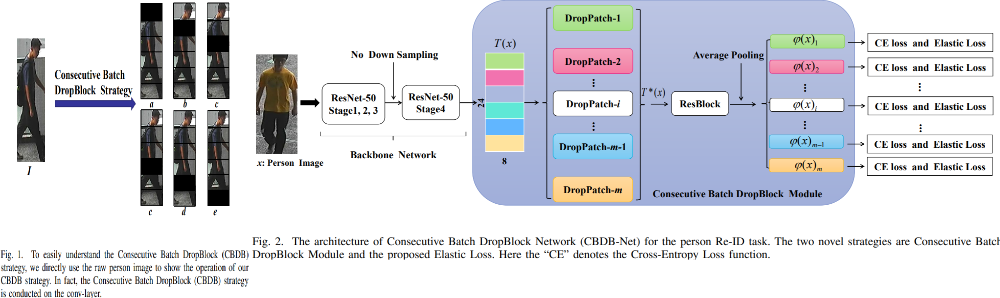
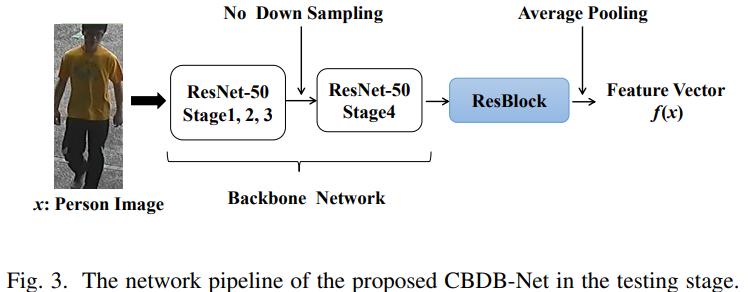
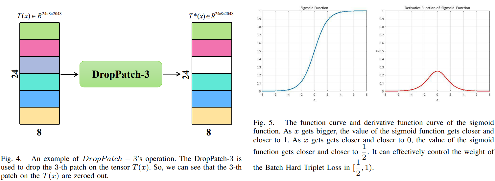
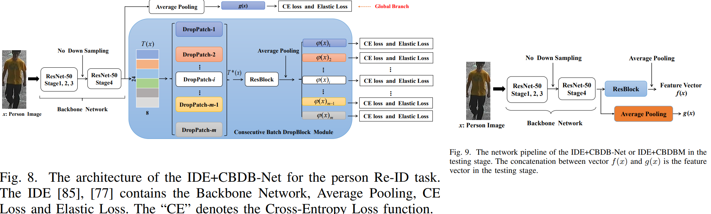

# Incomplete Descriptor Mining with Elastic Loss for Person Re-Identification
Hongchen Tan, Xiuping Liu*, Yuhao Bian, Huasheng Wang, and Baocai Yin _04 Mar 2021_

> In this paper, we propose a novel person Re-ID model, Consecutive Batch DropBlock Network (CBDB-Net), to capture the attentive and robust person descriptor for the person Re-ID task

* Official paper: [ArXiv](https://arxiv.org/pdf/2008.04010.pdf)
* Official code: [Github]()

# PROPOSED METHOD
In this section, we describe the details of the proposed Consecutive Batch DropBlock Network (CBDB-Net). The training framework is shown in Figure 2; The testing framework is shown in Figure 3.

**In the training stage** : CBDBNet contains three components: the Backbone Network, the _Consecutive Batch DropBlock Module_ (CBDBM), and the loss functions (which contain our proposed _Elastic Loss_)

- The core of the Consecutive Batch DropBlock Module (CBDBM) is the Consecutive Batch DropBlock strategy. The CBDBM outputs multiple incomplete person descriptors
-  The loss functions contain the Cross-Entropy Loss and our proposed Elastic Loss

**In the testing stage**:  the testing framework contains the Backbone Network, ResBlock, and Average Pooling Operation

1. Backbone Network

-  uses the ResNet-50 pre-trained on ImageNet
-  To get a larger size high-level feature tensor, the down-sampling operation at the beginning of the “ResNet-50 Stage 4” is not employed. Therefore, we can get
a larger feature tensor $T(x) \in \mathcal{R}^{24 \times 8 \times 2048}$

2.  Consecutive Batch DropBlock Module

(i:) As shown in Figure 2, the tensor T(x) is divided to _m_ uniform patches. 
(ii:) The DropPatch $-i, i=1,2, \cdots, m$ is designed to drop the _i-th_ patch on the tensor _T(x)_. 
- As shown in the Figure 4, the feature tensor _T(x)_ is divided to 6 uniform patches; 
- The DropPatch-3 is used to drop the _3-th_ patch on the tensor T(x). 
- We can see that the _3-th_ patch on the T(x) is zeroed out. 
- Since this, we can gain **m** incomplete feature tensors $T(x)_i^* \in \mathbb{R}^{24 \times 8 \times 2048}, i=1,2, \cdots, m$. 
(iii:) These _m_ incomplete feature tensors $T(x)_i^* \in \mathbb{R}^{24 \times 8 \times 2048}, i=$ $1,2, \cdots, m$ are fed into the "ResBlock" and average pooling operation

3.  The proposed Elastic Loss

`READ PAPER`

4. Network Architecture Overview

The overall pipeline of our CBDB-Net is illustrated in Figure 2 in the training stage.

- The Backbone Network firstly takes a person image _x_ as input, and then outputs the feature map $T(x) \in \mathbb{R}^{24 \times 8 \times 2048}$. 
- Secondly, the feature _T(x)_ is fed into Consecutive Batch DropBlock Module (CBDBM). 
- The CBDBM can output multiple incomplete feature descriptors $\varphi(x)_i \in \mathbb{R}^{512}, i=1,2, \cdots, m$. 
- Finally, the Cross-Entropy loss and the Elastic Loss are also employed at last. The whole loss functions in training stage are listed as:

$$\left.\mathcal{L}_{\text {all }}(X)=\mathcal{L}_{\text {Elastic }}(X)+\sum_{j=1}^M \sum_{i=1}^m \mathcal{L}_{C E}\left(\varphi(x)_{i j}\right)\right)$$

  - $\varphi(x)_i \in \mathbb{R}^{512}, i=1,2, \cdots, m ; \mathcal{L}_{C E}(\cdot)$ is the CrossEntropy Loss for person ID classification. 
  - The batch size _M__ in the training stage is 64 .

# IDE+CBDB-Net

> Our CBDB-Net does not contain the global feature vector from the global branch of IDE [77]. So, we introduce the global branch into the CBDB-Net, i.e. IDE+CBDB-Net.
> The training pipeline and testing pipeline of the IDE+CBDBNet are shown in Figure 8 and Figure 9 respectively. The concatenation between vector f(x) and g(x) is the feature vector in the testing stage. 
> Compared with CBDB-Net, the IDE+CBDB-Net only gains a slight improvement. It indicates that the additional global branch does not make an effective contribution to the improvement of the person Re-ID task. 

