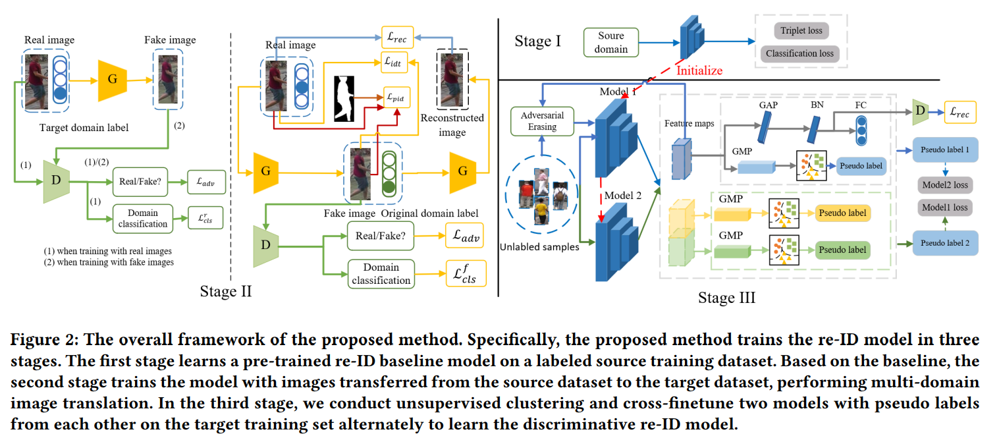
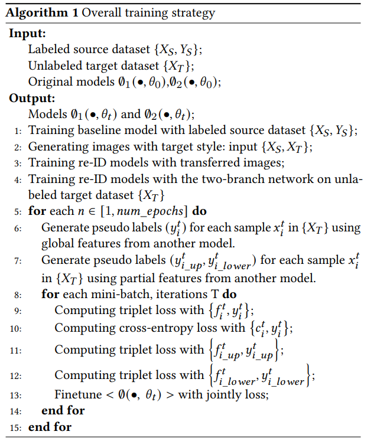

# Domain Camera Adaptation and Collaborative Multiple Feature Clustering for Unsupervised Person Re-Identification
Yuanpeng Tu*. _25 Aug 2022_

> we aim at finding better feature representations on the unseen target domain from two aspects, 1) performing unsupervised domain adaptation on the labeled source domain and 2) mining potential similarities on the unlabeled target domain. Besides, a collaborative pseudo re-labeling strategy is proposed to alleviate the influence of confirmation bias.

* Official paper: [ArXiv](https://arxiv.org/pdf/2208.08624.pdf)
* Official code: [Github]()

# OVERVIEW

In this paper, they aim at:

- finding better feature representations on the unseen target domain/dataset from two aspects: using labeled source training images and unlabeled target training images
- considering the disparities of cameras within the source and target datasets
- to mine the potential identity similarities on the target training set, a two-branch framework is proposed for similarity learning using multiple features to alleviate confirmation bias

# PROPOSED METHOD

1. Supervised pre-training
   
- To learn feature embeddings of the source domain, we train on the source dataset and denote the obtained model as **baseline**
- _label smoothing_ is used  to avoid overfitting. Specifically, the cross-entropy loss with label smoothing can be formulated as:

   $$\begin{gathered} \mathcal{L}_{\text {cross }}=-\frac{1}{n_s} \sum_{i=1}^{n_s} \sum_{k=1}^{M_S} q_i(k) \log p_i(k) \\ q_i(k)=\left\{\begin{array}{cl} 1-\varepsilon+\frac{\varepsilon}{M_S} & k=y \\ \frac{\varepsilon}{M_S} & k \neq y \end{array}\right. \end{gathered}$$

- The triplet loss is employed to enhance intra-class compactness and inter-class separability

<!--Pic-->

2. Cross Domain Camera Style Adaptation

- To leverage the knowledge of the source dataset ==> try to reduce the distribution discrepancy.  Instead of transferring the global style of images, they perform image-image translation by viewing each camera as an individual domain.
- Given a dataset X𝑆 from the source domain and a dataset X𝑇 from the target domain where the camera labels are available, our goal is to train a single generator G that learns the mappings among multiple domains.
- a given labeled image $\left(x_s^i, y_s^i\right)$ with camera label $\mathrm{c}_s^i$ is transferred to another camera style $\mathrm{c}_t$ of target domain, _while preserving the identity information during the translation._ **The generated images can then be used to train the person re-ID model**
- To learn the style mapping between source and target datasets, they employ [**StarGAN**](../../GAN/I2I/StarGAN.md) and further introduce two loss items during the image translation training procedure to improve the quality of the transferred images

- **StarGAN**
  - translate an input image **x** into an output image **y** conditioned on the target domain label $c, G(x, c) \rightarrow y$
  - to distinguish real training examples and generated samples from **G**, an auxiliary classifier is introduced to the discriminator **D** to control multiple domains
  - he discriminator produces probability distributions over both sources and domain labels:
  
      $$D: x \rightarrow \{D_{\text {src }}(x), D_{c l s}(x)\}$$
      
  - architecture details in paper.

- **Adversarial Loss**
  -  Adversarial loss is adopted to make the generated images indistinguishable from real image
  -  The generator $G$ tries to minimize the loss while the discriminator tries to maximize it:

   $$\mathcal{L}_{a d v}=E_x [\log D_{s r c}(x)]+E_{x, c} [\log (1-D_{s r c}(G(x, c)) ) \qquad \text{ (5)} $$

- **Domain Classification Loss**
    - To distinguish the domain labels of a real/fake image, an auxiliary classifier is added on top of D and cross-entropy loss is utilized to optimize both G and D
    - the domain classification loss of real images is used to optimizer D and the domain classification loss of fake images is used to optimize G:

    $$\begin{gathered}\mathcal{L}_{c l s}^r=E_{x, c^{\prime}}\left[-\log D_{c l s}\left(c^{\prime} \mid x\right)\right] \\ \mathcal{L}_{c l s}^f=E_{x, c}\left[-\log D_{c l s}(c \mid G(x, c))\right]\end{gathered}$$

     - where c′ is the original domain label of real image x

- **Reconstruction Loss**
    - To preserve the content of input images while changing only the domain-related style of images, reconstruction loss is used to formulate forward cycle consistency

    $$\mathcal{L}_{r e c}=E_{x, c, c^{\prime}}\left[\left\|x-G\left(G(x, c), c^{\prime}\right)\right\|_1\right]$$

- **Identity mapping Loss**
  - regularize the generator to be the identity matrix on samples from the target domain, [SPGAN](../../GAN/I2I/SPGAN.md) uses this loss to preserve the color composition between the input and output during translating images from the source dataset to the target dataset.

    $$\mathcal{L}_{i d t}=E_{x, c}\|G(x, c)-x\|_1$$

- **Person Identity Preserve Loss**
  - To utilize the transferred images to supervised person re-ID model training, it is important to preserve the identity of person images while changing the style of images
  -  they introduce the person identity preserve loss by evaluating the variations in the person foreground before and after person transfer. 
  -  a consistency regularization item is introduced by constraining the output of the original image and the enhanced image to be consistent, which is shown as follows

    $$\begin{array}{r}\mathcal{L}_{p i d}=E_{x, c}\|G(x, c) \odot M(x)-x \odot M(x)\|_2 \\ +E_{x, x^a, c}\left\|G(x, c) \odot M(x)-G\left(x^a, c\right) \odot M\left(x^a\right)\right\|_2 \end{array}$$

     - where $M(x)$ and $x^a$ represents the foreground mask and augmented images of $x$
     - they we use SOLO  instance segmentation algorithm to extract the foreground mask
  
- **Overall objective function** 

Stage II in Fig. 2 shows the overview of the training process of the proposed cross-domain camera style adaptation module. The objective functions to optimize G and D are written:

$$\begin{gathered}
\mathcal{L}_D=-\mathcal{L}_{a d v}+\lambda_{c l s} \mathcal{L}_{c l s}^r \\
\mathcal{L}_G=\mathcal{L}_{a d v}+\lambda_{c l s} \mathcal{L}_{c l s}^f+\lambda_{\text {rec }} \mathcal{L}_{r e c}+\lambda_{i d t} \mathcal{L}_{i d t}+\lambda_{p i d} \mathcal{L}_{p i d}
\end{gathered}$$

  - they set $\lambda_{c l s}=1, \lambda_{i d t}=1, \lambda_{r e c}=10$ and $\lambda_{\text {pid }}=10$ in experiments

# Collaborative Multiple feature clustering framework (CMFC)
As illustrated in Stage III of Fig. 2, we describe it as below:

**Two-branch re-ID model**

- the two-branch network shares the same backbone with the baseline model
- Before training on the target domain, the model is trained on the source dataset and transferred images described in Section 2, learning useful representations of person images.
- two two-branch networks are trained parallelly with the pseudo labels from each other to alleviate confirmation bias, which includes two branches: **the global feature branch** and 

**Global feature branch**

Given an unlabeled image $x_t^i$,
  - feed it into the pre-trained model for feature extraction
  - The feature map of image $x_t^i \text{ denotes as } F_t^i \in \mathbb{R}^{H \times W \times C}$ (the output of Resnet50 layer5)
  - employ the global max pooling (GMP) on the feature map to obtain feature vector $\mathrm{f}_t^i$
  - use DBSCAN algorithm to perform unsupervised clustering -> each image is assigned a pseudo label $\widetilde{y}_t^i$
  - then finetune the re-ID model with the new dataset in a supervised manner.

  - Due to the variation of cluster numbers in the training iterations:
    -  exploit the mean features of each cluster as the initial parameters, for each cluster $c$
    -  calculate the mean feature $\bar{f}_c$ by averaging all the embedding features of its elements
    -  The parameters **W** of the classifier layer are initialized as $W_c=\bar{f}_c(c=1,2,3, \ldots, C)$

  - a novel adversarial erasing based reconstruction branch:
    - the feature maps of images are used to generate activation maps
    - the coordinates with the largest value are recorded
    - Then rectangular areas of random size centered on these coordinates are generated as the erase areas
    - the erased images are fed into another decoder network for the reconstruction of the original images
    - A reconstruction loss as $\mathcal{L}_{\text {rec }}$ is used
- With this strategy, the network can mine the key information from other regions of the erased image, so that the network will not over-trust noisy labels.

**the partial feature branch**

- part-level feature learning usually achieves better performance on discriminative re-ID model learning by mining discriminative body regions
- they divide the feature maps of person images into two parts horizontally and each part. ref [PPLR review](PPLR.md) or [LF2](LF2.md)
- 

**Global max pooling operation**

- For unsupervised clustering, max pooling can produce better performance since the regions with higher response values contains more discriminative information about person images. 

**Loss function**

$$\begin{array}{r}
\mathcal{L}_{\text {all }}=\mathcal{L}_{\text {cross }}\left(p_t, \widetilde{y_t}\right)+\lambda_g \mathcal{L}_{\text {tri }}\left(f_t, \widetilde{y_t}\right) \\
+\lambda_{u p} \mathcal{L}_{\text {tri }}\left(f_{t_{-} u p}, \widetilde{y}_{t_{-} u p}\right)+\lambda_{\text {lower }} \mathcal{L}_{\text {tri }}\left(f_{t_{-} \text {lower }}, \widetilde{y}_{t_{-} \text {lower }}\right) \qquad \text{(Eq.12)}
\end{array}$$

In this paper, they use $\lambda_g=1, \lambda_{u p}=1$, and $\lambda_{\text {lower }}=0.5$ in our experiments. Since the upper body of person images usually contains more discriminative regions than the lower body.

**influence of the hyper-parameters**
- The weight of different loss items in Eq.12 is a key hyperparameter affecting the performance of feature representation learning. 𝜆𝑔, 𝜆𝑢𝑝 , and 𝜆𝑙𝑜𝑤𝑒𝑟 control the
relative importance of the whole body, upper body, and lower body similarity constraint.
- A possible explanation is that the upper body contains more discriminative information about person images than the lower body

# Overall algorithm

