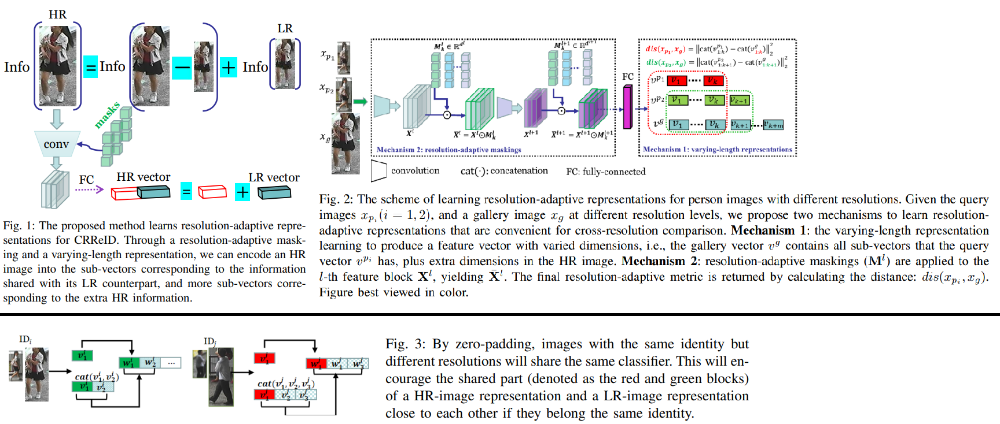
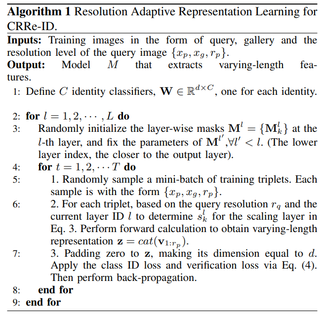

# Learning Resolution-Adaptive Representations for Cross-Resolution Person Re-Identification
Lin Wu, Lingqiao Liu, Yang Wang, Zheng Zhang, Farid Boussaid, Mohammed Bennamoun. _9 Jul 2022_

> The cross-resolution person re-identification (CRReID) problem aims to match low-resolution (LR) query identity images against high resolution (HR) gallery images. It is a challenging and practical problem since the query images often suffer from resolution degradation due to the different capturing conditions from real-world cameras.
>  To address this problem, SOTA solutions either learn the resolutioninvariant representation or adopt super-resolution (SR) module to recover the missing information from the LR query. This paper explores an alternative SR-free paradigm to directly compare HR and LR images via a dynamic metric, which is
adaptive to the resolution of a query image. We realize this idea by learning resolution-adaptive representations for crossresolution comparison

* Official paper: [ArXiv](https://arxiv.org/pdf/2207.13037.pdf)
* Official code: [Github]()

# OVERVIEW
- An important assumption made by some methods is that both the query and galley images have similar (high) resolutions. However, such an assumption may not hold in real-world scenarios, as the image resolution may vary due to the different distances between cameras and the subject of interest.

> The key idea of our  approach is to build a metric that is adaptive to the resolution of the query image

  - a query image can select the most appropriate distance metric according to its resolution to compare with the HR gallery images
  - As shown in Fig.1, we realize this idea by _learning resolution-adaptive representations_
    - The first one is a varying-length image representation with the representation length (dimensionality) determined by the resolution of the image
    -  The second mechanism further strengthens the resolution-adaptive capability by learning resolution-specific masks applied to the intermediate activations of a neural network

# PROPOSED METHOD

1. Problem Statement and Framework Overview

- We aim to learn a model that can match a low-resolution query image against the high-resolution gallery images. In practice, *the resolution could be estimated from the size (number of pixels)* of images or pedestrian bounding boxes since the height of people is relatively fixed
- Without loss of generality, we assume that the resolution could be quantized into a set of discrete levels: $\mathcal{r} \in \{1, 1/2, 1/3, 1/4 \}$ which is
the proportion of the height/width dimension

>  In our algorithm, we resize all the images, whether LR or HR, to the size of the highest resolution images via bilinear up-sampling.

-  we down-sample the HR training images to form various LR images to simulate the LR query images. The aim  is to learn a resolution-adaptive metric:

$$\text{dist}(x_p, x_g) = M(x_p, x_g, x_r)$$

   - **dist(xp, xg)** returns the distance between _a query image_ **xp** and _a gallery_ **xg**
   - An important characteristic of this model is that the resolution ratio of the query image **rp** is the input of M, and thus the metric is _resolution adaptive_

2. **Mechanism 1: Learning Varying-Length ResolutionAdaptive Representations**

> a HR image should contain all the information conveyed in the LR image, but also extra information from the higher resolution

-  when comparing a LR image with a HR image, the comparison should adhere to the information shared between them.
-  they propose to _disentangle the information_ that is **shared across resolutions** and the information that **is specific to HR into different dimensions of the feature representation**
-  In CRReID, a query image could have different resolutions, thus the above strategy will result in different representation lengths, i.e., the higher resolution of the query is, the more information that can be shared with the HR gallery images, and thus the longer dimension of the representation is

- In their implementation:
  - define _m_ sub-vectors $\left\{\mathbf{v}_k\right\}, k=$ $1, \cdots, m$, with _m_corresponding to the _m_ different levels of resolution. 
  - For images with the highest resolution, all _m_ subvectors will be concatenated as the final image representation. For the lowest resolution, only the first sub-vector will be used. 
  - Formally, the representation of a query image that corresponds to the _k-th_ level resolution, (larger k, higher resolution) where $\operatorname{cat}(\cdot)$ denotes concatenation:
   
    $$\mathbf{z}_p=\operatorname{cat}\left(\mathbf{v}_1, \cdots, \mathbf{v}_k\right)$$ 
    
    or 

    $$\mathbf{z}_p=\operatorname{cat}\left(\mathbf{v}_{1: k}\right)$$ 
  
  - For HR gallery images, their representations are the concatenations of all **m** sub-vectors, that is:
  
    $$\mathbf{z}_g=\operatorname{cat}\left(\mathbf{v}_1^g, \cdots, \mathbf{v}_m^g\right)$$
  
- the distance is calculated via

    $$\operatorname{dis}\left(x_p, x_g\right)=\left\|\mathbf{z}_p-\operatorname{cat}\left(\mathbf{v}_{1: k}^g\right)\right\|_2^2 .$$

  - the comparison is conducted by only comparing the top- $k$ sub-vectors of $\mathbf{z}_g$ when we know the query image resolution is at level- **k**.

3. **Mechanism 2: Resolution-Adaptive Masking**
To extract more resolutiondependent features, we propose a mechanism to inject the resolution information into the earlier layers of a neural network

- they build our network based on a residual network  with learnable masks:
  - one for a resolution level to the activations after each residual block
  - Each mask is a vector, with each dimension being a real value between 0 and 1
  - The mask acts as a dimension-wise scaling factor to the feature maps
  - For input images with varied resolutions, different masks will be chosen to determine the final representation and The values of Mask are parameters to be learned

$$\overline{\mathbf{X}}^l=\mathbf{X}^l \odot (\sum_k s_k^l \operatorname{Sigmoid} (\mathbf{M}_k^l))$$

where 
  -  $s_k^l=1$ if the input image is at resolution level _k_, otherwise equal 0 . 
  -  $s^l$ could be considered as an input to the network. 
  -  Sigmoid is the Sigmoid function converts the realvalued layer parameters $\mathbf{M}_k^l$ into the range between 0 and 1

4. **Varying-length Prediction on Resolution Variation**

- The rationale of the varying-length prediction on varied resolution query is to encode the image by reflecting its resolution
-  LR image is down-sampled from the same HR image, a down-sampled image share with the content with the original HR image but also contains its own characteristic
-   we train a classifier consisting of a set of sub-classifiers, such that an image at a resolution looks up the sub-classifiers to adaptively characterise its own feature

5.  Resolution-Adaptive Representation Training

- train the models with an identity classification loss (namely ID loss) and a verification loss.
- due to training set comprises HR images and multiple LR counterparts, which are created by down-sampling the HR images with varied resolution level, it lead to multiple representations when applying the resolution-adaptive mechanism ==> **apply zero-padding to the representation whose dimension is less than the maximal dimension**
- The verification loss $\mathcal{L}_{\text {verif }}$ is applied to a binary classifier that predicts whether two samples belong to the same class:
  
$$\begin{aligned}&\mathcal{L}_{\text {verif }}=-\sum_n^N y_n \log \left(p\left(y_n=1 \mid \mathbf{v}_{i j}\right)\right) \\ 
&+\left(1-y_n\right) \log \left(1-p\left(y_n=1 \mid \mathbf{v}_{i j}\right)\right) \end{aligned}$$

  - $\mathbf{v}_{i j}=\mathbf{v}_i-\mathbf{v}_j$ denotes the feature difference
  - $p\left(y_n=\right.$ $\left.1 \mid \mathbf{v}_{i j}\right)$ is implemented with a MLP, e.g., 
  - $p\left(y_n=1 \mid \mathbf{v}_{i j}\right)=$ Sigmoid $\left(f\left(\mathbf{v}_{i j}\right)\right)$ 

# Algorithm

