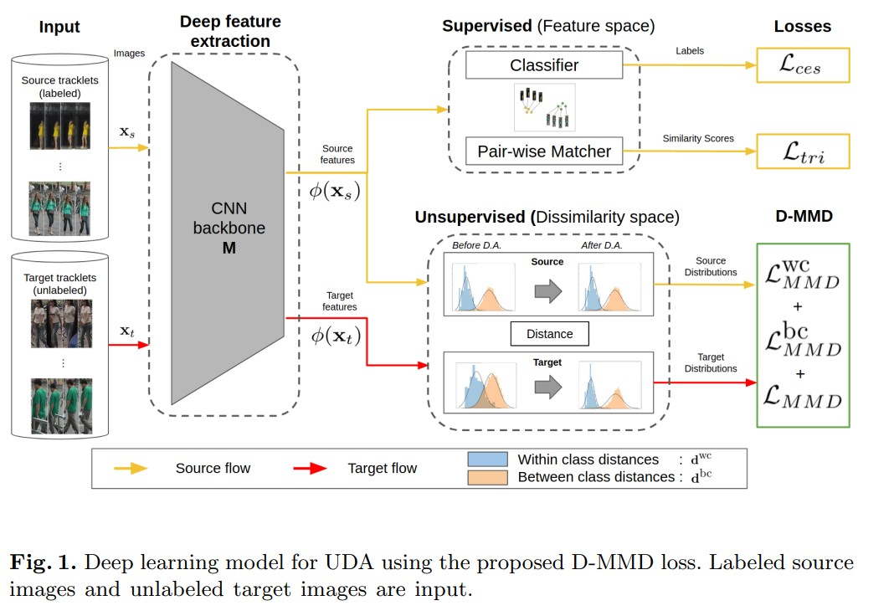
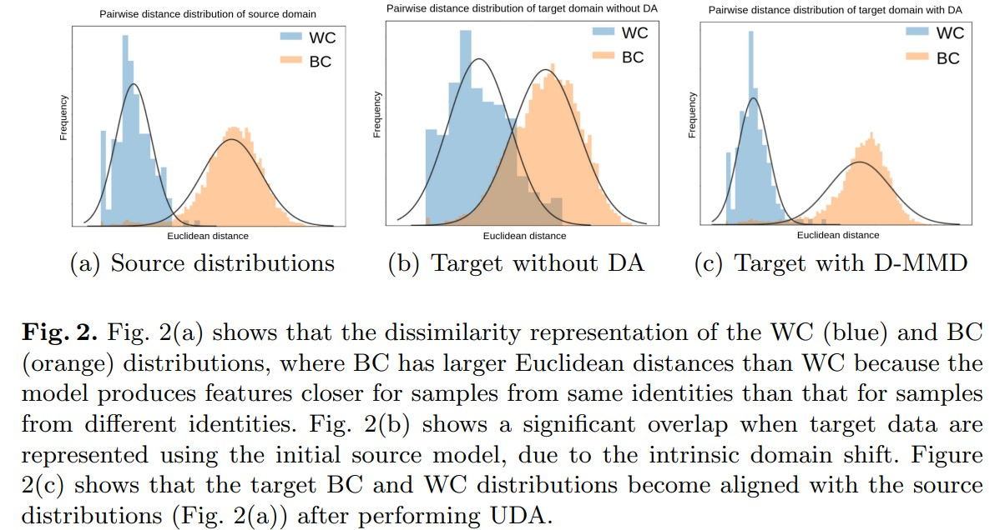
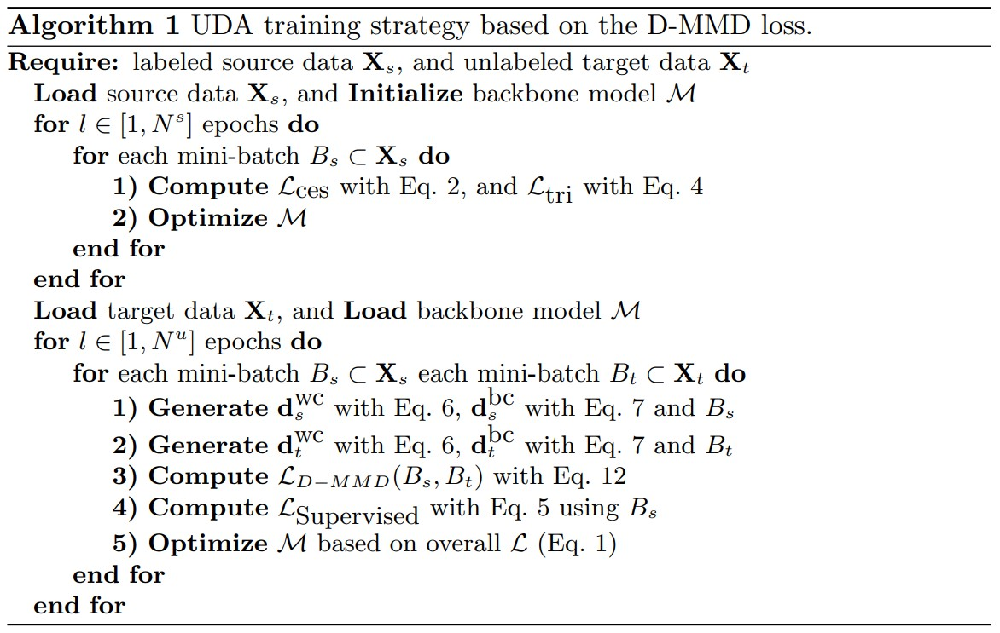

# Unsupervised Domain Adaptation in the Dissimilarity Space for Person Re-identification
Djebril Mekhazni, Amran Bhuiyan, George Ekladious, Eric Granger. _27 Jul 2020_

> We argue that for pair-wise matchers that rely on metric learning, e.g., Siamese networks for person ReID, the unsupervised domain adaptation (UDA) objective should consist in aligning pair-wise dissimilarity between domains, rather than aligning feature representations. Moreover, dissimilarity representations are more suitable for designing open-set ReID systems, where identities differ in the source and target domains. In this paper, we propose a novel Dissimilarity-based Maximum Mean Discrepancy (D-MMD) loss for aligning pair-wise distances that can be optimized via gradient descent

* Official paper: [ArXiv](https://arxiv.org/abs/2007.13890)
* Official code: [Github](https://github.com/djidje/D-MMD)

# Overview
- person ReID still remains a challenging task due to the non-rigid structure of the human body, the different perspectives with which a pedestrian can be observed, the variability of capture conditions (e.g., illumination, blur), occlusions and background clutter
-  the uncontrolled capture conditions and distributed camera viewpoints can lead to considerable intra-class variation, and to high inter-class similarity
-  The distribution of image data captured with different cameras and conditions may therefore differ considerably, a problem known in **the literature as domain shift**
> In this paper, we present a new concept for designing UDA methods that are suitable for pair-wise similarity matching in open-set person ReID scenarios.

- Instead of adapting the source model to unlabeled target samples in the feature representation space, UDA is performed in the dissimilarity representation space
-  the **dissimilarity space** consists of dissimilarity coordinates where each dimension represents the difference between two samples measured for a specific feature (i.e., a vector represents the Euclidean distance between two samples)
   -   the multiple clusters that represent different classes (i.e.,ReID identities) in the feature representation space, are tranformed to two clusters that represent the pair-wise within- and between-class distances
   -   This transformation is more suitable for open-set ReID problems, when identities differ between the source and target domains, since the new label space has only two labels – pair-wise similar or dissimilar
-   **Maximum Mean Discrepancy** (MMD) loss that is tailored for the dissimilarity representation space that exploits the structure of intra- and inter-class distributions to align the source and target data in the dissimilarity space
  
# Proposed Method
- Fig. 1 shows a DL model for UDA that relies on our D-MMD loss. For training:
  -  images $x_s \in X_s$ are sampled from the source domain 
  -  images $x_t \in X_t$ are sampled from the target domain 
  -  the CNN backbone model **M** is adapted to produce a discriminant feature representation $\phi (x_s) ; \phi (x_t)  $ for input images
  -   the _distances between input feature vectors_ allows estimating **within-class** WC or **between-class** BC distributions

- The underlying relations between source and target domain tracklets are employed to compute distributions of Euclidean distances based on:
    - samples of same identity $(\mathrm{WC}), \mathbf{d}^{\mathrm{wc}}$
    - samples of different identities $(\mathrm{BC}), \mathbf{d}^{\mathrm{bc}}$
- The D-MMD loss $\mathcal{L}_{D-M M D}$ seeks to align the distance distributions of both domains through back propagation

$$\mathcal{L}=\mathcal{L}_{\text {Supervised }}+\mathcal{L}_{D-M M D}$$

- During inference, the ReID system performs pair-wise similarity matching, so its relevant to optimize similarity space and align target similarity distribution with well-separated intra/inter-class distribution from $\mathcal{D}_{s}$

1. **Supervised Loss** - $\mathcal{L}_{\text {Supervised }}$

Combine both Softmax coss-entropy loss and triplet loss

$$\mathcal{L}_{supervised} = \mathcal{L}_{ces} + \lambda . \mathcal{L}_{triplet} $$

- The softmax cross-entropy loss Lces defines the learning process as a classification task
- The triplet loss allows to optimise an embedding where feature vectors are less similar different for inter-class images, and more similar intra-class images.

2. **Dissimilarity-based Maximum Mean Discrepancy** (D-MMD)

- Use model $\mathcal{M}$ trained to extract feature representations from:
  - source image :
  
  $$\mathbf{x}_{s} \in \mathbf{X}_{s}, \phi\left(\mathbf{x}_{s}\right)$$
  
  - target image :
  
  $$\mathbf{x}_{t} \in \mathbf{X}_{t}, \phi\left(\mathbf{x}_{t}\right)$$

- the within-class distances, e.g., Euclidean or $L_{2}$ distances, between each different pair of images $\mathbf{x}_{i}^{u} \text{ and } \mathbf{x}_{i}^{v}$ of the same class _i_ are computed:

    $$d_{i}^{\mathrm{Wc}}\left(\mathbf{x}_{i}^{u}, \mathbf{x}_{i}^{v}\right)=\left\|\phi\left(\mathbf{x}_{i}^{u}\right)-\phi\left(\mathbf{x}_{i}^{v}\right)\right\|_{2}, u \neq v$$

    where:
    - $\phi(.)$ is the backbone CNN feature extraction
    - $x_{i}^{u}$ is the image _u_ of the class _i_
-  the between-class distances are computed using each different pair of images $\mathbf{x}_{i}^{u}\text{ and }\mathbf{x}_{j}^{z}$ of the different class _i_ and _j_:
  
    $$d_{i, j}^{\mathrm{bc}}  (\mathbf{x}_i^u, \mathbf{x}_j^z) = \| \phi (\mathbf{x}_i^u )-\phi (\mathbf{x}_j^z) \|_{2}, i \neq j \text{ and } u \neq z$$

- Then, in the dissimilarity space:
  - $\mathbf{d}^{\mathrm{wc}}$  are defined as the distributions of all distance values $d_{i}^{\mathrm{wc}}$  
  - $\mathbf{d}^{\mathrm{bc}}$ are defined as the distributions of all distance values $d_{i i}^{\mathrm{bc}}$

==> Analysis:
  - The within-class (WC) and between-class (BC) distance samples of the source domain are computed directly using the source labels, so they capture the exact pair-wise distance distribution of the source domain.
  - the unlabeled target data, we leverage the tracklet information provided by a visual object tracker:
    - the frames within same tracklet as WC samples
    - frames from different tracklets as BC samples
    -  tracklet information provide us with an approximation of the pair-wise distance distribution of the target domain since it lacks intra-class pairs from different tracklets or cameras.
-  Maximum Mean Discrepancy (MMD) [ref](https://www.jmlr.org/papers/volume13/gretton12a/gretton12a.pdf) metric:
  
$$\begin{aligned}
M M D(P(A), Q(B))=\frac{1}{n^{2}} \sum_{i=1}^{n} \sum_{j=1}^{n} k\left(a_{i}, a_{j}\right) \\
&+\frac{1}{m^{2}} \sum_{i=1}^{m} \sum_{j=1}^{m} k\left(b_{i}, b_{j}\right)-\frac{2}{n m} \sum_{i=1}^{n} \sum_{j=1}^{m} k\left(a_{i}, b_{j}\right)
\end{aligned}$$

   -   **A** (resp. **B**) is the source (resp. target) domain
   -   _P(A)_ (resp. _Q(B)_) is the distribution of the source (resp. target) domain
   -   **k(., .)** is a kernel (e.g.Gaussian) 
   -   _ai_ (resp. _bi_) is sample i from A (resp. B)
   -   **n** and **m** are number of training examples from P(A) and Q(B)

- To evaluate the divergence between two domains, use:

$$\mathcal{L}_{M M D}=M M D(\mathcal{S}, \mathcal{T})$$

  $\mathcal{S}(\mathcal{T})$ is defined as the distribution of the sources (target) images
  
- So, Objective :
  - define the $\mathcal{L}_{M M D}^{\mathrm{wc}}$ loss:

       $$\mathcal{L}_{M M D}^{\mathrm{wc}}=M M D\left(\mathbf{d}_{s}^{\mathrm{wc}}, \mathbf{d}_{t}^{\mathrm{wc}}\right)$$

  - define the $\mathcal{L}_{M M D}^{\mathrm{bc}}$ loss:

       $$\mathcal{L}_{M M D}^{\mathrm{bc}}=M M D\left(\mathbf{d}_{s}^{\mathrm{bc}}, \mathbf{d}_{t}^{\mathrm{bc}}\right)$$

  - Minimizing the above terms aligns the pair-wise distance distributions of the source and target domains
  - Final unsupervised loss function:
  
    $$\mathcal{L}_{D-M M D}=\mathcal{L}_{M M D}^{\mathrm{Wc}}+\mathcal{L}_{M M D}^{\mathrm{bc}}+\mathcal{L}_{M M D}$$

  - Overview Algrithm:

    
