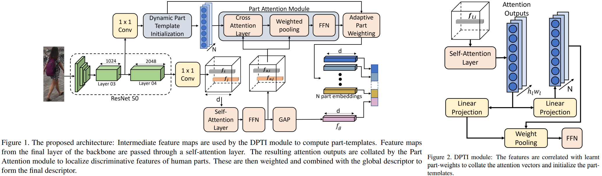

# Dynamic Template Initialization for Part-Aware Person Re-ID
Department of Electronic and Telecommunication Engineering University of Moratuwa, Sri Lanka _24 Aug 2022_

> Many of the existing Person Re-identification (Re-ID)  approaches depend on feature maps which are either partitioned to localize parts of a person or reduced to create a global representation. While part localization has shown  significant success, it uses either na¨ıve position-based partitions or static feature templates. 
> These, however, hypothesize the pre-existence of the parts in a given image or their positions, ignoring the input image-specific information which limits their usability in challenging scenarios such as Re-ID with partial occlusions and partial probe images.

* Paper: [ArXiv](https://arxiv.org/pdf/2208.11440.pdf)
* Code : [Github]()

# OVERVIEW

- Humans utilize different visual cues to Re-ID in different contexts: for quick re-identification, humans utilize vivid global features that include **the color of clothing** and **large accessories associated with the person**, sometimes people pay attention to discriminating and unique local features such as the features of a face 
  
- PDTI mechanism that learns part-based information using only the identity labels using inout image-specific features extracted from the backbone model.

# PROPOSED METHOD

##  Overall architecture

There are 4 components of significance in their architecture: feature extractor, DPTI module, part attention module and adaptive weighting module as Fig.1
  - The feature extractor used is a generic convolutional neural network (CNN)  which reduces the spatial dimensions and increases the channel dimension as the image propagates through the network
  -  The DPTI module uses the feature maps extracted from part-way through the feature extractor, such as from the last layer of the penultimate stage, which represent the mid-level semantics of local attributes of person from the input image
  -  The part templates are initialized from these feature maps using a cross-attention mechanism. The feature maps are fed through a self-attention  encoder, and then a cross-attention network with the part templates is used as the queries
  -  The global descriptor and part descriptors are concatenated to form the final person descriptor
  -  The identity predictions are made using the descriptor, using a cosine distance metric to determine similarity between descriptors

## Dynamic Part Template Initialization Module (DPTI)
- the output feature maps of the final layer of the _l-th_ stage is $F_l \in \mathcal{R}^{n_l \times h_l \times w_l}$
- Features extracted by the earlier layers of deep CNNs tend to be more generic and have lower-level semantics. Therefore, instead of using F to initialize the part templates, choose feautre maps $F_l$ 

-  To create the templates:
   -  pass $F_l$ through a 1 x 1 Conv to reduce the feature demensions to _d_ (dxhxw)
   -  then pass it through a spatial self-attention encoder to suppress background noise in the feature maps
   -  reshape $\tilde{\mathbf{F}}_l \text{ to } d \times h_l w_l$ to treat each spatial location as a separate feature vector, then we have:

    $$\tilde{\mathbf{F}}_l=\left[\boldsymbol{f}_{l, 1}, \boldsymbol{f}_{l, 2}, \ldots, \boldsymbol{f}_{l, h_l w_l}\right]$, where $\boldsymbol{f}_{l, i} \in \mathbb{R}^{d \times 1}$$

   -  the features are linearly projected to obtain the keys, queries and values as given by:

    $$\boldsymbol{q}_{l, i}=\mathbf{W}_{l, q} \boldsymbol{f}_{l, i}, \quad \mathbf{K}_l=\mathbf{W}_{l, k} \tilde{\mathbf{F}}_l, \quad \mathbf{V}_l=\mathbf{W}_{l, v} \tilde{\mathbf{F}}_l$$

      - $\mathbf{W}_{l, k}, \mathbf{W}_{l, q}, \mathbf{W}_{l, v} \in \mathbb{R}^{d \times d}$ matrices are the linear projections for the keys, queries, and values respectively.

   - The attention outputs are subsequently calculated as:

    $$\begin{aligned}\boldsymbol{\beta}_{l, i} &=\operatorname{softmax}\left(\frac{\mathbf{K}_l^T \boldsymbol{q}_{l, i}}{\sqrt{d_k}}\right), \\
    \boldsymbol{g}_{l, i} &=\mathbf{V}_l \boldsymbol{\beta}_{l, i},\end{aligned}$$

   - with **FFN** is a feed-forward netword of input and output dimensions, the final attention outputs are given as

    $$\boldsymbol{a}_{l, i}=\boldsymbol{F F N}\left(\boldsymbol{g}_{l, i}+\boldsymbol{f}_{l, i}\right)+\boldsymbol{g}_{l, i},$$

   - The matrix of attention outputs from the _l-th_ intermediate layer is denoted as $\mathbf{A}_l=$ $\left[\boldsymbol{a}_{l, 1}, \ldots, \boldsymbol{a}_{l, h_l w_l}\right]$
  
- initialize $N$ part templates for each input. The part templates are initialized by a simplified cross-attention mechanism in which the learnt keys are represented by the linear projection matrix are obtained by:

$$\begin{aligned}
\gamma_i &=\mathbf{A}_l^T \boldsymbol{q}_{t, i},  \qquad \text{ (Eq.5) }\\
\boldsymbol{t}_i &=\mathbf{W}_{t, v} \mathbf{A}_l \operatorname{softmax}\left(\boldsymbol{\gamma}_i\right), \qquad \text{ (Eq.6)}
\end{aligned}$$

  - $\boldsymbol{q}_{t, i} \in \mathbb{R}^{d \times 1}, i=1, \ldots, N$ represent the learnt partweights that serve as the queries
  - $\mathbf{W}_{t, v} \in \mathbb{R}^{d \times d}$ is the linear projection matrix for the template values

## Part Attention Module
- The Part Attention Module is required to localize and aggregate discriminative information about each part of the person identified by the templates
- To maximize discriminative power of the model, we use the feature maps from the final layer F to create the final part vectors. The obtained feature vectors are then used as the keys and values, while the part templates are used as the queries of a cross-attention encoder layer. These processes implements same part feature
- The global descriptor vector is obtained by applying global average pooling (GAP) over all outputs of the spatial encoder layer.
- Finally, all N part vectors and the global descriptor vector are concatenated to form the final descriptor vector

$$\mathbb{f} \in \mathcal{R}^{( \mathcal{N} + 1 ) d \times 1}$$

## Adaptive Part Weighting
To further strengthen robustness in the presence of occlusions, we explore adaptive weighting of the part vectors, $f_{p, i}$ before the final concatenation

- the attention weights that are computed during the template initialization phase in Eq. (5). The weight matrix A represents the correlation between the features obtained from the intermediate layer, and the part-weights.
- To leverage this information, we compute the mean of each weight vector $\gamma_i \text{ as } \bar{\gamma}_i$. 
- We apply a softmax operation over all _N_ mean weights, resulting in a part-presence vector $\boldsymbol{\rho}=\left[\rho_1, \ldots, \rho_N\right]$
- Scaling $\boldsymbol{\rho}$ by a factor of_N_, we obtain an adaptive weight for each of the parts.  Then, before concatenating the part descriptors, we scale each part descriptor by its corresponding weight, as

$$\tilde{\boldsymbol{f}}_{p, i}=N \rho_i \boldsymbol{f}_{p, i}$$
- For lower values of $\rho_i$ to have lower impact on the final distance between descriptors, we use the cosine distance metric after normalization.

## Loss Function

- We apply a weighted combination of cross-entropy loss , triplet loss Ltri, and a modified diversity loss 

$$\mathcal{L}=\alpha \mathcal{L}_{\text {class }}+\beta \mathcal{L}_{\text {tri }}+\gamma \mathcal{L}_{\text {div }}$$

-  we find that concatenating all descriptors into a single descriptor and jointly optimizing using identity classification loss and triplet loss yields superior results

- Modified Diversity Loss: 

$$\mathcal{L}_{d i v}=\frac{1}{N(N-1)} \sum_{i=1}^N \sum_{\substack{j=1 \\ j \neq i}}^N \frac{\left\langle\boldsymbol{f}_{p, i}, \boldsymbol{f}_{p, j}\right\rangle^2}{\left\|\boldsymbol{f}_{p, i}\right\|_2^2\left\|\boldsymbol{f}_{p, j}\right\|_2^2}$$

> We square each inner product to coerce the part-vectors to be orthogonal that allows the vectors to negatively correlated. Negative correlation still implies linear dependence, leading to part vectors which may not be independent.

