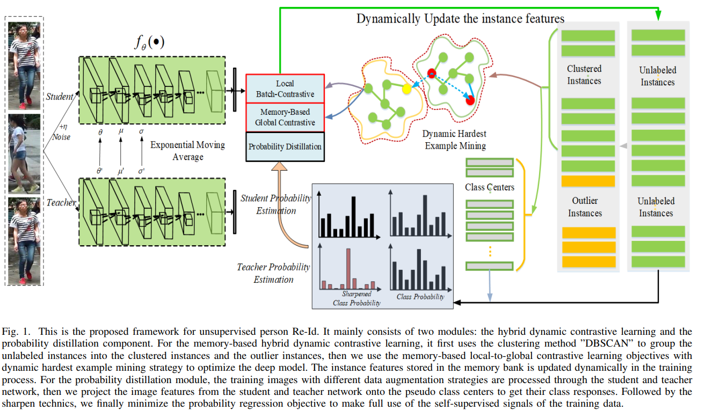
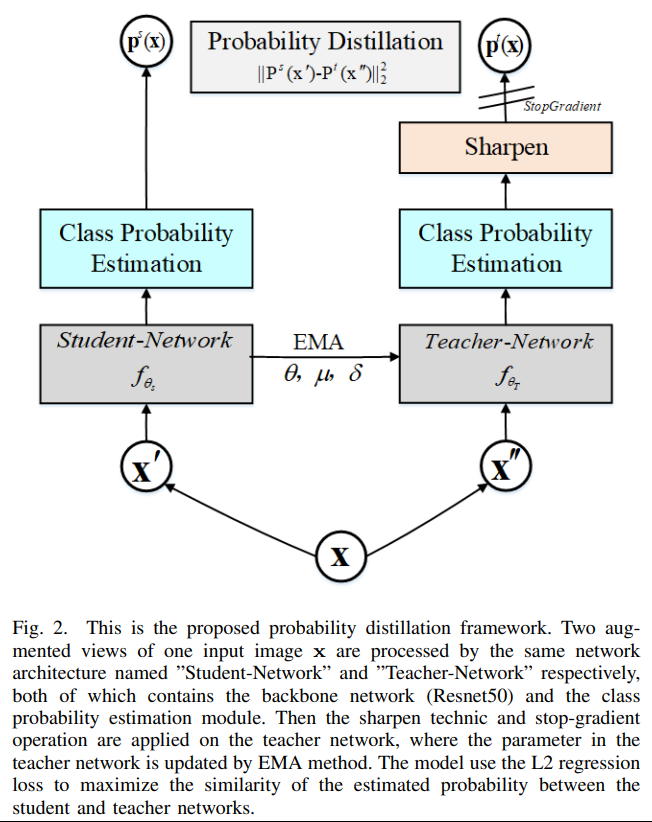

# Hybrid Dynamic Contrast and Probability Distillation for Unsupervised Person Re-Id.
De Cheng, Jingyu Zhou, Nannan Wang, Xinbo Gao. _29 Sep 2021_

>However, since person Re-Id is an open-set problem, the clustering based methods often leave out lots of outlier instances or group the instances into the wrong clusters, thus they can not make full use of the training samples as a whole. 
>To solve these problems, we present the hybrid dynamic cluster contrast and probability distillation algorithm. It formulates the unsupervised Re-Id problem into an unified local-to-global dynamic contrastive learning and selfsupervised probability distillation framework. 
* Official paper: [arXiv](https://arxiv.org/abs/2109.14157)
* Official code: [Github](https://github.com/zjy2050/HDCRL-ReID)

# Overview
> The hybrid dynamic contrastive and probability distillation framework for the purely USL and UDA person Re-Id.  We consider the selfsupervisor signals from the following two perspectives:  
> - 1) We treat the un-clustered outlier instances as independent classes and then maximize the distance between the similarity of the instance with its corresponding strong augmented instance, and the similarity of the instance with its nearest negative examples in each clusters;  
>  2) The proposed the probability distillation framework, relies on the assumption that the model should output very similar probability predictions when fed perturbed augmentation of the same image.

1. Relate works
2. HDCPD Analysis
3. Ablation Studies

# Relate works

1. **Some approachs for Deep unsupervised person Re-Id**
   These methods can be summarized into:
   -  the purely USL person Re-Id
      -   effective purely USL person Re-Id are clustering-based methods, generate hard/soft pseudo labels, and then finetune/train the deep models based on the pseudo labels. However, the noisy labels could degrade the model performances
      -   soft-label based method: measuring the similarities between the current person image with the reference clustered images
      -    Recently, some methods introduce mutual learning among two/three collaborative networks to mutually exploit the refined soft pseudo labels of the peer networks as supervision
   -  the UDA ReId:
      -   some domain translation-based methods are specially proposed, because the source domain labeled data can be used in this task
      -    some other methods exploits the valuable information across the source and target domains
  
2. **The general unsupervised or self-supervised representation learning**
> to learn the feature representations from the totally unlabeled data
the unsupervised representation learning have 3 categories:
   -  clustering pseudo-label-based methods (above)
   -  the generative models
   -   self-supervised learning (this paper) 
> Our proposed method falls into this category, but we are different with themThe proposed
method fist transform the unsupervised person Re-Id into the semi-supervised problem. then we creatively transform the instance feature into the class probability, and finally the probability regression objective is used to further improve the performances, instead of the instance feature itself

3. **Memory-based deep metric learning**
> methods present promising results on the unsupervised visual representation tasks.
> Some methods can leverage the memory bank to **measure the similarity between a sample and
the instances stored in the memory**, which helps to mine hard negative examples across batches and increase the contrastive power with more negatives, and finally better train the deep model.

# HDCPD Analysis

HDCPD mainly consists of 2 module:
   - The self-supervised framework with probability distillation;
   - The hybrid dynamic local-to-global contrastive learning. The above two modules are both optimized in the global memory bank.
and using ResNet50 as backbone, DBSCAN is choosen to clustering algorithm.

## Hybrid Local-to-Global Cluster Contrast Learning
- the primary grouped clusters usually contain examples mainly from one camera view, because the intra-class distance from different camera views of the same identity is usually larger than that of the inter-class distance from the same camera view of different identities.
>   we introduce the memory-based local-to-global cluster contrast method with hardest data mining strategy to overcome this challenge in some respects. 

- Given: 
  - Unlabel dataset **X**, using DBSCAN to group the training data into clusters $X_c$ and the unclusterd individual instances $X_o$. 
  - Assign the cluster ID to each instance as the pseudo label (unclustered as individual clusters)
  - the parameters of student network $f_{\theta}$
  - with training sample $x_i$, its feature representation vector $f_i = f_{\theta}(x_i) \quad | x_i \in \boldsymbol{X}_o \cup \boldsymbol{X}_c $

- The memory based global contrastive loss :
  
  $$\mathcal{L}_{GMemory} = -log \frac{exp<(q_i, f^+) / \tau>}{\sum_{k=1}^{N_{c}} \exp (<\mathbf{q}_{i}, \mathbf{f}_{c k^{*}}>/ \tau)+\sum_{k=1}^{N_{o}} \exp (<\mathbf{q}_{i}, \mathbf{f}_{k}>/ \tau)}$$

  where:
    - $\mathbf{q}_i$ is _i-th_ query feature in current minibatch
    - $\mathbf{f}^+$ is positive class prototype corresponding the _i-th_ query
    - $N_c \text{and} N_o$ are the number of grouped clusters and the number of unclusters individual instances respectively in MB.
  
  If the current query feature falls into the grouped clusters: 
     - $f^+$ is the hardest positive example.
     - $f_{ck*}, c \in 1, ..., N_c$ contain one hardest positive exmaple for the $q_i$s corresponding cluster.
     - The rest $N_c - 1$ hardest negative in negative clusters in MB.
     - $f_k, k \ in 1, ..., N_o$ is the unclustered instance features in MB

  If the current query feature falls into the  un-clustered individual groups: 
     - $f^+ = f_k$ as the outlier instance feature corresponding to **q** in memory bank
     - $f_{ck*}$ is the hardest negative examples in all the grouped clusters corresponding to q_i.
  

- the local batch contrastive loss is the traditional contrastive loss:

$$\mathcal{L}_{LBatch} = -\log \frac{\exp <\mathbf{q}_{i}, \mathbf{q}_{i}^{+}>/ \tau}{\exp \left(<\mathbf{q}_{i}, \mathbf{q}_{i}^{+}>/ \tau\right)+\sum_{\mathbf{q}_{j} \in B, y_{i} \neq y_{j}} \exp \left(<\mathbf{q}_{i}, \mathbf{q}_{j}>/ \tau\right)}$$

-  The hybrid local-toglobal contrastive loss with hardest data mining strategy $L_{L2G}$ : 

   $$\mathcal{L}_{L2G} = \mathcal{L}_{GMemory} + \mathcal{L}_{LBatch} $$

## The memory bank and Its updating strateg
- Store all the instances’ feature {f1,f2, ...,fN } in the memory bank

>  In the proposed algorithm, we first group all training instances into the clusteres and the unclustered individual instances, to obtain the pseudo labels of the instances with the cluster ID. . Following, we optimize thproposed learning objectives with these pseudo labels for T epoch on the training dataset, here T = 2 in our experiments. As the model parameters update, the instances’ features stored  in the memory bank would also be updated in the training  process. After every T epoch, we use the clustering method DBSCAN to generate the pseudo labels for all the training instances in the memory bank.

- In each interation, the _P x H_ extracted feature veecctors in current mini-batch are utilized to update the corresponding feature vectors stored in the memory banks as:
  
$$\mathbf{f}_{i} \leftarrow m \mathbf{f}_{i}+(1-m) \mathbf{q}_{i}$$

## Self-Supervised Probability Distillation
> our method also considers the self-supervised signals through the proposed pseudo probability distillation framework, which can also be regarded as a sort of knowledge distillation approach.

- Give input image x, the network take 2 randomly augmented _x'_ and _x''_ as input for student adn teacher, respectively.
- first, group all the training instances into the clusters and un-clustered outliers
- obtain the cluster centroid based on the grouped instances’ features  with features in the memory bank: 

$$\mathbf{c}_{k}=\frac{1}{\left|\mathcal{M}_{k}\right|} \sum_{\mathbf{f}_{i} \in \mathcal{M}_{k}} \mathbf{f}_{i}$$

where _K_ is the number of grouped clusters at present (_K_ is **changing** in the whole training procedure.)

- then compute the probability distribution of each instance belonging to the corresponding cluster centers:
  - $q_i^s \text{and} q_i^t$ is output student and teacher
  - their probbility distributions :
  
   $$\mathbf{P}_{k}^{s}\left(\mathbf{x}_{i}\right)=\frac{\exp \left(<\mathbf{q}_{i}^{s}, \mathbf{c}_{k}>/ \tau_{s}\right)}{\sum_{k=1}^{K} \exp \left(<\mathbf{q}_{i}^{s}, \mathbf{c}_{k}>/ \tau_{s}\right)}$$

- The proposed self-supervised probability distillation module works as a regularisation term between these two networks’ output probability distributions with fixed teacher network:

$$\mathcal{L}_{\mathrm{S}}=\left\|\mathbf{P}^{s}\left(\mathbf{x}_{i}\right)-\mathbf{P}^{t}\left(\mathbf{x}_{i}\right)\right\|_{2}^{2}$$

- **Note**, to update teacher network:
  - normal weight: $\mu_{t} \leftarrow \lambda \mu_{t}+(1-\lambda) \mu_{s}$ 
  - BatchNorm layer: $\text { and } \sigma_{t} \leftarrow \lambda \sigma_{t}+(1-\lambda) \sigma_{s}$

##  The Final Objective Function
the final objective function consists of the pseudo label based localto-global contrastive loss and the self-supervised probability

$$\mathcal{L}_{total} = \mathcal{L}_{(L2G)} + \gamma \mathcal{L}_S$$

# Ablation Studies

- Training hyperparameter setting:
  - batchsize >= 256
  - 16 pseudo identities and each identity has 16 different images
  - $\tau = 0.6$ for Eq. 1 and Eq.2. In Eq.6 $\tau_s = 0.1 \text{and} \tau_t=0.5$
  - Opt: Adam, lr 3.5e-4, decay_step 30, mometum 0.2, decay_rate 5e-4
  - Total epochs 70, (65 is best performance)
  - best performances at $\lambda = 0.2$
