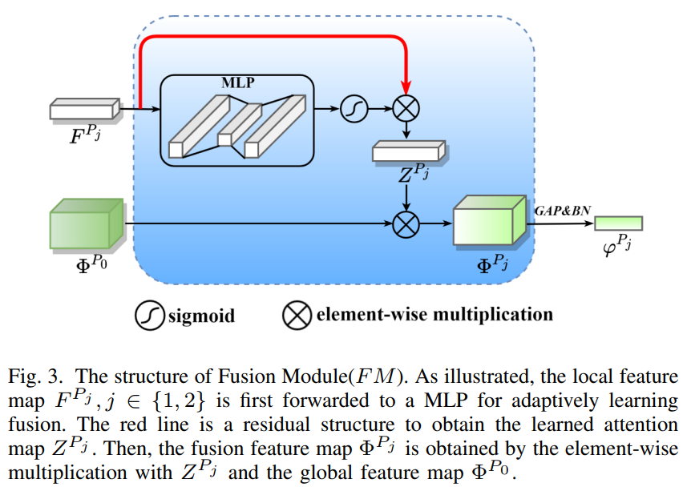
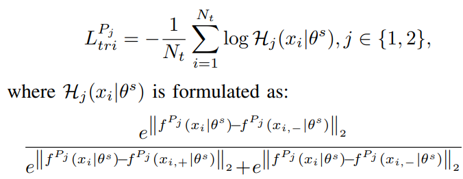
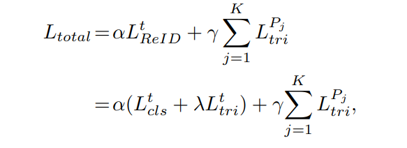

# Learning Feature Fusion for Unsupervised Domain Adaptive Person Re-identification
Jin Ding, Xue Zhou. _19 May 2022_
Unsupervised domain adaptive (UDA) person reidentification (ReID) has gained increasing attention for its effectiveness on the target domain without manual annotations.Most fine-tuning based UDA person ReID methods focus on encoding global features for pseudo labels generation, neglecting the local feature that can provide for the fine-grained information.
To handle this issue, we propose a Learning Feature Fusion ($LF^2$) framework for adaptively learning to fuse global and local features to obtain a more comprehensive fusion feature representation.
* Official paper: [arXiv](https://arxiv.org/abs/2205.09495)
* Official code: [Github](https://github.com/DJEddyking/LF2)

## Overview

1. Approach for Person ReID
2. Architecture Overview
3. Target-domain fine-tuning

## I. Approachs for Person ReID
- Problem definition
  -  the labeled source domain data   : $S  = \{ (x_i^s , y_i^s) \}_{i=1}^{N_s}$
  -  the unlabeled target domain data : $T  = \{(x_i^t)\}_{i=1}^{N_t}$
  -  with non-overlapping in identities, the goal is to retain model's performance trained on $S$ in testing on $\Tau$
   
- Approachs: Take advantages of Clustering-based methods and Mean-Teacher ideal for define psuedo labels for target domain and distillation learing.

## II. Architecture overview

- Source-domain training
Traditionally, We first train our model on the source domain data $S$ in a supervised manner. We use both Triplet Loss and Softmax Loss for calculate losses. Note that, do not use the Random Erase in this stage.
- Target-domain finetuing: In this phase, we use the pre-trained model for fine-tuning.
there are two steps: learning feature fusion and model optimization.

## III. Target-domain finetuning
To refine the noisy pseudo labels, we choose a pair of teacher-student network based on mean-teacher. Student is pretrained model in stage 1. Teacher is the exponential moving average of student models.
```python
    _update_ema_variables(self.student, self.tearcher, epoch*len(data_loader_target)+i)
    #with
    def _update_ema_variables(self, model, ema_model, alpha, global_step):
        alpha = min(1 - 1 / (global_step + 1), alpha)
        for ema_param, param in zip(ema_model.parameters(), model.parameters()):
            ema_param.data.mul_(alpha).add_(1 - alpha, param.data)
```


1. Learning feature fusion.
  - To compute the fusion features, we horizontally partition the last global feature map of the student network into K(default = 2) parts and obtain the results $F^{P_j}$ **after global average pooling** while retain the last global feature map $\Phi^{P_0}$. there are 2 reasons:
    - The teacher network gathers the learned knowledge from the student network meanwhile *maintains previous knowledge*. Thus, the global feature map of the teacher network can **focus on the overall information** of the image during the whole training
    - the student network pays attention to diverse *characteristics* in each iteration, which means that the local feature maps used for learning fusion can **avoid neglecting some important local fine-grained information**
  - The struture of Feature Fusion (FM):
  
    

      - In FM,  there is a multi-layer perceptron(MLP) to adopt $F^{P_j}$ with one hidden layer for learning fusion.
      - Overall process :
  
      

      CODE

    ```python
      class Fuse(nn.Module):
        def __init__(self):
          super(Fuse, self).__init__()
          self.maxpool=nn.AdaptiveMaxPool2d(1)
          self.avgpool=nn.AdaptiveAvgPool2d(1)
          self.bn_1 = nn.BatchNorm1d(2048)
          self.bn_2 = nn.BatchNorm1d(2048)
          self.bn_3 = nn.BatchNorm1d(2048)
        def forward(self, x, ca_upper, ca_low) :
          x_embed_upper = x*ca_upper  
          x_embed_low = x*ca_low
          x_embed_x_1 = self.maxpool(x) + self.avgpool(x)
          x_embed_x_1 = x_embed_x_1.view(x_embed_x_1.size(0), -1)
          x_embed_x_1 = self.bn_1(x_embed_x_1)
          x_embed_upper_pool = self.maxpool(x_embed_upper) + self.avgpool(x_embed_upper)
          x_embed_upper_pool = x_embed_upper_pool.view(x_embed_upper_pool.size(0), -1)
          x_embed_upper_pool = self.bn_2(x_embed_upper_pool)
          x_embed_low_pool = self.maxpool(x_embed_low) + self.avgpool(x_embed_low)
          x_embed_low_pool = x_embed_low_pool.view(x_embed_low_pool.size(0), -1)
          x_embed_low_pool = self.bn_3(x_embed_low_pool)
          return [x_embed_x_1, x_embed_upper_pool, x_embed_low_pool] 
    ```

  - Then FM ouputs will be flaten: $\Phi^{P_j}  ==> \varphi^{P_j}$ 
  - both  $\varphi^{P_j},  j \in \{1,2\}  and  \varphi^{P_0}$ are finally utilized to predict the pseudo labels by cluster algorithms.  


2. Model optimization
  - As a result of [Learning feature fusion](#iii-target-domain-finetuning), each target-domain image $x_i^t$ has K + 1 pseudo labels. 
  - The local features $f^{P_j}$, we use the pseudo labels generated 
by corresponding fusion feature $\varphi^{P_j}$ to calculate the softmax triplet loss:

  
  ```python
  class SoftTripletLoss(nn.Module):

	def __init__(self, margin=None, normalize_feature=False):
		super(SoftTripletLoss, self).__init__()
		self.margin = margin
		self.normalize_feature = normalize_feature

	def forward(self, emb1, emb2, label):
		if self.normalize_feature:
			# equal to cosine similarity
			emb1 = F.normalize(emb1)
			emb2 = F.normalize(emb2)

		mat_dist = euclidean_dist(emb1, emb1)
		assert mat_dist.size(0) == mat_dist.size(1)
		N = mat_dist.size(0)
		mat_sim = label.expand(N, N).eq(label.expand(N, N).t()).float()   

		dist_ap, dist_an, ap_idx, an_idx = _batch_hard(mat_dist, mat_sim, indice=True)
		assert dist_an.size(0)==dist_ap.size(0)
		triple_dist = torch.stack((dist_ap, dist_an), dim=1) 
		triple_dist = F.log_softmax(triple_dist, dim=1)  
		# import pdb;pdb.set_trace()
		if (self.margin is not None):
			loss = (- self.margin * triple_dist[:,0] - (1 - self.margin) * triple_dist[:,1]).mean()  
			return loss  

		mat_dist_ref = euclidean_dist(emb2, emb2)
		dist_ap_ref = torch.gather(mat_dist_ref, 1, ap_idx.view(N,1).expand(N,N))[:,0]  
		dist_an_ref = torch.gather(mat_dist_ref, 1, an_idx.view(N,1).expand(N,N))[:,0]
		triple_dist_ref = torch.stack((dist_ap_ref, dist_an_ref), dim=1)
		triple_dist_ref = F.softmax(triple_dist_ref, dim=1).detach()  

		loss = (- triple_dist_ref * triple_dist).mean(0).sum()
		return loss
  ```
  - For the global feature, the cluster result  of the global clustering feature  are considered as pseudo labels. Both classification loss and triplet loss are utilized for supervised learning.
  - Total loss for optimization as:

      

```python
     # global 
     loss_tri_1 = 0
     loss_tri_1 += self.criterion_tri(feat_list[0],feat_list[0], targets_global)
     # upper
     loss_tri_2 = 0
     loss_tri_2 += self.criterion_tri(feat_list_2[1],feat_list_2[1], targets_upper) 
     # low
     loss_tri_3 = 0
     loss_tri_3 += self.criterion_tri(feat_list_3[2],feat_list_3[2], targets_low)
     # total loss
      loss = loss_ce_1 + loss_tri_1 +  0.5*loss_tri_2 + 0.5*loss_tri_3 
```

            