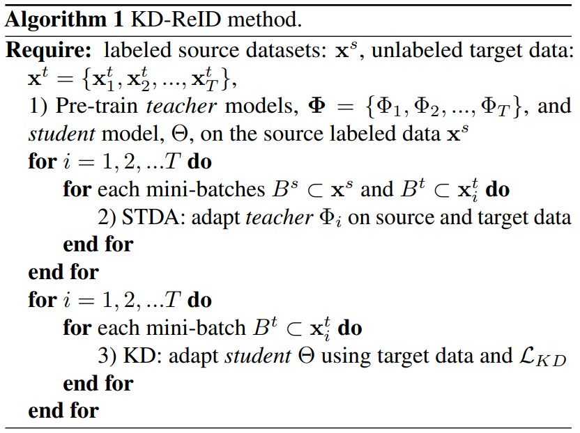

# Knowledge Distillation for Multi-Target Domain Adaptation in Real-Time Person Re-Identification
Félix Remigereau, Djebril Mekhazni, Sajjad Abdoli, Le Thanh Nguyen-Meidine, Rafael M. O. Cruz, Eric Granger. _11 Jul 2022 (v2)_

* Official paper: [ArXiv](https://arxiv.org/abs/2205.06237)
* Official code: [Github](https://github.com/fremigereau/mtda_kd_reid)

# Overview
- Popular supervised losses include cross-entropy, triplet, and contrastive losses based on positives and negatives pairs in a labeled dataset. They remain complex models, and typically require optimizing many parameters using large annotated image datasets. They also suffer from poor generalization in the presence of domain shift between source domain and target domain
- multi-target domain adaptation (MTDA) may lead to poor generalization for lightweight model

- **MTDA-KD-Reid** proposed:
  - A CNN backbone (teacher) is adapted for each target domain and  the corresponding unlabeled target dataset using an STDA method
  - the knowledge learned from all the target-specific teachers is alternatively distilled to a common lightweight CNN backbone (student)
  

# PROPOSED APPROACH

Let:
  - $\mathbf{x}^{s} \in \mathcal{X}^{s}$ be the set of samples from the source domain
  - $y^{s} \in \mathcal{Y}$ be their corresponding labels from the source domain
  - the target domains feature space $\mathcal{X}^{t}$
  - the set of samples for **T** unlabeled target domain datasets :
  
  $$\mathbf{x}^{t} = \{\mathbf{x}_{1}^{t}, \mathbf{x}_{2}^{t}, \ldots, \mathbf{x}_{T}^{t} \} \in \mathcal{X}^{t}$$
  
  - CNN backbone as $\Theta$
  - each one adapted to each target domain, as 
  
  $$\boldsymbol{\Phi}= \{\Phi_{1}, \Phi_{2}, \ldots, \Phi_{T}\}$$

As illustrated in Figure 1 (a), a straightforward MTDA method:
  - a straightforward MTDA method
  -  blending the data $x_i^t$ of all of the targets for i = 1, 2, ..., T,
  -  applying a STDA method on the resulting dataset $x^t$

**MTDA method based on KD** that is suitable for real-time reid (Figure 1 (b)):
  -  a common lightweight CNN backbone (student model) $\boldsymbol{\Theta}$
  -  distills knowledge learned by multiple specialized CNN backbones $\boldsymbol{\Phi}_i$ (teacher models) 
  -  each one adapted on data $x^i$ from a specific target domain, for i = 1, 2, ..., T
  -  three steps:
    1. **Pre-training on source data** : All the CNN backbones (teachers and student models) undergo supervised pre-training on the labeled source domain dataset
    2. **STDA of teacher CNNs**: The teacher models are adapted to their respective target domains using some single-target-domain-adaptived method with source and target datasets including the [D-MMD](DMMD.md), and [SPCL](../3.Object%20ReID/SpCL.md)
    3. **KD to student CNN**: Knowledge from every teacher model is distilled to the common student model based on target datasets and on the KD loss function
  - The KD-ReID method is summarized in Algorithm 1:

  

  $$\mathbf{F}=\left[\dot{f}_{1}, f_{2}, \ldots, f_{N}\right] \in \mathbb{R}^{D \times N}$$
  
   - above feature matrix, with   
      - $N$ is the batch size
      - $D$ is the dimension of feature vectors
    - self-similarity matrix denoted as $\mathbf{A} \in \mathbb{R}^{N \times N}$ 
      - is defined as $a_{j, k}=\left\langle f_{j}, f_{k}\right\rangle$
      - $\langle\cdot, \cdot\rangle$ is the cosine distance between the feature vectors
    - Similarity matrices $\mathbf{A}^{s} \text{ and } \mathbf{A}^{t}$ are computed based on student and teacher feature matrices
    - KD loss $\mathcal{L}_{K D}$:
      
      $$\mathcal{L}_{K D}=\left\|\mathbf{A}^{s}-\mathbf{A}^{t}\right\|_{F}$$
      
      - $\|\cdot, \cdot\|_{F}$ is the Frobenius norm matrix
      - It allows tuning $\Theta$ parameters, while $\Phi$ parameters are fixed
    - For each mini-batch $B^{t}$ from a given target domain $i$, we select only the corresponding teacher model $\Phi_{i}$
    - The order of targets for KD is selected randomly, and it changes at every epoch.

> An important benefit of the KD-ReID approach is its versatility. It is independent of the STDA methods used to adapt each teachers. The choice of CNN backbones , and its STDA methods may differ, allowing to select the best configuration to address the specific challenges (i.e., domain shift) faced by each target domain.
> Moreover, KD-ReID allows distilling knowledge to a lighter common CNN backbone making it suitable for real-time applications.

# Experiments

