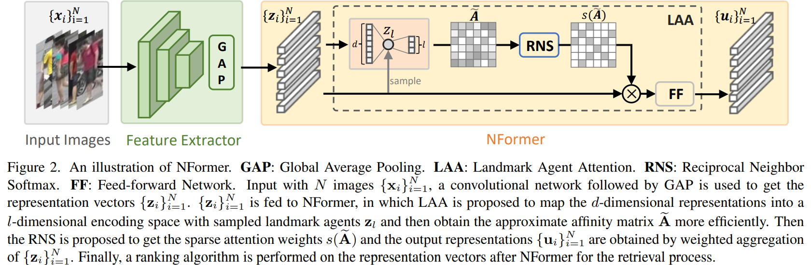
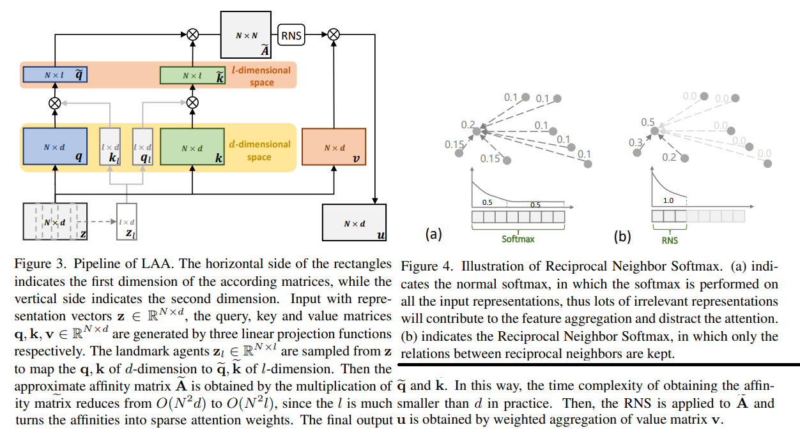

# NFormer: Robust Person Re-identification with Neighbor Transformer

Haochen Wang, Jiayi Shen, Yongtuo Liu, Yan Gao, Efstratios Gavves. _20 Apr 2022_

> we propose a Neighbor Transformer Network, or NFormer, which explicitly models interactions across all input images, thus suppressing outlier features and leading to more robust representations overall. As modelling interactions between enormous amount of images is a massive task with lots of distractors, NFormer introduces two novel modules, the Landmark Agent Attention, and the Reciprocal Neighbor Softmax. Specifically, the Landmark Agent Attention efficiently models the relation map between images by a low-rank factorization with a few landmarks in feature space. Moreover, the Reciprocal Neighbor Softmax achieves sparse attention to relevant -- rather than all -- neighbors only, which alleviates interference of irrelevant representations and further relieves the computational burden

* Official paper: [ArXiv](https://arxiv.org/abs/2204.09331)
* Official code: [Github](https://github.com/haochenheheda/NFormer)

# OVERVIEW
- They argue that encouraging lower representation variations per identity is crucial during both training and test among all the input images.
-  NFormer computes an **affinity matrix** representing the relations between the individual representations and then conducts the representation aggregation process according to the affinity matrix. 
-  They also propose a Landmark Agent Attention module (LAA) that reduces the computations in the affinity matrix by the introduction of a handful of landmark agents in the representation space
-  introduce the Reciprocal Neighbor Softmax function (RNS) to achieve sparse attention attending to computationally manageable neighbors only. 

# PROPOSED METHOD

1. Problem Setting
    - training set $T = set(x_i, y_i)_{i=1}^N$
    - model $z_i=f(x_i)$ computes discriminative feature representations
    -  a query set U and  a gallery set G

2. Learning NFormer

   - f(·) is computed on single input images, thus ignoring any possible relations that may arise between the representations of the same individual across cameras and scenarios
   -  To explicitly account for such relations, they propose a function to get the aggregated representation vector **u_i*:

        $$\mathbf{u}_i=g (\mathbf{z}_i, \{\mathbf{z}_j \}_{j=1}^N ) = \sum_j \mathbf{w}_{i j} \mathbf{z}_j \qquad \text{  (Eq.1) }$$

        - where $\{z_j\}_{j=1}^N$ contains the representation vectors obtained by the _f(.)_ of all input images
        - during training, $\{x_i\}_{i=1}^N$ is a large batch sampleed from training set.
        - **W** is learnable weight between **z_i** and **z_j** where $\sum_j w_{ij} = 1$
    - With a [Transformer](https://arxiv.org/abs/1706.03762) formulation, we have equation (1) reformed by:

        $$\mathbf{u}_i=\sum_j s(\mathbf{A})_{i j} \varphi_v\left(\mathbf{z}_j\right) \qquad \text{ (Eq.2)}$$

        - $\mathbf{A} \in \mathbb{R}^{N \times N}$ is an affinity matrix that contains the similarities between any two pairs of input 
        - $s(\cdot)$ is a softmax function to turn the affinities into weights
        - $\varphi_v(\cdot)$ is a linear projection function
    -  For the affinity matrix $\mathbf{A}$, we have

        $$\mathbf{A}_{i j}=K\left(\varphi_q\left(\mathbf{z}_i\right), \varphi_k\left(\mathbf{z}_j\right)\right) / \sqrt{d}=\mathbf{q}_i^{\top} \mathbf{k}_j / \sqrt{d} \qquad \text{ (Eq.3)}$$

        - $\varphi_q(\cdot), \varphi_k(\cdot)$ are two linear projections which map the input representation vector to query and key matrices **q,k**
        - **d** is the dimension of the representation vectors
    - The $K(\cdot, \cdot)$ is typically the inner product function:
    
        $$\mathbf{u}_i=g (\mathbf{z}_i, \{\mathbf{z}_j \}_{j=1}^N)=\sum_j \mathbf{w}_{i j} \mathbf{z}_j$$

    - in theory, computing the affinity matrix A in equation (3) has quadratic $O ( N^2 d)$ complexity with respect to the number of images N

3. Landmark Agent Attention

> Instead of measuring the similarity between highdimensional representation vectors, we propose a more efficient way to obtain an approximate affinity matrix A

- The key idea is to map the high-dimensional representation vectors z into a lower-dimensional encoding space as inspired by **random Fourier features**

-  in figure 3, following Transformer, the query, key and value matrices **q,k,v** are obtained by three separate linear projections $\varphi_q(.), \varphi_k(.), \varphi_v(.)$ using representation vectors **z** as input
-  Specifically:
   -  randomly sample l representations $\textbf{z}_l \in \mathcal{R}^{l \times d}$ from **z** as landmark agents
   -  then, obtain $q_l \text{ and } k_l$ martrices
   -  map the orginal query and key matrices $q,k \in \mathcal{R}^{N \times d}$ to a _l-dimentional space_
   
        $\widetilde{\mathbf{q}}=\mathbf{q} \mathbf{k}_l^{\top}, \widetilde{\mathbf{k}}=\mathbf{k q}_l^{\top}$
   
   -  with:
  
        $$\widetilde{\mathbf{q}}, \widetilde{\mathbf{k}} \in R^{N \times l} . \widetilde{\mathbf{q}}_{i j}, \widetilde{\mathbf{k}}_{i j}$$ 
        
        indicate the similarity between representation vector i..N landmark agent j in (1..l)
        
   -  Thus, the multiplication complexity for obtaining the affinity matrix is significantly reduced from O(N2d) to O(N2l), since l is typically much smaller than d (l = 5, d ≥ 256 in paper).
   -  with a small number of landmark agents, the NFormer is able to perform stably.

4. Reciprocal Neighbor Softmax

- After obtaining the approximate affinity matrix $\tilde{A}$, a softmax function s is typically used in equation (2)
- rewrite equation (2) as a sum of two parts:

    $$\mathbf{u}_i=$ $\sum_{j: \widetilde{\mathbf{A}}_{i j} \leq \rho} s(\widetilde{\mathbf{A}})_{i j} \varphi_v\left(\mathbf{z}_j\right)+\sum_{j: \widetilde{\mathbf{A}}_{i j}>\rho} s(\widetilde{\mathbf{A}})_{i j} \varphi_v\left(\mathbf{z}_j\right)$$

    - $\rho$ is a small threshold
    - The first part represents the sum of elements with small attention weights 
    - the second part represents the sum of elements with large attention weights
    - Although each of the attention weights in 
        
        $$\sum_{j: \widetilde{\mathbf{A}}_{i j} \leq \rho} s(\widetilde{\mathbf{A}})_{i j} \varphi_v\left(\mathbf{z}_j\right)$$ 
        
        is small, with a growing number of samples _N_ the total summation will still be large and comparable to the second term in the summation, as shown in figure 4 (a)
        
    - the final computation of $\mathbf{u}_i$ will be negatively impacted by the significant presence of irrelevant samples.

- Reciprocal Neighbor Softmax (RNS) to enforce sparsity to few relevant attention weights with a reciprocal neighbor mask. 
  - assume that if two images are reciprocal neighbors with each other in feature space, they are likely to be relevant
  - o compute a top-k neighbor mask $M^k$ from the approximate affinity map

    $$M_{ij}^k = 1 if j \in top-K else 0$$

  - we can obtain a reciprocal neighbor mask M by multiplying $M^k$ with its transposition using Hadamard Product.

    $$\begin{aligned}\mathbf{M}_{i j} &=\mathbf{M}^k \circ \mathbf{M}^{k \top} \\
    &= \begin{cases}1, & j \in \operatorname{topk}\left(\tilde{\mathbf{A}}_{i,:}\right), i \in \operatorname{topk}\left(\widetilde{\mathbf{A}}_{:, j}\right) \\
    0, & \text { otherwise. }\end{cases}\end{aligned}$$

  - adding this mask M to the regular softmax function, we achieve sparse attention only occurring in neighbors
  
    $$\operatorname{RNS}(\mathbf{A})_{i j}=\frac{\mathbf{M}_{i j} \exp \left(-\widetilde{\mathbf{A}}_{i j}\right)}{\sum_k \mathbf{M}_{i k} \exp \left(-\widetilde{\mathbf{A}}_{i k}\right)}$$

  - Since most attention values are set to zero, as shown in figure 4 (b), the relations are constrained to the relevant neighbors, making the aggregation in equation (2) more focused and robust.

