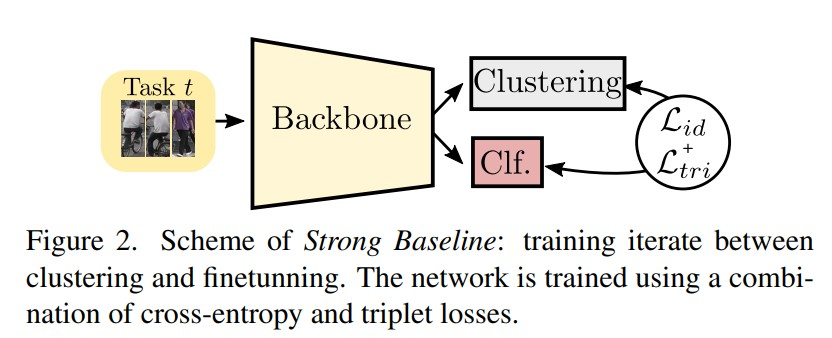

# Online Unsupervised Domain Adaptation for Person Re-identification
Hamza Rami, Matthieu Ospici, Stéphane Lathuilière. _9 May 2022_

> Most of the recent papers that address this problem adopt an offline training setting which is done assuming that we have access to the complete training target domain data set. In this paper, we argue that the target domain generally consists of a stream of data in a practical real-world application, where data is continuously increasing from the different network's cameras. 

* Official paper: [ArXiv](https://arxiv.org/abs/2205.04383)

# Overview
To match practical scenarios, an unsupervised domain adaptation method for Person Re-ID should respect two main constraints:
 - 1) Online adaptation: the target domain data is not accessible all at once, but in a stream fashion where only small batches of images are available at a given instant of time and 
 - 2) Privacy protection: Images captured by the different cameras can be used to update the Re-ID model and stored for only a limited period of time

Plan:
1.  Related Work
2.  Online Setting for UDA for Person Re-ID
3.  Others Analyses

# I. Related Work

**Unsupervised domain adaptation (UDA) for person Reidentification**
    - Domain translation-based methods: to modify the source images to obtain images with the content of the source domain but the appearance of the target as based on CycleGAN,... 
    - Pseudo-labeling methods called clustering-based
methods as [PPLR](PPLR.md), [P2LR](P2LR.md), [LF2](LF2.md)
    -   Lifelong Learning for person Re-Identification is a field that aims at mitigating the catastrophic forgetting problem, which means that the model tends to forget previous knowledge acquired during previous tasks when learning new ones. 3 main catgories:
        -   teacherstudent frameworks
        -   the regularization of the parameters update when new tasks arrive
        -    replay methods that consist in using stored images or an image generation model to feed old-task images along with the current task images into the learning network 

# II. Online Setting for UDA for Person Re-ID

1. Problem Definition

   - **Initiation**:
     - Source domain $D_s = \{(x_i^S, y_i^S) \|_{i=1}^{N_s} \}$
     - Target domain $D_t = \{(x_i_t) \|_{i=1}^{N_t} \}$ ,  is accessible as an online stream of data. target batch will be called task $T_i \quad \text{composed of N images} \quad \{x_i^t, i = 1..N\}$.
     - assume that there is no identity overlap between tasks even if our approach does not strictly require it. 
     - the images of the task $\mathbf{T}_t$ cannot be used for the next tasks
     - In addition to the source domain that is accessible at any time
     - only the parameters of the networks can be kept in memory in between two tasks(training source and target)
     - **the goal** is to deploy the trained model on an unknown target dataset that follows the same distribution as the training target tasks but does not share identities with the training tasks
  
   

2. Strong Baseline
   The Strong Baseline is a simple pseudo labeling pipeline:
   - A feature extractor network, which is pre-trained on the source labeled domain data set, _F_ is used to extract image features for every target domain image
   - Then a standard clustering algorithm is applied to the extracted target domain features to obtain **K** clusters
  
    

   - F is then finetuned on the target samples using their cluster labels as pseudo-labels. 
  
    **Adaptation to OUDA.**
    - instead of using the whole target dataset in the clustering step, we use only the data of the current task. 
    - The two steps are applied iteratively for several epochs.

3. MMT
   
   -  MMT employs two networks F1 and F2
   -  mean teacher networks M1 and M2 coresponding F1 and F2
   -  The losses between $F_{1}$ and $M_{2}$ are:
  
    $$\begin{aligned}&\mathcal{L}_{\text {sid }}=-M_{2}\left(x_{i}\right) \cdot \log C_{1}\left(F_{1}\left(x_{i}\right)\right) \\&\mathcal{L}_{\text {stri }}=-\mathcal{L}_{b c e}\left(\tau_{1}^{F}\left(x_{i}\right), \tau_{2}^{M}\left(x_{i}\right)\right),\end{aligned}$$

    where:
       -   $\mathcal{L}_{\text {bce }}$ denotes the binary cross entropy 
       -   $\tau_{1}^{F} \quad \text{and} \quad \tau_{2}^{M}$ are given by:
    $$\tau_{1}^{F}\left(x_{i}\right)=\frac{e^{\left\|F_{1}\left(x_{i}\right)-F_{1}\left(x_{i}^{-}\right)\right\|}}{e^{\left\|F_{1}\left(x_{i}\right)-F_{1}\left(x_{i}^{+}\right)\right\|}+e^{\left\|F_{1}\left(x_{i}\right)-F_{1}\left(x_{i}^{-}\right)\right\|}}$$

    $$\tau_{2}^{M}\left(x_{i}\right)=\frac{e^{\left\|M_{2}\left(x_{i}\right)-M_{2}\left(x_{i}^{-}\right)\right\|}}{e^{\left\|M_{2}\left(x_{i}\right)-M_{2}\left(x_{i}^{+}\right)\right\|}+e^{\left\|M_{2}\left(x_{i}\right)-M_{2}\left(x_{i}^{-}\right)\right\|}}$$

Note that to encourage the two networks to learn different image representations, different random data transformation policies are used for each network pairs $\left(F_{1}, M_{1}\right)$ and $\left(F_{2}, M_{2}\right)$.

**Adaptation to OUDA.** at the end of each task, the parameters of the four networks are kept and reused for the next task. 

   
1. SpCL

Finally, we consider the SpCL method proposed in [here](SpCL.md).

This framework employs a hybrid memory that stores and continually updates three types of feature vectors:      
- the class centroids for every class of the sourcedomain
- cluster centroids for every cluster from the target domain
- the image feature corresponding to the
target-domain samples that are not assigned to any cluster and that are considered as outliers. This memory provides supervision to the feature extractor via a contrastive loss over the three types of features in the memory.

**Adaptation to OUDA.**
- do not use any of the source data when adapting to the target domain
- the memory is emptied, and clustering is performed at the beginning of each task

# III. Others Analyses