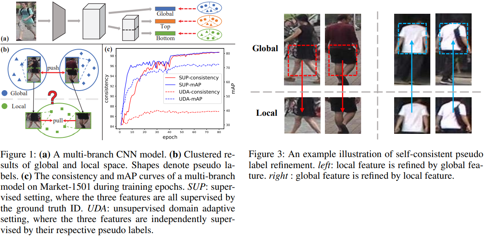
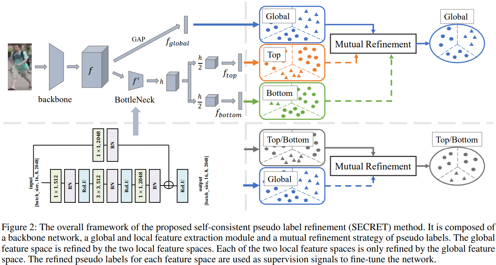
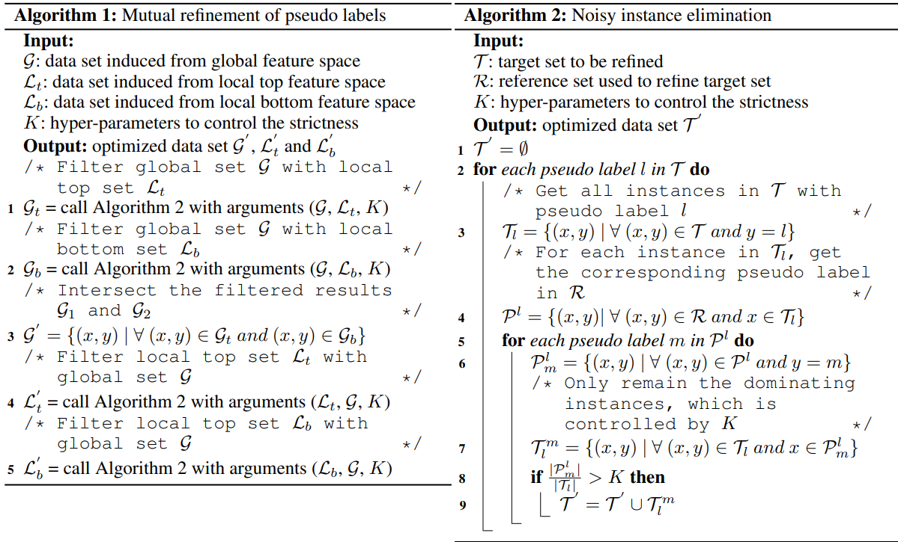
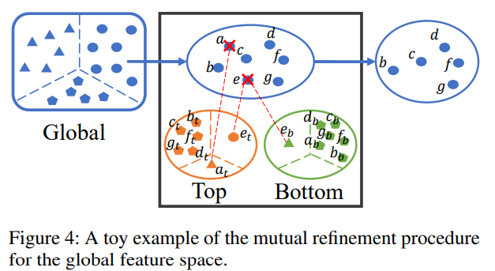

# SECRET: Self-Consistent Pseudo Label Refinement for Unsupervised Domain  Adaptive Person Re-Identification
Tao He, Leqi Shen, Zhenhua Guo, Yuchen Guo, Guiguang Ding _2022-06-28_

* Official paper: [AAAI](https://ojs.aaai.org/index.php/AAAI/article/view/19970)
* Official code: [Github](https://github.com/LunarShen/SECRET)

# OVERVIEW
- Despite the fact that the pseudo-label-based methods have obtained promising performance, the key issue: **the quality of the pseudo labels**
- Multi-branch is a popular pseudo-label-based method  which can explore global and local feature spaces simultaneously (Fig1.a)

- However, in the unsupervised setting, there is no ground truth label to supervise each feature space. So simply ignoring the consistency and supervising each feature space by its own pseudo labels will lead to the limited performance.(Fig1-b,c)
> Motivated by the importance of consistency, we propose to improve the quality of pseudo labels by keeping consistency of different feature spaces in the UDA person Re-ID task. 

# PROPOSED METHOD

## Network Architecture
The structure and detailed parameters are shown in the bottom left of Figure 2:
  - the feature map obtained from backbone is _f_ after GAP :  the global feature $f_\text{global}$
  - add a lightweight bottleneck on top of the feature map _f_ to produce _f'_  then horizontally split it to 2 part: the part feature $f_\text{top} - f_\text{bottom}$
into two parts

## Mutual Refinement of Pseudo Labels
> The most important part of the proposed SECRET is the mutual refinement of pseudo labels.

- It is executed after independent clustering on global features and two local features in each training epoch. 
- Then the refined pseudo labels for each branch will be used to fine-tune the whole network.
- the motivation of refining pseudo labels by different feature spaces
- As shown in the left of Figure 3, only clustering on local features of the bottom part cannot easily distinguish between persons wearing skirt and shorts, but with the help of global features, their differences are amplified.

- The core idea of the mutual refinement procedure is to only remain the instances together with their pseudo labels that are in agreement with other feature spaces. Alg1&2
  - For global feature space, we first refine its pseudo labels by local top and local bottom features individually, and then use the intersection of these two as the results.
  -  For each local feature space, only the global feature refines it
  -  The hyper-parameter K controls the degree of agreement between two feature spaces

## Loss Function
**Source Domain** :  For each of the feature in $\left(f_g, f_{\text {top }}, f_{\text {bottom }}\right)$, we simultaneously apply both cross-entropy loss and triplet loss

**Target Domain.** $N^t$ unlabeled instances in target domain, the feature set for all instances is as follows:  $\qquad \mathcal{F} = $ 

$$\mathcal{F}_g= \{f_g^1, \ldots, f_g^{N^t} \}$$

$$\mathcal{F}_{\text {top }} = \{f_{\text {top }}^1, \ldots, f_{\text {top }}^{N^t} \} $$

$$\mathcal{F}_{\text {bottom }} = \{f_{\text {bottom }}^1, \ldots, f_{\text {bottom }}^{N^t} \}$$

- At _T-th_ epoch, after first running DBSCAN algorithm independently on 

$$\mathcal{F}_g, \mathcal{F}_{\text {top }} \text{ and } \mathcal{F}_{b o t t o m}$$

   and then conducting mutual refinement of pseudo labels

$$X^t= \{x_i^t: (y_{\text {global }}^i, y_{  {top }}^i, y_{\text {bottom }}^i ; 1 \leq i \leq N_T^t ) \}$$

- Note that $N_T^t < N^t$ , as noisy instances that found by clustering algorithm and the refinement procedure, are discarded from the fine-tuning data set.
