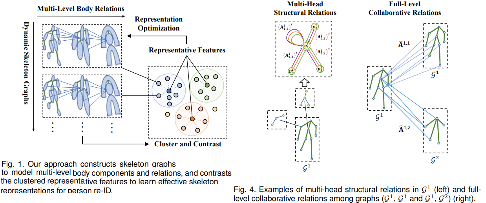
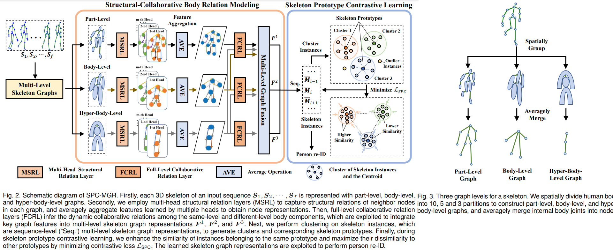
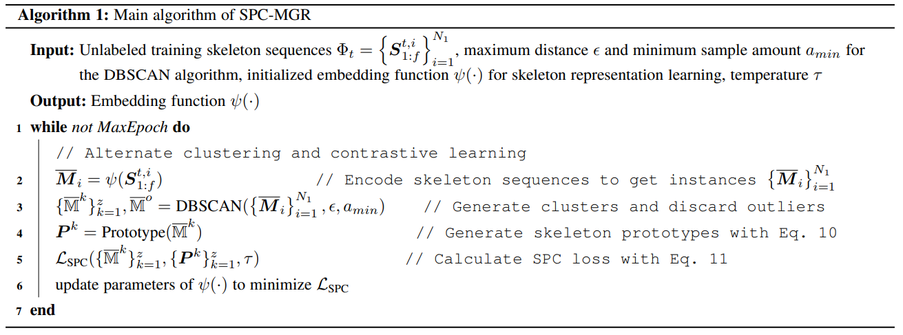

# Skeleton Prototype Contrastive Learning with Multi-Level Graph Relation Modeling for Unsupervised Person Re-Identification
Haocong Rao, Chunyan Miao. _25 Aug 2022_

>This paper proposes a generic unsupervised Skeleton Prototype Contrastive learning paradigm with Multi-level Graph Relation learning (SPC-MGR) to learn effective representations from unlabeled skeletons to perform person re-ID. 
>Specifically, we first construct unified multi-level skeleton graphs to fully model body structure within skeletons. Then we propose a multi-head structural relation layer to comprehensively capture relations of physically-connected body-component nodes in graphs. A full-level collaborative relation layer is exploited to infer collaboration between motion-related body parts at various levels, so as to capture rich body features and recognizable walking patterns. Lastly, we propose a skeleton prototype contrastive learning scheme that clusters feature-correlative instances of unlabeled graph representations and contrasts their inherent similarity with representative skeleton features (“skeleton prototypes”) to learn discriminative skeleton representations for person re-ID

* Official paper: [ArXiv](https://arxiv.org/pdf/2208.11814.pdf)
* Official code: [Github](https://github.com/Kali-Hac/SPC-MGR)

# OVERVIEW

- Compared with RGB-based and depth-based methods, 3D skeleton-based models exploit 3D coordinates of numerous key joints to characterize human body and motion, which enjoys smaller data size and better robustness to scale and view variation
- SPC-MGR can comprehensively model body structure and relations at various levels and mine discriminative features from unlabeled skeletons for person re-ID:
  - first devise **multi-level graphs** to represent each 3D skeleton in a unified coarse-to-fine manner
  - to enable a comprehensive exploration of relations between different body components, model structural-collaborative body relations within skeletons from multi-level graphs with **multi-head structural relation layer (MSRL)**
  - motivated by the fact that dynamic cooperation of body components in motion could carry unique patterns, a **full-level collaborative relation layer** (FCRL) to adaptively infer collaborative relations among motion-related components at both the same-level and cross-level in graphs 
  - 

# RELATED WORKS
1. Skeleton-Based Person Re-Identification
*  Hand-Crafted Methods
   - Early skeleton-based works extract hand-crafted descriptors in terms of certain geometric, morphological or anthropometric attributes of human body. then leverage support vector machine (SVM), k-nearest neighbor (KNN) or Adaboost classifiers for person re-ID
   - Since such solutions using 3D skeletons alone are hard to achieve satisfactory performance, they usually combine other modalities such as 3D point clouds or 3D face descriptors to improve person re-ID accuracy
*  Supervised and Self-Supervised Methods

2. Contrastive Learning
-  Its general objective is to learn effective data representations by pulling closer positive pairs and pushing apart negative pairs in the feature space using contrastive losses, which are often designed based on certain auxiliary tasks
-  

# PROPOSED METHOD

Suppose that a 3D skeleton sequence $\boldsymbol{S}_{1: f}=\left(\boldsymbol{S}_1, \cdots, \boldsymbol{S}_f\right) \in$ $\mathbb{R}^{f \times J \times D}$, where
   -  $\boldsymbol{S}_t \in \mathbb{R}^{J \times D} \text{ is }t^{t h}$ skeleton with **J** body joints and **D=3** dimensions. 
   -  Each skeleton sequence $\boldsymbol{S}_{1: f}$ corresponds to an ID label _y_
   -  The training set $\Phi_t=\left\{\boldsymbol{S}_{1: f}^{t, i}\right\}_{i=1}^{N_1}$
   -  Probe set $\Phi_p=\left\{\boldsymbol{S}_{1: f}^{p, i}\right\}_{i=1}^{N_2}$
   -  gallery set $\Phi_g=\left\{\boldsymbol{S}_{1: f}^{g, i}\right\}_{i=1}^{\bar{N}_3^1} \text{ contains } N_1, N_2$ N_3$ skeleton sequences of different persons under varying views or scenes. 
   -  Our goal is to learn an embedding function $\psi(\cdot)$ :
      -  maps $\Phi_p \text{ and } \Phi_g$ to effective skeleton representations $\left\{\overline{\boldsymbol{M}}^{p, i}\right\}_{i=1}^{N_2} \text{ and }\left\{\overline{\boldsymbol{M}}^{g, j}\right\}_{j=1}^{N_3}$ without using any label
      -  such that the representation $\bar{M}^{p, i}$ in the probe set can match the representation $\bar{M}^{g, j}$ of the same identity in the gallery set. 

The overview of the proposed approach is given in Fig. 2

1. Unified Multi-Level Skeleton Graphs

Inspired by the fact that human motion can be decomposed into movements of functional body-components **==>**  we spatially group skeleton joints to be higher level body components at their centroids

-  first divide human skeletons into several partitions **from coarse to fine**. Based on the nature of body structure, we specify the location of each body partition and its corresponding skeleton joints of different sources (e.g., datasets)
-  Then, we adopt the weighted average of body joints in the same partition as the node of higher level body component and use its physical connections as edges, so as to build unified skeleton graphs for an input skeleton 
-  As shown in Fig. 3,  we construct three levels of skeleton graphs, namely **part-level**, **body-level** and **hyper-body-level** graphs for each skeleton $\boldsymbol{S} --> \mathcal{G}^1, \mathcal{G}^2 \text{ and }\mathcal{G}^3$
-  Each graph $\mathcal{G}^l\left(\mathcal{V}^l, \mathcal{E}^l\right)(l \in\{1,2,3\})$ consists of:
   -  nodes $\mathcal{V}^l=\left\{\boldsymbol{v}_1^l, \boldsymbol{v}_2^l, \cdots, \boldsymbol{v}_{n_l}^l\right\}, \boldsymbol{v}_i^l \in \mathbb{R}^D, i \in\left\{1, \cdots, n_l\right\}$
   -  edges $\mathcal{E}^l=\left\{e_{i, j}^l \mid \boldsymbol{v}_i^l, \boldsymbol{v}_j^l \in \mathcal{V}^l\right\}, e_{i, j}^l \in \mathbb{R}$
   -   $\mathcal{V}^l \text{ and }\mathcal{E}^l$ denote the set of nodes corresponding to different body components and the set of their internal connection relations
   -   *n_l* denotes the number of nodes in $\mathcal{G}^l$
-   define a graph's adjacency matrix as $\mathbf{A}^l \in \mathbb{R}^{n_l \times n_l}$ to represent structural relations among *n_l* nodes

- **Note**: The proposed unified multi-level skeleton graphs can be generalized into different skeleton datasets, which enables the pre-trained model to be directly transferred across different domains for generalized person re-ID

2. Structural-Collaborative Body Relation Modeling
* **Multi-Head Structural Relation Layer** (MSRL)
> To capture latent body structural information and learn an effective representation for each body-component node in skeleton graphs, we propose to focus on features of structurally-connected neighbor nodes, which enjoy higher correlations (referred as **structural relations**) than distant pairs

-  adjacent nodes usually have closer spatial positions and similar motion tendency, then MSRL has to MSRL) to learn _relations of neighbor nodes_ and aggregate _the most correlative spatial features_ to represent each body-component node

-  first devise a basic structural relation head based on the graph attention mechanism which can focus on more correlative neighbor nodes by assigning larger attention weights

$$e_{i, j}^l=\operatorname{LeakyReLU}\left(\mathbf{W}_r^{l^{\top}}\left[\mathbf{W}_v^l \boldsymbol{v}_i^l \| \mathbf{W}_v^l \boldsymbol{v}_j^l\right]\right)$$

   -   $\mathbf{W}_v^l \in \mathbb{R}^{D \times D_h}$ denotes the weight matrix to map the $l^{t h}$ level node features $\boldsymbol{v}_i^l \in \mathbb{R}^D$ into a higher level feature space $\mathbb{R}^{D_h}$, $\mathbf{W}_r^l \in \mathbb{R}^{2 D_h}$ is a learnable weight matrix to perform relation learning in the $l^{t h}$ level graph
   -   $\|$ indicates concatenating features of two nodes, and LeakyReLU(.) is a non-linear activation function
   -   we normalize relations using the softmax function as follows:

    $$\mathbf{A}_{i, j}^l=\operatorname{softmax}_j\left(e_{i, j}^l\right)=\frac{\exp \left(e_{i, j}^l\right)}{\sum_{k \in \mathcal{N}_i} \exp \left(e_{i, k}^l\right)}$$

       - where $\mathcal{N}_i$ denotes directly-connected neighbor nodes (including _i_ ) of node _i_ in graph
    
    - structural relations $\mathbf{A}_{i, j}^l$ to aggregate features of most relevant nodes to represent node _i_:

    $$\overline{\boldsymbol{v}}_i^l=\sigma\left(\sum_{j \in \mathcal{N}_i} \mathbf{A}_{i, j}^l \mathbf{W}_v^l \boldsymbol{v}_j^l\right) \qquad \text{ (Eq.3)}$$

      - $\sigma(\cdot)$ is a non-linear function 
      - $\overline{\boldsymbol{v}}_i^l \in \mathbb{R}^{D_h}$ is feature representation of node $i$ computed by a structural relation head
    
    - To sufficiently capture potential structural relations (e.g., position similarity and movement correlations) between each node and its neighbor nodes, we employ multiple structural relation heads, each of which independently executes the same computation of Eq. 3 to learn a potentially different structural relation, as shown in Fig. 4
    
    $$\widehat{\boldsymbol{v}}_i^l=\frac{1}{m} \sum_{s=1}^m \sigma\left(\sum_{j \in \mathcal{N}_i}\left(\mathbf{A}_{i, j}^l\right)^s\left(\mathbf{W}_v^l\right)^s \boldsymbol{v}_j^l\right)$$

      - Here we use average rather than concatenation operation to reduce feature dimension and allow for more structural relation heads. 
      - MSRL enables our model to capture the relations of correlative neighbor nodes (see Eq. 1 and 2) and intergrates key spatial features into node representations of each graph (see Eq. 3 and 4)

* **Full-Level Collaborative Relation Layer** (FCRL)

* **Multi-Level Graph Feature Fusion**

3. Skeleton Prototype Contrastive Learning Scheme

4. The Entire Approach

# Algorithm
