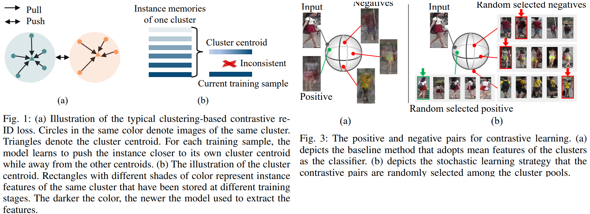
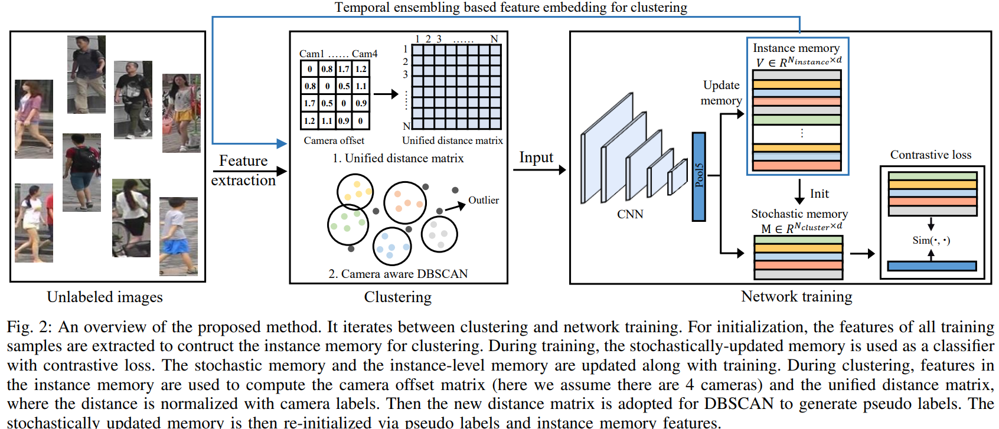

# Unsupervised Person Re-identification with Stochastic Training Strategy
Hongchen Tan, Xiuping Liu*, Yuhao Bian, Huasheng Wang, and Baocai Yin _04 Mar 2021_

* Official paper: [ArXiv](https://arxiv.org/pdf/2008.04010.pdf)
* Official code: [Github](https://github.com/lithium770/Unsupervised-Person-re-ID-with-Stochastic-Training-Strategy)

# OVERVIEW
- to overcome the issue which is dependency upon a large scale of annotated data of some methods, this paper  addresses fully unsupervised person re-ID, which does not require labeled source datasets and is thus more challenging

- the SOTA UL methods fllow a clustering-based strategy or contrastive learning, a momentum-updated memory (average instance level memory) ==> three problems (fig1):
  - F1.a training with cluster centroids letting all instances get closer to their centroid, making the clustering result more stable, which will provide less supervision signal for training in the next iteration and accumulate errors in the pseudo labels during iterations
  - Replace a large number of negatives with only the cluster centroids would damage the diversity of the contrastive pairs 
  - Fig. 1 (b), an instance feature in memory was updated when it was last seen. If we construct a huge memory for all instances, the inconsistency among representations will be severe due to the change of encoder.
- To address the above problems,  The main idea is, instead of using the cluster centroid as the positive and negative samples, all the instances are taken as candidate pools to provide positive and negative samples randomly

# PROPOSED METHOD

## CLUSTERING-BASED RE-ID BASELINE
After the initialization, the framework alternates between two steps:
- **Clustering**: At the beginning of each epoch, features in the instance-level memory are adopted to compute the distance (cosine similarities) matrix for clustering. Clustering algorithms such as K-means, DBSCAN  are applied to generate clusters. Through this step, the unlabeled dataset with pseudo labels are generated
- **Network training**:  
  - For each batch, the CNN encoder $f_\theta$ is optimized with pseudo labeled dataset and a contrastive loss. The contrastive loss makes an instance close to the centroid of its cluster, and pushed away from other clusters
  - After the backward procedure of each batch, the memory is updated with the encoded features

    $$w_i = \mu . w_i + (1 - \mu) f_\theta (x_i)  \qquad \text{2}$$

##  Stochastic Learning Strategy
-  in the baseline approach, during training, the average feature of each cluster is used as positive and negatives for contrastive loss but pseudo labels generated by clustering could be noisy
-  To alleviate these defects, stochastic learning strategy is proposed As shown in Fig. 3 (b):
   -   adopt a stochastically-updated memory, which is updated with random instance features for each cluster along with network training
   -   The features of the stochastic memory are used as the classifier for contrastive loss
   -   At the beginning of each iteration, we construct a memory bank $M \in R^{Y \times d}$ to represent each cluster, where **Y** is the cluster number, **d** is the feature dimension, and $m_i$ denotes the feature of the _i-th_ class.
   -   **Updating**
       -   For each $P \times K$ batch, we sample **P** identities and **K** instances for each person identity and guarantees that images for each identity are taken by at least two different cameras.
       -   During training, the instance $x_i$ is used to update the corresponding cluster center y:

      $$m_{y_i}=\mu_s \cdot m_{y_i}+\left(1-\mu_s\right) f_\theta\left(x_i\right \qquad \text{ (3)}$$

   - **Contrastive loss**

    $$\mathcal{L}=-\sum_{i=1}^N \log \frac{\exp \left(\left\langle f_\theta\left(x_i\right), m_{y_i}\right\rangle / \tau\right)}{\sum_{j=1}^Y \exp \left(\left\langle f_\theta\left(x_i\right), m_j\right\rangle / \tau\right)}$$

- Through initializing and updating, a stochastic memory is maintained that represents each cluster with the last seen images

## Temporal Ensembling based Camera-aware Clustering

* Temporal ensembling based feature embedding
  
  -  To build more robust feature for clustering, temporal ensembling is adopted to aggregate the features of multiple previous networks into an ensemble feature embedding
  -  we maintain an instance-level memory to represent instance features and combine twolevel memories : instance memory(maintains an exponential moving average  feature for each of the training samples) and stochastic memory ( temporal features)

* Unified distance matrix for camera aware clustering.
  - denote the corresponding camera ID of each training sample as $\left\{c_i\right\}_{i=1}^N$
  - To efficiently alleviate the influence of the camera variance, we set a camera domain offset matrix $D^{\text {cam }} \in N_{\text {cam }} \times N_{\text {cam }}$ reflects the image differences between different camera domains (or in a domain)
  - At each iteration, the matrix $D^{\text {cam }}$ is computed by the mean similarity of instance pairs belong to the corresponding camera domain
  - a unified distance $\tilde{D}$ is computed by:
    - original similarity matrix $D \in N \times N$
    - offset matrix $D^{\text {cam }}$
  
  - original distance matrix $D \in N \times N$ is calculated by the cosine similarities between the temporal ensembling
  - the camera variance between camera i and camera j in the camera domain offset matrix is calculated by
  
  $$D_{i, j}^{c a m}=\frac{1}{N_{c a m}^i \times N_{c a m}^j} \sum_{i=1}^{N_{c a m}^i} \sum_{j=1}^{N_{c a m}^j} D_{\left\{u, v \mid c_u=i, c_v=j\right\}}$$

    - when _i_ equals to _j_, the offset distance $D_{i, j}^{\text {cam }}$ represents the intra-camera similarity value
    - A greater value represents more similar domains, and the values of intra-domain (same camera label) should be the largest
  - We subtract the corresponding value from the distance matrix **D** as a penalty item. Then the element $\tilde{D}_{u, v}$ in $\tilde{D}$ is calculated :

  $$\tilde{D}_{u, v}=D_{u, v}-\lambda \cdot D_{c_u, c_v}^{c a m}$$