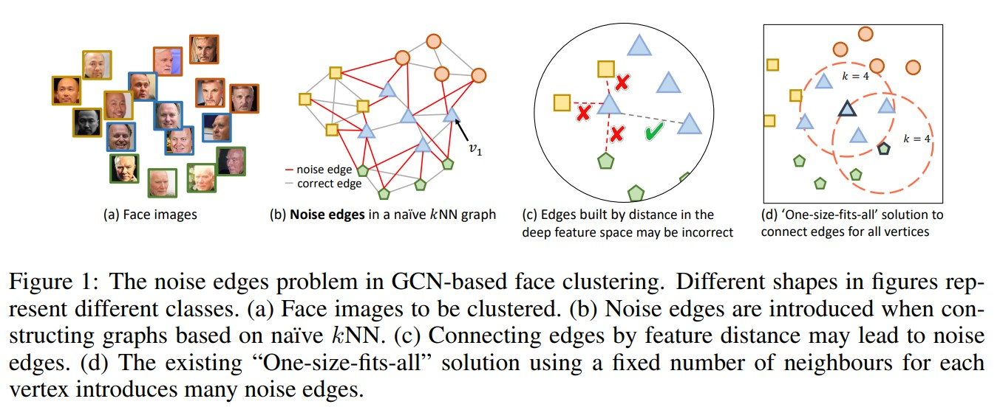
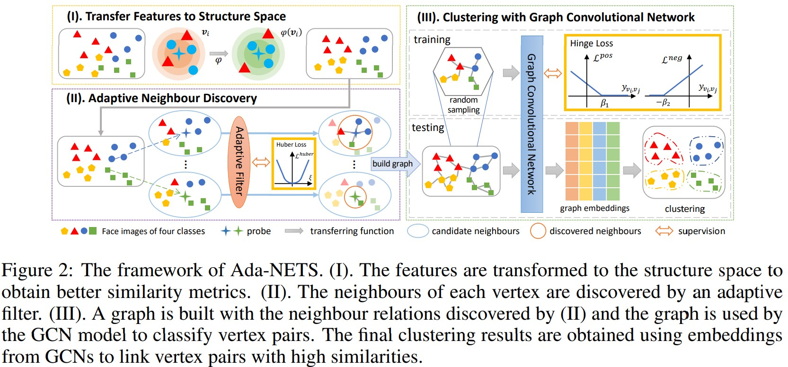
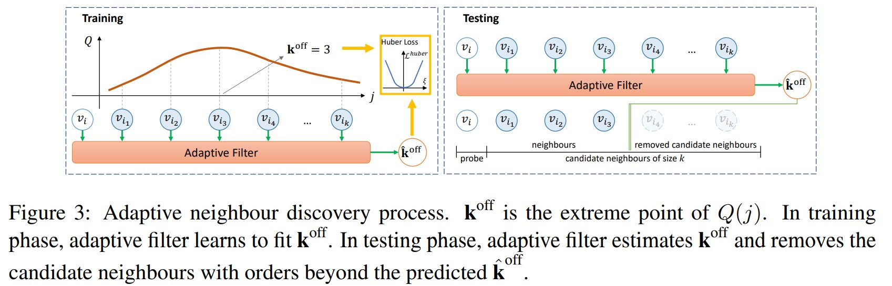
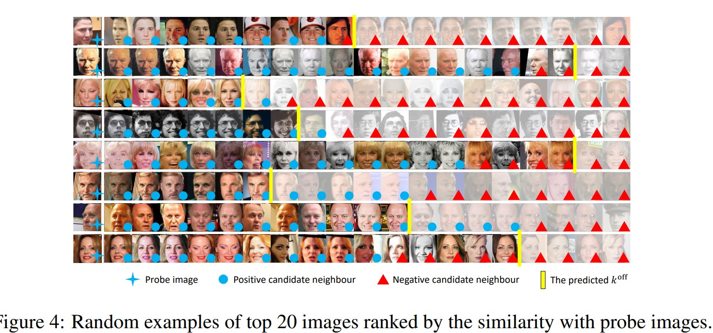

# Ada-NETS: Face Clustering via Adaptive Neighbour Discovery in the Structure Space
Yaohua Wang, Yaobin Zhang, Fangyi Zhang, Ming Lin, YuQi Zhang, Senzhang Wang, Xiuyu Sun. _29 Mar 2022 (v2)_

> Face clustering has attracted rising research interest recently to take advantage of massive amounts of face images on the web. State-of-the-art performance has been achieved by Graph Convolutional Networks (GCN) due to their powerful representation capacity. However, existing GCN-based methods build face graphs mainly according to kNN relations in the feature space, which may lead to a lot of noise edges connecting two faces of different classes. The face features will be polluted when messages pass along these noise edges, thus degrading the performance of GCNs. 
> In this paper, a novel algorithm named Ada-NETS is proposed to cluster faces by constructing clean graphs for GCNs. In Ada-NETS, each face is transformed to a new structure space, obtaining robust features by considering face features of the neighbour images. Then, an adaptive neighbour discovery strategy is proposed to determine a proper number of edges connecting to each face image

* Official paper: [ArXiv](https://arxiv.org/abs/2202.03800)
* Official code: [Github](https://github.com/damo-cv/ada-nets) [Github-2](https://github.com/Thomas-wyh/Ada-NETS)

# INTRODUCTION
- the main problem restricting the power of existing GCN-based face clustering algorithms is the existence of **noise edges** in the face graphs
- Unlike common graph datasets, face images do not contain explicit structural information, but only deep features extracted from a trained CNN model.

- The challenges of removing the noise edges in the face graphs are two-fold as shown in Figure 1 (c) (d). 
  - face images are treated as _vertices_
  - the edges between face images are usually constructed based on the kNN relations when building the graph, **Challenge**:
    -  Each face serves as a probe to retrieve its k nearest neighbours by deep features
    -  The noise edges will propagate noisy information between vertices, hurting their features when aggregation in KNN, ...
    -  It is difficult to tell whether two vertices are of the same class solely according to their deep features, because two vertices of different classes can also have a high similarity, thus introducing noise edges
    -  It is hard to determine how many edges to connect for each vertex when building a graph only based on the pairwise cosine similarity between vertices using deep features
- Adaptive Neighbour discovEry in the strucTure Space (Ada-Nets):
  - a _structure space_ is first presented in which vertices can obtain robust features by encoding more texture information after perceiving the data distribution 
  - a _candidate neighbours quality criterion_ is carefully designed to guide building less-noisy yet rich edges, along with a _learnable adaptive filter_ to learn this criterion

# METHODOLOGY
**Target**:  aims to divide a set of face samples into groups so that samples in a group belong to one identity, and any two samples in different groups belong to different identities

**Given:** a set of feature vectors $\mathcal{V} = {v_1, v_2, ..., v_i, ..., v_N | v_i \in \mathbf{R}^D}$ extracted from CNN models

**AdaNet Ideology:**
    * Firstly, the features are transformed to the proposed structure space for an accurate similarity metric
    * an adaptive neighbour discovery strategy is used to find neighbours for each vertex
    * a graph with clean and rich edges is built as the input graph of GCNs for the final clustering    

1. STRUCTURE SPACE

-  the similarity metric (cosine,...) can be improved by considering the _structure information_(the neighbourhood relationships)
-  In the structure space:
   -  the features can encode more texture information by perceiving the data distribution
   -  A transforming function $\varphi$ is deployed to convert one feature $\mathbf{v}_{i}$ into the structure space, noted as:
  
    $$\mathbf{v}_{i}^{s}=\varphi \left (\mathbf{v}_{i} \mid \mathcal{V} \right), \forall i \in\{1,2, \cdots, N\} \quad \text{(Eq.1)}$$

   - As shown in Figure 2 (I), with the help of the structure space, for one vertex $\mathbf{v}_{i}$, its similarities with other vertices are computed by the following steps:
     *   _kNN_ of $\mathbf{v}_{i}$ are obtained via an Approximate Nearest-neighbour (ANN) algorithm based on the cosine similarity, noted as:
  
    $$\mathcal{N} (\mathbf{v}_{i}, k) =  \{\mathbf{v}_{i_{1}}, \mathbf{v}_{i_{2}}, \cdots, \mathbf{v}_{i_{k}} \}$$

     *   define the similarity of $\mathbf{v}_{i}$ to each of its candidates in the structure space by:

    $$\begin{aligned}\kappa\left(\mathbf{v}_{i}, \mathbf{v}_{i_{j}}\right) &=\left\langle\mathbf{v}_{i}^{s}, \mathbf{v}_{i_{j}}^{s}\right\rangle \\ & \triangleq(1-\eta) s^{\mathrm{Jac}}\left(\mathbf{v}_{i}, \mathbf{v}_{i_{j}}\right)+\eta s^{\cos }\left(\mathbf{v}_{i}, \mathbf{v}_{i_{j}}\right), \quad \forall j \in\{1,2, \cdots, k\},\end{aligned}$$

    * where:
     - $\eta$ weights 
     - the cosine similarity 
     
     $$s^{\cos } (\mathbf{v}_{i}, \mathbf{v}_{i_{j}} )=\frac{\mathbf{v}_{i} \cdot \mathbf{v}_{i_{j}}}{\| \mathbf{v}_{i} \| \| \mathbf{v}_{i_{j}} \|}$$
     
     - the Jaccard similarity 
     
     $$s^{\mathrm{Jac}} \left (\mathbf{v}_{i}, \mathbf{v}_{i_{j}} \right)$$
     

2. ADAPTIVE NEIGHBOUR DISCOVERY

- the adaptive neighbour discovery module is proposed to learn from the features pattern around each vertex as shown in Figure 2 II

**CANDIDATE NEIGHBOURS QUALITY CRITERION**

-   a heuristic criterion is designed to assess the quality of candidate neighbours for each probe vertex with _2 principles_:
    -   Good neighbours should be clean, i.e., most neighbours should have the same class label with the probe vertex, so that noise edges will not be included in large numbers when building a graph
    -   The neighbours should also be rich, so that the message can fully pass in the graph
  
-   **the criterion is proposed:** $F_{\beta}-score$
    -   all candidate neighbours are ordered by the similarity with the probe vertex in a sequence
    -    Given candidate neighbours of size j probed by vertex $v_i$,  its quality criterion Q (j) is defined as:
  
    $$Q(j)=F_{\beta}^{j}=\left(1+\beta^{2}\right) \frac{P r^{j} R c^{j}}{\beta^{2} P r^{j}+R c^{j}}$$

    - where:
      - $P r^{j} \text{ and } R c^{j}$ are the precision and recall of the first _j_ candidate neighbours with respect to the label of v(i)

**ADAPTIVE FILTER**

$\mathbf{k}^{\text {off }}$ is defined as the heuristic ground truth value of the number of neighbours to choose:

$$\mathbf{k}^{\text {off }}=\arg \max _{j \in\{1,2, \ldots k\}} Q(j) .$$

As shown in Figure 3, the adaptive filter estimates $\mathbf{k}^{\text {off }}$ by finding the position of the highest $Q$-value on the $Q$-value curve. 

- The input of the adaptive filter is the feature vectors:

$$\left[\mathbf{v}_{i}, \mathbf{v}_{i_{1}}, \mathbf{v}_{i_{2}}, \cdots,, \mathbf{v}_{i_{k}}\right]^{T} \in \mathbb{R}^{(k+1) \times D}$$
 
- In training, adaptive filter is trained using the Huber loss:

$$\begin{aligned} \mathcal{L}^{\text {Huber }} &=\frac{1}{B} \sum_{b=1}^{B} \mathcal{L}_{b}^{\text {Huber }}, \\ \text { where } \mathcal{L}_{b}^{\text {Huber }} &=\left\{\begin{array}{ll} \frac{1}{2} \xi^{2}, & \xi<\delta, \\ \delta \xi-\frac{1}{2} \delta^{2}, & \text { otherwise, } \end{array} \quad \xi=\frac{\left|\hat{\mathbf{k}}_{b}^{\text {off }}-\mathbf{k}_{b}^{\text {off }}\right|}{\mathbf{k}_{b}^{\text {off }}},\right. \end{aligned}$$

  - $\hat{\mathbf{k}}_{b}^{\text {off }}$ is the prediction$
  - $\delta$ is an outlier threshold
  - the candidate neighbours with orders beyond $\hat{\mathbf{k}}^{\text {off }}$ are removed and the left will be treated as neighbours of the corresponding probe

**ADA-NETS FOR FACE CLUSTERING**

- A GCN model is used to learn whether two vertices belong to the same class
- Two GCN layers are used in this paper, followed with one FC layer with PReLU (He et al., 2015) activation and one normalization
- the training loss is defined as a variant version of Hinge loss

$$\begin{gathered}
\mathcal{L}^{\text {Hinge }}=\mathcal{L}^{\text {neg }}+\lambda \mathcal{L}^{\text {pos }}, \\
\text { where } \mathcal{L}^{\text {pos }}=\frac{1}{\left\|l_{i}=l_{j}\right\|} \sum_{l_{i}=l_{j}}\left[\beta_{1}-y_{\mathbf{v}_{i}, \mathbf{v}_{j}}\right]_{+}, \quad \mathcal{L}^{n e g}=\max _{l_{i} \neq l_{j}}\left[\beta_{2}+y_{\mathbf{v}_{i}, \mathbf{v}_{j}}\right]_{+},
\end{gathered}$$

  - $y_{\mathbf{v}_{i}\text{ , }\mathbf{v}_{j}}$ is the cosine similarity of the GCN output features
  - $\left\|l_{i}=l_{j}\right\|$ is the number of the positive pairs
  - $\beta_{1} \text{ and } \beta_{2}$ are the margins of the positive and negative losses
  - $\lambda$ is the weight balancing the two losses
- Pairs of vertices are linked when their similarity scores are larger than a predefined threshold $\theta$
- clustering is done by merging all links transitively with the union-find algorithm

# Experiments

