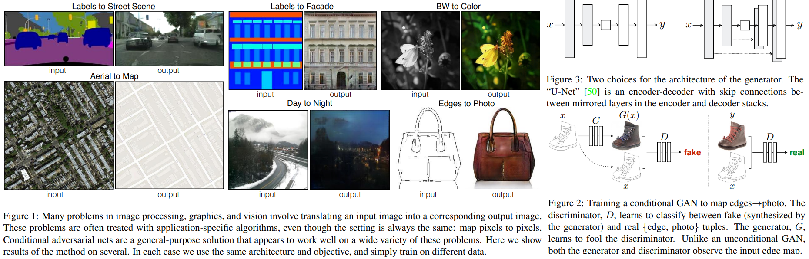

# Image-to-Image Translation with Conditional Adversarial Networks
Phillip Isola, Jun-Yan Zhu, Tinghui Zhou, Alexei A. Efros _5 Jan 2021(this ver)_

> We investigate conditional adversarial networks as a general-purpose solution to image-to-image translation problems. These networks not only learn the mapping from input image to output image, but also learn a loss function to train this mapping. This makes it possible to apply the same generic approach to problems that traditionally would require very different loss formulations. We demonstrate that this approach is effective at synthesizing photos from label maps, reconstructing objects from edge maps, and colorizing images, among other tasks

* Official paper: [paper](https://arxiv.org/abs/1611.07004v3)
* Officical Code: [Github](https://github.com/phillipi/pix2pix)

# Overview
- they define automatic image-to-image translation as the task of translating one possible epresentation of a  scene into another, given sufficient training data as Fig1



# Method
GANs are generative models that learn a mapping from random **noise vector** z to output image y, G : z → y while **conditional GANs** learn a mapping from observed image x and random noise vector z, to y, G : {x, z} → y. This training procedure is diagrammed in Figure 2.

1. Objective
- Goal of Normal conditional GAN can be expressed as:

$$\begin{aligned}
\mathcal{L}_{c G A N}(G, D)=& \mathbb{E}_{x, y}[\log D(x, y)]+\\
& \mathbb{E}_{x, z}[\log (1-D(x, G(x, z))],
\end{aligned}$$

- Someonse have found it beneficial to mix the GAN objective with a more traditional loss, such as L2 distance. The discriminator's job remains unchanged, but the generator is tasked to not only fool the discriminator but also to be near the ground truth output in an L2 sense.
- They also explore this option, using L1 distance rather than L2 as L1 encourages less blurring:

$$\mathcal{L}_{L 1}(G)=\mathbb{E}_{x, y, z}\left[\|y-G(x, z)\|_1\right] $$

- Final objective is

$$G^*=\arg \min _G \max _D \mathcal{L}_{c G A N}(G, D)+\lambda \mathcal{L}_{L 1}(G)$$

2. Network architectures
- Both generator and discriminator use modules of the form convolution-BatchNorm-ReLu

**Generator with skips**
there is a great deal of low-level information shared between the input and output, so To give the generator a means to circumvent the bottleneck for information like this, we add skip connections, following the general shape of a “U-Net” as fig.3

encoder:
C64-C128-C256-C512-C512-C512-C512-C512
decoder:
CD512-CD512-CD512-C512-C256-C128-C64

- Let Ck denote a Convolution-BatchNorm-ReLU layer with k filters. CDk denotes a Convolution-BatchNormDropout-ReLU layer with a dropout rate of 50%

**Discriminator architectures**
- The 70 × 70 discriminator architecture is: C64-C128-C256-C512
- 1 × 1 discriminator: C64-C128 (note, in this special case, all convolutions are 1 × 1 spatial filters)
- 286 × 286 discriminator: C64-C128-C256-C512-C512-C512

3. PathGAN


# CODE

```python
class Pix2PixModel(BaseModel):
    """ This class implements the pix2pix model, for learning a mapping from input images to output images given paired data.
    The model training requires '--dataset_mode aligned' dataset.
    By default, it uses a '--netG unet256' U-Net generator,
    a '--netD basic' discriminator (PatchGAN),
    and a '--gan_mode' vanilla GAN loss (the cross-entropy objective used in the orignal GAN paper).
    pix2pix paper: https://arxiv.org/pdf/1611.07004.pdf
    """
    @staticmethod
    def modify_commandline_options(parser, is_train=True):
        """Add new dataset-specific options, and rewrite default values for existing options.
        Parameters:
            parser          -- original option parser
            is_train (bool) -- whether training phase or test phase. You can use this flag to add training-specific or test-specific options.
        Returns:
            the modified parser.
        For pix2pix, we do not use image buffer
        The training objective is: GAN Loss + lambda_L1 * ||G(A)-B||_1
        By default, we use vanilla GAN loss, UNet with batchnorm, and aligned datasets.
        """
        # changing the default values to match the pix2pix paper (https://phillipi.github.io/pix2pix/)
        parser.set_defaults(norm='batch', netG='unet_256', dataset_mode='aligned')
        if is_train:
            parser.set_defaults(pool_size=0, gan_mode='vanilla')
            parser.add_argument('--lambda_L1', type=float, default=100.0, help='weight for L1 loss')

        return parser

    def __init__(self, opt):
        """Initialize the pix2pix class.
        Parameters:
            opt (Option class)-- stores all the experiment flags; needs to be a subclass of BaseOptions
        """
        BaseModel.__init__(self, opt)
        # specify the training losses you want to print out. The training/test scripts will call <BaseModel.get_current_losses>
        self.loss_names = ['G_GAN', 'G_L1', 'D_real', 'D_fake']
        # specify the images you want to save/display. The training/test scripts will call <BaseModel.get_current_visuals>
        self.visual_names = ['real_A', 'fake_B', 'real_B']
        # specify the models you want to save to the disk. The training/test scripts will call <BaseModel.save_networks> and <BaseModel.load_networks>
        if self.isTrain:
            self.model_names = ['G', 'D']
        else:  # during test time, only load G
            self.model_names = ['G']
        # define networks (both generator and discriminator)
        self.netG = networks.define_G(opt.input_nc, opt.output_nc, opt.ngf, opt.netG, opt.norm,
                                      not opt.no_dropout, opt.init_type, opt.init_gain, self.gpu_ids)

        if self.isTrain:  # define a discriminator; conditional GANs need to take both input and output images; Therefore, #channels for D is input_nc + output_nc
            self.netD = networks.define_D(opt.input_nc + opt.output_nc, opt.ndf, opt.netD,
                                          opt.n_layers_D, opt.norm, opt.init_type, opt.init_gain, self.gpu_ids)

        if self.isTrain:
            # define loss functions
            self.criterionGAN = networks.GANLoss(opt.gan_mode).to(self.device)
            self.criterionL1 = torch.nn.L1Loss()
            # initialize optimizers; schedulers will be automatically created by function <BaseModel.setup>.
            self.optimizer_G = torch.optim.Adam(self.netG.parameters(), lr=opt.lr, betas=(opt.beta1, 0.999))
            self.optimizer_D = torch.optim.Adam(self.netD.parameters(), lr=opt.lr, betas=(opt.beta1, 0.999))
            self.optimizers.append(self.optimizer_G)
            self.optimizers.append(self.optimizer_D)

    def set_input(self, input):
        """Unpack input data from the dataloader and perform necessary pre-processing steps.
        Parameters:
            input (dict): include the data itself and its metadata information.
        The option 'direction' can be used to swap images in domain A and domain B.
        """
        AtoB = self.opt.direction == 'AtoB'
        self.real_A = input['A' if AtoB else 'B'].to(self.device)
        self.real_B = input['B' if AtoB else 'A'].to(self.device)
        self.image_paths = input['A_paths' if AtoB else 'B_paths']

    def forward(self):
        """Run forward pass; called by both functions <optimize_parameters> and <test>."""
        self.fake_B = self.netG(self.real_A)  # G(A)

    def backward_D(self):
        """Calculate GAN loss for the discriminator"""
        # Fake; stop backprop to the generator by detaching fake_B
        fake_AB = torch.cat((self.real_A, self.fake_B), 1)  # we use conditional GANs; we need to feed both input and output to the discriminator
        pred_fake = self.netD(fake_AB.detach())
        self.loss_D_fake = self.criterionGAN(pred_fake, False)
        # Real
        real_AB = torch.cat((self.real_A, self.real_B), 1)
        pred_real = self.netD(real_AB)
        self.loss_D_real = self.criterionGAN(pred_real, True)
        # combine loss and calculate gradients
        self.loss_D = (self.loss_D_fake + self.loss_D_real) * 0.5
        self.loss_D.backward()

    def backward_G(self):
        """Calculate GAN and L1 loss for the generator"""
        # First, G(A) should fake the discriminator
        fake_AB = torch.cat((self.real_A, self.fake_B), 1)
        pred_fake = self.netD(fake_AB)
        self.loss_G_GAN = self.criterionGAN(pred_fake, True)
        # Second, G(A) = B
        self.loss_G_L1 = self.criterionL1(self.fake_B, self.real_B) * self.opt.lambda_L1
        # combine loss and calculate gradients
        self.loss_G = self.loss_G_GAN + self.loss_G_L1
        self.loss_G.backward()

    def optimize_parameters(self):
        self.forward()                   # compute fake images: G(A)
        # update D
        self.set_requires_grad(self.netD, True)  # enable backprop for D
        self.optimizer_D.zero_grad()     # set D's gradients to zero
        self.backward_D()                # calculate gradients for D
        self.optimizer_D.step()          # update D's weights
        # update G
        self.set_requires_grad(self.netD, False)  # D requires no gradients when optimizing G
        self.optimizer_G.zero_grad()        # set G's gradients to zero
        self.backward_G()                   # calculate graidents for G
        self.optimizer_G.step()             # udpate G's weights
```