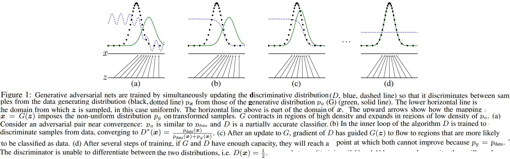
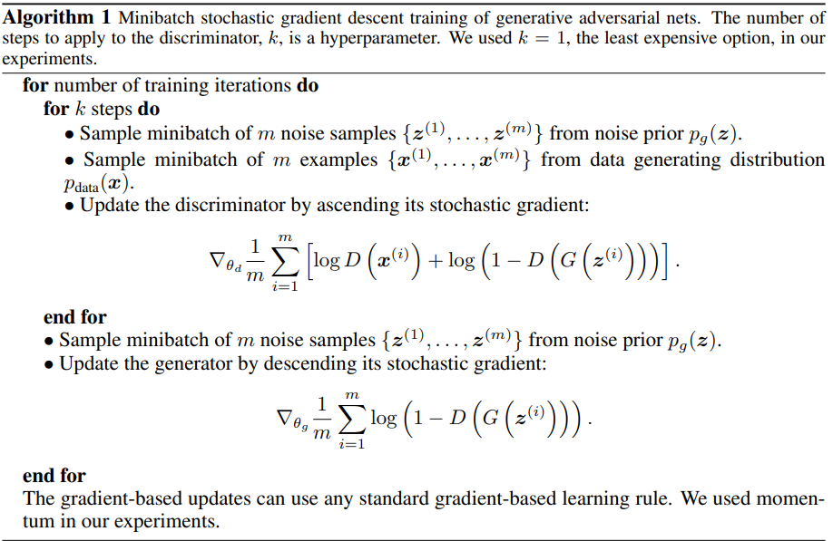

# StarGAN: Unified Generative Adversarial Networks for Multi-Domain Image-to-Image Translation
Ian J. Goodfellow, Jean Pouget-Abadie, Mehdi Mirza, Bing Xu, David Warde-Farley, Sherjil Ozair, Aaron Courville, Yoshua Bengio _10 Jun 2014_

>We propose a new framework for estimating generative models via an adversarial process, in which we simultaneously train two models: a generative model G that captures the data distribution, and a discriminative model D that estimates the probability that a sample came from the training data rather than G. The training procedure for G is to maximize the probability of D making a mistake. This framework corresponds to a minimax two-player game. In the space of arbitrary functions G and D, a unique solution exists, with G recovering the training data distribution and D equal to 1/2 everywhere. In the case where G and D are defined by multilayer perceptrons, the entire system can be trained with backpropagation. There is no need for any Markov chains or unrolled approximate inference networks during either training or generation of samples. 

* Official paper: [ArXiv](https://arxiv.org/abs/1406.2661)
* Official code: [Github](https://github.com/goodfeli/adversarial)


# OVERVIEW

In the proposed adversarial nets framework:

  - the **generative model** is pitted against an adversary : **discriminative model** that learns to determine whether a sample is from the model distribution or the data distribution 

In this article:
  - they explore the special case when the generative model generates samples by passing random noise through a multilayer perceptron
  - the discriminative model is also a multilayer perceptron
  - they can train both models using only the highly successful backpropagation and dropout algorithms and sample from the generative model using only forward propagation

# Theory

## Adversarial nets

The adversarial modeling framework is most straightforward to apply when the models are both multilayer perceptrons. To learn the generator’s distribution $p_g$ over data x, we define:

  -  a prior on input noise variables : $p_\mathcal{z} (\mathcal{z})$
  -  a mapping to data space as $G(z; \theta_g)$. with G is differentiable function with hyperparameter theta_g
  -  second multilayer perceptron $D(x; \theta_d)$ that outputs a single scalar
     -    _D(x)_ represents the probability that x came from the data rather than $p_g$
  - Train D to maximize the probability of assigning the correct label to both training examples and samples from G

In other words, $D$ and $G$ play the following two-player minimax game with value function $V(G, D)$ :

$$\min _G \max _D V(D, G)=\mathbb{E}_{\boldsymbol{x} \sim p_{\text {data }}(\boldsymbol{x})}[\log D(\boldsymbol{x})]+\mathbb{E}_{\boldsymbol{z} \sim p_{\boldsymbol{z}}(\boldsymbol{z})}[\log (1-D(G(\boldsymbol{z})))]$$

See Figure 1 for a less formal, more pedagogical explanation of the approach:



In practice, we must implement the game using an iterative, numerical approach:
  - Optimizing **D** to completion in the inner loop of training is computationally prohibitive, and on finite datasets would result in overfitting. 
  - Instead, we alternate between _k_ steps of optimizing **D** and one step of optimizing **G**. 
  - This results in **D** being maintained near its optimal solution, so long as **G** changes slowly enough. 

However, In practice, equation 1 may not provide sufficient gradient for **G** to learn well:
  - Early in learning, when **G** is poor, **D** can reject samples with high confidence because they are clearly different from the training data. 
  
  $$\log (1-D(G(\boldsymbol{z}))) \qquad \text{ is saturates}$$  
  
  - => rather minimize $\log (1-D(G(\boldsymbol{z}))) \text{ we can train G to maximize }  \log D(G(\boldsymbol{z}))$. 
  - This objective function results in the same fixed point of the dynamics of **G and D** but provides much stronger gradients early in learning.

# Alogrithm



## Global Optimality of $p_g=p_{\text {data }}$

* Proposition 1. For **G** fixed, the optimal discriminator **D** is
  
$$D_G^*(\boldsymbol{x})=\frac{p_{\text {data }}(\boldsymbol{x})}{p_{\text {data }}(\boldsymbol{x})+p_g(\boldsymbol{x})}$$

- the training objective for _D_ can be interpreted as maximizing the log-likelihood for estimating the conditional probability $P(Y=y \mid \boldsymbol{x})$
  -  **Y** indicates whether $\boldsymbol{x}$ comes from $p_{\text {data }}$ (with _y=1_ ) or from **p_g** (with _y=0_ )
  - The minimax game in Eq. 1 can now be reformulated as:

  $$\begin{aligned}C(G) &=\max _D V(G, D) \\
  &=\mathbb{E}_{\boldsymbol{x} \sim p_{\text {data }}}\left[\log D_G^*(\boldsymbol{x})\right]+\mathbb{E}_{\boldsymbol{z} \sim p_{\boldsymbol{z}}}\left[\log \left(1-D_G^*(G(\boldsymbol{z}))\right)\right] \\
  &=\mathbb{E}_{\boldsymbol{x} \sim p_{\text {data }}}\left[\log D_G^*(\boldsymbol{x})\right]+\mathbb{E}_{\boldsymbol{x} \sim p_g}\left[\log \left(1-D_G^*(\boldsymbol{x})\right)\right] \\
  &=\mathbb{E}_{\boldsymbol{x} \sim p_{\text {data }}}\left[\log \frac{p_{\text {data }}(\boldsymbol{x})}{P_{\text {data }}(\boldsymbol{x})+p_g(\boldsymbol{x})\right]+\mathbb{E}_{\boldsymbol{x} \sim p_g}\left[\log \frac{p_g(\boldsymbol{x})}{p_{\text {data }}(\boldsymbol{x})+p_g(\boldsymbol{x})}\right]\end{aligned}$$


* Theorem 1. The global minimum of the virtual training criterion **C(G)** is achieved if and only if $p_g=p_{\text {data }}$. 
  - At that point, **C(G)** achieves the value $-\log 4$.
  - From the Proof in the paper, they have shown that:
    -  $C^*=-\log (4)$ is the global minimum of **C(G)**
    -  the only solution is $p_g=p_{\text {data }}$, i.e., the generative model perfectly replicating the data generating process.


* Proposition 2. If **G and D** have enough capacity, and at each step of Algorithm 1, the discriminator is allowed to reach its optimum given **G**, and $p_g$ is updated so as to improve the criterion

$$\mathbb{E}_{\boldsymbol{x} \sim p_{\text {data }}}\left[\log D_G^*(\boldsymbol{x})\right]+\mathbb{E}_{\boldsymbol{x} \sim p_g}\left[\log \left(1-D_G^*(\boldsymbol{x})\right)\right]$$

  then $p_g$ converges to $p_{\text {data }}$

- In practice: 
  - adversarial nets represent a limited family of ***p_g*** distributions via the function $G\left(\boldsymbol{z} ; \theta_g\right)$
  - we optimize $\theta_g \text{ rather than } p_g$ 


# CODE EEAMPLE

- Generator & Discriminator

```python
"""
torch.nn.ConvTranspose2d(in_channels, out_channels, kernel_size, stride=1, padding=0, output_padding=0, groups=1, bias=True, dilation=1, padding_mode='zeros', device=None, dtype=None)

"""


class Generator(nn.Module):
    """
    noise_vector:  is the length of the z input vector.

    num_gen_filter: size of the feature maps that are propagated through the generator,

    num_ch: The number of channels in the output image (set to 1 for Grayscale images).

    Here, the height and width dimension of the image does not change, only the channel dimension decreases.

    For the Conv and ConvTranspose layers:
    * in_channels (int) – Number of channels/filters in the input image
    * out_channels (int) – Number of channels/filters produced by the convolution

    """

    def __init__(self, num_ch, noise_vector, num_gen_filter):
        super(Generator, self).__init__()
        self.network = nn.Sequential(
            nn.ConvTranspose2d(
                in_channels=noise_vector,
                out_channels=num_gen_filter * 4,
                kernel_size=4,
                stride=1,
                padding=0,
                bias=False,
            ),
            nn.BatchNorm2d(num_gen_filter * 4),
            nn.ReLU(True),
            nn.ConvTranspose2d(
                in_channels=num_gen_filter * 4,
                out_channels=num_gen_filter * 2,
                kernel_size=3,
                stride=2,
                padding=1,
                bias=False,
            ),
            nn.BatchNorm2d(num_gen_filter * 2),
            nn.ReLU(True),
            nn.ConvTranspose2d(
                in_channels=num_gen_filter * 2,
                out_channels=num_gen_filter,
                kernel_size=4,
                stride=2,
                padding=1,
                bias=False,
            ),
            nn.BatchNorm2d(num_gen_filter),
            nn.ReLU(True),
            nn.ConvTranspose2d(
                in_channels=num_gen_filter,
                out_channels=num_ch,
                kernel_size=4,
                stride=2,
                padding=1,
                bias=False,
            ),
            nn.Tanh(),
        )

    def forward(self, input):
        output = self.network(input)
        return output


class Discriminator(nn.Module):
    """
    torch.nn.Conv2d(in_channels, out_channels, kernel_size, stride=1, padding=0, dilation=1, groups=1, bias=True, padding_mode='zeros', device=None, dtype=None)
    Here, the height and width dimension of the image does not change, only the channel dimension increases.
    """

    def __init__(self, num_ch, num_disc_filter):
        super(Discriminator, self).__init__()
        self.network = nn.Sequential(
            nn.Conv2d(
                in_channels=num_ch,
                out_channels=num_disc_filter,
                kernel_size=4,
                stride=2,
                padding=1,
                bias=False,
            ),
            nn.LeakyReLU(0.2, inplace=True),
            nn.Conv2d(
                in_channels=num_disc_filter,
                out_channels=num_disc_filter * 2,
                kernel_size=4,
                stride=2,
                padding=1,
                bias=False,
            ),
            nn.BatchNorm2d(num_disc_filter * 2),
            nn.LeakyReLU(0.2, inplace=True),
            nn.Conv2d(
                in_channels=num_disc_filter * 2,
                out_channels=num_disc_filter * 4,
                kernel_size=3,
                stride=2,
                padding=1,
                bias=False,
            ),
            nn.BatchNorm2d(num_disc_filter * 4),
            nn.LeakyReLU(0.2, inplace=True),
            nn.Conv2d(
                in_channels=num_disc_filter * 4,
                out_channels=1,
                kernel_size=4,
                stride=1,
                padding=0,
                bias=False,
            ),
            nn.Sigmoid(),
        )

    # The Discriminator outputs a scalar probability to classify the input image as real or fake.
    def forward(self, input):
        output = self.network(input)
        return output.view(-1, 1).squeeze(1)
```

- Training loop

```python

def train(   num_epochs,   discriminator_net,   generator_net,
    optimizerD,   optimizerG,
    train_loader,    fake_label,    real_label,
    criterion,
    output_path,    num_test_samples,    device,    noise_vector,):
    num_batches = len(train_loader)

    for epoch in range(num_epochs):
        for i, (real_images, _) in enumerate(train_loader):
            batch_size_real_imgs = real_images.shape[0]

            ############################
            # (1) Update D network: maximize log(D(x)) + log(1 - D(G(z)))
            ###########################
            """ The standard process to train a DCGAN network is to first train
            the discriminator on the batch of samples.
            """
            discriminator_net.zero_grad()

            real_images = real_images.to(device)

            # First training on real image, hence fill it with 1
            # Create Labels
            label = torch.full((batch_size_real_imgs,), real_label, device=device)

            """ The discriminator is used to classify real images (drawn from the training set)
            and fake images (produced by the generator).
            So, next, train the discriminator network on real images and real labels:
            """
            output = discriminator_net(real_images)

            loss_disc_real = criterion(output, label)

            loss_disc_real.backward()

            D_x = output.mean().item()

            # Creating noise variables for the input to whole adversarial network
            noise = torch.randn(batch_size_real_imgs, noise_vector, 1, 1, device=device)

            # Generate a batch of fake images using the generator network
            fake_images = generator_net(noise)

            # As now training on fake image, fill label with 0's
            label.fill_(fake_label)

            # Now train Discriminator on fake images
            output = discriminator_net(fake_images.detach())

            loss_disc_fake = criterion(output, label)
            loss_disc_fake.backward()

            D_G_z1 = output.mean().item()

            # Total Discriminator Loss
            loss_disc_total = loss_disc_real + loss_disc_fake

            optimizerD.step()

            ############################
            # (2) Update Generator network: maximize log(D(G(z)))
            ###########################

            """ When we train the generator network we have to
            freeze the discriminator network, as we have already trained it. """

            generator_net.zero_grad()

            # Now, set Image Label vector values equal to 1
            # To fool the Discriminator Network
            label.fill_(real_label)

            # After filling all labels with 1 (representing real labels), run discriminator network with fake images to fool it
            # To classify real images (drawn from the training set) and fakes images (produced by the generator).
            output = discriminator_net(fake_images)

            # And now after I tried to fool discriminator, check how much it was fooled.
            # so to the extent above output does not match with "labels" variable (which were all filed up with 1)
            # That will be the failure of Generator Network i.e. Generator Loss
            loss_generator = criterion(output, label)

            loss_generator.backward()

            D_G_z2 = output.mean().item()

            optimizerG.step()

    generator_net.eval()
    plot_images(
        epoch,
        output_path,
        num_test_samples,
        generator_net,
        device,
    )
    generator_net.train()


##########################################
# Initialize all the necessary variables
#########################################

batch_size = 256

output_path = "/content/sample_data/"

# Gather MNIST Dataset
train_loader = get_data_loader(batch_size)

# Create the Discriminator and Generator network
discriminator_net = Discriminator(num_ch=1, num_disc_filter=32).to(device)

generator_net = Generator(num_ch=1, noise_vector=100, num_gen_filter=32).to(device)

# loss function
criterion = nn.BCELoss()

# optimizers
optimizerD = optim.Adam(discriminator_net.parameters(), lr=0.001)
optimizerG = optim.Adam(generator_net.parameters(), lr=0.001)

# initialize variables required for training
real_label = 1.0
fake_label = 0.0
# num_batches = len(train_loader)

num_test_samples = 16

fixed_noise = torch.randn(num_test_samples, 100, 1, 1, device=device)

num_epochs = 70

noise_vector = 100

##########################################
# Execute the train Function
#########################################

train(
    num_epochs=num_epochs,
    discriminator_net=discriminator_net,
    generator_net=generator_net,
    optimizerD=optimizerD,
    optimizerG=optimizerG,
    train_loader=train_loader,
    fake_label=fake_label,
    real_label=real_label,
    criterion=criterion,
    output_path=output_path,
    num_test_samples=num_test_samples,
    device=device,
    noise_vector=noise_vector,
)

```