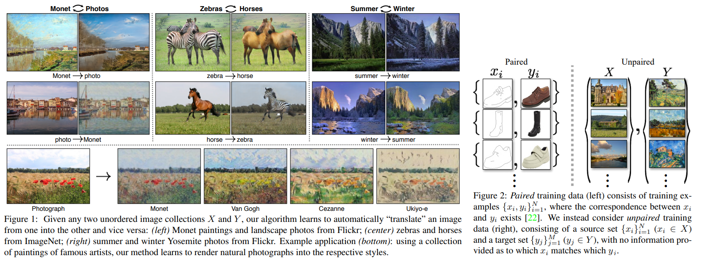
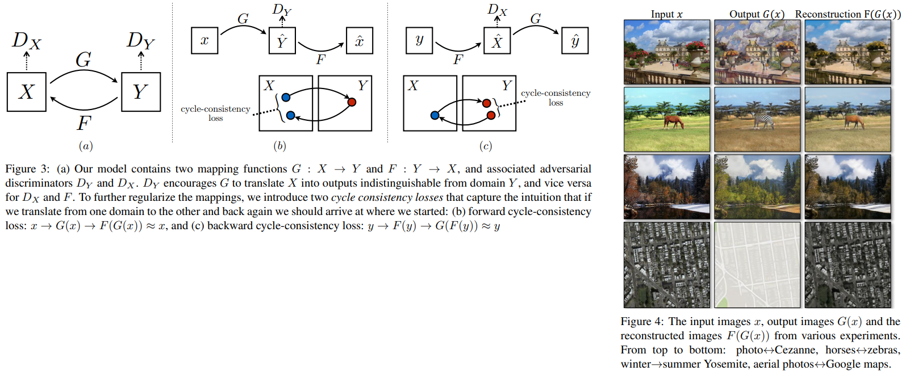

# Unpaired Image-to-Image Translation using Cycle-Consistent Adversarial Networks
Jun-Yan Zhu∗, Taesung Park∗, Phillip Isola, Alexei A. Efros _24 Aug 2020_

* Official paper: [paper](https://arxiv.org/pdf/1703.10593.pdf)
* Officical Code: [Github](https://junyanz.github.io/CycleGAN/)

# Overview
- for many tasks, paired training data will not be available for image-trans-image. hence they  present an approach for learning to translate an image from a source domain X to a target domain Y in the absence of paired examples.
  

-  Goal is to learn a mapping G : X → Y such that the distribution of images from G(X) is indistinguishable from the distribution Y using an adversarial loss. Because this mapping is highly under-constrained, we couple it with an inverse mapping F : Y → X and introduce a cycle consistency loss to enforce F(G(X)) ≈ X (and viceversa)
-  We assume there is some underlying relationship between the domains – for example (fig2), 
   -   they are two different renderings of the same underlying scene – and seek to learn that relationship. 
   -   Although we lack supervision in the form of paired examples, we can exploit supervision at the level of sets: we are given one set of images in domain X and a different set in domain Y.
   -   We may train a mapping G : X → Y such that the output yˆ = G(x), x ∈ X, is indistinguishable from images y ∈ Y by an adversary trained to  classify yˆ apart from y. 

# Proposed Method

1. Ideal

- Our goal is to learn mapping functions between two domains **X** and __Y__ 
- Given training samples:
  -  $\{x_i\}_{i=1}^N \text{ where } x_i \in X$ 
  -  $\{y_j\}_{j=1}^M$ \text{ where } $y_j \in Y^1$. 
-  We denote the data distribution as 
   -  $x \sim p_{\text {data }}(x)$ 
   -  $y \sim p_{\text {data }}(y)$. 
-  As illustrated in Figure 3 (a),  model includes two mappings:
   -   $G: X \rightarrow Y$ 
   -   $F: Y \rightarrow X$. 
-   In addition, we introduce two adversarial discriminators $D_X$ and $D_Y$, 
-   Our objective contains two types of terms: adversarial losses [16] for matching the distribution of generated images to the data distribution in the target domain; and cycle consistency losses to prevent the learned mappings $G$ and $F$ from contradicting each other.

2. [Adversarial Loss](../GANs.md)

- For the mapping function $G: X \rightarrow Y$ and its discriminator $D_Y$, we express the objective as:

$$\begin{aligned}
\mathcal{L}_{\mathrm{GAN}}\left(G, D_Y, X, Y\right) &=\mathbb{E}_{y \sim p_{\text {data }}(y)}\left[\log D_Y(y)\right] \\
&+\mathbb{E}_{x \sim p_{\text {data }}(x)}\left[\log \left(1-D_Y(G(x))\right]\right.
\end{aligned}$$

- a similar adversarial loss for the mapping function $F: Y \rightarrow X$ and its discriminator as well: 
 
$$\min _F \max _{D_X} \mathcal{L}_{\mathrm{GAN}}\left(F, D_X, Y, X\right)$$

3. **Cycle Consistency Loss**

* Why we need Cycle costency loss
- learn mappings G and F that produce outputs identically distributed as target domains Y and X respectively . However, with large enough capacity, a network can map the same set of input images to any random permutation of images in the target domain, where any of the learned mappings can induce an output distribution that matches the target distribution. 
- Thus, adversarial losses alone cannot guarantee that the learned function can map an individual input xi to a desired output yi. To further reduce the space of possible mapping functions, we argue that the learned mapping functions should be cycle-consistent: as shown in Figure 3

$$x \rightarrow G(x) \rightarrow F(G(x)) \approx x$$

$$y \rightarrow F(y) \rightarrow G(F(y)) \approx y$$

* **Formula**
  
$$\begin{aligned}
\mathcal{L}_{\text {cyc }}(G, F) &=\mathbb{E}_{x \sim p_{\text {data }}(x)}\left[\|F(G(x))-x\|_1\right] \\
&+\mathbb{E}_{y \sim p_{\text {data }}(y)}\left[\|G(F(y))-y\|_1\right] .
\end{aligned}$$

The behavior induced by the cycle consistency loss can be observed in Figure 4: the reconstructed images $F(G(x))$ end up matching closely to the input images _x_

4. Full Objective

$$\begin{aligned}
\mathcal{L}\left(G, F, D_X, D_Y\right) &=\mathcal{L}_{\mathrm{GAN}}\left(G, D_Y, X, Y\right) \\
&+\mathcal{L}_{\mathrm{GAN}}\left(F, D_X, Y, X\right) \\
&+\lambda \mathcal{L}_{\mathrm{cyc}}(G, F)
\end{aligned}$$

5. Extra loss:  Identity loss

- we find that it is helpful to introduce an additional loss to encourage the mapping to preserve color composition between the input and output

$$\mathcal{L}_{\text {identity }}(G, F)=\mathbb{E}_{y \sim p_{\text {data }}(y)}\left[\|G(y)-y\|_1\right]+$ $\mathbb{E}_{x \sim p_{\text {data }}(x)}\left[\|F(x)-x\|_1\right]$$

- Without Loss_identity, the generator G and F are free to change the tint of input images when there is no need to.

# Code

- [jupyterNotebook](../_code_/CycleGan.ipynb)