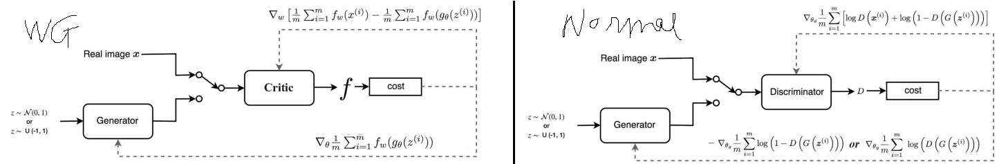
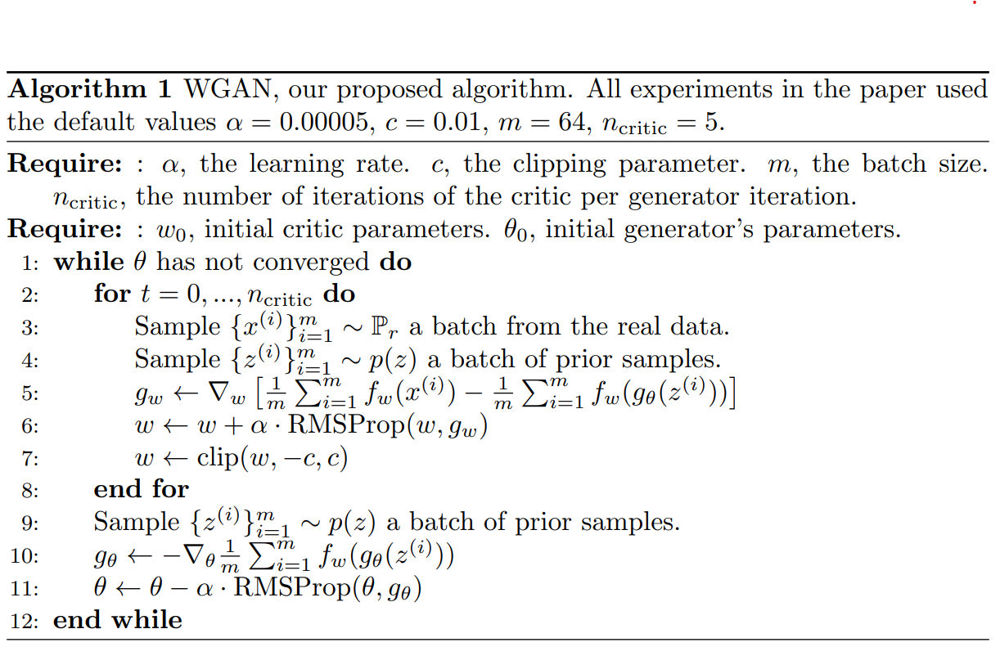

# Wasserstein GAN
Martin Arjovsky, Soumith Chintala, Léon Bottou _last revised 6 Dec 2017 (this version, v3)]_

>  In this new model, we show that we can improve the stability of learning, get rid of problems like mode collapse, and provide meaningful learning curves useful for debugging and hyperparameter searches. Furthermore, we show that the corresponding optimization problem is sound, and provide extensive theoretical work highlighting the deep connections to other distances between distributions.

# OVERVIEW
* [**Hạn chế của DCGAN**](../GANs.md):

  - Quá trình huấn luyện discriminator sẽ tạo ra những thông tin tốt để cải thiện generator nhưng generator lại không thực hiện tốt vai trò của mình khiến cho giá trị gradient descent của nó thường bị triệt tiêu và generator không học được gì.
  
    $$-\nabla_{\theta_g} \log \left(1-D\left(G\left(z^{(i)}\right)\right) \rightarrow 0\right.$$

  - Arjovsky đề xuất để thay thế hàm loss function cũ của generator nhằm giải quyết tình trạng triệt tiêu đạo hàm, tuy nhiên đạo hàm này sẽ có một số giá trị rất lớn và dẫn tới mô hình hoạt động không ổn định :
  
    $$\nabla_{\theta_g} \log \left(D\left(G\left(z^{(i)}\right)\right)\right.$$

  - Arjovsky đề xuất một phương pháp mới sẽ add thêm noise vào hình ảnh thật trước khi đưa vào huấn luyện discriminator. Tại sao lại cần add thêm noise? Đó là bởi do ảnh hưởng của noise nên discriminator sẽ hoạt động không tốt quá và cũng không kém quá dẫn tới $D\left(G\left(z^{(i)}\right)\right.$ không hội tụ về 0. although generator is more stable but it only can generate fake image similar the combiantion real + noise. 

# Preliminary
1. Cross Entropy
- to đo lường tương quan giữa 2 phân phối:
  -  xác suất thực tế $\mathbf{p}=\left(p_1, \ldots, p_C\right)$
  -  xác suất dự báo $\mathbf{q}=\left(q_1, \ldots, q_C\right)$ 
  
$$D_{C E}(\mathbf{p} \| \mathbf{q}) \triangleq \mathbf{H}(\mathbf{p}, \mathbf{q})=-\sum_{i=1}^C p_i \log \left(q_i\right)$$

  - Trong đó $\sum_{i=1}^C p_i=\sum_{i=1}^C q_i=1$ và _C_là số lượng classes. 

- Mục tiêu tối ưu hóa hàm loss function cũng đồng nghĩa với mục tiêu tìm ra mô hình dự báo phân phối q qát nhất với phân phối $\mathbf{p}$. 
- Tuy nhiên cross entropy có một số hạn chế đó là giá trị của nó có thể lớn tùy ý. Chẳng hạn như khi $p_i=q_i=\frac{1}{n}, i \in \forall 1, n$. Khi $n \rightarrow+\infty$ thì giá trị của cross entropy sẽ là :
  
$$\lim _{n \rightarrow+\infty} D_{C E}(\mathbf{p} \| \mathbf{q})=\lim _{n \rightarrow+\infty}-\sum_{i=1}^n \frac{1}{n} \log \left(\frac{1}{n}\right)=\lim _{n \rightarrow \infty} \log (n)=+\infty$$

2. Kullback Leibler divergence

trường hợp phân phối của $x$ rời rạc

$$\begin{aligned}
D_{K L}(P \| Q) &=\sum_{i=1}^n P(x) \log \left(\frac{P(x)}{Q(x)}\right) \\
&=\sum_{i=1}^n P(x)[\log (P(x))-\log (Q(x))]
\end{aligned}$$

Nếu phân phối của $x$ liên tục thì tổng sẽ được chuyển sang tích phân:

$$D_{K L}(p \| q)=\int_\chi p(x) \log \left(\frac{p(x)}{q(x)}\right) d x$$

3. Jensen-Shannon metric

Jensen-Shannon là độ đo được xây dựng dựa trên Kullback Leibler

$$D_{J S}(P \| Q)=D_{K L}\left(P \| \frac{P+Q}{2}\right)+D_{K L}\left(Q \| \frac{P+Q}{2}\right)$$

- Nếu $P$ và $Q$ càng giống nhau thì khoảng cách của nó tới phân phối trung binh càng nhỏ và khi chúng trùng nhau thì khoảng cách này bằng 0 .
- Một tinh chất quan trọng của Jensen-Shannon so với Kullback Leibler đó là nó có tinh chất đối xứng $D_{J S}(P \| Q)=D_{J S}(Q \| P)$
- do Kullback-Leiber sẽ rất lón tại những điểm $x$ mà giá trị của _Q(x)_ rất nhỏ và giá trị của _P(x)_ khác 0 . Bởi vì khi đó $P(x)[\log (P(x))-\log (Q(x))] \rightarrow+\infty$. Do đó hàm loss function sẽ thường không hội tụ nếu xuất hiện những điểm $x$ nhu tren

- Độ đo Jensen-Shannon sẽ khắc phục được hạn chế này vì giá trị của $\log \left(\frac{P(x)}{P(x)+Q(x)}\right)$ luôn giao động trong khoảng:
  
$$\log \left(\frac{P(x)}{P(x)+1}\right) \leq \log \left(\frac{P(x)}{P(x)+Q(x)}\right) \leq 1$$

4. Độ đo Earth-Mover (EM) hoặc Wasserstein

# METHODs
1. Lipschitz continuity

- các hàm số liên tục, khả vi và có độ lớn (về giá trị tuyệt đối) đạo hàm bị giới hạn đó là liên tục lipschitz. Giả sử $f: \mathbb{R} \rightarrow \mathbb{R}$. Khi đó :
  
$$\left|\frac{f\left(x_1\right)-f\left(x_2\right)}{x_1-x_2}\right| \leq K, \forall x_1, x_2 \in \mathbb{R}$$

- Với **K** là một giá trị hằng số thì hàm **f** được gọi là liên tục K-lipchitz
  - hàm sin ( $x$ ) vì giá trị độ lớn đạo hàm của nó bị chặn trên bởi 1
  - $x^2$ không phải là hàm liên tục lipchitz vì đạo hàm của nó là **2x**
  - $\log (x)$ cũng không liên tục lipchitz 
-  loss function là hàm liên tục K-lipchitz có thể khắc phục được hiện tượng đạo hàm bùng nổ (explosion)

2.  Wassertein GAN

- Wassertein distance might have nicer properties when optimized than $J S\left(\mathbb{P}_r, \mathbb{P}_\theta\right)$. However, the infimum in (1) is highly intractable. On the other hand, the Kantorovich-Rubinstein duality  tells us that
  
$$W\left(\mathbb{P}_r, \mathbb{P}_\theta\right)=\sup _{\|f\|_L \leq 1} \mathbb{E}_{x \sim \mathbb{P}_r}[f(x)]-\mathbb{E}_{x \sim \mathbb{P}_\theta}[f(x)]$$

  - where the supremum is over all the 1-Lipschitz functions $f: \mathcal{X} \rightarrow \mathbb{R}$
  - if we replace $\|f\|_L \leq 1$ for $\|f\|_L \leq K$ then
    -  we end up with $K \cdot W\left(\mathbb{P}_r, \mathbb{P}_g\right)$
    -  we could consider solving the problem:
  
    $$\max _{w \in \mathcal{W}} \mathbb{E}_{x \sim \mathbb{P}_r}\left[f_w(x)\right]-\mathbb{E}_{z \sim p(z)}\left[f_w\left(g_\theta(z)\right]\right.$$

 - The Wasserstein Generative Adversarial Network (WGAN) procedure is described in Algorithm 1. **Weight clipping is a clearly terrible way to enforce a Lipschitz constraint**. If the clipping parameter is large, then it can take a long time for any weights to reach their limit, thereby making it harder to train the critic till optimality

# Code
- [jupyter notebook](../_code_/MGAN.ipynb)
